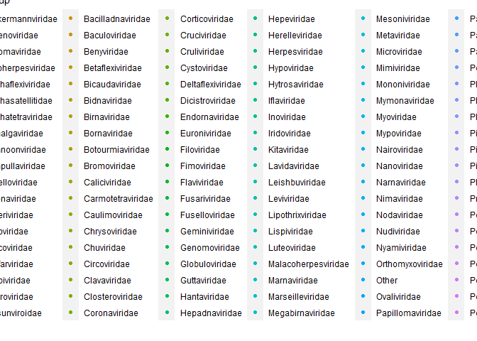
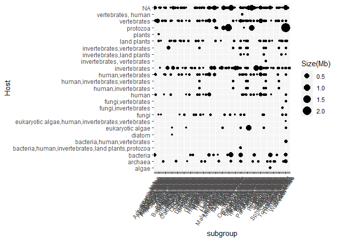

```r
library(tidyverse)
```

```
## -- Attaching packages --------------------------------------- tidyverse 1.3.0 --
```

```
## v ggplot2 3.3.3     v purrr   0.3.4
## v tibble  3.1.0     v dplyr   1.0.4
## v tidyr   1.1.2     v stringr 1.4.0
## v readr   1.4.0     v forcats 0.5.1
```

```
## -- Conflicts ------------------------------------------ tidyverse_conflicts() --
## x dplyr::filter() masks stats::filter()
## x dplyr::lag()    masks stats::lag()
```

```r
library(here)
```

```
## here() starts at C:/Users/starf/Documents/GitHub/BIS15W2021_ahearne
```

```r
library(janitor)
```

```
## 
## Attaching package: 'janitor'
```

```
## The following objects are masked from 'package:stats':
## 
##     chisq.test, fisher.test
```


```r
virus<-readr::read_csv("data/viruses.csv")
```

```
## 
## -- Column specification --------------------------------------------------------
## cols(
##   `Organism Name` = col_character(),
##   `Organism Groups` = col_character(),
##   BioSample = col_logical(),
##   BioProject = col_character(),
##   Assembly = col_character(),
##   Level = col_character(),
##   `Size(Mb)` = col_double(),
##   `GC%` = col_double(),
##   Host = col_character(),
##   CDS = col_double(),
##   Neighbors = col_double(),
##   `Release Date` = col_datetime(format = ""),
##   `GenBank FTP` = col_character(),
##   `RefSeq FTP` = col_character(),
##   Genes = col_double(),
##   Scaffolds = col_double()
## )
```

```
## Warning: 344 parsing failures.
##  row       col           expected       actual               file
## 1438 BioSample 1/0/T/F/TRUE/FALSE SAMN02981359 'data/viruses.csv'
## 4401 BioSample 1/0/T/F/TRUE/FALSE SAMN02981224 'data/viruses.csv'
## 8940 BioSample 1/0/T/F/TRUE/FALSE SAMN01137200 'data/viruses.csv'
## 8941 BioSample 1/0/T/F/TRUE/FALSE SAMN01137212 'data/viruses.csv'
## 8944 BioSample 1/0/T/F/TRUE/FALSE SAMN01137140 'data/viruses.csv'
## .... ......... .................. ............ ..................
## See problems(...) for more details.
```


```r
names(virus)
```

```
##  [1] "Organism Name"   "Organism Groups" "BioSample"       "BioProject"     
##  [5] "Assembly"        "Level"           "Size(Mb)"        "GC%"            
##  [9] "Host"            "CDS"             "Neighbors"       "Release Date"   
## [13] "GenBank FTP"     "RefSeq FTP"      "Genes"           "Scaffolds"
```


```r
virus2<-virus%>%
  separate(`Organism Groups`, into = c("domain","kingdom","subgroup"),sep=";")%>%
  filter(Level=="Complete")
virus2
```

```
## # A tibble: 32,211 x 18
##    `Organism Name`  domain  kingdom subgroup BioSample BioProject Assembly Level
##    <chr>            <chr>   <chr>   <chr>    <lgl>     <chr>      <chr>    <chr>
##  1 White spot synd~ Viruses Other   Nimavir~ NA        <NA>       GCA_000~ Comp~
##  2 Posavirus sp.    Viruses unclas~ unclass~ NA        <NA>       GCA_002~ Comp~
##  3 Hepatitis E vir~ Viruses Other   Hepevir~ NA        <NA>       GCA_000~ Comp~
##  4 Heterosigma aka~ Viruses Other   Marnavi~ NA        <NA>       GCA_000~ Comp~
##  5 Pyrococcus abys~ Viruses unclas~ unclass~ NA        <NA>       GCA_000~ Comp~
##  6 Marine RNA viru~ Viruses Other   Other    NA        <NA>       GCA_000~ Comp~
##  7 Tomato marchite~ Viruses Other   Secovir~ NA        <NA>       GCA_000~ Comp~
##  8 Ourmia melon vi~ Viruses Other   Botourm~ NA        <NA>       GCA_000~ Comp~
##  9 Epirus cherry v~ Viruses Other   Botourm~ NA        <NA>       GCA_000~ Comp~
## 10 Vibrio phage do~ Viruses Other   Podovir~ NA        PRJNA39215 GCA_000~ Comp~
## # ... with 32,201 more rows, and 10 more variables: Size(Mb) <dbl>, GC% <dbl>,
## #   Host <chr>, CDS <dbl>, Neighbors <dbl>, Release Date <dttm>,
## #   GenBank FTP <chr>, RefSeq FTP <chr>, Genes <dbl>, Scaffolds <dbl>
```


```r
n_distinct(virus2$subgroup)
```

```
## [1] 146
```


```r
virus2%>%
  group_by(subgroup)%>%
  ggplot(aes(x=Host, y=`Size(Mb)`, color=subgroup))+
    geom_point()+
  coord_flip()
```

<!-- -->

```r
virus2%>%
  group_by(subgroup)%>%
  ggplot(aes(x=subgroup, y=Host, size=`Size(Mb)`))+
    geom_point()+
  theme(legend.position="right",
        axis.text.x=element_text(angle=60, hjust=1))
```

<!-- -->


