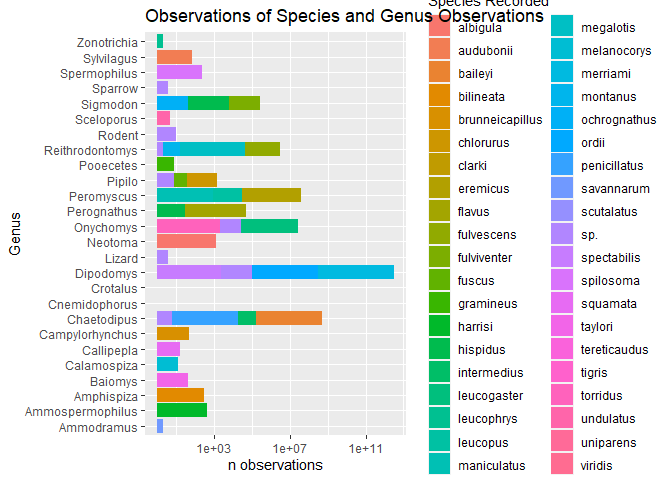
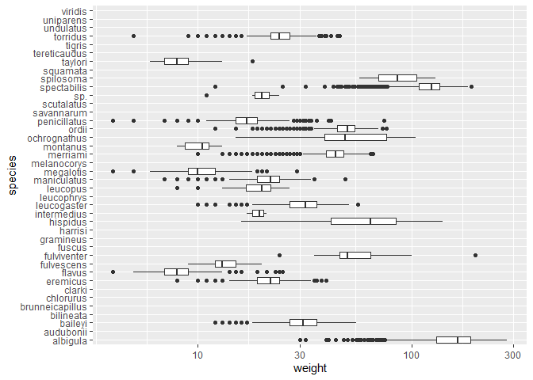
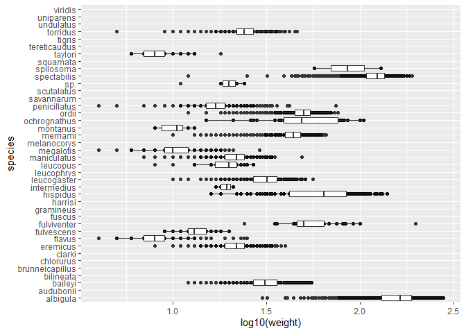
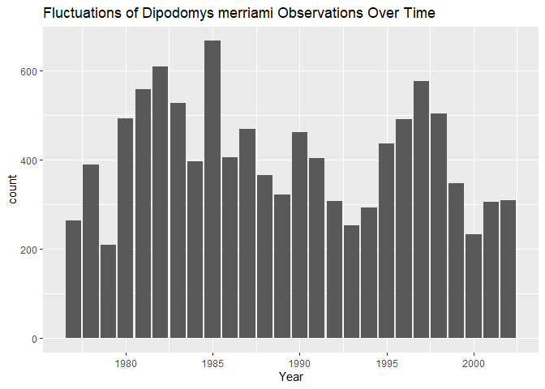
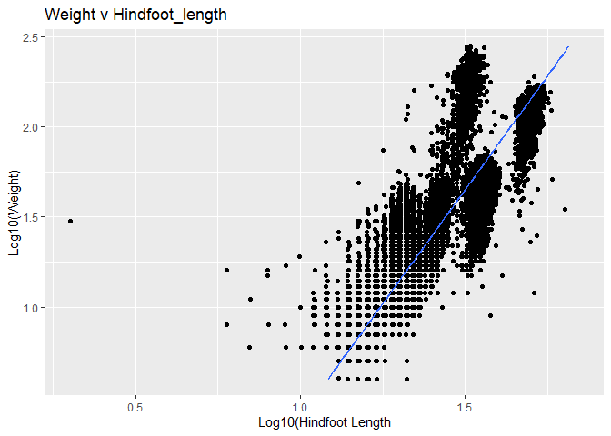
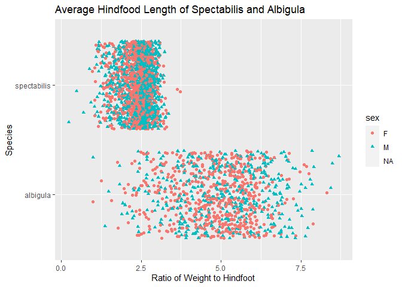
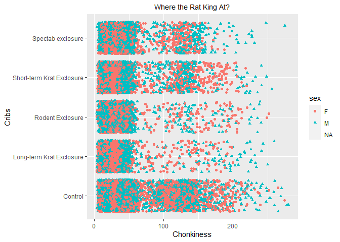

```r
library(tidyverse)
```

```
## -- Attaching packages --------------------------------------- tidyverse 1.3.0 --
```

```
## v ggplot2 3.3.3     v purrr   0.3.4
## v tibble  3.0.4     v dplyr   1.0.2
## v tidyr   1.1.2     v stringr 1.4.0
## v readr   1.4.0     v forcats 0.5.0
```

```
## -- Conflicts ------------------------------------------ tidyverse_conflicts() --
## x dplyr::filter() masks stats::filter()
## x dplyr::lag()    masks stats::lag()
```

```r
library(janitor)
```

```
## 
## Attaching package: 'janitor'
```

```
## The following objects are masked from 'package:stats':
## 
##     chisq.test, fisher.test
```

```r
library(here)
```

```
## here() starts at C:/Users/starf/Documents/GitHub/BIS15W2021_ahearne
```

```r
library(naniar)
```


```r
deserts <- read_csv(here("lab10", "data", "surveys_complete.csv"))
```

```
## 
## -- Column specification --------------------------------------------------------
## cols(
##   record_id = col_double(),
##   month = col_double(),
##   day = col_double(),
##   year = col_double(),
##   plot_id = col_double(),
##   species_id = col_character(),
##   sex = col_character(),
##   hindfoot_length = col_double(),
##   weight = col_double(),
##   genus = col_character(),
##   species = col_character(),
##   taxa = col_character(),
##   plot_type = col_character()
## )
```


```r
deserts
```

```
## # A tibble: 34,786 x 13
##    record_id month   day  year plot_id species_id sex   hindfoot_length weight
##        <dbl> <dbl> <dbl> <dbl>   <dbl> <chr>      <chr>           <dbl>  <dbl>
##  1         1     7    16  1977       2 NL         M                  32     NA
##  2         2     7    16  1977       3 NL         M                  33     NA
##  3         3     7    16  1977       2 DM         F                  37     NA
##  4         4     7    16  1977       7 DM         M                  36     NA
##  5         5     7    16  1977       3 DM         M                  35     NA
##  6         6     7    16  1977       1 PF         M                  14     NA
##  7         7     7    16  1977       2 PE         F                  NA     NA
##  8         8     7    16  1977       1 DM         M                  37     NA
##  9         9     7    16  1977       1 DM         F                  34     NA
## 10        10     7    16  1977       6 PF         F                  20     NA
## # ... with 34,776 more rows, and 4 more variables: genus <chr>, species <chr>,
## #   taxa <chr>, plot_type <chr>
```


```r
names(deserts)
```

```
##  [1] "record_id"       "month"           "day"             "year"           
##  [5] "plot_id"         "species_id"      "sex"             "hindfoot_length"
##  [9] "weight"          "genus"           "species"         "taxa"           
## [13] "plot_type"
```

#### 1. Use the function(s) of your choice to get an idea of its structure, including how NA’s are treated. Are the data tidy?


```r
# Data look tidy. NAs are treated as NAs. 
```

#### 2. How many genera and species are represented in the data? What are the total number of observations? Which species is most/ least frequently sampled in the study?


```r
deserts%>%
  ggplot(aes(x=genus, fill=species))+
  scale_y_log10()+
  geom_bar()+
  coord_flip()+
  labs(title="Observations of Species and Genus Observations",
       x="Genus",
       y="n observations",
       fill="Species Recorded")
```

<!-- -->

#### 3. What is the proportion of taxa included in this study? Show a table and plot that reflects this count.


```r
deserts%>%
  ggplot(aes(x=taxa))+
  geom_bar()+
  scale_y_log10()
```

<!-- -->

#### 4. For the taxa included in the study, use the fill option to show the proportion of individuals sampled by `plot_type`.


```r
deserts%>%
  ggplot(aes(x=taxa, fill=plot_type))+
  geom_bar()+
  scale_y_log10()+
  labs(title= "Observations of Taxa in x Plot",
       x="Taxa Recorded",
       y="N Observations",
       fill="Plot Recorded")
```

<!-- -->

```r
# CUTE!!!!!
```


#### 5. What is the range of weight for each species included in the study? Remove any observations of weight that are NA so they do not show up in the plot.


```r
deserts%>%
  ggplot(aes(x=species, y=weight))+
  scale_y_log10()+
  geom_boxplot()+
  coord_flip()
```

```
## Warning: Removed 2503 rows containing non-finite values (stat_boxplot).
```

<!-- -->

#### 6. Add another layer to your answer from #4 using `geom_point` to get an idea of how many measurements were taken for each species.


```r
deserts%>%
  ggplot(aes(x=species, y=log10(weight)))+
  geom_point()+
  geom_boxplot()+
  coord_flip()
```

```
## Warning: Removed 2503 rows containing non-finite values (stat_boxplot).
```

```
## Warning: Removed 2503 rows containing missing values (geom_point).
```

<!-- -->

#### 7. Dipodomys merriami is the most frequently sampled animal in the study. How have the number of observations of this species changed over the years included in the study?


```r
deserts%>%
  filter(genus=="Dipodomys"& species=="merriami")%>%
  ggplot(aes(x=year))+
  geom_bar()+
  labs(title="Fluctuations of Dipodomys merriami Observations Over Time",
      x="Year",
      Y="N Observations")
```

<!-- -->


#### 8. What is the relationship between `weight` and `hindfoot` length? Consider whether or not over plotting is an issue.


```r
deserts%>%
  ggplot(aes(x=log10(weight), y=log10(hindfoot_length)))+
  geom_jitter()+
  coord_flip()+
  geom_smooth(method=lm, se=F)+
  labs(title="Weight v Hindfoot_length",
       x="Log10(Weight)",
       y="Log10(Hindfoot Length")
```

```
## `geom_smooth()` using formula 'y ~ x'
```

```
## Warning: Removed 4048 rows containing non-finite values (stat_smooth).
```

```
## Warning: Removed 4048 rows containing missing values (geom_point).
```

<!-- -->


```r
# That is a VERY ugly graph. ): I would probably restrict it a bit to clean it up - either by taxa or area or... something. It needs an additional constraint. 
```

#### 9. Which two species have, on average, the highest weight? Once you have identified them, make a new column that is a ratio of `weight` to `hindfoot_length`. Make a plot that shows the range of this new ratio and fill by sex.


```r
deserts%>%
  group_by(species)%>%
  filter(weight!="NA")%>%
  summarize(mean_weight=mean(weight))%>%
  top_n(2)
```

```
## `summarise()` ungrouping output (override with `.groups` argument)
```

```
## Selecting by mean_weight
```

```
## # A tibble: 2 x 2
##   species     mean_weight
##   <chr>             <dbl>
## 1 albigula           159.
## 2 spectabilis        120.
```


```r
deserts%>%
  group_by(species)%>%
  filter(weight!="NA", species=="albigula" | species=="spectabilis")%>%
  mutate(weight_to_hindfoot=(weight/hindfoot_length))%>%
  ggplot(aes(x=species, y=weight_to_hindfoot, shape=sex, color=sex))+
  geom_jitter()+
  coord_flip()+
  labs(title="Average Hindfood Length of Spectabilis and Albigula",
       x="Species",
       y="Ratio of Weight to Hindfoot",
       color="sex")
```

```
## Warning: Removed 428 rows containing missing values (geom_point).
```

<!-- -->


```r
# So CUTE!
```


#### 10. Make one plot of your choice! Make sure to include at least two of the aesthetics options you have learned.


```r
deserts%>%
  filter(taxa=="Rodent")%>%
  ggplot(aes(x=plot_type, y=weight, shape=sex, color=sex))+
  geom_jitter()+
  coord_flip()+
  labs(title="Where the Rat King At?",
       x="Cribs",
       y="Chonkiness")+
  theme(plot.title = element_text(size = rel(0.95), hjust = 0.5))
```

```
## Warning: Removed 2065 rows containing missing values (geom_point).
```

<!-- -->

