```r
library(tidyverse)
```

```
## -- Attaching packages --------------------------------------- tidyverse 1.3.0 --
```

```
## v ggplot2 3.3.3     v purrr   0.3.4
## v tibble  3.0.4     v dplyr   1.0.2
## v tidyr   1.1.2     v stringr 1.4.0
## v readr   1.4.0     v forcats 0.5.0
```

```
## -- Conflicts ------------------------------------------ tidyverse_conflicts() --
## x dplyr::filter() masks stats::filter()
## x dplyr::lag()    masks stats::lag()
```

```r
library(here)
```

```
## here() starts at C:/Users/starf/Documents/GitHub/BIS15W2021_ahearne
```

```r
library(janitor)
```

```
## 
## Attaching package: 'janitor'
```

```
## The following objects are masked from 'package:stats':
## 
##     chisq.test, fisher.test
```

```r
life_history<-readr::read_csv("data/mammal_lifehistories_v2.csv")%>%
  na_if("-999")%>%
  clean_names()
```

```
## 
## -- Column specification --------------------------------------------------------
## cols(
##   order = col_character(),
##   family = col_character(),
##   Genus = col_character(),
##   species = col_character(),
##   mass = col_double(),
##   gestation = col_double(),
##   newborn = col_double(),
##   weaning = col_double(),
##   `wean mass` = col_double(),
##   AFR = col_double(),
##   `max. life` = col_double(),
##   `litter size` = col_double(),
##   `litters/year` = col_double()
## )
```

```r
glimpse(life_history)
```

```
## Rows: 1,440
## Columns: 13
## $ order        <chr> "Artiodactyla", "Artiodactyla", "Artiodactyla", "Artio...
## $ family       <chr> "Antilocapridae", "Bovidae", "Bovidae", "Bovidae", "Bo...
## $ genus        <chr> "Antilocapra", "Addax", "Aepyceros", "Alcelaphus", "Am...
## $ species      <chr> "americana", "nasomaculatus", "melampus", "buselaphus"...
## $ mass         <dbl> 45375.0, 182375.0, 41480.0, 150000.0, 28500.0, 55500.0...
## $ gestation    <dbl> 8.13, 9.39, 6.35, 7.90, 6.80, 5.08, 5.72, 5.50, 8.93, ...
## $ newborn      <dbl> 3246.36, 5480.00, 5093.00, 10166.67, NA, 3810.00, 3910...
## $ weaning      <dbl> 3.00, 6.50, 5.63, 6.50, NA, 4.00, 4.04, 2.13, 10.71, 6...
## $ wean_mass    <dbl> 8900, NA, 15900, NA, NA, NA, NA, NA, 157500, NA, NA, N...
## $ afr          <dbl> 13.53, 27.27, 16.66, 23.02, NA, 14.89, 10.23, 20.13, 2...
## $ max_life     <dbl> 142, 308, 213, 240, NA, 251, 228, 255, 300, 324, 300, ...
## $ litter_size  <dbl> 1.85, 1.00, 1.00, 1.00, 1.00, 1.37, 1.00, 1.00, 1.00, ...
## $ litters_year <dbl> 1.00, 0.99, 0.95, NA, NA, 2.00, NA, 1.89, 1.00, 1.00, ...
```


```r
life_history%>%
  count(order,sort=T)
```

```
## # A tibble: 17 x 2
##    order              n
##    <chr>          <int>
##  1 Rodentia         665
##  2 Carnivora        197
##  3 Artiodactyla     161
##  4 Primates         156
##  5 Insectivora       91
##  6 Cetacea           55
##  7 Lagomorpha        42
##  8 Xenarthra         20
##  9 Perissodactyla    15
## 10 Macroscelidea     10
## 11 Pholidota          7
## 12 Scandentia         7
## 13 Sirenia            5
## 14 Hyracoidea         4
## 15 Dermoptera         2
## 16 Proboscidea        2
## 17 Tubulidentata      1
```


```r
life_history%>%
  ggplot(aes(x=order))+
  geom_bar()+
  coord_flip()
```

<!-- -->


```r
life_history%>%
  group_by(order)%>%
  summarize(mean_mass=mean(mass,na.rm=T))
```

```
## `summarise()` ungrouping output (override with `.groups` argument)
```

```
## # A tibble: 17 x 2
##    order          mean_mass
##    <chr>              <dbl>
##  1 Artiodactyla     115843.
##  2 Carnivora         43382.
##  3 Cetacea         9830457.
##  4 Dermoptera         1000 
##  5 Hyracoidea         3031.
##  6 Insectivora         133.
##  7 Lagomorpha         1702.
##  8 Macroscelidea       124.
##  9 Perissodactyla   694487.
## 10 Pholidota          7980 
## 11 Primates           5145.
## 12 Proboscidea     3342500 
## 13 Rodentia            637.
## 14 Scandentia          389.
## 15 Sirenia         1169400 
## 16 Tubulidentata     60000 
## 17 Xenarthra          7238.
```


```r
options(scipen = 999)
```

```r
life_history%>%
  group_by(order)%>%
  summarize(mean_mass=mean(mass,na.rm=T))%>%
  ggplot(aes(x=order, y=mean_mass))+
  geom_col()
```

```
## `summarise()` ungrouping output (override with `.groups` argument)
```

<!-- -->


```r
life_history%>%
  group_by(order)%>%
  summarize(mean_mass=mean(mass,na.rm=T))%>%
  ggplot(aes(x=order,y=mean_mass))+
  geom_col()+
  coord_flip()+
  scale_y_log10()
```

```
## `summarise()` ungrouping output (override with `.groups` argument)
```

<!-- -->


```r
life_history%>%
  ggplot(aes(x=gestation, y=wean_mass))+
  geom_point(na.rm=T)+
  scale_y_log10()+
  geom_smooth(method="lm")
```

```
## `geom_smooth()` using formula 'y ~ x'
```

```
## Warning: Removed 1066 rows containing non-finite values (stat_smooth).
```

<!-- -->

```r
glimpse(life_history)
```

```
## Rows: 1,440
## Columns: 13
## $ order        <chr> "Artiodactyla", "Artiodactyla", "Artiodactyla", "Artio...
## $ family       <chr> "Antilocapridae", "Bovidae", "Bovidae", "Bovidae", "Bo...
## $ genus        <chr> "Antilocapra", "Addax", "Aepyceros", "Alcelaphus", "Am...
## $ species      <chr> "americana", "nasomaculatus", "melampus", "buselaphus"...
## $ mass         <dbl> 45375.0, 182375.0, 41480.0, 150000.0, 28500.0, 55500.0...
## $ gestation    <dbl> 8.13, 9.39, 6.35, 7.90, 6.80, 5.08, 5.72, 5.50, 8.93, ...
## $ newborn      <dbl> 3246.36, 5480.00, 5093.00, 10166.67, NA, 3810.00, 3910...
## $ weaning      <dbl> 3.00, 6.50, 5.63, 6.50, NA, 4.00, 4.04, 2.13, 10.71, 6...
## $ wean_mass    <dbl> 8900, NA, 15900, NA, NA, NA, NA, NA, 157500, NA, NA, N...
## $ afr          <dbl> 13.53, 27.27, 16.66, 23.02, NA, 14.89, 10.23, 20.13, 2...
## $ max_life     <dbl> 142, 308, 213, 240, NA, 251, 228, 255, 300, 324, 300, ...
## $ litter_size  <dbl> 1.85, 1.00, 1.00, 1.00, 1.00, 1.37, 1.00, 1.00, 1.00, ...
## $ litters_year <dbl> 1.00, 0.99, 0.95, NA, NA, 2.00, NA, 1.89, 1.00, 1.00, ...
```


```r
life_history%>%
  ggplot(aes(x=order,y=mass))+
  geom_boxplot()+
  scale_y_log10()+
  coord_flip()
```

```
## Warning: Removed 85 rows containing non-finite values (stat_boxplot).
```

<!-- -->


```r
elephants<-readr::read_csv("data/ElephantsMF.csv")%>%
  clean_names()
```

```
## 
## -- Column specification --------------------------------------------------------
## cols(
##   Age = col_double(),
##   Height = col_double(),
##   Sex = col_character()
## )
```


```r
elephants
```

```
## # A tibble: 288 x 3
##      age height sex  
##    <dbl>  <dbl> <chr>
##  1   1.4   120  M    
##  2  17.5   227  M    
##  3  12.8   235  M    
##  4  11.2   210  M    
##  5  12.7   220  M    
##  6  12.7   189  M    
##  7  12.2   225  M    
##  8  12.2   204  M    
##  9  28.2   266. M    
## 10  11.7   233  M    
## # ... with 278 more rows
```

#### 1. On midterm 1, I asked how many male and female elephants were represented in the data. How would you make a plot of this?


```r
elephants%>%
  group_by(sex)%>%
  ggplot(aes(x=sex))+
  geom_bar()
```

<!-- -->


#### 2. How does the age of elephants compare by sex?


```r
elephants%>%
  group_by(sex)%>%
  summarize(mean_age=mean(age, na.rm=T))%>%
  ggplot(aes(x=sex, y=mean_age))+
  geom_col()
```

```
## `summarise()` ungrouping output (override with `.groups` argument)
```

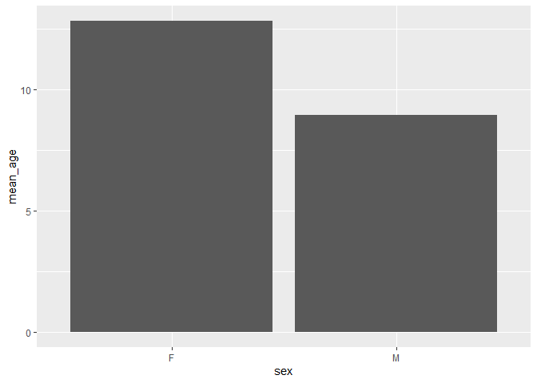<!-- -->

#### 3. What is the relationship between age and height?


```r
elephants%>%
  ggplot(aes(x=age, y=height))+
  geom_point()+
  geom_smooth(method="lm")
```

```
## `geom_smooth()` using formula 'y ~ x'
```

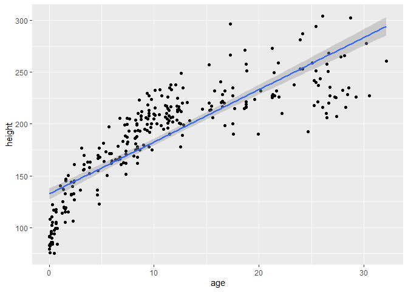<!-- -->


```r
elephants%>%
  ggplot(aes(x=age, y=height))+
  geom_point()+
  geom_smooth(method=lm, se=F)
```

```
## `geom_smooth()` using formula 'y ~ x'
```

<!-- -->


```r
elephants%>%
  ggplot(aes(x=age, y=height))+
  geom_point()+
  geom_smooth(method=lm, se=F)+
  labs(title="Elephant Age v Height",
       x="Age",
       y="Height (cm)")
```

```
## `geom_smooth()` using formula 'y ~ x'
```

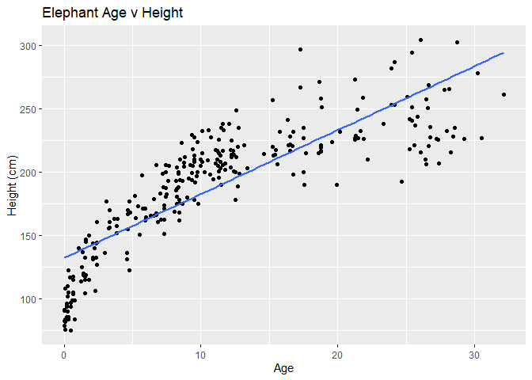<!-- -->


```r
elephants%>%
  ggplot(aes(x=age, y=height))+
  geom_point()+
  geom_smooth(method=lm, se=F)+
  labs(title="Elephants Age v Height",
       x="Age",
       y="Height (cm)")+
  theme(plot.title=element_text(size=12, face="bold"),
        axis.text = element_text(size=10),
        axis.title=element_text(size=10))
```

```
## `geom_smooth()` using formula 'y ~ x'
```

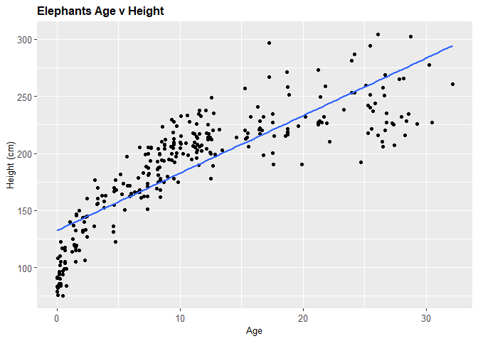<!-- -->


```r
elephants %>% 
  ggplot(aes(x=age, y=height)) + geom_point() + geom_smooth(method=lm, se=F) +
  labs(title = "Elephant Age vs. Height",
       x = "Age",
       y = "Height") +
  theme(plot.title = element_text(size = rel(1.5), hjust = 0.5))
```

```
## `geom_smooth()` using formula 'y ~ x'
```

<!-- -->


```r
elephants %>% 
  ggplot(aes(x=sex, fill=sex))+geom_bar()+
  labs(title = "# Elephants by Sex",
       x = "Sex",
       y = NULL) +
  theme(plot.title = element_text(size = rel(1.5), hjust = 0.5))
```

<!-- -->


```r
life_history %>% 
  ggplot(aes(x=gestation, y=log10(mass), size=mass))+
  geom_point(na.rm=T)
```

<!-- -->


```r
life_history%>%
  filter(gestation>20)
```

```
## # A tibble: 2 x 13
##   order family genus species   mass gestation newborn weaning wean_mass   afr
##   <chr> <chr>  <chr> <chr>    <dbl>     <dbl>   <dbl>   <dbl>     <dbl> <dbl>
## 1 Prob~ Eleph~ Elep~ maximus 3.18e6      21.1 100039.    18          NA  127.
## 2 Prob~ Eleph~ Loxo~ africa~ 3.51e6      21.5  99006.    39.4    600000  148.
## # ... with 3 more variables: max_life <dbl>, litter_size <dbl>,
## #   litters_year <dbl>
```


```r
homerange<-readr::read_csv("data/Tamburelloetal_HomeRangeDatabase.csv")%>%
  clean_names()
```

```
## 
## -- Column specification --------------------------------------------------------
## cols(
##   .default = col_character(),
##   mean.mass.g = col_double(),
##   log10.mass = col_double(),
##   mean.hra.m2 = col_double(),
##   log10.hra = col_double(),
##   preymass = col_double(),
##   log10.preymass = col_double(),
##   PPMR = col_double()
## )
## i Use `spec()` for the full column specifications.
```


```r
names(homerange)
```

```
##  [1] "taxon"                      "common_name"               
##  [3] "class"                      "order"                     
##  [5] "family"                     "genus"                     
##  [7] "species"                    "primarymethod"             
##  [9] "n"                          "mean_mass_g"               
## [11] "log10_mass"                 "alternative_mass_reference"
## [13] "mean_hra_m2"                "log10_hra"                 
## [15] "hra_reference"              "realm"                     
## [17] "thermoregulation"           "locomotion"                
## [19] "trophic_guild"              "dimension"                 
## [21] "preymass"                   "log10_preymass"            
## [23] "ppmr"                       "prey_size_reference"
```

```r
homerange
```

```
## # A tibble: 569 x 24
##    taxon common_name class order family genus species primarymethod n    
##    <chr> <chr>       <chr> <chr> <chr>  <chr> <chr>   <chr>         <chr>
##  1 lake~ american e~ acti~ angu~ angui~ angu~ rostra~ telemetry     16   
##  2 rive~ blacktail ~ acti~ cypr~ catos~ moxo~ poecil~ mark-recaptu~ <NA> 
##  3 rive~ central st~ acti~ cypr~ cypri~ camp~ anomal~ mark-recaptu~ 20   
##  4 rive~ rosyside d~ acti~ cypr~ cypri~ clin~ fundul~ mark-recaptu~ 26   
##  5 rive~ longnose d~ acti~ cypr~ cypri~ rhin~ catara~ mark-recaptu~ 17   
##  6 rive~ muskellunge acti~ esoc~ esoci~ esox  masqui~ telemetry     5    
##  7 mari~ pollack     acti~ gadi~ gadid~ poll~ pollac~ telemetry     2    
##  8 mari~ saithe      acti~ gadi~ gadid~ poll~ virens  telemetry     2    
##  9 mari~ lined surg~ acti~ perc~ acant~ acan~ lineat~ direct obser~ <NA> 
## 10 mari~ orangespin~ acti~ perc~ acant~ naso  litura~ telemetry     8    
## # ... with 559 more rows, and 15 more variables: mean_mass_g <dbl>,
## #   log10_mass <dbl>, alternative_mass_reference <chr>, mean_hra_m2 <dbl>,
## #   log10_hra <dbl>, hra_reference <chr>, realm <chr>, thermoregulation <chr>,
## #   locomotion <chr>, trophic_guild <chr>, dimension <chr>, preymass <dbl>,
## #   log10_preymass <dbl>, ppmr <dbl>, prey_size_reference <chr>
```


#### Make a barplot that shows counts of `ectotherms` and `endotherms`. Label the axes, provide a title, and fill by `thermoregulation`.


```r
homerange%>%
  group_by(thermoregulation)%>%
  ggplot(aes(x=thermoregulation, fill=thermoregulation))+
  geom_bar()
```

<!-- -->


#### Make a scatterplot that compares log10.mass and homerange. Adjust the size of points by mass. Label the axes and provide a title.


```r
homerange%>%
  ggplot(aes(x=mean_hra_m2, y=log10_mass, size=log10_mass))+
  scale_x_log10()+
  geom_point()+ 
  geom_smooth(method="lm")+
  labs(title = "Homerange v Mass",
       x = "Avg Homerange (log10(m2))",
       y = "log10(mass)") +
  theme(plot.title = element_text(size = rel(1.5), hjust = 0.5))
```

```
## `geom_smooth()` using formula 'y ~ x'
```

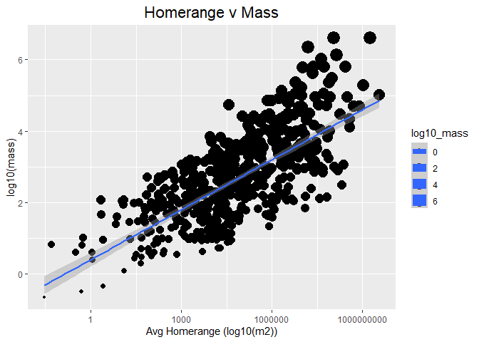<!-- -->

#Part 2


```r
p<-homerange%>%
  ggplot(aes(x=log10_mass, y=log10_hra))
```


```r
p +geom_point(size=1)
```

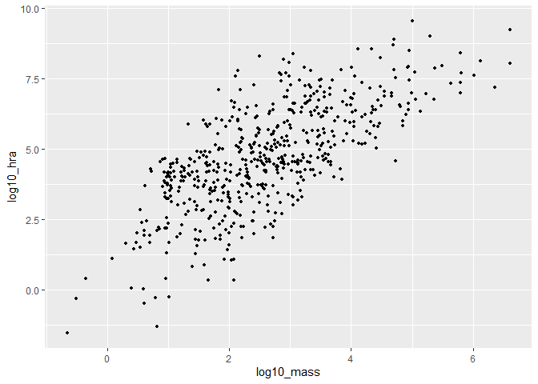<!-- -->


```r
p+geom_point(aes(shape=thermoregulation, color=thermoregulation),
             size=1.75)
```

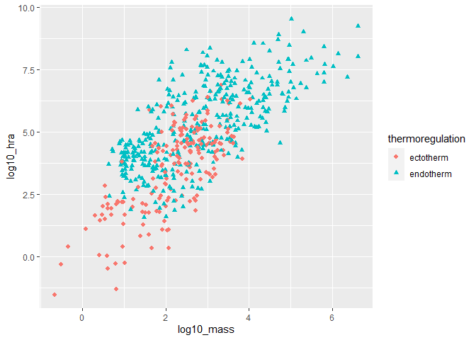<!-- -->


```r
homerange%>%
  count(taxon)
```

```
## # A tibble: 9 x 2
##   taxon             n
##   <chr>         <int>
## 1 birds           140
## 2 lake fishes       9
## 3 lizards          11
## 4 mammals         238
## 5 marine fishes    90
## 6 river fishes     14
## 7 snakes           41
## 8 tortoises        12
## 9 turtles          14
```


```r
homerange%>%
  ggplot(aes(x=taxon))+
  geom_bar()+
  coord_flip()+
  labs(title="Observations by Taxon in Homerange Data",
       x="Taxonomic Group")
```

<!-- -->


```r
homerange%>%
  ggplot(aes(x=taxon, fill=trophic_guild))+
  geom_bar()+
  coord_flip()+
  labs(title="Observations by Taxon in Homerange Data",
       x="Taxonomic Group",
       fill="Trophic Guild")
```

<!-- -->


```r
homerange%>%
  ggplot(aes(x=taxon, fill=trophic_guild))+
  geom_bar(position="dodge")+
  coord_flip()+
  labs(title="Observations by Taxon in Homerange Data",
       x="Taxonomic Group",
       fill="Trophic Guild")
```

<!-- -->


```r
homerange%>%
  ggplot(aes(x=taxon, fill=trophic_guild))+
  geom_bar(position="dodge")+
  labs(title="Observations by Taxon in Homerange Data",
       x="Taxonomic Group",
       fill="Trophic Guild")
```

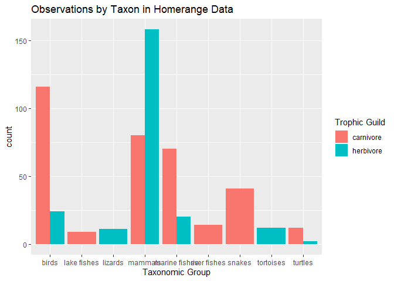<!-- -->


```r
homerange%>%
  ggplot(aes(x=taxon, fill=trophic_guild))+
  geom_bar(position=position_fill())+
  scale_y_continuous(labels=scales::percent)+
  coord_flip()
```

<!-- -->


```r
library(palmerpenguins)
```


```r
penguins
```

```
## # A tibble: 344 x 8
##    species island bill_length_mm bill_depth_mm flipper_length_~ body_mass_g
##    <fct>   <fct>           <dbl>         <dbl>            <int>       <int>
##  1 Adelie  Torge~           39.1          18.7              181        3750
##  2 Adelie  Torge~           39.5          17.4              186        3800
##  3 Adelie  Torge~           40.3          18                195        3250
##  4 Adelie  Torge~           NA            NA                 NA          NA
##  5 Adelie  Torge~           36.7          19.3              193        3450
##  6 Adelie  Torge~           39.3          20.6              190        3650
##  7 Adelie  Torge~           38.9          17.8              181        3625
##  8 Adelie  Torge~           39.2          19.6              195        4675
##  9 Adelie  Torge~           34.1          18.1              193        3475
## 10 Adelie  Torge~           42            20.2              190        4250
## # ... with 334 more rows, and 2 more variables: sex <fct>, year <int>
```


```r
names(penguins)
```

```
## [1] "species"           "island"            "bill_length_mm"   
## [4] "bill_depth_mm"     "flipper_length_mm" "body_mass_g"      
## [7] "sex"               "year"
```

#### 1. Make a bar plot that shows counts of individuals by island. Fill by species, and try both a stacked bar plot and `position="dodge"`.


```r
penguins%>%
  group_by(island)%>%
  ggplot(aes(x=island, fill=species))+
  geom_bar()+
  coord_flip()
```

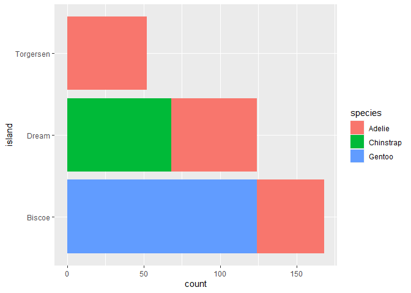<!-- -->


```r
penguins%>%
  group_by(island)%>%
  ggplot(aes(x=island, fill=species))+
  geom_bar(position="dodge")+
  coord_flip()
```

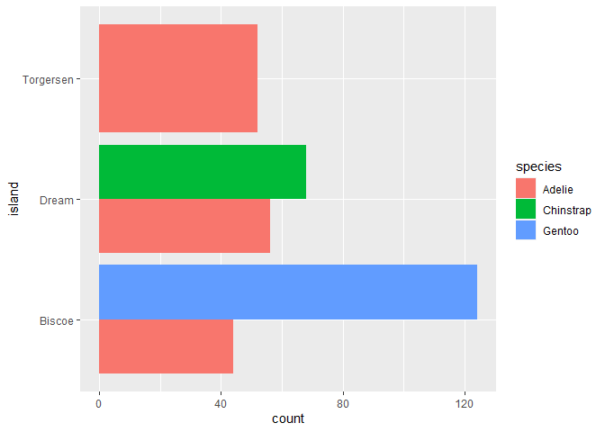<!-- -->


#### 2. What are the number of individuals separated by sex on each island?


```r
penguins%>%
  group_by(island)%>%
  ggplot(aes(x=island, fill=sex))+
  geom_bar(position="dodge")+
  coord_flip()
```

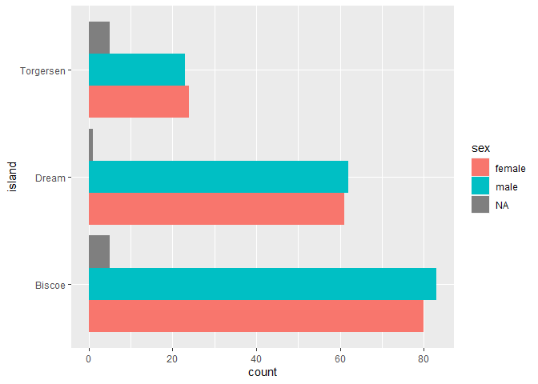<!-- -->


```r
homerange%>%
  ggplot(aes(x=class, y=log10_mass))+
  geom_boxplot()
```

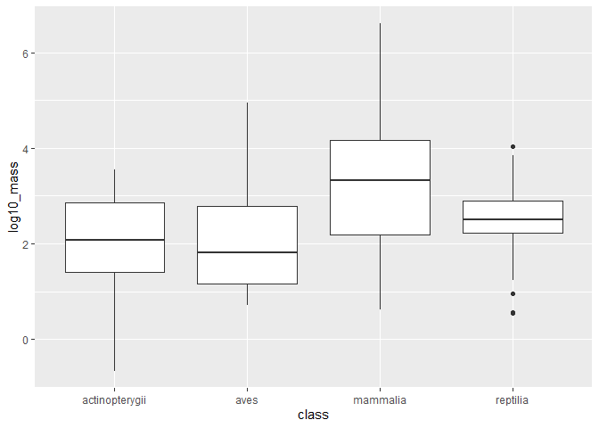<!-- -->


```r
homerange%>%
  ggplot(aes(x=class, y=log10_mass, group=taxon))+
  geom_boxplot()
```

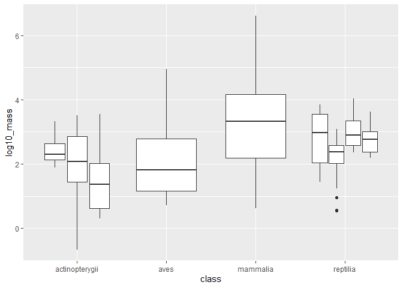<!-- -->


```r
homerange%>%
  ggplot(aes(x=class, y=log10_mass, fill=taxon))+
  geom_boxplot()
```

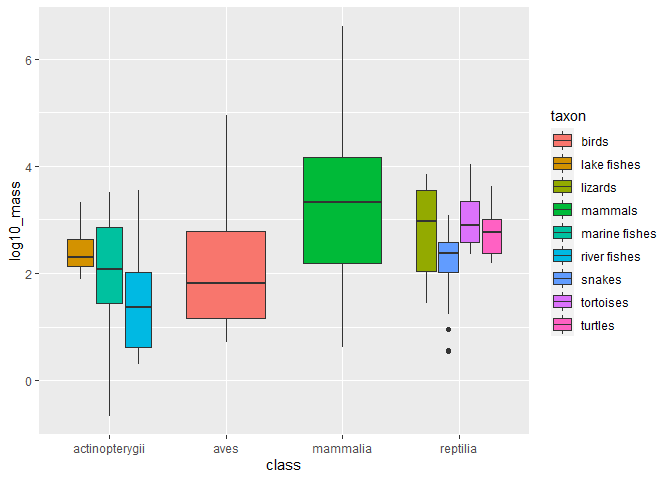<!-- -->

