```r
library(tidyverse)
```

```
## -- Attaching packages --------------------------------------- tidyverse 1.3.0 --
```

```
## √ ggplot2 3.3.3     √ purrr   0.3.4
## √ tibble  3.0.5     √ dplyr   1.0.3
## √ tidyr   1.1.2     √ stringr 1.4.0
## √ readr   1.4.0     √ forcats 0.5.1
```

```
## -- Conflicts ------------------------------------------ tidyverse_conflicts() --
## x dplyr::filter() masks stats::filter()
## x dplyr::lag()    masks stats::lag()
```

```r
library(janitor)
```

```
## 
## Attaching package: 'janitor'
```

```
## The following objects are masked from 'package:stats':
## 
##     chisq.test, fisher.test
```

```r
library(here)
```

```
## here() starts at D:/TA files/Winter2021 BIS15L/students_rep/BIS15W2021_ahearne
```

```r
library(naniar)
#install.packages("gapminder")
library(gapminder)
library(ggthemes)
library(paletteer)
```

#### 1. Use the function(s) of your choice to get an idea of the overall structure of the data frame, including its dimensions, column names, variable classes, etc. As part of this, determine how NA’s are treated in the data.


```r
glimpse(gapminder)
```

```
## Rows: 1,704
## Columns: 6
## $ country   <fct> Afghanistan, Afghanistan, Afghanistan, Afghanistan, Afgha...
## $ continent <fct> Asia, Asia, Asia, Asia, Asia, Asia, Asia, Asia, Asia, Asi...
## $ year      <int> 1952, 1957, 1962, 1967, 1972, 1977, 1982, 1987, 1992, 199...
## $ lifeExp   <dbl> 28.801, 30.332, 31.997, 34.020, 36.088, 38.438, 39.854, 4...
## $ pop       <int> 8425333, 9240934, 10267083, 11537966, 13079460, 14880372,...
## $ gdpPercap <dbl> 779.4453, 820.8530, 853.1007, 836.1971, 739.9811, 786.113...
```


```r
gapminder%>%
  purrr::map_df(~sum(is.na(.)))
```

```
## # A tibble: 1 x 6
##   country continent  year lifeExp   pop gdpPercap
##     <int>     <int> <int>   <int> <int>     <int>
## 1       0         0     0       0     0         0
```

```r
gapminder_t<-gapminder%>%
  na_if("-999")
```


```r
gapminder_t%>%
  purrr::map_df(~sum(is.na(.)))
```

```
## # A tibble: 1 x 6
##   country continent  year lifeExp   pop gdpPercap
##     <int>     <int> <int>   <int> <int>     <int>
## 1       0         0     0       0     0         0
```

```r
#No NA data
```


#### 2. Among the interesting variables in gapminder is life expectancy. How has global life expectancy changed between 1952 and 2007?


```r
#gapminder
```


```r
gapminder$year<-as.factor(gapminder$year)
```


```r
#colors<-paletteer::palettes_d_names
#colors
```


```r
#install.packages("PNWColors")
#install.packages("devtools")
#devtools::install_github("johannesbjork/LaCroixColoR")
my_lil_palette<- LaCroixColoR::lacroix_palette("Pamplemousse", type = "discrete")
my_lil_palette_cont<-LaCroixColoR::lacroix_palette("Pamplemousse", n = 50, type = "continuous")
barplot(rep(1,14), axes=FALSE, col=my_lil_palette)
```

<!-- -->


```r
gapminder%>%
  group_by(year)%>%
  summarize(mean_lifeExp=mean(lifeExp))%>%
  ggplot(aes(x=year, y=mean_lifeExp, color=year))+
  geom_point()+
  geom_line()+
  theme_solarized()+
  theme(axis.text.x=element_text(angle=60,hjust=1))+
  scale_fill_manual(values=my_lil_palette_cont)+ 
  labs(title="Change in Life Expectancy Over the Years",
       x="Year",
       y="Average Yearly Life Expectancy",
       fill="Life Expectancy")
```

```
## geom_path: Each group consists of only one observation. Do you need to adjust
## the group aesthetic?
```

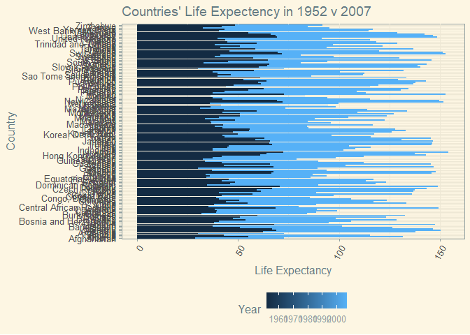<!-- -->


#### 3. How do the distributions of life expectancy compare for the years 1952 and 2007?


```r
gapminder%>%
  filter(year=="1952"| year=="2007")%>%
  ggplot(aes(x=continent, y=lifeExp, color=year))+
  geom_point()+
  theme_solarized()+
  theme(legend.position="bottom",
        axis.text.x=element_text(angle=60, hjust=1))+
  scale_color_manual(values=my_lil_palette)+
  labs(title="Countries' Life Expectency in 1952 v 2007",
       x= "Continent",
       y= "Life Expectancy",
       color= "Year")
```

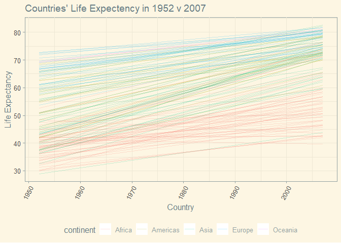<!-- -->

```r
gapminder%>%
  filter(year=="1952"| year=="2007")%>%
  ggplot(aes(x=year, y=lifeExp, group=country, color=continent, size=pop))+
  geom_point(alpha=0.4)+
  theme_solarized()+
  theme(legend.position="top",
        axis.text.x=element_text(angle=60, hjust=1))+
  scale_color_manual(values=my_lil_palette)+
  scale_size(range = c(0.1, 10),
             guide = "none")+
  labs(title="Countries' Life Expectency in 1952 v 2007",
       x= "Year",
       y= "Life Expectancy",
       color= "Country's Continent")
```

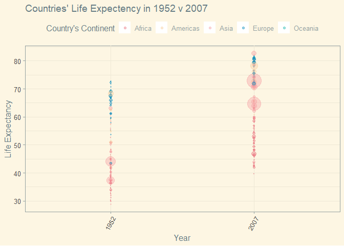<!-- -->

#### 4. Your answer above doesn’t tell the whole story since life expectancy varies by region. Make a summary that shows the min, mean, and max life expectancy by continent for all years represented in the data.


```r
gapminder2<-gapminder%>%
  group_by(continent, year)%>%
  summarize(min_lifeExp=min(lifeExp),
            mean_lifeExp=mean(lifeExp),
            max_lifeExp=max(lifeExp))
```

```
## `summarise()` has grouped output by 'continent'. You can override using the `.groups` argument.
```

```r
gapminder2
```

```
## # A tibble: 60 x 5
## # Groups:   continent [5]
##    continent year  min_lifeExp mean_lifeExp max_lifeExp
##    <fct>     <fct>       <dbl>        <dbl>       <dbl>
##  1 Africa    1952         30           39.1        52.7
##  2 Africa    1957         31.6         41.3        58.1
##  3 Africa    1962         32.8         43.3        60.2
##  4 Africa    1967         34.1         45.3        61.6
##  5 Africa    1972         35.4         47.5        64.3
##  6 Africa    1977         36.8         49.6        67.1
##  7 Africa    1982         38.4         51.6        69.9
##  8 Africa    1987         39.9         53.3        71.9
##  9 Africa    1992         23.6         53.6        73.6
## 10 Africa    1997         36.1         53.6        74.8
## # ... with 50 more rows
```


```r
gapminder2%>%
  ggplot(aes(x=year, y=min_lifeExp, group=continent, color=continent))+
  geom_line()+
  geom_point()+
  scale_color_manual(values=my_lil_palette)+
  theme_solarized()+
  theme(legend.position="bottom",
        axis.text.x=element_text(angle=60, hjust=1))+
  labs(title="Minimum Life Expectancy per Continent per Year",
       x="Year",
       y="Life Expectancy",
       fill= "Continent")
```

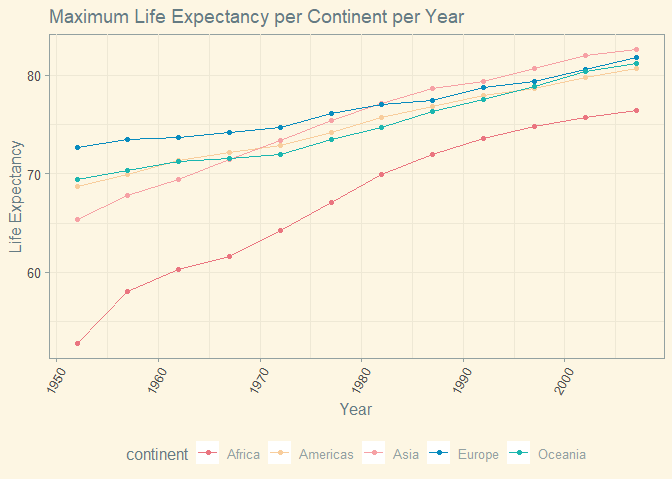<!-- -->


```r
gapminder2%>%
  ggplot(aes(x=year, y=max_lifeExp, group=continent, color=continent))+
  geom_line()+
  geom_point()+
  scale_color_manual(values=my_lil_palette)+
  theme_solarized()+
  theme(legend.position="bottom",
        axis.text.x=element_text(angle=60, hjust=1))+
  labs(title="Maximum Life Expectancy per Continent per Year",
       x="Year",
       y="Life Expectancy",
       fill= "Continent")
```

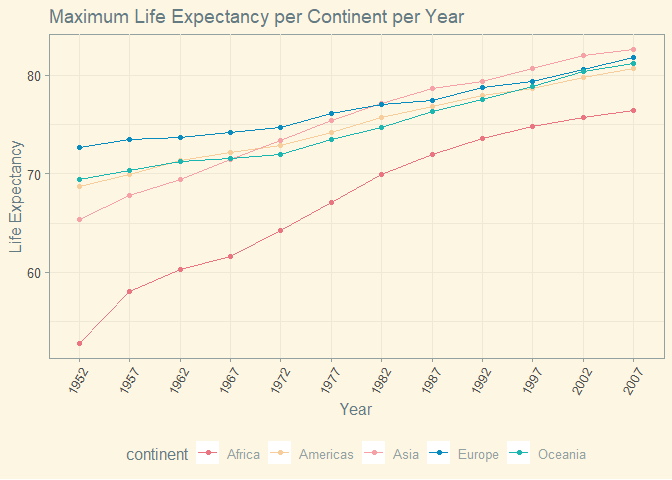<!-- -->


```r
gapminder2%>%
  ggplot(aes(x=year, y=mean_lifeExp, group=continent, color=continent))+
  geom_line()+
  geom_point()+
  scale_color_manual(values=my_lil_palette)+
  theme_solarized()+
  theme(legend.position="bottom",
        axis.text.x=element_text(angle=60, hjust=1))+
  labs(title="Mean Life Expectancy per Continent per Year",
       x="Year",
       y="Life Expectancy",
       fill= "Continent")
```

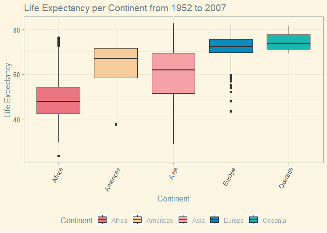<!-- -->

```r
gapminder%>%
  ggplot(aes(x=continent, y=lifeExp, fill=continent))+
  geom_boxplot()+
  scale_fill_manual(values=my_lil_palette)+
  theme_solarized()+
  theme(legend.position="bottom",
        axis.text.x=element_text(angle=60, hjust=1))+
  labs(title="Life Expectancy per Continent from 1952 to 2007",
       x="Continent",
       y="Life Expectancy",
       fill= "Continent")
```

<!-- -->


```r
#I'm just not sure what kind of data readout this question is looking for. 
```


#### 5. How has life expectancy changed between 1952-2007 for each continent?


```r
gapminder%>%
  ggplot(aes(x=year, y=lifeExp, group=continent, color=continent))+
  geom_point(alpha=0.2)+
  geom_smooth(se = FALSE, method = "loess")+
  scale_color_manual(values=my_lil_palette)+ 
  theme_solarized()+
  theme(legend.position="top",
        axis.text.x=element_text(angle=60, hjust=1))+
  labs(title="Life Expectancy per Continent from 1952 to 2007",
       x="Continent",
       y="Life Expectancy",
       fill= "Continent")
```

```
## `geom_smooth()` using formula 'y ~ x'
```

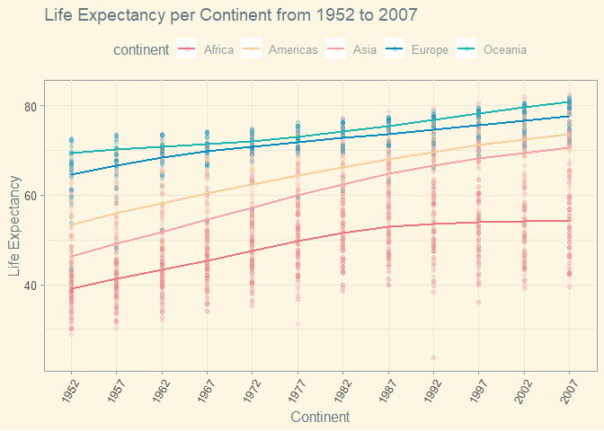<!-- -->


#### 6. We are interested in the relationship between per capita GDP and life expectancy; i.e. does having more money help you live longer?


```r
gapminder%>%
  ggplot(aes(x=lifeExp, y=gdpPercap, color=continent, size=pop))+
  geom_point(alpha=0.5)+
  coord_flip()+
  scale_color_manual(values=my_lil_palette)+ 
  theme_solarized()+
  theme(legend.position="top",
        axis.text.x=element_text(angle=60, hjust=1))+
  labs(title="Life Expectancy v GDP",
       x="Life Expectancy",
       y="GDP Per Capita",
       fill= "Continent")
```

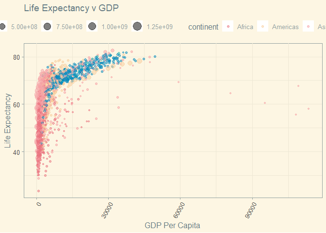<!-- -->
#### 7. Which countries have had the largest population growth since 1952?


```r
g3<-gapminder%>%
  group_by(country)%>%
  filter(year=="1952" | year=="2007")%>%
  mutate(population_growth=pop-lag(pop,default=first(pop)))
g3
```

```
## # A tibble: 284 x 7
## # Groups:   country [142]
##    country     continent year  lifeExp      pop gdpPercap population_growth
##    <fct>       <fct>     <fct>   <dbl>    <int>     <dbl>             <int>
##  1 Afghanistan Asia      1952     28.8  8425333      779.                 0
##  2 Afghanistan Asia      2007     43.8 31889923      975.          23464590
##  3 Albania     Europe    1952     55.2  1282697     1601.                 0
##  4 Albania     Europe    2007     76.4  3600523     5937.           2317826
##  5 Algeria     Africa    1952     43.1  9279525     2449.                 0
##  6 Algeria     Africa    2007     72.3 33333216     6223.          24053691
##  7 Angola      Africa    1952     30.0  4232095     3521.                 0
##  8 Angola      Africa    2007     42.7 12420476     4797.           8188381
##  9 Argentina   Americas  1952     62.5 17876956     5911.                 0
## 10 Argentina   Americas  2007     75.3 40301927    12779.          22424971
## # ... with 274 more rows
```


```r
g3%>%
  arrange(desc(population_growth))
```

```
## # A tibble: 284 x 7
## # Groups:   country [142]
##    country       continent year  lifeExp        pop gdpPercap population_growth
##    <fct>         <fct>     <fct>   <dbl>      <int>     <dbl>             <int>
##  1 China         Asia      2007     73.0 1318683096     4959.         762419569
##  2 India         Asia      2007     64.7 1110396331     2452.         738396331
##  3 United States Americas  2007     78.2  301139947    42952.         143586947
##  4 Indonesia     Asia      2007     70.6  223547000     3541.         141495000
##  5 Brazil        Americas  2007     72.4  190010647     9066.         133408087
##  6 Pakistan      Asia      2007     65.5  169270617     2606.         127924057
##  7 Bangladesh    Asia      2007     64.1  150448339     1391.         103561480
##  8 Nigeria       Africa    2007     46.9  135031164     2014.         101912068
##  9 Mexico        Americas  2007     76.2  108700891    11978.          78556574
## 10 Philippines   Asia      2007     71.7   91077287     3190.          68638596
## # ... with 274 more rows
```


#### 8. Use your results from the question above to plot population growth for the top five countries since 1952.


```r
gapminder%>%
  filter(country=="China"|country=="India"|country=="United States"|country=="Indonesia"|country=="Brazil")%>%
  ggplot(aes(x=year,y=pop,color=country))+
  geom_point(aes(color=country, size=gdpPercap), alpha=0.5)+
  scale_color_manual(values=my_lil_palette)+ 
  theme_solarized()+
  theme(legend.position="top",
        axis.text.x=element_text(angle=60, hjust=1))+
  labs(title="Population over Time by 5 Fastest Growing Countries",
       x="Year",
       y="Population",
       color= "Country")
```

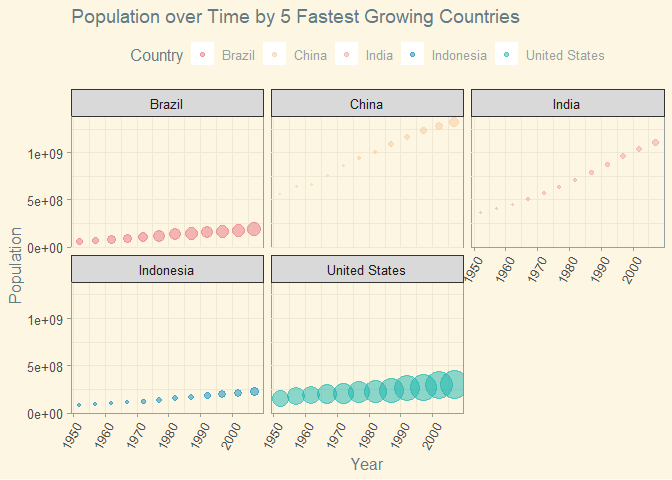<!-- -->

```r
gapminder%>%
  filter(country=="China"|country=="India"|country=="United States"|country=="Indonesia"|country=="Brazil")%>%
  ggplot(aes(x=year,y=pop,color=country))+
  geom_point(aes(color=country, size=gdpPercap), alpha=0.5)+
  facet_wrap(~country)+
  scale_color_manual(values=my_lil_palette)+ 
  theme_solarized()+
  theme(legend.position="top",
        axis.text.x=element_text(angle=60, hjust=1))+
  labs(title="Population over Time by 5 Fastest Growing Countries",
       x="Year",
       y="Population",
       color= "Country",
       size="GDP per Capita")+
  scale_size(range = c(0.1, 10),
             breaks = 1000000 * c(250, 500, 750, 1000, 1250),
             labels = c("250", "500", "750", "1000", "1250")) 
```

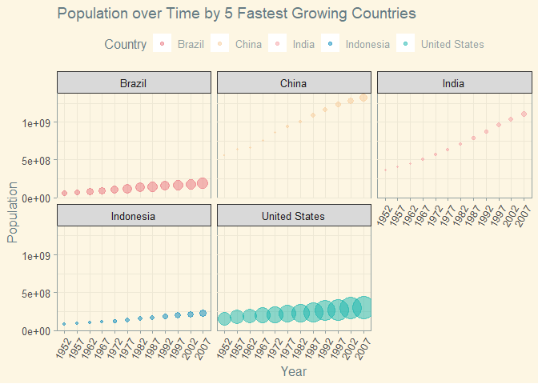<!-- -->


#### 9. How does per-capita GDP growth compare between these same five countries?


```r
gapminder%>%
  filter(country=="China"|country=="India"|country=="United States"|country=="Indonesia"|country=="Brazil")%>%
  ggplot(aes(x=year,y=gdpPercap,color=country))+
  geom_point(aes(color=country, size=pop), alpha=0.5)+
  scale_color_manual(values=my_lil_palette)+ 
  theme_solarized()+
  theme(legend.position="top",
        axis.text.x=element_text(angle=60, hjust=1))+
  labs(title="GDP over Time by 5 Countries with the Fastest Growing Populations",
       x="Year",
       y="GDP per Capita",
       color= "Country")+
  scale_size(range = c(0.1, 10),
             guide = "none")
```

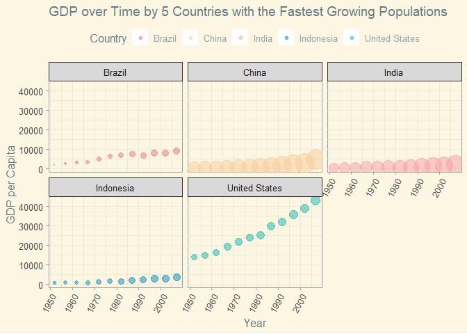<!-- -->


```r
gapminder%>%
  filter(country=="China"|country=="India"|country=="United States"|country=="Indonesia"|country=="Brazil")%>%
  ggplot(aes(x=year, y=gdpPercap, color=country))+
  geom_point(aes(color=country, size=pop), alpha=0.5)+
  facet_wrap(~country)+
  scale_color_manual(values=my_lil_palette)+ 
  theme_solarized()+
  theme(legend.position="top",
        axis.text.x=element_text(angle=60, hjust=1))+
  labs(title="GDP over Time by 5 Countries with the Fastest Growing Populations",
       x="Year",
       y="GDP per Capita",
       color= "Country",
       size="Population")+
  scale_size(range = c(0.1, 10),
             guide = "none")
```

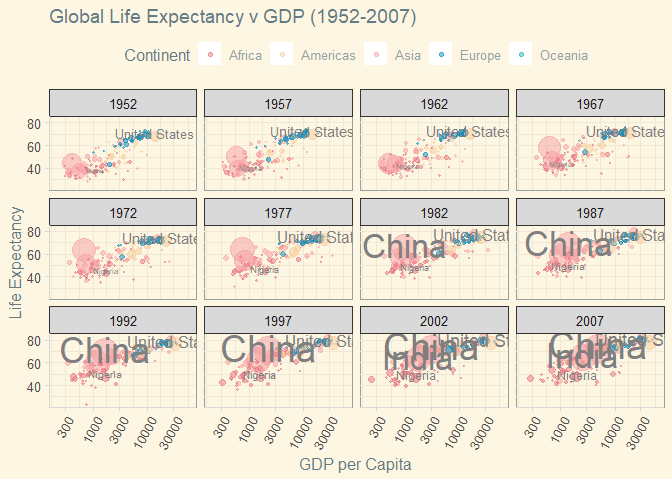<!-- -->


#### 10. Make one plot of your choice that uses faceting!


```r
gapminder%>%
  ggplot(aes(x=gdpPercap, y=lifeExp, color=continent, size=pop))+
  geom_point(alpha=0.5)+
  geom_text(aes(x=gdpPercap, y=lifeExp+3, label=country),
            color="grey50",
            data=filter(gapminder, pop>1000000000  | country %in% c("Nigeria", "United States")))+
  scale_x_log10(limits=c(200,60000))+
  scale_size(range=c(0.1,10),
             guide="none")+
  facet_wrap(~year)+
  scale_color_manual(values=my_lil_palette)+ 
  theme_solarized()+
  theme(legend.position="top",
        axis.line = element_line(color = "grey85"),
        axis.ticks = element_line(color = "grey85"),
        axis.text.x=element_text(angle=60, hjust=1))+
  labs(title="Global Life Expectancy v GDP (1952-2007)",
       x="GDP per Capita",
       y="Life Expectancy",
       color= "Continent")
```

```
## Warning: Removed 5 rows containing missing values (geom_point).
```

<!-- -->


