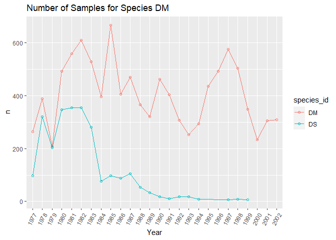
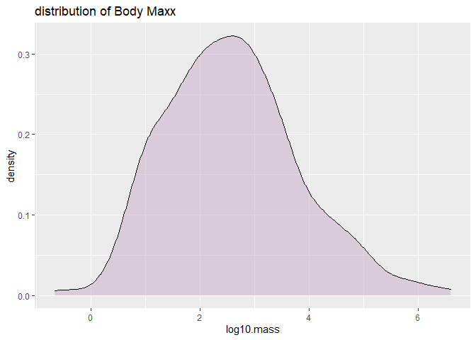
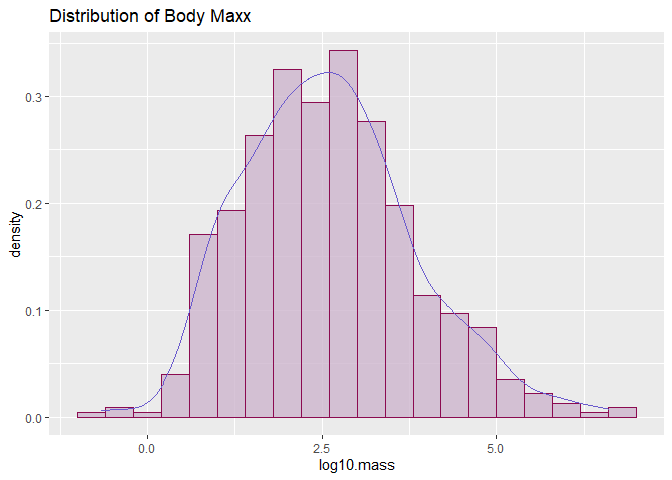
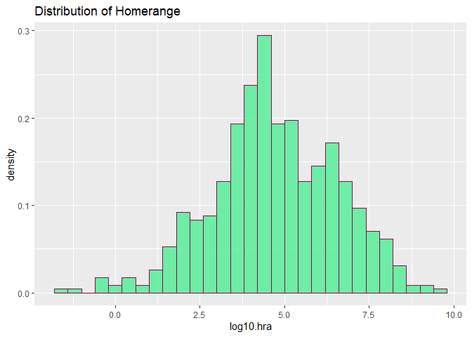
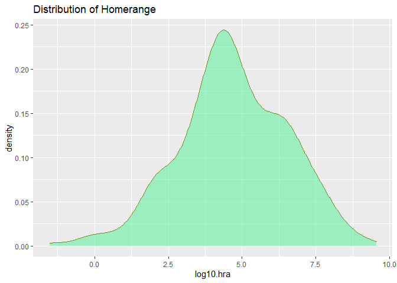
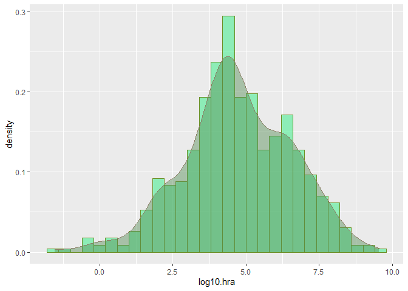
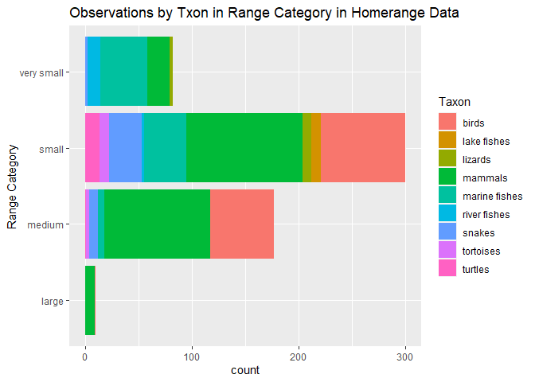
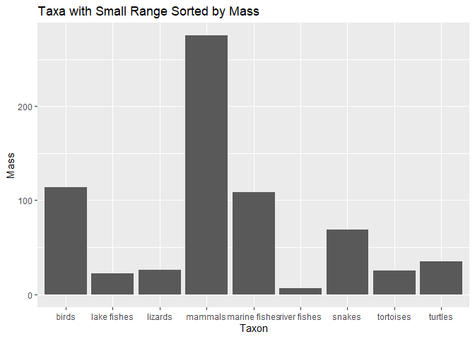

```r
#intall.packages("RColorBrewer")
#install.packages("paletteer")
```


```r
library(tidyverse)
```

```
## -- Attaching packages --------------------------------------- tidyverse 1.3.0 --
```

```
## v ggplot2 3.3.3     v purrr   0.3.4
## v tibble  3.0.4     v dplyr   1.0.2
## v tidyr   1.1.2     v stringr 1.4.0
## v readr   1.4.0     v forcats 0.5.0
```

```
## -- Conflicts ------------------------------------------ tidyverse_conflicts() --
## x dplyr::filter() masks stats::filter()
## x dplyr::lag()    masks stats::lag()
```

```r
library(RColorBrewer)
library(paletteer)
library(janitor)
```

```
## 
## Attaching package: 'janitor'
```

```
## The following objects are masked from 'package:stats':
## 
##     chisq.test, fisher.test
```

```r
library(here)
```

```
## here() starts at C:/Users/starf/Documents/GitHub/BIS15W2021_ahearne
```

```r
options(scipen=999)
```


```r
deserts<-readr::read_csv("data/surveys_complete.csv")
```

```
## 
## -- Column specification --------------------------------------------------------
## cols(
##   record_id = col_double(),
##   month = col_double(),
##   day = col_double(),
##   year = col_double(),
##   plot_id = col_double(),
##   species_id = col_character(),
##   sex = col_character(),
##   hindfoot_length = col_double(),
##   weight = col_double(),
##   genus = col_character(),
##   species = col_character(),
##   taxa = col_character(),
##   plot_type = col_character()
## )
```

```r
homerange<-readr::read_csv("data/Tamburelloetal_HomeRangeDatabase.csv")
```

```
## 
## -- Column specification --------------------------------------------------------
## cols(
##   .default = col_character(),
##   mean.mass.g = col_double(),
##   log10.mass = col_double(),
##   mean.hra.m2 = col_double(),
##   log10.hra = col_double(),
##   preymass = col_double(),
##   log10.preymass = col_double(),
##   PPMR = col_double()
## )
## i Use `spec()` for the full column specifications.
```

```r
deserts%>%
  filter(species_id=="DM"|species_id=="DS")%>%
  group_by(year,species_id)%>%
  summarise(n=n())
```

```
## `summarise()` regrouping output by 'year' (override with `.groups` argument)
```

```
## # A tibble: 47 x 3
## # Groups:   year [26]
##     year species_id     n
##    <dbl> <chr>      <int>
##  1  1977 DM           264
##  2  1977 DS            98
##  3  1978 DM           389
##  4  1978 DS           320
##  5  1979 DM           209
##  6  1979 DS           204
##  7  1980 DM           493
##  8  1980 DS           346
##  9  1981 DM           559
## 10  1981 DS           354
## # ... with 37 more rows
```

```r
deserts$year<-as.factor(deserts$year)
```

```r
deserts%>%
  filter(species_id=="DM"|species_id=="DS")%>%
  group_by(year, species_id)%>%
  summarize(n=n())%>%
  ggplot(aes(x=year,y=n,group=species_id,color=species_id))+
  geom_line()+
  geom_point(shape=1)+
  theme(axis.text.x=element_text(angle=60,hjust=1))+
  labs(title="Number of Samples for Species DM",
       x="Year",
       fill="n")
```

```
## `summarise()` regrouping output by 'year' (override with `.groups` argument)
```

<!-- -->


```r
homerange%>%
  ggplot(aes(x=log10.mass))+
  geom_histogram(alpha=0.6,color="black",fill="deeppink4", bins=40)+
  labs(title="Distribution of Body Mass")
```

<!-- -->


```r
grDevices::colors()
```

```
##   [1] "white"                "aliceblue"            "antiquewhite"        
##   [4] "antiquewhite1"        "antiquewhite2"        "antiquewhite3"       
##   [7] "antiquewhite4"        "aquamarine"           "aquamarine1"         
##  [10] "aquamarine2"          "aquamarine3"          "aquamarine4"         
##  [13] "azure"                "azure1"               "azure2"              
##  [16] "azure3"               "azure4"               "beige"               
##  [19] "bisque"               "bisque1"              "bisque2"             
##  [22] "bisque3"              "bisque4"              "black"               
##  [25] "blanchedalmond"       "blue"                 "blue1"               
##  [28] "blue2"                "blue3"                "blue4"               
##  [31] "blueviolet"           "brown"                "brown1"              
##  [34] "brown2"               "brown3"               "brown4"              
##  [37] "burlywood"            "burlywood1"           "burlywood2"          
##  [40] "burlywood3"           "burlywood4"           "cadetblue"           
##  [43] "cadetblue1"           "cadetblue2"           "cadetblue3"          
##  [46] "cadetblue4"           "chartreuse"           "chartreuse1"         
##  [49] "chartreuse2"          "chartreuse3"          "chartreuse4"         
##  [52] "chocolate"            "chocolate1"           "chocolate2"          
##  [55] "chocolate3"           "chocolate4"           "coral"               
##  [58] "coral1"               "coral2"               "coral3"              
##  [61] "coral4"               "cornflowerblue"       "cornsilk"            
##  [64] "cornsilk1"            "cornsilk2"            "cornsilk3"           
##  [67] "cornsilk4"            "cyan"                 "cyan1"               
##  [70] "cyan2"                "cyan3"                "cyan4"               
##  [73] "darkblue"             "darkcyan"             "darkgoldenrod"       
##  [76] "darkgoldenrod1"       "darkgoldenrod2"       "darkgoldenrod3"      
##  [79] "darkgoldenrod4"       "darkgray"             "darkgreen"           
##  [82] "darkgrey"             "darkkhaki"            "darkmagenta"         
##  [85] "darkolivegreen"       "darkolivegreen1"      "darkolivegreen2"     
##  [88] "darkolivegreen3"      "darkolivegreen4"      "darkorange"          
##  [91] "darkorange1"          "darkorange2"          "darkorange3"         
##  [94] "darkorange4"          "darkorchid"           "darkorchid1"         
##  [97] "darkorchid2"          "darkorchid3"          "darkorchid4"         
## [100] "darkred"              "darksalmon"           "darkseagreen"        
## [103] "darkseagreen1"        "darkseagreen2"        "darkseagreen3"       
## [106] "darkseagreen4"        "darkslateblue"        "darkslategray"       
## [109] "darkslategray1"       "darkslategray2"       "darkslategray3"      
## [112] "darkslategray4"       "darkslategrey"        "darkturquoise"       
## [115] "darkviolet"           "deeppink"             "deeppink1"           
## [118] "deeppink2"            "deeppink3"            "deeppink4"           
## [121] "deepskyblue"          "deepskyblue1"         "deepskyblue2"        
## [124] "deepskyblue3"         "deepskyblue4"         "dimgray"             
## [127] "dimgrey"              "dodgerblue"           "dodgerblue1"         
## [130] "dodgerblue2"          "dodgerblue3"          "dodgerblue4"         
## [133] "firebrick"            "firebrick1"           "firebrick2"          
## [136] "firebrick3"           "firebrick4"           "floralwhite"         
## [139] "forestgreen"          "gainsboro"            "ghostwhite"          
## [142] "gold"                 "gold1"                "gold2"               
## [145] "gold3"                "gold4"                "goldenrod"           
## [148] "goldenrod1"           "goldenrod2"           "goldenrod3"          
## [151] "goldenrod4"           "gray"                 "gray0"               
## [154] "gray1"                "gray2"                "gray3"               
## [157] "gray4"                "gray5"                "gray6"               
## [160] "gray7"                "gray8"                "gray9"               
## [163] "gray10"               "gray11"               "gray12"              
## [166] "gray13"               "gray14"               "gray15"              
## [169] "gray16"               "gray17"               "gray18"              
## [172] "gray19"               "gray20"               "gray21"              
## [175] "gray22"               "gray23"               "gray24"              
## [178] "gray25"               "gray26"               "gray27"              
## [181] "gray28"               "gray29"               "gray30"              
## [184] "gray31"               "gray32"               "gray33"              
## [187] "gray34"               "gray35"               "gray36"              
## [190] "gray37"               "gray38"               "gray39"              
## [193] "gray40"               "gray41"               "gray42"              
## [196] "gray43"               "gray44"               "gray45"              
## [199] "gray46"               "gray47"               "gray48"              
## [202] "gray49"               "gray50"               "gray51"              
## [205] "gray52"               "gray53"               "gray54"              
## [208] "gray55"               "gray56"               "gray57"              
## [211] "gray58"               "gray59"               "gray60"              
## [214] "gray61"               "gray62"               "gray63"              
## [217] "gray64"               "gray65"               "gray66"              
## [220] "gray67"               "gray68"               "gray69"              
## [223] "gray70"               "gray71"               "gray72"              
## [226] "gray73"               "gray74"               "gray75"              
## [229] "gray76"               "gray77"               "gray78"              
## [232] "gray79"               "gray80"               "gray81"              
## [235] "gray82"               "gray83"               "gray84"              
## [238] "gray85"               "gray86"               "gray87"              
## [241] "gray88"               "gray89"               "gray90"              
## [244] "gray91"               "gray92"               "gray93"              
## [247] "gray94"               "gray95"               "gray96"              
## [250] "gray97"               "gray98"               "gray99"              
## [253] "gray100"              "green"                "green1"              
## [256] "green2"               "green3"               "green4"              
## [259] "greenyellow"          "grey"                 "grey0"               
## [262] "grey1"                "grey2"                "grey3"               
## [265] "grey4"                "grey5"                "grey6"               
## [268] "grey7"                "grey8"                "grey9"               
## [271] "grey10"               "grey11"               "grey12"              
## [274] "grey13"               "grey14"               "grey15"              
## [277] "grey16"               "grey17"               "grey18"              
## [280] "grey19"               "grey20"               "grey21"              
## [283] "grey22"               "grey23"               "grey24"              
## [286] "grey25"               "grey26"               "grey27"              
## [289] "grey28"               "grey29"               "grey30"              
## [292] "grey31"               "grey32"               "grey33"              
## [295] "grey34"               "grey35"               "grey36"              
## [298] "grey37"               "grey38"               "grey39"              
## [301] "grey40"               "grey41"               "grey42"              
## [304] "grey43"               "grey44"               "grey45"              
## [307] "grey46"               "grey47"               "grey48"              
## [310] "grey49"               "grey50"               "grey51"              
## [313] "grey52"               "grey53"               "grey54"              
## [316] "grey55"               "grey56"               "grey57"              
## [319] "grey58"               "grey59"               "grey60"              
## [322] "grey61"               "grey62"               "grey63"              
## [325] "grey64"               "grey65"               "grey66"              
## [328] "grey67"               "grey68"               "grey69"              
## [331] "grey70"               "grey71"               "grey72"              
## [334] "grey73"               "grey74"               "grey75"              
## [337] "grey76"               "grey77"               "grey78"              
## [340] "grey79"               "grey80"               "grey81"              
## [343] "grey82"               "grey83"               "grey84"              
## [346] "grey85"               "grey86"               "grey87"              
## [349] "grey88"               "grey89"               "grey90"              
## [352] "grey91"               "grey92"               "grey93"              
## [355] "grey94"               "grey95"               "grey96"              
## [358] "grey97"               "grey98"               "grey99"              
## [361] "grey100"              "honeydew"             "honeydew1"           
## [364] "honeydew2"            "honeydew3"            "honeydew4"           
## [367] "hotpink"              "hotpink1"             "hotpink2"            
## [370] "hotpink3"             "hotpink4"             "indianred"           
## [373] "indianred1"           "indianred2"           "indianred3"          
## [376] "indianred4"           "ivory"                "ivory1"              
## [379] "ivory2"               "ivory3"               "ivory4"              
## [382] "khaki"                "khaki1"               "khaki2"              
## [385] "khaki3"               "khaki4"               "lavender"            
## [388] "lavenderblush"        "lavenderblush1"       "lavenderblush2"      
## [391] "lavenderblush3"       "lavenderblush4"       "lawngreen"           
## [394] "lemonchiffon"         "lemonchiffon1"        "lemonchiffon2"       
## [397] "lemonchiffon3"        "lemonchiffon4"        "lightblue"           
## [400] "lightblue1"           "lightblue2"           "lightblue3"          
## [403] "lightblue4"           "lightcoral"           "lightcyan"           
## [406] "lightcyan1"           "lightcyan2"           "lightcyan3"          
## [409] "lightcyan4"           "lightgoldenrod"       "lightgoldenrod1"     
## [412] "lightgoldenrod2"      "lightgoldenrod3"      "lightgoldenrod4"     
## [415] "lightgoldenrodyellow" "lightgray"            "lightgreen"          
## [418] "lightgrey"            "lightpink"            "lightpink1"          
## [421] "lightpink2"           "lightpink3"           "lightpink4"          
## [424] "lightsalmon"          "lightsalmon1"         "lightsalmon2"        
## [427] "lightsalmon3"         "lightsalmon4"         "lightseagreen"       
## [430] "lightskyblue"         "lightskyblue1"        "lightskyblue2"       
## [433] "lightskyblue3"        "lightskyblue4"        "lightslateblue"      
## [436] "lightslategray"       "lightslategrey"       "lightsteelblue"      
## [439] "lightsteelblue1"      "lightsteelblue2"      "lightsteelblue3"     
## [442] "lightsteelblue4"      "lightyellow"          "lightyellow1"        
## [445] "lightyellow2"         "lightyellow3"         "lightyellow4"        
## [448] "limegreen"            "linen"                "magenta"             
## [451] "magenta1"             "magenta2"             "magenta3"            
## [454] "magenta4"             "maroon"               "maroon1"             
## [457] "maroon2"              "maroon3"              "maroon4"             
## [460] "mediumaquamarine"     "mediumblue"           "mediumorchid"        
## [463] "mediumorchid1"        "mediumorchid2"        "mediumorchid3"       
## [466] "mediumorchid4"        "mediumpurple"         "mediumpurple1"       
## [469] "mediumpurple2"        "mediumpurple3"        "mediumpurple4"       
## [472] "mediumseagreen"       "mediumslateblue"      "mediumspringgreen"   
## [475] "mediumturquoise"      "mediumvioletred"      "midnightblue"        
## [478] "mintcream"            "mistyrose"            "mistyrose1"          
## [481] "mistyrose2"           "mistyrose3"           "mistyrose4"          
## [484] "moccasin"             "navajowhite"          "navajowhite1"        
## [487] "navajowhite2"         "navajowhite3"         "navajowhite4"        
## [490] "navy"                 "navyblue"             "oldlace"             
## [493] "olivedrab"            "olivedrab1"           "olivedrab2"          
## [496] "olivedrab3"           "olivedrab4"           "orange"              
## [499] "orange1"              "orange2"              "orange3"             
## [502] "orange4"              "orangered"            "orangered1"          
## [505] "orangered2"           "orangered3"           "orangered4"          
## [508] "orchid"               "orchid1"              "orchid2"             
## [511] "orchid3"              "orchid4"              "palegoldenrod"       
## [514] "palegreen"            "palegreen1"           "palegreen2"          
## [517] "palegreen3"           "palegreen4"           "paleturquoise"       
## [520] "paleturquoise1"       "paleturquoise2"       "paleturquoise3"      
## [523] "paleturquoise4"       "palevioletred"        "palevioletred1"      
## [526] "palevioletred2"       "palevioletred3"       "palevioletred4"      
## [529] "papayawhip"           "peachpuff"            "peachpuff1"          
## [532] "peachpuff2"           "peachpuff3"           "peachpuff4"          
## [535] "peru"                 "pink"                 "pink1"               
## [538] "pink2"                "pink3"                "pink4"               
## [541] "plum"                 "plum1"                "plum2"               
## [544] "plum3"                "plum4"                "powderblue"          
## [547] "purple"               "purple1"              "purple2"             
## [550] "purple3"              "purple4"              "red"                 
## [553] "red1"                 "red2"                 "red3"                
## [556] "red4"                 "rosybrown"            "rosybrown1"          
## [559] "rosybrown2"           "rosybrown3"           "rosybrown4"          
## [562] "royalblue"            "royalblue1"           "royalblue2"          
## [565] "royalblue3"           "royalblue4"           "saddlebrown"         
## [568] "salmon"               "salmon1"              "salmon2"             
## [571] "salmon3"              "salmon4"              "sandybrown"          
## [574] "seagreen"             "seagreen1"            "seagreen2"           
## [577] "seagreen3"            "seagreen4"            "seashell"            
## [580] "seashell1"            "seashell2"            "seashell3"           
## [583] "seashell4"            "sienna"               "sienna1"             
## [586] "sienna2"              "sienna3"              "sienna4"             
## [589] "skyblue"              "skyblue1"             "skyblue2"            
## [592] "skyblue3"             "skyblue4"             "slateblue"           
## [595] "slateblue1"           "slateblue2"           "slateblue3"          
## [598] "slateblue4"           "slategray"            "slategray1"          
## [601] "slategray2"           "slategray3"           "slategray4"          
## [604] "slategrey"            "snow"                 "snow1"               
## [607] "snow2"                "snow3"                "snow4"               
## [610] "springgreen"          "springgreen1"         "springgreen2"        
## [613] "springgreen3"         "springgreen4"         "steelblue"           
## [616] "steelblue1"           "steelblue2"           "steelblue3"          
## [619] "steelblue4"           "tan"                  "tan1"                
## [622] "tan2"                 "tan3"                 "tan4"                
## [625] "thistle"              "thistle1"             "thistle2"            
## [628] "thistle3"             "thistle4"             "tomato"              
## [631] "tomato1"              "tomato2"              "tomato3"             
## [634] "tomato4"              "turquoise"            "turquoise1"          
## [637] "turquoise2"           "turquoise3"           "turquoise4"          
## [640] "violet"               "violetred"            "violetred1"          
## [643] "violetred2"           "violetred3"           "violetred4"          
## [646] "wheat"                "wheat1"               "wheat2"              
## [649] "wheat3"               "wheat4"               "whitesmoke"          
## [652] "yellow"               "yellow1"              "yellow2"             
## [655] "yellow3"              "yellow4"              "yellowgreen"
```


```r
homerange%>%
  ggplot(aes(x=log10.mass))+
  geom_density(fill="thistle3", alpha=0.6, color="black")+
  labs(title="distribution of Body Maxx")
```

<!-- -->


```r
homerange%>%
  ggplot(aes(x=log10.mass))+
  geom_histogram(aes(y=..density..),binwidth=.4,fill="thistle3",alpha=0.8,color="deeppink4")+
  geom_density(color="slateblue")+
  labs(title="Distribution of Body Maxx")
```

<!-- -->

#Practice

#### 1.Make a histogram of `log10.hra`. Make sure to add a title.


```r
homerange%>%
  ggplot(aes(x=log10.hra))+
  geom_histogram(aes(y=..density..), binwidth =.4, fill="seagreen2", alpha=0.8, color="deeppink4")+
  labs(title="Distribution of Homerange")
```

<!-- -->

#### 2. Now plot the same variable using `geom_density()`.


```r
homerange%>%
  ggplot(aes(x=log10.hra))+
  geom_density(fill="seagreen2", alpha=0.5, color="olivedrab")+
  labs(title="Distribution of Homerange")
```

<!-- -->

#### 3. Combine them both!


```r
homerange%>%
  ggplot(aes(x=log10.hra))+
  geom_histogram(aes(y=..density..),binwidth = 0.4, fill="seagreen2",alpha=0.6, color="olivedrab")+
  geom_density(fill="palegreen4", alpha=0.45, color="wheat4")
```

<!-- -->


```r
glimpse(homerange)
```

```
## Rows: 569
## Columns: 24
## $ taxon                      <chr> "lake fishes", "river fishes", "river fi...
## $ common.name                <chr> "american eel", "blacktail redhorse", "c...
## $ class                      <chr> "actinopterygii", "actinopterygii", "act...
## $ order                      <chr> "anguilliformes", "cypriniformes", "cypr...
## $ family                     <chr> "anguillidae", "catostomidae", "cyprinid...
## $ genus                      <chr> "anguilla", "moxostoma", "campostoma", "...
## $ species                    <chr> "rostrata", "poecilura", "anomalum", "fu...
## $ primarymethod              <chr> "telemetry", "mark-recapture", "mark-rec...
## $ N                          <chr> "16", NA, "20", "26", "17", "5", "2", "2...
## $ mean.mass.g                <dbl> 887.00, 562.00, 34.00, 4.00, 4.00, 3525....
## $ log10.mass                 <dbl> 2.9479236, 2.7497363, 1.5314789, 0.60206...
## $ alternative.mass.reference <chr> NA, NA, NA, NA, NA, NA, NA, NA, NA, NA, ...
## $ mean.hra.m2                <dbl> 282750.00, 282.10, 116.11, 125.50, 87.10...
## $ log10.hra                  <dbl> 5.4514026, 2.4504031, 2.0648696, 2.09864...
## $ hra.reference              <chr> "Minns, C. K. 1995. Allometry of home ra...
## $ realm                      <chr> "aquatic", "aquatic", "aquatic", "aquati...
## $ thermoregulation           <chr> "ectotherm", "ectotherm", "ectotherm", "...
## $ locomotion                 <chr> "swimming", "swimming", "swimming", "swi...
## $ trophic.guild              <chr> "carnivore", "carnivore", "carnivore", "...
## $ dimension                  <chr> "3D", "2D", "2D", "2D", "2D", "2D", "2D"...
## $ preymass                   <dbl> NA, NA, NA, NA, NA, NA, 1.39, NA, NA, NA...
## $ log10.preymass             <dbl> NA, NA, NA, NA, NA, NA, 0.1430148, NA, N...
## $ PPMR                       <dbl> NA, NA, NA, NA, NA, NA, 530, NA, NA, NA,...
## $ prey.size.reference        <chr> NA, NA, NA, NA, NA, NA, "Brose U, et al....
```


```r
homerange
```

```
## # A tibble: 569 x 24
##    taxon common.name class order family genus species primarymethod N    
##    <chr> <chr>       <chr> <chr> <chr>  <chr> <chr>   <chr>         <chr>
##  1 lake~ american e~ acti~ angu~ angui~ angu~ rostra~ telemetry     16   
##  2 rive~ blacktail ~ acti~ cypr~ catos~ moxo~ poecil~ mark-recaptu~ <NA> 
##  3 rive~ central st~ acti~ cypr~ cypri~ camp~ anomal~ mark-recaptu~ 20   
##  4 rive~ rosyside d~ acti~ cypr~ cypri~ clin~ fundul~ mark-recaptu~ 26   
##  5 rive~ longnose d~ acti~ cypr~ cypri~ rhin~ catara~ mark-recaptu~ 17   
##  6 rive~ muskellunge acti~ esoc~ esoci~ esox  masqui~ telemetry     5    
##  7 mari~ pollack     acti~ gadi~ gadid~ poll~ pollac~ telemetry     2    
##  8 mari~ saithe      acti~ gadi~ gadid~ poll~ virens  telemetry     2    
##  9 mari~ lined surg~ acti~ perc~ acant~ acan~ lineat~ direct obser~ <NA> 
## 10 mari~ orangespin~ acti~ perc~ acant~ naso  litura~ telemetry     8    
## # ... with 559 more rows, and 15 more variables: mean.mass.g <dbl>,
## #   log10.mass <dbl>, alternative.mass.reference <chr>, mean.hra.m2 <dbl>,
## #   log10.hra <dbl>, hra.reference <chr>, realm <chr>, thermoregulation <chr>,
## #   locomotion <chr>, trophic.guild <chr>, dimension <chr>, preymass <dbl>,
## #   log10.preymass <dbl>, PPMR <dbl>, prey.size.reference <chr>
```


```r
homerange%>%
  select(log10.mass)%>%
  summarize(min=min(log10.mass),
            max=max(log10.mass))
```

```
## # A tibble: 1 x 2
##      min   max
##    <dbl> <dbl>
## 1 -0.658  6.60
```


```r
homerange<-homerange%>%
  mutate(mass_category=case_when(log10.mass<=1.75~"small",
         log10.mass>1.74&log10.mass<=2.75~"medium",
         log10.mass>2.75~"large"))
```


```r
homerange%>%
  ggplot(aes(x=mass_category,fill=trophic.guild))+
  geom_bar()+
  coord_flip()+
  labs(title="observations by Taxon and Mass Category in Homerange Data",
       x="Mass Category",
       fill="Trophic Guild")
```

<!-- -->

# Practice

#### Use `case_when()` to make a new column `range_category` that breaks down `log10.hra` into very small, small, medium, and large classes based on quartile. 


```r
names(homerange)
```

```
##  [1] "taxon"                      "common.name"               
##  [3] "class"                      "order"                     
##  [5] "family"                     "genus"                     
##  [7] "species"                    "primarymethod"             
##  [9] "N"                          "mean.mass.g"               
## [11] "log10.mass"                 "alternative.mass.reference"
## [13] "mean.hra.m2"                "log10.hra"                 
## [15] "hra.reference"              "realm"                     
## [17] "thermoregulation"           "locomotion"                
## [19] "trophic.guild"              "dimension"                 
## [21] "preymass"                   "log10.preymass"            
## [23] "PPMR"                       "prey.size.reference"       
## [25] "mass_category"
```


```r
homerange%>%
  select(log10.hra)%>%
  summarize(min=min(log10.hra),
            max=max(log10.hra))
```

```
## # A tibble: 1 x 2
##     min   max
##   <dbl> <dbl>
## 1 -1.52  9.55
```


```r
homerange<-homerange%>%
  mutate(range_category=case_when(log10.hra<=2.768~"very small",
                                  log10.hra>2.768&log10.hra<=5.5366045~"small",
                                  log10.hra>5.5366045&log10.hra<=8.305~"medium",
                                  log10.hra>8.305&log10.hra<=9.55033~"large"))
```


```r
#homerange
```

#### 2. How many and which taxonomic classes are represented in each of the `range_category` classes?


```r
homerange%>%
  ggplot(aes(x=range_category, fill=taxon))+
  geom_bar()+
  coord_flip()+
  labs(title="Observations by Txon in Range Category in Homerange Data",
       x="Range Category",
       fill="Taxon")
```

<!-- -->

#### 3. Isolate the small `range_category` and plot the range of `log10.mass` by taxonomic class.


```r
homerange%>%
  filter(range_category=="small")%>%
  ggplot(aes(x=log10.mass, y=taxon))+
  geom_col()+
  coord_flip()+
  labs(title="Taxa with Small Range Sorted by Mass",
       y="Taxon",
       x="Mass")
```

<!-- -->

#Part 2


```r
p<-homerange%>%
  ggplot(aes(x=taxon, fill=trophic.guild))+
  geom_bar(na.rm=T,position="dodge")
p
```

<!-- -->


```r
p+theme_linedraw()+
  theme(axis.text.x=element_text(angle=60,hjust=1))+
  labs(title="Observations by Taxon in Homerange Data",
       x= NULL,
       y="n",
       fill="Trophic Guild")
```

<!-- -->


```r
p+theme_linedraw()+
  theme(axis.text.x=element_text(angle=60,hjust=1))+
  labs(title="Observations by Taxon in Homerange Data",
       x=NULL,
       y="n",
       fill="Trophic Guild")
```

<!-- -->


```r
#install.packages("ggthemes")
library(ggthemes)
```


```r
ls("package:ggthemes")[grepl("theme_", ls("package:ggthemes"))]
```

```
##  [1] "theme_base"            "theme_calc"            "theme_clean"          
##  [4] "theme_economist"       "theme_economist_white" "theme_excel"          
##  [7] "theme_excel_new"       "theme_few"             "theme_fivethirtyeight"
## [10] "theme_foundation"      "theme_gdocs"           "theme_hc"             
## [13] "theme_igray"           "theme_map"             "theme_pander"         
## [16] "theme_par"             "theme_solarized"       "theme_solarized_2"    
## [19] "theme_solid"           "theme_stata"           "theme_tufte"          
## [22] "theme_wsj"
```


```r
p+
  theme_pander()+
  theme(legend.position = "bottom",
        axis.text.x=element_text(angle=60,hjust=1))+
  labs(title="Observations by Taxon in Homerange Data",
       x= NULL,
       y="n",
       fill="Trophic Guild")
```

<!-- -->


```r
?RColorBrewer
```

```
## starting httpd help server ... done
```


```r
display.brewer.pal(8,"PRGn")
```

<!-- -->


```r
p+
  scale_fill_brewer(palette="Paired")+
  theme(legend.position="bottom",
        axis.text.x=element_text(angle=60, hjust=1))+
  labs(title="Observations by Taxon in Homerange Data",
       x=NULL,
       y="n",
       fill="Trophic Guild")
```

<!-- -->


```r
colors<-paletteer::palettes_d_names
```


```r
my_palette <- paletteer_d("ggsci::hallmarks_light_cosmic")
```


```r
barplot(rep(1,14), axes=FALSE, col=my_palette)
```

<!-- -->


```r
p+scale_fill_manual(values=my_palette)+
  theme(legend.position = "bottom",
        axis.text.x = element_text(angle = 60, hjust=1))+
  labs(title = "Observations by Taxon in Homerange Data",
       x = NULL,
       y= "n",
       fill= "Trophic Guild")
```

<!-- -->


```r
homerange%>%
  ggplot(aes(x=log10.mass, y=log10.hra, color=locomotion))+
  geom_point()+
  xlim(0,4)+
  ylim(1,6)
```

```
## Warning: Removed 175 rows containing missing values (geom_point).
```

<!-- -->

