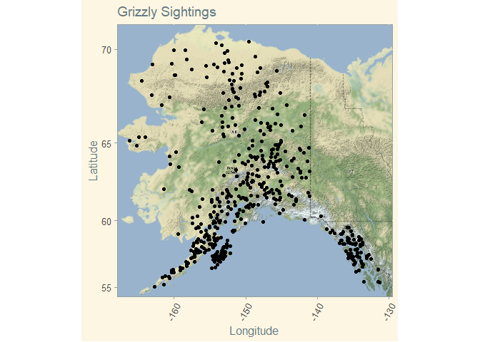
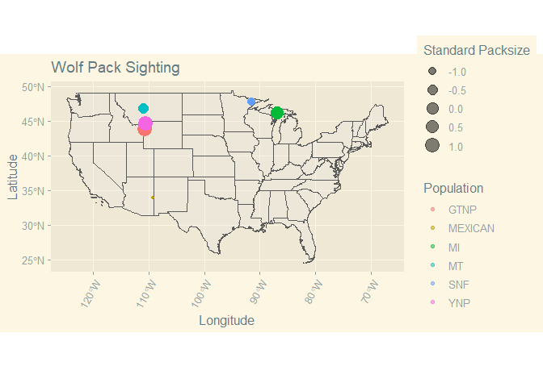

```r
library(tidyverse)
```

```
## -- Attaching packages --------------------------------------- tidyverse 1.3.0 --
```

```
## v ggplot2 3.3.3     v purrr   0.3.4
## v tibble  3.0.4     v dplyr   1.0.2
## v tidyr   1.1.2     v stringr 1.4.0
## v readr   1.4.0     v forcats 0.5.0
```

```
## -- Conflicts ------------------------------------------ tidyverse_conflicts() --
## x dplyr::filter() masks stats::filter()
## x dplyr::lag()    masks stats::lag()
```

```r
library(janitor)
```

```
## 
## Attaching package: 'janitor'
```

```
## The following objects are masked from 'package:stats':
## 
##     chisq.test, fisher.test
```

```r
library(here)
```

```
## here() starts at C:/Users/starf/Documents/GitHub/BIS15W2021_ahearne
```

```r
library(ggmap)
```

```
## Google's Terms of Service: https://cloud.google.com/maps-platform/terms/.
```

```
## Please cite ggmap if you use it! See citation("ggmap") for details.
```

```r
library(albersusa)
library(ggthemes)
```


#### 1. The first data set represent sightings of grizzly bears (Ursos arctos) in Alaska.
#### 2. The second data set is from Brandell, Ellen E (2021), Serological dataset and R code for: Patterns and processes of pathogen exposure in gray wolves across North America, Dryad, Dataset.


```r
see_bears<-readr::read_csv("data/bear-sightings.csv")%>%tidy_names()
```

```
## 
## -- Column specification --------------------------------------------------------
## cols(
##   bear.id = col_double(),
##   longitude = col_double(),
##   latitude = col_double()
## )
```

```r
see_wolves<-readr::read_csv("data/wolves_data/wolves_dataset.csv") #Not easily tidyable
```

```
## 
## -- Column specification --------------------------------------------------------
## cols(
##   .default = col_double(),
##   pop = col_character(),
##   age.cat = col_character(),
##   sex = col_character(),
##   color = col_character()
## )
## i Use `spec()` for the full column specifications.
```

#### 3. Load the `grizzly` data and evaluate its structure. As part of this step, produce a summary that provides the range of latitude and longitude so you can build an appropriate bounding box.


```r
names(see_bears)
```

```
## [1] "bear.id"   "longitude" "latitude"
```

```r
summary(see_bears)
```

```
##     bear.id       longitude         latitude    
##  Min.   :   7   Min.   :-166.2   Min.   :55.02  
##  1st Qu.:2569   1st Qu.:-154.2   1st Qu.:58.13  
##  Median :4822   Median :-151.0   Median :60.97  
##  Mean   :4935   Mean   :-149.1   Mean   :61.41  
##  3rd Qu.:7387   3rd Qu.:-145.6   3rd Qu.:64.13  
##  Max.   :9996   Max.   :-131.3   Max.   :70.37
```

```r
anyNA(see_bears)
```

```
## [1] FALSE
```

```r
see_bears%>%
  select(latitude, longitude)%>%
  summary()
```

```
##     latitude       longitude     
##  Min.   :55.02   Min.   :-166.2  
##  1st Qu.:58.13   1st Qu.:-154.2  
##  Median :60.97   Median :-151.0  
##  Mean   :61.41   Mean   :-149.1  
##  3rd Qu.:64.13   3rd Qu.:-145.6  
##  Max.   :70.37   Max.   :-131.3
```

#### 4. Use the range of the latitude and longitude to build an appropriate bounding box for your map.
#### 5. Load a map from stamen in a terrain style projection and display the map.


```r
latb<-c(55.02, 70.37)
longb<-c(-166.2, -131.3)
bboxb<-make_bbox(longb,latb, f=0.05)
mapb<-get_map(bboxb, maptype = "terrain", source="stamen")
```

```
## Map tiles by Stamen Design, under CC BY 3.0. Data by OpenStreetMap, under ODbL.
```

```r
ggmap(mapb)
```

<!-- -->

#### 6. Build a final map that overlays the recorded observations of grizzly bears in Alaska. 


```r
ggmap(mapb)+
  geom_point(data=see_bears, aes(x=longitude, y=latitude))+
  labs(x = "Longitude", y = "Latitude", title = "Grizzly Sightings")+
  theme_solarized()+
  theme(legend.position="right",
        axis.text.x=element_text(angle=60, hjust=1))
```

<!-- -->

#### 7. Let’s switch to the wolves data. Load the data and evaluate its structure.


```r
#names(see_wolves) #needs to be cleaned
#summary(see_wolves)
#anyNA(see_wolves) #Yes
see_wolves
```

```
## # A tibble: 1,986 x 23
##    pop     year age.cat sex   color   lat  long habitat human pop.density
##    <chr>  <dbl> <chr>   <chr> <chr> <dbl> <dbl>   <dbl> <dbl>       <dbl>
##  1 AK.PEN  2006 S       F     G      57.0 -158.    254.  10.4           8
##  2 AK.PEN  2006 S       M     G      57.0 -158.    254.  10.4           8
##  3 AK.PEN  2006 A       F     G      57.0 -158.    254.  10.4           8
##  4 AK.PEN  2006 S       M     B      57.0 -158.    254.  10.4           8
##  5 AK.PEN  2006 A       M     B      57.0 -158.    254.  10.4           8
##  6 AK.PEN  2006 A       M     G      57.0 -158.    254.  10.4           8
##  7 AK.PEN  2006 A       F     G      57.0 -158.    254.  10.4           8
##  8 AK.PEN  2006 P       M     G      57.0 -158.    254.  10.4           8
##  9 AK.PEN  2006 S       F     G      57.0 -158.    254.  10.4           8
## 10 AK.PEN  2006 P       M     G      57.0 -158.    254.  10.4           8
## # ... with 1,976 more rows, and 13 more variables: pack.size <dbl>,
## #   standard.habitat <dbl>, standard.human <dbl>, standard.pop <dbl>,
## #   standard.packsize <dbl>, standard.latitude <dbl>, standard.longitude <dbl>,
## #   cav.binary <dbl>, cdv.binary <dbl>, cpv.binary <dbl>, chv.binary <dbl>,
## #   neo.binary <dbl>, toxo.binary <dbl>
```

#### 8. How many distinct wolf populations are included in this study? Mae a new object that restricts the data to the wolf populations in the lower 48 US states.


```r
n_distinct(see_wolves$pack.size)
```

```
## [1] 17
```

```r
see_wolves_below<-see_wolves%>%
  filter(lat<=48)%>%
  group_by(pack.size)
see_wolves_below
```

```
## # A tibble: 1,169 x 23
## # Groups:   pack.size [6]
##    pop    year age.cat sex   color   lat  long habitat human pop.density
##    <chr> <dbl> <chr>   <chr> <chr> <dbl> <dbl>   <dbl> <dbl>       <dbl>
##  1 GTNP   2012 P       M     G      43.8 -111.  10375. 3924.        34.0
##  2 GTNP   2012 P       F     G      43.8 -111.  10375. 3924.        34.0
##  3 GTNP   2012 P       F     G      43.8 -111.  10375. 3924.        34.0
##  4 GTNP   2012 P       M     B      43.8 -111.  10375. 3924.        34.0
##  5 GTNP   2013 A       F     G      43.8 -111.  10375. 3924.        34.0
##  6 GTNP   2013 A       M     G      43.8 -111.  10375. 3924.        34.0
##  7 GTNP   2013 P       M     G      43.8 -111.  10375. 3924.        34.0
##  8 GTNP   2013 P       M     G      43.8 -111.  10375. 3924.        34.0
##  9 GTNP   2013 P       M     G      43.8 -111.  10375. 3924.        34.0
## 10 GTNP   2013 P       F     G      43.8 -111.  10375. 3924.        34.0
## # ... with 1,159 more rows, and 13 more variables: pack.size <dbl>,
## #   standard.habitat <dbl>, standard.human <dbl>, standard.pop <dbl>,
## #   standard.packsize <dbl>, standard.latitude <dbl>, standard.longitude <dbl>,
## #   cav.binary <dbl>, cdv.binary <dbl>, cpv.binary <dbl>, chv.binary <dbl>,
## #   neo.binary <dbl>, toxo.binary <dbl>
```

#### 9. Use the `albersusa` package to make a base map of the lower 48 US states.


```r
library(albersusa)
us_comp <- usa_sf()
US_comp_lower<-us_comp%>%
  filter(name!="Alaska", name!="Hawaii")
```

#### 10. Use the relimited data to plot the distribution of wolf populations in the lower 48 US states.


```r
ggplot()+
  geom_sf(data=US_comp_lower,size=0.125, alpha=0.25)+
  geom_point(data=see_wolves_below, aes(long, lat, color=pop, size=standard.packsize), alpha=0.5)+
  theme_solarized_2()+
  theme(legend.position="right",
        axis.text.x=element_text(angle=60, hjust=1))+
  labs(title="Wolf Pack Sighting",
       x="Longitude",
       y="Latitude",
       size="Standard Packsize",
       color="Population")
```

<!-- -->

#### 11. What is the average pack size for the wolves in this study by region?


```r
see_wolves_below%>%
  group_by(lat)%>%
  summarize(mean_packsize=mean(pack.size, na.rm=T))
```

```
## `summarise()` ungrouping output (override with `.groups` argument)
```

```
## # A tibble: 6 x 2
##     lat mean_packsize
##   <dbl>         <dbl>
## 1  33.9          4.04
## 2  43.8          8.1 
## 3  44.6          8.25
## 4  46.1          7.12
## 5  46.8          5.62
## 6  47.7          4.81
```

#### 12. Make a new map that shows the distribution of wolves in the lower 48 US states but which has the size of location markers adjusted by pack size.


```r
ggplot()+
  geom_sf(data=US_comp_lower,size=0.125, alpha=0.25)+
  geom_point(data=see_wolves_below, aes(long, lat, color=pop, size=pack.size), alpha=0.5)+
  theme_solarized_2()+
  theme(legend.position="right",
        axis.text.x=element_text(angle=60, hjust=1))+
  labs(title="Wolf Pack Sighting",
       x=NULL,
       y=NULL,
       size="Packsize",
       color="Population")
```

<!-- -->


