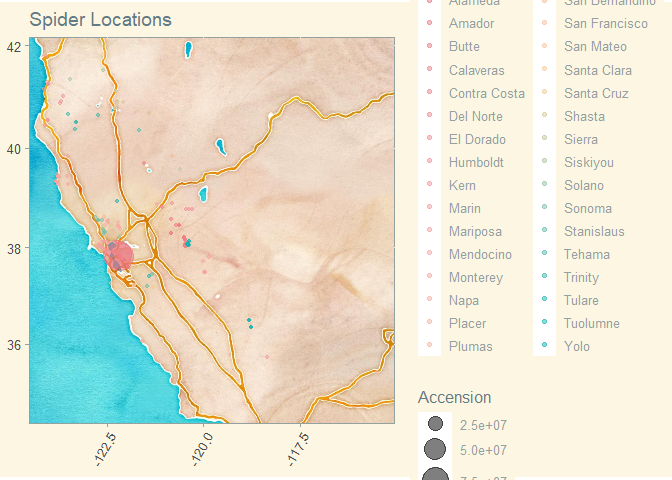
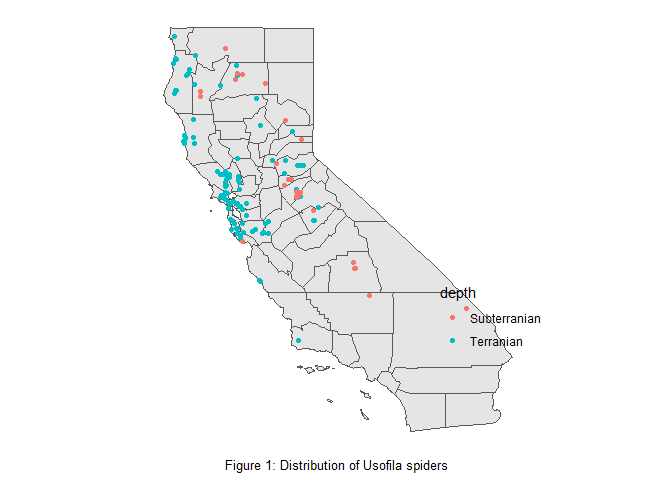

```r
library(tidyverse)
```

```
## -- Attaching packages --------------------------------------- tidyverse 1.3.0 --
```

```
## v ggplot2 3.3.3     v purrr   0.3.4
## v tibble  3.0.4     v dplyr   1.0.2
## v tidyr   1.1.2     v stringr 1.4.0
## v readr   1.4.0     v forcats 0.5.0
```

```
## -- Conflicts ------------------------------------------ tidyverse_conflicts() --
## x dplyr::filter() masks stats::filter()
## x dplyr::lag()    masks stats::lag()
```

```r
library(here)
```

```
## here() starts at C:/Users/starf/Documents/GitHub/BIS15W2021_ahearne
```

```r
library(janitor)
```

```
## 
## Attaching package: 'janitor'
```

```
## The following objects are masked from 'package:stats':
## 
##     chisq.test, fisher.test
```

```r
library(lubridate)
```

```
## 
## Attaching package: 'lubridate'
```

```
## The following objects are masked from 'package:base':
## 
##     date, intersect, setdiff, union
```

```r
library(ggmap)
```

```
## Google's Terms of Service: https://cloud.google.com/maps-platform/terms/.
```

```
## Please cite ggmap if you use it! See citation("ggmap") for details.
```


```r
files<-list.files("data/spiders",".csv")
files
```

```
##  [1] "Alameda .csv"        "Amador .csv"         "Butte .csv"         
##  [4] "Calaveras .csv"      "Contra Costa .csv"   "Del Norte .csv"     
##  [7] "El Dorado .csv"      "Humboldt .csv"       "Kern .csv"          
## [10] "Marin .csv"          "Mariposa .csv"       "Mendocino .csv"     
## [13] "Monterey .csv"       "Napa .csv"           "Placer .csv"        
## [16] "Plumas .csv"         "San Bernandino .csv" "San Francisco .csv" 
## [19] "San Mateo .csv"      "Santa Clara .csv"    "Santa Cruz .csv"    
## [22] "Shasta .csv"         "Sierra .csv"         "Siskiyou .csv"      
## [25] "Solano .csv"         "Sonoma .csv"         "Stanislaus .csv"    
## [28] "Tehama .csv"         "Trinity .csv"        "Tulare .csv"        
## [31] "Tuolumne .csv"       "Yolo .csv"
```

```r
files<-list.files("data/spiders",".csv",full.names=TRUE)
files
```

```
##  [1] "data/spiders/Alameda .csv"        "data/spiders/Amador .csv"        
##  [3] "data/spiders/Butte .csv"          "data/spiders/Calaveras .csv"     
##  [5] "data/spiders/Contra Costa .csv"   "data/spiders/Del Norte .csv"     
##  [7] "data/spiders/El Dorado .csv"      "data/spiders/Humboldt .csv"      
##  [9] "data/spiders/Kern .csv"           "data/spiders/Marin .csv"         
## [11] "data/spiders/Mariposa .csv"       "data/spiders/Mendocino .csv"     
## [13] "data/spiders/Monterey .csv"       "data/spiders/Napa .csv"          
## [15] "data/spiders/Placer .csv"         "data/spiders/Plumas .csv"        
## [17] "data/spiders/San Bernandino .csv" "data/spiders/San Francisco .csv" 
## [19] "data/spiders/San Mateo .csv"      "data/spiders/Santa Clara .csv"   
## [21] "data/spiders/Santa Cruz .csv"     "data/spiders/Shasta .csv"        
## [23] "data/spiders/Sierra .csv"         "data/spiders/Siskiyou .csv"      
## [25] "data/spiders/Solano .csv"         "data/spiders/Sonoma .csv"        
## [27] "data/spiders/Stanislaus .csv"     "data/spiders/Tehama .csv"        
## [29] "data/spiders/Trinity .csv"        "data/spiders/Tulare .csv"        
## [31] "data/spiders/Tuolumne .csv"       "data/spiders/Yolo .csv"
```


```r
spider_list<-lapply(files, read_csv)
```

```
## 
## -- Column specification --------------------------------------------------------
## cols(
##   Accession = col_double(),
##   Family = col_character(),
##   Genus = col_character(),
##   Country = col_character(),
##   State = col_character(),
##   County = col_character(),
##   Locality = col_character(),
##   Date = col_character(),
##   Collector = col_character()
## )
## 
## 
## -- Column specification --------------------------------------------------------
## cols(
##   Accession = col_double(),
##   Family = col_character(),
##   Genus = col_character(),
##   Country = col_character(),
##   State = col_character(),
##   County = col_character(),
##   Locality = col_character(),
##   Date = col_character(),
##   Collector = col_character()
## )
## 
## 
## -- Column specification --------------------------------------------------------
## cols(
##   Accession = col_double(),
##   Family = col_character(),
##   Genus = col_character(),
##   Country = col_character(),
##   State = col_character(),
##   County = col_character(),
##   Locality = col_character(),
##   Date = col_character(),
##   Collector = col_character()
## )
## 
## 
## -- Column specification --------------------------------------------------------
## cols(
##   Accession = col_double(),
##   Family = col_character(),
##   Genus = col_character(),
##   Country = col_character(),
##   State = col_character(),
##   County = col_character(),
##   Locality = col_character(),
##   Date = col_character(),
##   Collector = col_character()
## )
## 
## 
## -- Column specification --------------------------------------------------------
## cols(
##   Accession = col_double(),
##   Family = col_character(),
##   Genus = col_character(),
##   Country = col_character(),
##   State = col_character(),
##   County = col_character(),
##   Locality = col_character(),
##   Date = col_character(),
##   Collector = col_character()
## )
## 
## 
## -- Column specification --------------------------------------------------------
## cols(
##   Accession = col_double(),
##   Family = col_character(),
##   Genus = col_character(),
##   Country = col_character(),
##   State = col_character(),
##   County = col_character(),
##   Locality = col_character(),
##   Date = col_character(),
##   Collector = col_character()
## )
## 
## 
## -- Column specification --------------------------------------------------------
## cols(
##   Accession = col_double(),
##   Family = col_character(),
##   Genus = col_character(),
##   Country = col_character(),
##   State = col_character(),
##   County = col_character(),
##   Locality = col_character(),
##   Date = col_character(),
##   Collector = col_character()
## )
## 
## 
## -- Column specification --------------------------------------------------------
## cols(
##   Accession = col_double(),
##   Family = col_character(),
##   Genus = col_character(),
##   Country = col_character(),
##   State = col_character(),
##   County = col_character(),
##   Locality = col_character(),
##   Date = col_character(),
##   Collector = col_character()
## )
## 
## 
## -- Column specification --------------------------------------------------------
## cols(
##   Accession = col_double(),
##   Family = col_character(),
##   Genus = col_character(),
##   Country = col_character(),
##   State = col_character(),
##   County = col_character(),
##   Locality = col_character(),
##   Date = col_character(),
##   Collector = col_character()
## )
## 
## 
## -- Column specification --------------------------------------------------------
## cols(
##   Accession = col_double(),
##   Family = col_character(),
##   Genus = col_character(),
##   Country = col_character(),
##   State = col_character(),
##   County = col_character(),
##   Locality = col_character(),
##   Date = col_character(),
##   Collector = col_character()
## )
## 
## 
## -- Column specification --------------------------------------------------------
## cols(
##   Accession = col_double(),
##   Family = col_character(),
##   Genus = col_character(),
##   Country = col_character(),
##   State = col_character(),
##   County = col_character(),
##   Locality = col_character(),
##   Date = col_character(),
##   Collector = col_character()
## )
## 
## 
## -- Column specification --------------------------------------------------------
## cols(
##   Accession = col_double(),
##   Family = col_character(),
##   Genus = col_character(),
##   Country = col_character(),
##   State = col_character(),
##   County = col_character(),
##   Locality = col_character(),
##   Date = col_character(),
##   Collector = col_character()
## )
## 
## 
## -- Column specification --------------------------------------------------------
## cols(
##   Accession = col_double(),
##   Family = col_character(),
##   Genus = col_character(),
##   Country = col_character(),
##   State = col_character(),
##   County = col_character(),
##   Locality = col_character(),
##   Date = col_character(),
##   Collector = col_character()
## )
## 
## 
## -- Column specification --------------------------------------------------------
## cols(
##   Accession = col_double(),
##   Family = col_character(),
##   Genus = col_character(),
##   Country = col_character(),
##   State = col_character(),
##   County = col_character(),
##   Locality = col_character(),
##   Date = col_character(),
##   Collector = col_character()
## )
## 
## 
## -- Column specification --------------------------------------------------------
## cols(
##   Accession = col_double(),
##   Family = col_character(),
##   Genus = col_character(),
##   Country = col_character(),
##   State = col_character(),
##   County = col_character(),
##   Locality = col_character(),
##   Date = col_character(),
##   Collector = col_character()
## )
## 
## 
## -- Column specification --------------------------------------------------------
## cols(
##   Accession = col_double(),
##   Family = col_character(),
##   Genus = col_character(),
##   Country = col_character(),
##   State = col_character(),
##   County = col_character(),
##   Locality = col_character(),
##   Date = col_character(),
##   Collector = col_character()
## )
## 
## 
## -- Column specification --------------------------------------------------------
## cols(
##   Accession = col_double(),
##   Family = col_character(),
##   Genus = col_character(),
##   Country = col_character(),
##   State = col_character(),
##   County = col_character(),
##   Locality = col_character(),
##   Date = col_character(),
##   Collector = col_character()
## )
## 
## 
## -- Column specification --------------------------------------------------------
## cols(
##   Accession = col_double(),
##   Family = col_character(),
##   Genus = col_character(),
##   Country = col_character(),
##   State = col_character(),
##   County = col_character(),
##   Locality = col_character(),
##   Date = col_character(),
##   Collector = col_character()
## )
## 
## 
## -- Column specification --------------------------------------------------------
## cols(
##   Accession = col_double(),
##   Family = col_character(),
##   Genus = col_character(),
##   Country = col_character(),
##   State = col_character(),
##   County = col_character(),
##   Locality = col_character(),
##   Date = col_character(),
##   Collector = col_character()
## )
## 
## 
## -- Column specification --------------------------------------------------------
## cols(
##   Accession = col_double(),
##   Family = col_character(),
##   Genus = col_character(),
##   Country = col_character(),
##   State = col_character(),
##   County = col_character(),
##   Locality = col_character(),
##   Date = col_character(),
##   Collector = col_character()
## )
## 
## 
## -- Column specification --------------------------------------------------------
## cols(
##   Accession = col_double(),
##   Family = col_character(),
##   Genus = col_character(),
##   Country = col_character(),
##   State = col_character(),
##   County = col_character(),
##   Locality = col_character(),
##   Date = col_character(),
##   Collector = col_character()
## )
## 
## 
## -- Column specification --------------------------------------------------------
## cols(
##   Accession = col_double(),
##   Family = col_character(),
##   Genus = col_character(),
##   Country = col_character(),
##   State = col_character(),
##   County = col_character(),
##   Locality = col_character(),
##   Date = col_character(),
##   Collector = col_character()
## )
## 
## 
## -- Column specification --------------------------------------------------------
## cols(
##   Accession = col_double(),
##   Family = col_character(),
##   Genus = col_character(),
##   Country = col_character(),
##   State = col_character(),
##   County = col_character(),
##   Locality = col_character(),
##   Date = col_character(),
##   Collector = col_character()
## )
## 
## 
## -- Column specification --------------------------------------------------------
## cols(
##   Accession = col_double(),
##   Family = col_character(),
##   Genus = col_character(),
##   Country = col_character(),
##   State = col_character(),
##   County = col_character(),
##   Locality = col_character(),
##   Date = col_character(),
##   Collector = col_character()
## )
## 
## 
## -- Column specification --------------------------------------------------------
## cols(
##   Accession = col_double(),
##   Family = col_character(),
##   Genus = col_character(),
##   Country = col_character(),
##   State = col_character(),
##   County = col_character(),
##   Locality = col_character(),
##   Date = col_character(),
##   Collector = col_character()
## )
## 
## 
## -- Column specification --------------------------------------------------------
## cols(
##   Accession = col_double(),
##   Family = col_character(),
##   Genus = col_character(),
##   Country = col_character(),
##   State = col_character(),
##   County = col_character(),
##   Locality = col_character(),
##   Date = col_character(),
##   Collector = col_character()
## )
## 
## 
## -- Column specification --------------------------------------------------------
## cols(
##   Accession = col_double(),
##   Family = col_character(),
##   Genus = col_character(),
##   Country = col_character(),
##   State = col_character(),
##   County = col_character(),
##   Locality = col_character(),
##   Date = col_character(),
##   Collector = col_character()
## )
## 
## 
## -- Column specification --------------------------------------------------------
## cols(
##   Accession = col_double(),
##   Family = col_character(),
##   Genus = col_character(),
##   Country = col_character(),
##   State = col_character(),
##   County = col_character(),
##   Locality = col_character(),
##   Date = col_character(),
##   Collector = col_character()
## )
## 
## 
## -- Column specification --------------------------------------------------------
## cols(
##   Accession = col_double(),
##   Family = col_character(),
##   Genus = col_character(),
##   Country = col_character(),
##   State = col_character(),
##   County = col_character(),
##   Locality = col_character(),
##   Date = col_character(),
##   Collector = col_character()
## )
## 
## 
## -- Column specification --------------------------------------------------------
## cols(
##   Accession = col_double(),
##   Family = col_character(),
##   Genus = col_character(),
##   Country = col_character(),
##   State = col_character(),
##   County = col_character(),
##   Locality = col_character(),
##   Date = col_character(),
##   Collector = col_character()
## )
## 
## 
## -- Column specification --------------------------------------------------------
## cols(
##   Accession = col_double(),
##   Family = col_character(),
##   Genus = col_character(),
##   Country = col_character(),
##   State = col_character(),
##   County = col_character(),
##   Locality = col_character(),
##   Date = col_character(),
##   Collector = col_character()
## )
## 
## 
## -- Column specification --------------------------------------------------------
## cols(
##   Accession = col_double(),
##   Family = col_character(),
##   Genus = col_character(),
##   Country = col_character(),
##   State = col_character(),
##   County = col_character(),
##   Locality = col_character(),
##   Date = col_character(),
##   Collector = col_character()
## )
```

```r
spider_list[[3]]
```

```
## # A tibble: 1 x 9
##   Accession Family  Genus  Country State   County Locality       Date  Collector
##       <dbl> <chr>   <chr>  <chr>   <chr>   <chr>  <chr>          <chr> <chr>    
## 1   9038509 Telemi~ Usofi~ USA     Califo~ Butte  Dry Creek Rd,~ 2/3/~ RO Schus~
```

```r
class(spider_list[[3]])
```

```
## [1] "spec_tbl_df" "tbl_df"      "tbl"         "data.frame"
```
#### 1. What are the names of our list elements?


```r
names(spider_list[[3]])
```

```
## [1] "Accession" "Family"    "Genus"     "Country"   "State"     "County"   
## [7] "Locality"  "Date"      "Collector"
```

```r
names<-list.files("data/spiders",".csv")
names_list<-strsplit(names,split=".csv")
names_list
```

```
## [[1]]
## [1] "Alameda "
## 
## [[2]]
## [1] "Amador "
## 
## [[3]]
## [1] "Butte "
## 
## [[4]]
## [1] "Calaveras "
## 
## [[5]]
## [1] "Contra Costa "
## 
## [[6]]
## [1] "Del Norte "
## 
## [[7]]
## [1] "El Dorado "
## 
## [[8]]
## [1] "Humboldt "
## 
## [[9]]
## [1] "Kern "
## 
## [[10]]
## [1] "Marin "
## 
## [[11]]
## [1] "Mariposa "
## 
## [[12]]
## [1] "Mendocino "
## 
## [[13]]
## [1] "Monterey "
## 
## [[14]]
## [1] "Napa "
## 
## [[15]]
## [1] "Placer "
## 
## [[16]]
## [1] "Plumas "
## 
## [[17]]
## [1] "San Bernandino "
## 
## [[18]]
## [1] "San Francisco "
## 
## [[19]]
## [1] "San Mateo "
## 
## [[20]]
## [1] "Santa Clara "
## 
## [[21]]
## [1] "Santa Cruz "
## 
## [[22]]
## [1] "Shasta "
## 
## [[23]]
## [1] "Sierra "
## 
## [[24]]
## [1] "Siskiyou "
## 
## [[25]]
## [1] "Solano "
## 
## [[26]]
## [1] "Sonoma "
## 
## [[27]]
## [1] "Stanislaus "
## 
## [[28]]
## [1] "Tehama "
## 
## [[29]]
## [1] "Trinity "
## 
## [[30]]
## [1] "Tulare "
## 
## [[31]]
## [1] "Tuolumne "
## 
## [[32]]
## [1] "Yolo "
```

```r
names_vec<-unlist(names_list)
names_vec
```

```
##  [1] "Alameda "        "Amador "         "Butte "          "Calaveras "     
##  [5] "Contra Costa "   "Del Norte "      "El Dorado "      "Humboldt "      
##  [9] "Kern "           "Marin "          "Mariposa "       "Mendocino "     
## [13] "Monterey "       "Napa "           "Placer "         "Plumas "        
## [17] "San Bernandino " "San Francisco "  "San Mateo "      "Santa Clara "   
## [21] "Santa Cruz "     "Shasta "         "Sierra "         "Siskiyou "      
## [25] "Solano "         "Sonoma "         "Stanislaus "     "Tehama "        
## [29] "Trinity "        "Tulare "         "Tuolumne "       "Yolo "
```


```r
names(spider_list)<-names_vec
names(spider_list)
```

```
##  [1] "Alameda "        "Amador "         "Butte "          "Calaveras "     
##  [5] "Contra Costa "   "Del Norte "      "El Dorado "      "Humboldt "      
##  [9] "Kern "           "Marin "          "Mariposa "       "Mendocino "     
## [13] "Monterey "       "Napa "           "Placer "         "Plumas "        
## [17] "San Bernandino " "San Francisco "  "San Mateo "      "Santa Clara "   
## [21] "Santa Cruz "     "Shasta "         "Sierra "         "Siskiyou "      
## [25] "Solano "         "Sonoma "         "Stanislaus "     "Tehama "        
## [29] "Trinity "        "Tulare "         "Tuolumne "       "Yolo "
```
#### 1. Now that our list elements are named, how could we access the Butte County data by name?


```r
spider_list$Butte
```

```
## # A tibble: 1 x 9
##   Accession Family  Genus  Country State   County Locality       Date  Collector
##       <dbl> <chr>   <chr>  <chr>   <chr>   <chr>  <chr>          <chr> <chr>    
## 1   9038509 Telemi~ Usofi~ USA     Califo~ Butte  Dry Creek Rd,~ 2/3/~ RO Schus~
```


```r
spiders_all<-bind_rows(spider_list)
spiders_all
```

```
## # A tibble: 270 x 9
##    Accession Family  Genus  Country State  County  Locality     Date  Collector 
##        <dbl> <chr>   <chr>  <chr>   <chr>  <chr>   <chr>        <chr> <chr>     
##  1   9038521 Telemi~ Usofi~ USA     Calif~ Alameda Berkeley     2/3/~ LM Smith  
##  2   9038522 Telemi~ Usofi~ USA     Calif~ Alameda Castro Vall~ 24/3~ WM Pearce 
##  3   9038523 Telemi~ Usofi~ USA     Calif~ Alameda Niles, off ~ 2/1/~ V Roth    
##  4   9038524 Telemi~ Usofi~ USA     Calif~ Alameda Oakland      18/2~ WG Bentin~
##  5   9038525 Telemi~ Usofi~ USA     Calif~ Alameda Oakland      25/1~ R Schuster
##  6   9038526 Telemi~ Usofi~ USA     Calif~ Alameda Oakland      18/2~ WC Bentin~
##  7   9038527 Telemi~ Usofi~ USA     Calif~ Alameda Oakland      10/1~ J Helfer  
##  8  90386281 Telemi~ Usofi~ USA     Calif~ Alameda Oakland, Mo~ 17/1~ Roth, Sch~
##  9   9038529 Telemi~ Usofi~ USA     Calif~ Alameda Oakland, Mo~ 17/1~ Roth, Sch~
## 10  90387441 Telemi~ Usofi~ USA     Calif~ Alameda Berkeley, C~ 17/2~ PR Craig,~
## # ... with 260 more rows
```


```r
table_A<-readr::read_csv("data/table_A.csv")
```

```
## 
## -- Column specification --------------------------------------------------------
## cols(
##   customer_ID = col_double(),
##   n_orders = col_double(),
##   total_value_orders = col_double(),
##   ave_value_orders = col_double(),
##   last_order_date = col_character()
## )
```

```r
table_B<-readr::read_csv("data/table_B.csv")
```

```
## 
## -- Column specification --------------------------------------------------------
## cols(
##   customer_ID = col_double(),
##   age = col_double(),
##   gender = col_character(),
##   favorite = col_character()
## )
```

```r
inner_ex<-inner_join(table_A,table_B,by="customer_ID")
inner_ex
```

```
## # A tibble: 2 x 8
##   customer_ID n_orders total_value_orders ave_value_orders last_order_date   age
##         <dbl>    <dbl>              <dbl>            <dbl> <chr>           <dbl>
## 1           1        5                500              100 12/7/20            50
## 2           2       10                240               24 1/2/18             44
## # ... with 2 more variables: gender <chr>, favorite <chr>
```


```r
left_ex<-left_join(table_A,table_B,by="customer_ID")
left_ex
```

```
## # A tibble: 3 x 8
##   customer_ID n_orders total_value_orders ave_value_orders last_order_date   age
##         <dbl>    <dbl>              <dbl>            <dbl> <chr>           <dbl>
## 1           1        5                500              100 12/7/20            50
## 2           2       10                240               24 1/2/18             44
## 3           3        4                 40               10 3/6/20             NA
## # ... with 2 more variables: gender <chr>, favorite <chr>
```


```r
right_ex<-right_join(table_A,table_B,by="customer_ID")
right_ex
```

```
## # A tibble: 3 x 8
##   customer_ID n_orders total_value_orders ave_value_orders last_order_date   age
##         <dbl>    <dbl>              <dbl>            <dbl> <chr>           <dbl>
## 1           1        5                500              100 12/7/20            50
## 2           2       10                240               24 1/2/18             44
## 3           4       NA                 NA               NA <NA>               30
## # ... with 2 more variables: gender <chr>, favorite <chr>
```

```r
full_ex<-full_join(table_A,table_B,by="customer_ID")
full_ex
```

```
## # A tibble: 4 x 8
##   customer_ID n_orders total_value_orders ave_value_orders last_order_date   age
##         <dbl>    <dbl>              <dbl>            <dbl> <chr>           <dbl>
## 1           1        5                500              100 12/7/20            50
## 2           2       10                240               24 1/2/18             44
## 3           3        4                 40               10 3/6/20             NA
## 4           4       NA                 NA               NA <NA>               30
## # ... with 2 more variables: gender <chr>, favorite <chr>
```

```r
semi_ex<-semi_join(table_A,table_B,by="customer_ID")
semi_ex
```

```
## # A tibble: 2 x 5
##   customer_ID n_orders total_value_orders ave_value_orders last_order_date
##         <dbl>    <dbl>              <dbl>            <dbl> <chr>          
## 1           1        5                500              100 12/7/20        
## 2           2       10                240               24 1/2/18
```

```r
anti_ex<-anti_join(table_A,table_B,by="customer_ID")
anti_ex
```

```
## # A tibble: 1 x 5
##   customer_ID n_orders total_value_orders ave_value_orders last_order_date
##         <dbl>    <dbl>              <dbl>            <dbl> <chr>          
## 1           3        4                 40               10 3/6/20
```


```r
spiders_loc <- read_csv("data/spiders locations/spiders_locations.csv")
```

```
## 
## -- Column specification --------------------------------------------------------
## cols(
##   Accession = col_double(),
##   Latitude = col_double(),
##   Longitude = col_double()
## )
```

```r
spiders_loc
```

```
## # A tibble: 270 x 3
##    Accession Latitude Longitude
##        <dbl>    <dbl>     <dbl>
##  1   9038521     37.9     -122.
##  2   9038522     37.7     -122.
##  3   9038523     37.6     -122.
##  4   9038524     37.8     -122.
##  5   9038525     37.8     -122.
##  6   9038526     37.8     -122.
##  7   9038527     37.8     -122.
##  8  90386281     37.8     -122.
##  9   9038529     37.8     -122.
## 10  90387441     37.9     -122.
## # ... with 260 more rows
```

```r
spiders_with_locs<-left_join(spiders_all, spiders_loc,by=c("Accession"))
summary(spiders_with_locs)
```

```
##    Accession           Family             Genus             Country         
##  Min.   : 9034549   Length:270         Length:270         Length:270        
##  1st Qu.: 9038573   Class :character   Class :character   Class :character  
##  Median : 9038644   Mode  :character   Mode  :character   Mode  :character  
##  Mean   : 9641191                                                           
##  3rd Qu.: 9038718                                                           
##  Max.   :90387441                                                           
##     State              County            Locality             Date          
##  Length:270         Length:270         Length:270         Length:270        
##  Class :character   Class :character   Class :character   Class :character  
##  Mode  :character   Mode  :character   Mode  :character   Mode  :character  
##                                                                             
##                                                                             
##                                                                             
##   Collector            Latitude       Longitude     
##  Length:270         Min.   :34.67   Min.   :-124.1  
##  Class :character   1st Qu.:37.88   1st Qu.:-122.5  
##  Mode  :character   Median :38.19   Median :-122.1  
##                     Mean   :38.49   Mean   :-121.6  
##                     3rd Qu.:38.88   3rd Qu.:-120.5  
##                     Max.   :44.51   Max.   :-115.5
```


```r
class(spiders_with_locs$Date)
```

```
## [1] "character"
```


```r
day<-today()
str(day)
```

```
##  Date[1:1], format: "2021-02-24"
```


```r
datetime<-now()
datetime
```

```
## [1] "2021-02-24 23:09:58 PST"
```

```r
dmy(spiders_with_locs$Date)
```

```
## Warning: 2 failed to parse.
```

```
##   [1] "1958-03-02" "1941-03-24" "1964-01-02" "1953-02-18" "1953-01-25"
##   [6] "1953-02-18" "1953-12-10" "1953-10-17" "1953-10-17" "1962-02-17"
##  [11] "1983-12-21" "1964-01-01" "1995-03-25" "1987-10-17" "1987-10-17"
##  [16] "1981-01-24" "1980-09-21" "1980-09-13" "1995-07-15" "1979-04-15"
##  [21] "1956-03-02" "1979-02-28" "1975-09-23" "1994-06-11" "1990-12-22"
##  [26] "1961-09-01" "1991-08-24" "1977-05-14" "1962-08-11" "1963-08-21"
##  [31] "1977-05-25" "1960-05-14" "1961-03-31" "1977-05-25" "1977-05-25"
##  [36] "1961-09-04" "1962-08-13" "1979-03-29" "1962-08-15" "1977-05-25"
##  [41] "1961-08-31" NA           "1963-08-19" "1961-09-01" "1979-03-29"
##  [46] "1960-05-14" "1977-05-16" NA           "1977-04-27" "1977-05-16"
##  [51] "1961-09-04" "1961-09-04" "1963-08-17" "1961-09-04" "1960-05-14"
##  [56] "1960-05-14" "1972-08-11" "1961-09-04" "1991-02-22" "1991-02-22"
##  [61] "1991-02-22" "1953-12-12" "1953-12-05" "1953-05-18" "1961-03-27"
##  [66] "1953-09-19" "1953-09-19" "1994-04-20" "1961-05-18" "1962-09-01"
##  [71] "1962-09-01" "1946-03-18" "1962-06-02" "1958-04-25" "1958-03-05"
##  [76] "1958-02-22" "1959-09-15" "1953-08-13" "1953-08-13" "1961-09-16"
##  [81] "1953-09-19" "1961-09-15" "1959-10-01" "1953-04-13" "2006-06-30"
##  [86] "1937-07-13" "1994-04-21" "1980-09-30" "1960-03-01" "1982-03-14"
##  [91] "1960-03-24" "1991-03-01" "1953-11-08" "1982-03-07" "1987-11-14"
##  [96] "1991-03-08" "1986-01-02" "1994-01-15" "1986-02-23" "1991-03-08"
## [101] "1982-03-07" "1994-01-30" "1982-04-25" "1994-03-12" "1994-03-19"
## [106] "1993-02-27" "1985-12-07" "1990-03-16" "1979-04-07" "1958-09-04"
## [111] "1953-04-04" "1953-04-04" "1953-04-04" "1992-09-07" "1993-07-25"
## [116] "1990-09-15" "1990-09-21" "1990-09-18" "1991-05-04" "1990-07-20"
## [121] "1957-01-05" "1955-05-03" "1957-03-03" "1957-11-15" "1955-02-12"
## [126] "1957-08-03" "1958-03-17" "1958-03-15" "1996-05-26" "1964-05-02"
## [131] "1991-05-31" "1949-05-30" "1953-12-31" "1958-01-19" "1957-01-06"
## [136] "1958-01-22" "1958-01-19" "1957-12-13" "1957-01-06" "1958-12-15"
## [141] "1958-01-22" "1954-02-15" "1953-12-31" "1957-01-06" "1962-04-29"
## [146] "1957-03-17" "1962-05-22" "1957-05-12" "1953-12-31" "1954-03-14"
## [151] "1957-03-16" "1958-01-03" "1959-03-10" "1959-01-03" "1959-03-10"
## [156] "1958-03-21" "1959-01-03" "1959-03-19" "1959-03-10" "1958-03-12"
## [161] "1959-09-19" "1961-09-05" "1972-04-01" "1954-02-10" "1990-06-29"
## [166] "1988-11-18" "1991-05-16" "2001-07-13" "1961-11-05" "1986-09-13"
## [171] "1987-01-02" "1991-02-10" "1989-03-11" "1989-03-31" "1989-02-20"
## [176] "1954-01-02" "1957-06-02" "1990-01-26" "1983-01-02" "1957-08-28"
## [181] "1953-06-14" "1953-12-23" "1991-02-18" "1989-07-08" "1963-08-28"
## [186] "1991-02-18" "1979-04-21" "1961-09-15" "1954-07-11" "1979-04-09"
## [191] "1961-09-07" "1961-09-07" "1960-06-28" "2000-04-14" "1989-08-06"
## [196] "1960-06-28" "1959-09-27" "1959-06-15" "1954-07-11" "1959-06-14"
## [201] "1959-12-19" "1995-06-08" "1996-08-30" "1960-04-02" "1989-08-07"
## [206] "1995-06-08" "1995-06-09" "1995-06-07" "1991-08-17" "1959-08-22"
## [211] "1989-06-17" "1960-02-11" "1983-02-11" "1980-12-07" "1983-02-11"
## [216] "1988-01-18" "1954-03-14" "1958-01-22" "1953-12-31" "1953-12-31"
## [221] "1953-11-21" "1953-12-31" "2007-01-09" "1991-02-10" "1989-03-31"
## [226] "1954-06-26" "1990-10-27" "1996-08-31" "1990-08-13" "1990-10-27"
## [231] "1989-10-20" "1954-07-11" "2000-06-22" "1990-04-05" "1990-04-05"
## [236] "1979-04-18" "1979-04-18" "1991-07-27" "1991-07-26" "2004-04-28"
## [241] "2004-04-27" "2004-05-04" "2004-04-27" "2003-11-19" "2004-04-27"
## [246] "2004-04-27" "2003-11-19" "2004-04-28" "2003-08-13" "2003-11-17"
## [251] "2003-08-13" "1978-01-20" "1977-05-01" "1979-03-28" "1977-12-18"
## [256] "1978-01-10" "1979-04-01" "1978-01-02" "1977-02-21" "1979-02-12"
## [261] "1979-03-25" "1977-12-14" "1979-03-25" "1979-04-17" "1978-01-10"
## [266] "1979-02-04" "1977-05-12" "1977-03-15" "1981-03-05" "1960-02-09"
```

#### 1. Convert each of the examples above using lubridate.


```r
year(day)
```

```
## [1] 2021
```

```r
year(datetime)
```

```
## [1] 2021
```


```r
month(day)
```

```
## [1] 2
```

```r
day(day)
```

```
## [1] 24
```

```r
hour(datetime)
```

```
## [1] 23
```

```r
minute(datetime)
```

```
## [1] 9
```

```r
second(datetime)
```

```
## [1] 58.93062
```

```r
wday(datetime, label=T)
```

```
## [1] Wed
## Levels: Sun < Mon < Tue < Wed < Thu < Fri < Sat
```


```r
write.csv(spiders_with_locs, file="spiders_with_locs.csv", row.names=F)
```


```r
#install.packages("remotes")
#remotes::install_github("https://github.com/hrbrmstr/albersusa")
```


# Part 2


```r
library(ggmap)
```


```r
spiders<-readr::read_csv("data/spiders_with_locs.csv")%>%
  clean_names()
```

```
## 
## -- Column specification --------------------------------------------------------
## cols(
##   Accession = col_double(),
##   Family = col_character(),
##   Genus = col_character(),
##   Country = col_character(),
##   State = col_character(),
##   County = col_character(),
##   Locality = col_character(),
##   Date = col_date(format = ""),
##   Collector = col_character(),
##   Latitude = col_double(),
##   Longitude = col_double()
## )
```


```r
spiders<-spiders%>%filter(latitude<=42)
```


```r
spiders%>%
  select(latitude, longitude)%>%
  summary()
```

```
##     latitude       longitude     
##  Min.   :34.67   Min.   :-124.1  
##  1st Qu.:37.88   1st Qu.:-122.5  
##  Median :38.19   Median :-122.1  
##  Mean   :38.47   Mean   :-121.6  
##  3rd Qu.:38.88   3rd Qu.:-120.5  
##  Max.   :41.80   Max.   :-115.5
```


```r
lat<-c(34.67,41.80)
long<-c(-124.1, -115.5)
bbox<-make_bbox(long,lat,f=0.05)
```


```r
map1<-get_map(bbox, maptype="terrain",source="stamen")
```

```
## Map tiles by Stamen Design, under CC BY 3.0. Data by OpenStreetMap, under ODbL.
```

```r
ggmap(map1)
```

<!-- -->


```r
ggmap(map1)+
  geom_point(data=spiders,aes(longitude,latitude))+
  labs(x="Longitude",
       y="Latitude",
       title="Spider Locations")
```

<!-- -->


#### 1. Map the spider locations with a different type of base map. Try to adjust the map using different aesthetics including `size`, `color`, and `alpha`.


```r
names(spiders)
```

```
##  [1] "accession" "family"    "genus"     "country"   "state"     "county"   
##  [7] "locality"  "date"      "collector" "latitude"  "longitude"
```


```r
map2<-get_map(bbox, maptype="watercolor",source="stamen")
```

```
## Map tiles by Stamen Design, under CC BY 3.0. Data by OpenStreetMap, under CC BY SA.
```

```r
library(ggthemes)
my_lil_palette<- LaCroixColoR::lacroix_palette("Pamplemousse", type = "discrete")
my_lil_palette_cont<-LaCroixColoR::lacroix_palette("Pamplemousse", n = 50, type = "continuous")
barplot(rep(1,14), axes=FALSE, col=my_lil_palette)
```

<!-- -->


```r
ggmap(map2)+
  geom_point(data=spiders,aes(longitude,latitude, color=county, size=accession), alpha=0.5)+
  labs(x="Longitude",
       y="Latitude",
       title="Spider Locations")+
  scale_color_manual(values=my_lil_palette_cont)+
  theme_solarized()+
  theme(legend.position="right",
        axis.text.x=element_text(angle=60, hjust=1))+
  labs(title="Spider Locations",
       x=NULL,
       y=NULL,
       color="County",
       size="Accension")+
  scale_size(range = c(1, 10))
```

<!-- -->


```r
library(albersusa)
```


```r
us_comp<-usa_sf()
```

```r
cnty_comp<-counties_sf()
```

```r
ggplot()+
  geom_sf(data=us_comp, size=0.125)+
  theme_linedraw()+
  labs(title="USA State Boundaries")
```

<!-- -->

```r
ca_comp<-us_comp%>%
  filter(name=="California")
```


```r
ca_cnty_comp<-cnty_comp%>%
  filter(state=="California")
```


```r
ggplot()+
  geom_sf(data=ca_comp, size=0.125)+
  geom_sf(data=ca_cnty_comp, size=0.125)
```

<!-- -->


```r
ggplot()+
  geom_sf(data=ca_comp, size=0.125)+
  geom_sf(data=ca_cnty_comp, size=0.125)+
  geom_point(data=spiders, aes(longitude, latitude))
```

<!-- -->


```r
ggplot() +
  geom_sf(data = ca_comp, size = 0.125)+
  geom_sf(data = ca_cnty_comp, size = 0.125)+
  geom_point(data = spiders, aes(longitude, latitude))+
  labs(x = "Figure 1: Distribution of Usofila spiders")+
  theme_minimal() +
  theme(axis.text = element_blank()) +
  theme(axis.title.x = element_text(hjust=0.5, size = 10)) +
  theme(axis.title.y = element_blank()) +
  theme(panel.grid = element_blank()) +
  theme(legend.position = c(0.9, 0.3)) -> uso_map
uso_map
```

<!-- -->


#Practice
#### Make a new column that labels each specimen as occurring in a cave or on the surface. The word “Cave” is part of the locality information.


```r
spiders
```

```
## # A tibble: 269 x 11
##    accession family  genus  country state county locality   date       collector
##        <dbl> <chr>   <chr>  <chr>   <chr> <chr>  <chr>      <date>     <chr>    
##  1   9038521 Telemi~ Usofi~ USA     Cali~ Alame~ Berkeley   2019-03-02 LM Smith 
##  2   9038522 Telemi~ Usofi~ USA     Cali~ Alame~ Castro Va~ 2019-03-24 WM Pearce
##  3   9038523 Telemi~ Usofi~ USA     Cali~ Alame~ Niles, of~ 2019-01-02 V Roth   
##  4   9038524 Telemi~ Usofi~ USA     Cali~ Alame~ Oakland    2019-02-18 WG Benti~
##  5   9038525 Telemi~ Usofi~ USA     Cali~ Alame~ Oakland    2019-01-25 R Schust~
##  6   9038526 Telemi~ Usofi~ USA     Cali~ Alame~ Oakland    2019-02-18 WC Benti~
##  7   9038527 Telemi~ Usofi~ USA     Cali~ Alame~ Oakland    2019-12-10 J Helfer 
##  8  90386281 Telemi~ Usofi~ USA     Cali~ Alame~ Oakland, ~ 2019-10-17 Roth, Sc~
##  9   9038529 Telemi~ Usofi~ USA     Cali~ Alame~ Oakland, ~ 2019-10-17 Roth, Sc~
## 10  90387441 Telemi~ Usofi~ USA     Cali~ Alame~ Berkeley,~ 2019-02-17 PR Craig~
## # ... with 259 more rows, and 2 more variables: latitude <dbl>, longitude <dbl>
```


```r
spiders<-spiders%>%
  mutate(depth=case_when(grepl("Cave", locality)~ "Subterranian",
                         grepl(".", locality)~ "Terranian"))
```


```r
ggplot() +
  geom_sf(data = ca_comp, size = 0.125)+
  geom_sf(data = ca_cnty_comp, size = 0.125)+
  geom_point(data = spiders, aes(longitude, latitude, color=depth))+
  labs(x = "Figure 1: Distribution of Usofila spiders")+
  theme_minimal() +
  theme(axis.text = element_blank()) +
  theme(axis.title.x = element_text(hjust=0.5, size = 10)) +
  theme(axis.title.y = element_blank()) +
  theme(panel.grid = element_blank()) +
  theme(legend.position = c(0.9, 0.3))
```

<!-- -->

