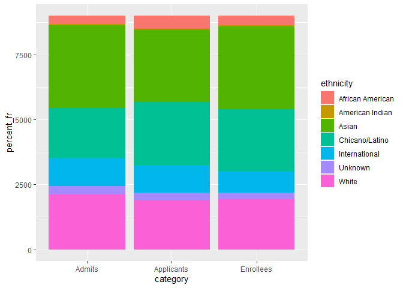

```r
library(tidyverse)
```

```
## -- Attaching packages --------------------------------------- tidyverse 1.3.0 --
```

```
## v ggplot2 3.3.3     v purrr   0.3.4
## v tibble  3.1.0     v dplyr   1.0.4
## v tidyr   1.1.2     v stringr 1.4.0
## v readr   1.4.0     v forcats 0.5.1
```

```
## -- Conflicts ------------------------------------------ tidyverse_conflicts() --
## x dplyr::filter() masks stats::filter()
## x dplyr::lag()    masks stats::lag()
```

```r
library(shiny)
library(shinydashboard)
```

```
## 
## Attaching package: 'shinydashboard'
```

```
## The following object is masked from 'package:graphics':
## 
##     box
```

```r
library(janitor)
```

```
## 
## Attaching package: 'janitor'
```

```
## The following objects are masked from 'package:stats':
## 
##     chisq.test, fisher.test
```


```r
uc_admit<-readr::read_csv("data/UC_admit.csv")
```

```
## 
## -- Column specification --------------------------------------------------------
## cols(
##   Campus = col_character(),
##   Academic_Yr = col_double(),
##   Category = col_character(),
##   Ethnicity = col_character(),
##   `Perc FR` = col_character(),
##   FilteredCountFR = col_double()
## )
```

#### 1. Use the function(s) of your choice to get an idea of the overall structure of the data frame, including its dimensions, column names, variable classes, etc. As part of this, determine if there are NA’s and how they are treated.


```r
#summary(Uc_admit)
#glimpse(uc_admit)
uc_admit<-clean_names(uc_admit)
names(uc_admit)
```

```
## [1] "campus"            "academic_yr"       "category"         
## [4] "ethnicity"         "perc_fr"           "filtered_count_fr"
```

```r
uc_admit2<-uc_admit%>%
  mutate(percent_fr=str_replace(perc_fr, "%", ""))%>%
  select(campus, academic_yr, category, ethnicity, percent_fr, filtered_count_fr)%>%
  filter(ethnicity!="All")
uc_admit2
```

```
## # A tibble: 1,890 x 6
##    campus academic_yr category   ethnicity        percent_fr filtered_count_fr
##    <chr>        <dbl> <chr>      <chr>            <chr>                  <dbl>
##  1 Davis         2019 Applicants International    21.16                  16522
##  2 Davis         2019 Applicants Unknown          2.51                    1959
##  3 Davis         2019 Applicants White            18.39                  14360
##  4 Davis         2019 Applicants Asian            30.76                  24024
##  5 Davis         2019 Applicants Chicano/Latino   22.44                  17526
##  6 Davis         2019 Applicants American Indian  0.35                     277
##  7 Davis         2019 Applicants African American 4.39                    3425
##  8 Davis         2018 Applicants International    19.87                  15507
##  9 Davis         2018 Applicants Unknown          2.83                    2208
## 10 Davis         2018 Applicants White            18.96                  14797
## # ... with 1,880 more rows
```


```r
uc_admit2$academic_yr<-as.factor(uc_admit2$academic_yr)
uc_admit2$percent_fr<-as.numeric(uc_admit2$percent_fr)
```


```r
names(uc_admit2)
```

```
## [1] "campus"            "academic_yr"       "category"         
## [4] "ethnicity"         "percent_fr"        "filtered_count_fr"
```


#### 2. The president of UC has asked you to build a shiny app that shows admissions by ethnicity across all UC campuses. Your app should allow users to explore year, campus, and admit category as interactive variables. Use shiny dashboard and try to incorporate the aesthetics you have learned in ggplot to make the app neat and clean.


```r
#Planning and plotting (get it? PLOTTING!)
uc_admit2%>%
  ggplot(aes(x=category, y=percent_fr, fill=ethnicity, group=ethnicity))+
  geom_col()
```

```
## Warning: Removed 1 rows containing missing values (position_stack).
```

<!-- -->


```r
#Setting up the X Inputs

ui<-fluidPage(
  selectInput("x", "Select X Variable", choices=c("campus", "academic_yr", "category"),
              selected="campus")
)
server<-function(input, output, session){
}
shinyApp(ui,server)
```

`<div style="width: 100% ; height: 400px ; text-align: center; box-sizing: border-box; -moz-box-sizing: border-box; -webkit-box-sizing: border-box;" class="muted well">Shiny applications not supported in static R Markdown documents</div>`{=html}


```r
#Adding Static Y Input
ui<-fluidPage(
  selectInput("x", "Select X Variable", choices=c("campus", "academic_yr", "category"),
              selected="campus"),
  plotOutput("plot", width="500px", height="400px")
)
server<-function(input, output, session){
  output$plot<-renderPlot({
    uc_admit2%>%
    ggplot(aes_string(x=input$x, y="percent_fr", fill="ethnicity"))+
    geom_col()+
    theme_light(base_size=18)+
    theme(legend.position="right",
        axis.text.x=element_text(angle=60, hjust=1))
})
}
shinyApp(ui,server)
```

`<div style="width: 100% ; height: 400px ; text-align: center; box-sizing: border-box; -moz-box-sizing: border-box; -webkit-box-sizing: border-box;" class="muted well">Shiny applications not supported in static R Markdown documents</div>`{=html}

```r
#Adding format
ui<-dashboardPage(
  dashboardHeader(title="UC Data by Ethnicity"),
  dashboardSidebar(disable=T),
  dashboardBody(
    fluidRow(
      box(title="Data Select", width=10,
  selectInput("x", "Select X Variable", choices=c("campus", "academic_yr", "category"),
              selected="campus"),
  plotOutput("plot", width="700px", height="400px")
))))
server<-function(input, output, session){
  output$plot<-renderPlot({
    uc_admit2%>%
    ggplot(aes_string(x=input$x, y="percent_fr", fill="ethnicity", group="ethnicity"))+
    geom_col()+
    theme_light(base_size=18)+
    theme(legend.position="right",
        axis.text.x=element_text(angle=60, hjust=1))+
      coord_flip()
})
   session$onSessionEnded(stopApp)
}
shinyApp(ui,server)
```

`<div style="width: 100% ; height: 400px ; text-align: center; box-sizing: border-box; -moz-box-sizing: border-box; -webkit-box-sizing: border-box;" class="muted well">Shiny applications not supported in static R Markdown documents</div>`{=html}
#### 3. Make alternate version of your app above by tracking enrollment at a campus over all of the represented years while allowing users to interact with campus, category, and ethnicity.


```r
ui<-dashboardPage(
  dashboardHeader(title="UC Data by Ethnicity"),
  dashboardSidebar(disable=T),
  dashboardBody(
    fluidRow(
      box(title="Data Select", width=10,
  selectInput("x", "Select X Variable", choices=c("campus", "ethnicity", "category"),
              selected="campus"),
  plotOutput("plot", width="700px", height="400px")
))))
server<-function(input, output, session){
  output$plot<-renderPlot({
    uc_admit2%>%
    ggplot(aes_string(x=input$x, y="percent_fr", fill="academic_yr", group="academic_yr"))+
    geom_col()+
    theme_light(base_size=18)+
    theme(legend.position="right",
        axis.text.x=element_text(angle=60, hjust=1))+
      coord_flip()
})
   session$onSessionEnded(stopApp)
}
shinyApp(ui,server)
```

`<div style="width: 100% ; height: 400px ; text-align: center; box-sizing: border-box; -moz-box-sizing: border-box; -webkit-box-sizing: border-box;" class="muted well">Shiny applications not supported in static R Markdown documents</div>`{=html}

