```r
library(tidyverse)
```

```
## -- Attaching packages --------------------------------------- tidyverse 1.3.0 --
```

```
## v ggplot2 3.3.3     v purrr   0.3.4
## v tibble  3.1.0     v dplyr   1.0.4
## v tidyr   1.1.2     v stringr 1.4.0
## v readr   1.4.0     v forcats 0.5.1
```

```
## -- Conflicts ------------------------------------------ tidyverse_conflicts() --
## x dplyr::filter() masks stats::filter()
## x dplyr::lag()    masks stats::lag()
```

```r
library(here)
```

```
## here() starts at C:/Users/starf/Documents/GitHub/BIS15W2021_ahearne
```

```r
library(janitor)
```

```
## 
## Attaching package: 'janitor'
```

```
## The following objects are masked from 'package:stats':
## 
##     chisq.test, fisher.test
```

```r
library(lubridate)
```

```
## 
## Attaching package: 'lubridate'
```

```
## The following objects are masked from 'package:base':
## 
##     date, intersect, setdiff, union
```

```r
library(qtl)
library(qtlcharts)
library(tidyverse)
library(ggmap)
```

```
## Google's Terms of Service: https://cloud.google.com/maps-platform/terms/.
```

```
## Please cite ggmap if you use it! See citation("ggmap") for details.
```

```r
library(albersusa)
library(ggthemes)
```


#### 1. We have a satellite collars on a number of different individuals and want to be able to quickly look at all of their recent movements at once. Please load all the data files from `us_individual_collar_data` and use for loop to create plots for all different individuals of the path they move on longitude and latitude.


```r
us_ic_data <- list.files(path = "data/us_individual_collar_data", full.names=T)
us_ic_data
```

```
##  [1] "data/us_individual_collar_data/collar-data-A1-2016-02-26.txt" 
##  [2] "data/us_individual_collar_data/collar-data-B2-2016-02-26.txt" 
##  [3] "data/us_individual_collar_data/collar-data-C3-2016-02-26.txt" 
##  [4] "data/us_individual_collar_data/collar-data-D4-2016-02-26.txt" 
##  [5] "data/us_individual_collar_data/collar-data-E5-2016-02-26.txt" 
##  [6] "data/us_individual_collar_data/collar-data-F6-2016-02-26.txt" 
##  [7] "data/us_individual_collar_data/collar-data-G7-2016-02-26.txt" 
##  [8] "data/us_individual_collar_data/collar-data-H8-2016-02-26.txt" 
##  [9] "data/us_individual_collar_data/collar-data-I9-2016-02-26.txt" 
## [10] "data/us_individual_collar_data/collar-data-J10-2016-02-26.txt"
```


```r
paths<-for (i in 1: length(us_ic_data)){
  us_individual <- as.data.frame(read_csv(us_ic_data[i]))
  print(
    ggplot(us_individual, aes(x=long, y=lat))+
      geom_path()+
      geom_point()+
      
      theme_solarized_2()+
      theme(legend.position="right",
            axis.text.x=element_text(angle=60, hjust=1))+
      labs(title=us_ic_data[i],
           x="Longitude",
           y="Latitude")
  )
}
```

```
## Warning: Missing column names filled in: 'X1' [1]
```

```
## 
## -- Column specification --------------------------------------------------------
## cols(
##   X1 = col_double(),
##   date = col_date(format = ""),
##   collar = col_character(),
##   time = col_datetime(format = ""),
##   lat = col_double(),
##   long = col_double()
## )
```

```
## Warning: Missing column names filled in: 'X1' [1]
```

```
## 
## -- Column specification --------------------------------------------------------
## cols(
##   X1 = col_double(),
##   date = col_date(format = ""),
##   collar = col_character(),
##   time = col_datetime(format = ""),
##   lat = col_double(),
##   long = col_double()
## )
```

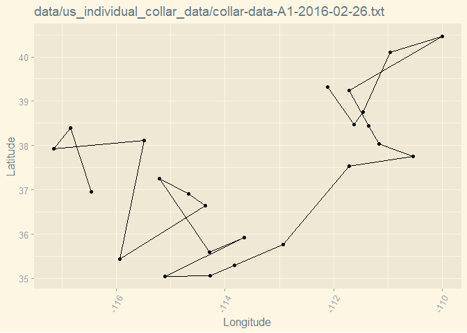<!-- -->

```
## Warning: Missing column names filled in: 'X1' [1]
```

```
## 
## -- Column specification --------------------------------------------------------
## cols(
##   X1 = col_double(),
##   date = col_date(format = ""),
##   collar = col_character(),
##   time = col_datetime(format = ""),
##   lat = col_double(),
##   long = col_double()
## )
```

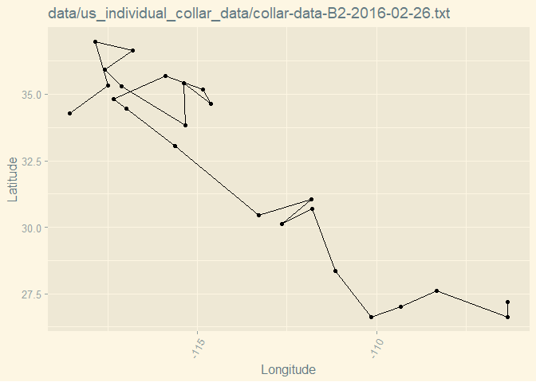<!-- -->

```
## Warning: Missing column names filled in: 'X1' [1]
```

```
## 
## -- Column specification --------------------------------------------------------
## cols(
##   X1 = col_double(),
##   date = col_date(format = ""),
##   collar = col_character(),
##   time = col_datetime(format = ""),
##   lat = col_double(),
##   long = col_double()
## )
```

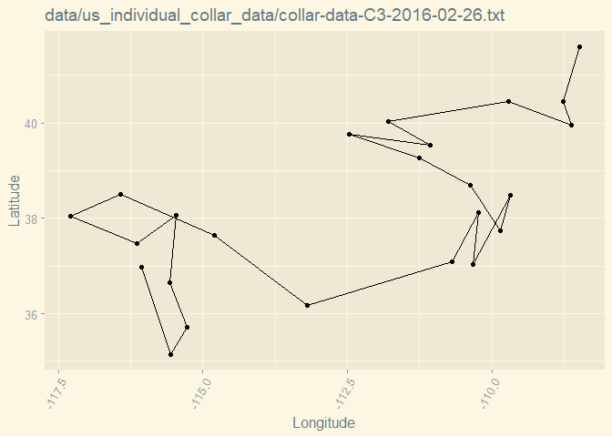<!-- -->

```
## Warning: Missing column names filled in: 'X1' [1]
```

```
## 
## -- Column specification --------------------------------------------------------
## cols(
##   X1 = col_double(),
##   date = col_date(format = ""),
##   collar = col_character(),
##   time = col_datetime(format = ""),
##   lat = col_double(),
##   long = col_double()
## )
```

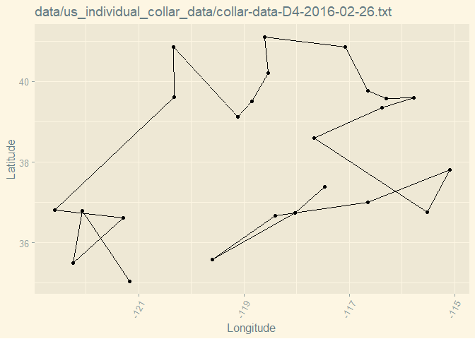<!-- -->

```
## Warning: Missing column names filled in: 'X1' [1]
```

```
## 
## -- Column specification --------------------------------------------------------
## cols(
##   X1 = col_double(),
##   date = col_date(format = ""),
##   collar = col_character(),
##   time = col_datetime(format = ""),
##   lat = col_double(),
##   long = col_double()
## )
```

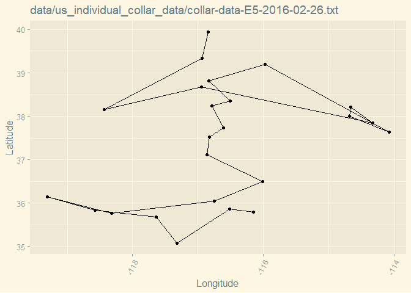<!-- -->

```
## Warning: Missing column names filled in: 'X1' [1]
```

```
## 
## -- Column specification --------------------------------------------------------
## cols(
##   X1 = col_double(),
##   date = col_date(format = ""),
##   collar = col_character(),
##   time = col_datetime(format = ""),
##   lat = col_double(),
##   long = col_double()
## )
```

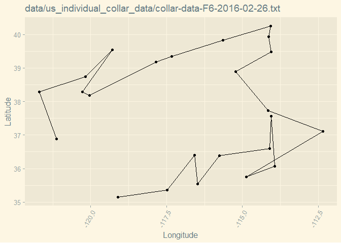<!-- -->

```
## Warning: Missing column names filled in: 'X1' [1]
```

```
## 
## -- Column specification --------------------------------------------------------
## cols(
##   X1 = col_double(),
##   date = col_date(format = ""),
##   collar = col_character(),
##   time = col_datetime(format = ""),
##   lat = col_double(),
##   long = col_double()
## )
```

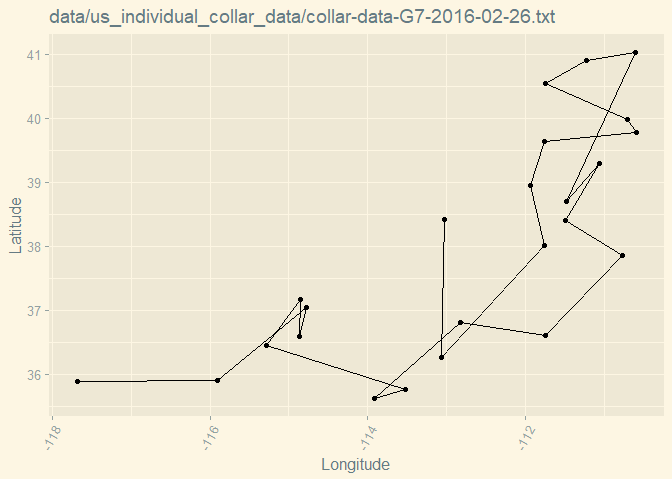<!-- -->

```
## Warning: Missing column names filled in: 'X1' [1]
```

```
## 
## -- Column specification --------------------------------------------------------
## cols(
##   X1 = col_double(),
##   date = col_date(format = ""),
##   collar = col_character(),
##   time = col_datetime(format = ""),
##   lat = col_double(),
##   long = col_double()
## )
```

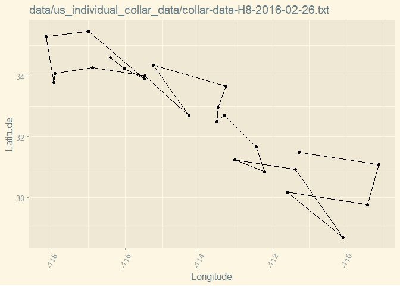<!-- -->

```
## Warning: Missing column names filled in: 'X1' [1]
```

```
## 
## -- Column specification --------------------------------------------------------
## cols(
##   X1 = col_double(),
##   date = col_date(format = ""),
##   collar = col_character(),
##   time = col_datetime(format = ""),
##   lat = col_double(),
##   long = col_double()
## )
```

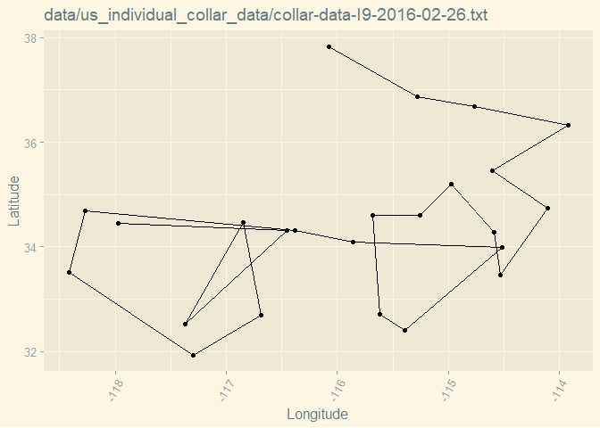<!-- -->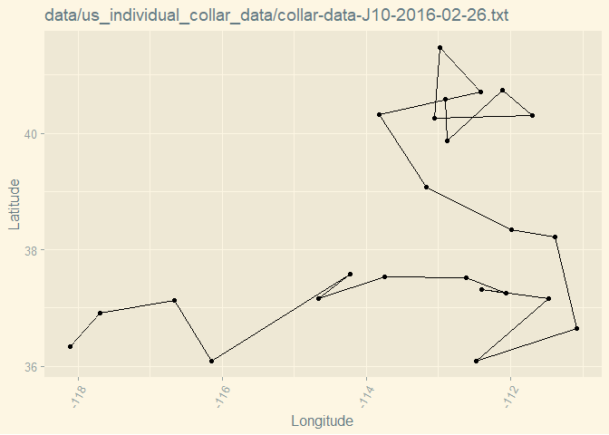<!-- -->


#### 2. Please load all the data files from `us_individual_collar_data` and combine all data into one data frame. Create a summary to show what is the maximum and minimum of recorded data points on longitude and latitude.


```r
us_ind_collar<-lapply(us_ic_data, read_csv)
```

```
## Warning: Missing column names filled in: 'X1' [1]
```

```
## 
## -- Column specification --------------------------------------------------------
## cols(
##   X1 = col_double(),
##   date = col_date(format = ""),
##   collar = col_character(),
##   time = col_datetime(format = ""),
##   lat = col_double(),
##   long = col_double()
## )
```

```
## Warning: Missing column names filled in: 'X1' [1]
```

```
## 
## -- Column specification --------------------------------------------------------
## cols(
##   X1 = col_double(),
##   date = col_date(format = ""),
##   collar = col_character(),
##   time = col_datetime(format = ""),
##   lat = col_double(),
##   long = col_double()
## )
```

```
## Warning: Missing column names filled in: 'X1' [1]
```

```
## 
## -- Column specification --------------------------------------------------------
## cols(
##   X1 = col_double(),
##   date = col_date(format = ""),
##   collar = col_character(),
##   time = col_datetime(format = ""),
##   lat = col_double(),
##   long = col_double()
## )
```

```
## Warning: Missing column names filled in: 'X1' [1]
```

```
## 
## -- Column specification --------------------------------------------------------
## cols(
##   X1 = col_double(),
##   date = col_date(format = ""),
##   collar = col_character(),
##   time = col_datetime(format = ""),
##   lat = col_double(),
##   long = col_double()
## )
```

```
## Warning: Missing column names filled in: 'X1' [1]
```

```
## 
## -- Column specification --------------------------------------------------------
## cols(
##   X1 = col_double(),
##   date = col_date(format = ""),
##   collar = col_character(),
##   time = col_datetime(format = ""),
##   lat = col_double(),
##   long = col_double()
## )
```

```
## Warning: Missing column names filled in: 'X1' [1]
```

```
## 
## -- Column specification --------------------------------------------------------
## cols(
##   X1 = col_double(),
##   date = col_date(format = ""),
##   collar = col_character(),
##   time = col_datetime(format = ""),
##   lat = col_double(),
##   long = col_double()
## )
```

```
## Warning: Missing column names filled in: 'X1' [1]
```

```
## 
## -- Column specification --------------------------------------------------------
## cols(
##   X1 = col_double(),
##   date = col_date(format = ""),
##   collar = col_character(),
##   time = col_datetime(format = ""),
##   lat = col_double(),
##   long = col_double()
## )
```

```
## Warning: Missing column names filled in: 'X1' [1]
```

```
## 
## -- Column specification --------------------------------------------------------
## cols(
##   X1 = col_double(),
##   date = col_date(format = ""),
##   collar = col_character(),
##   time = col_datetime(format = ""),
##   lat = col_double(),
##   long = col_double()
## )
```

```
## Warning: Missing column names filled in: 'X1' [1]
```

```
## 
## -- Column specification --------------------------------------------------------
## cols(
##   X1 = col_double(),
##   date = col_date(format = ""),
##   collar = col_character(),
##   time = col_datetime(format = ""),
##   lat = col_double(),
##   long = col_double()
## )
```

```
## Warning: Missing column names filled in: 'X1' [1]
```

```
## 
## -- Column specification --------------------------------------------------------
## cols(
##   X1 = col_double(),
##   date = col_date(format = ""),
##   collar = col_character(),
##   time = col_datetime(format = ""),
##   lat = col_double(),
##   long = col_double()
## )
```


```r
names<-strsplit(us_ic_data, split=".txt")
names2<-unlist(names)
names(us_ind_collar)<-names2
full_data<-bind_rows(us_ind_collar)
full_data
```

```
## # A tibble: 240 x 6
##       X1 date       collar time                  lat  long
##    <dbl> <date>     <chr>  <dttm>              <dbl> <dbl>
##  1     1 2016-02-26 A1     2016-02-26 00:00:00  37.0 -116.
##  2     2 2016-02-26 A1     2016-02-26 01:00:00  38.4 -117.
##  3     3 2016-02-26 A1     2016-02-26 02:00:00  37.9 -117.
##  4     4 2016-02-26 A1     2016-02-26 03:00:00  38.1 -115.
##  5     5 2016-02-26 A1     2016-02-26 04:00:00  35.4 -116.
##  6     6 2016-02-26 A1     2016-02-26 05:00:00  36.6 -114.
##  7     7 2016-02-26 A1     2016-02-26 06:00:00  36.9 -115.
##  8     8 2016-02-26 A1     2016-02-26 07:00:00  37.3 -115.
##  9     9 2016-02-26 A1     2016-02-26 08:00:00  35.6 -114.
## 10    10 2016-02-26 A1     2016-02-26 09:00:00  35.9 -114.
## # ... with 230 more rows
```


```r
full_data%>%
  summarise(max_long=max(long),
            min_long=min(long),
            max_lat=max(lat),
            min_lat=min(lat))
```

```
## # A tibble: 1 x 4
##   max_long min_long max_lat min_lat
##      <dbl>    <dbl>   <dbl>   <dbl>
## 1    -106.    -123.    41.6    26.6
```


#### 3. Use the range of the latitude and longitude from Q2 to build an appropriate bounding box for your map and load a map from stamen in a terrain style projection and display the map. Then, build a final map that overlays the recorded path from Q1.


```r
lat<-c(26.6116,41.58802)
long<-c(-122.6017, -106.3343)
bbox<-make_bbox(long,lat,f=0.05)
collar_map<-get_map(bbox, maptype = "terrain", source="stamen")
```

```
## Map tiles by Stamen Design, under CC BY 3.0. Data by OpenStreetMap, under ODbL.
```


```r
i <- 1
for (i in 1:length(us_ic_data)){
  us_individual <- as.data.frame(read_csv(us_ic_data[i]))
  print(
    ggmap(collar_map)+
      geom_path(data=us_individual, aes(long,lat, color=time, size=.08, alpha=0.3))+
      geom_point(data=us_individual, aes(long,lat))+
      scale_size(range = c(4),
             guide = "none") +
      theme_solarized_2()+
      theme(legend.position="left",
            axis.text.x=element_text(angle=60, hjust=1))+
      labs(title = "Collared Individual Path", 
           x="Longitude", 
           y="Latitude",
           color="Date",
           alpha=NULL,
           size=NULL)
  )
}
```

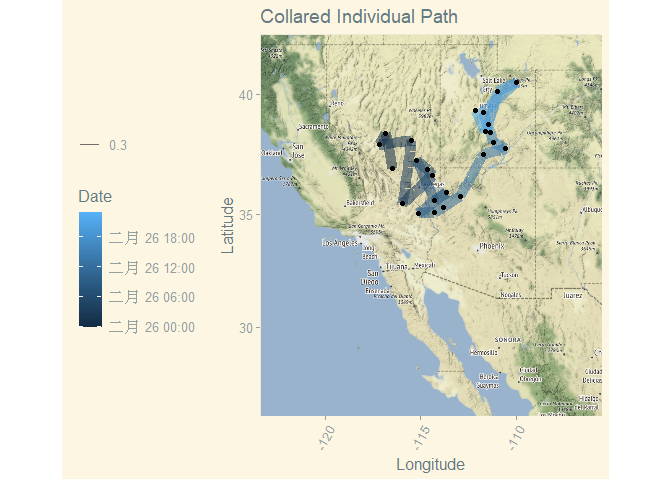<!-- -->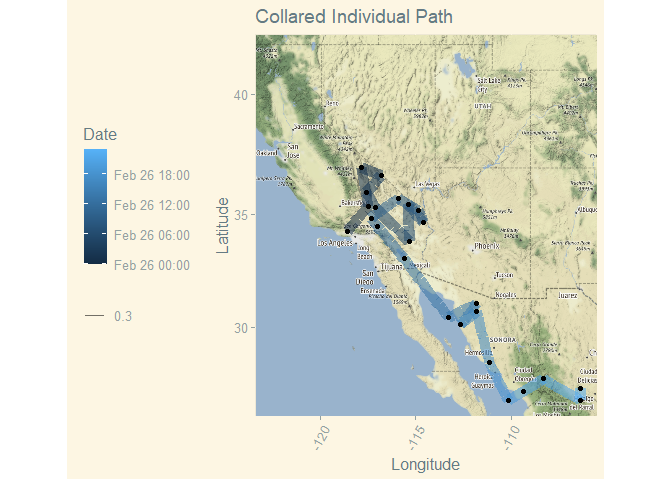<!-- -->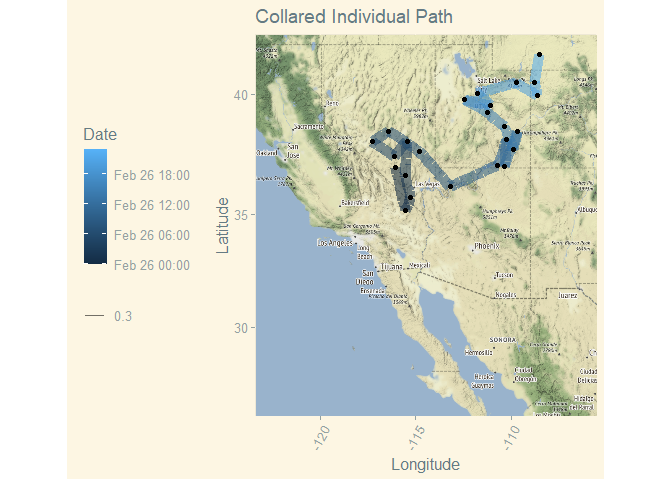<!-- -->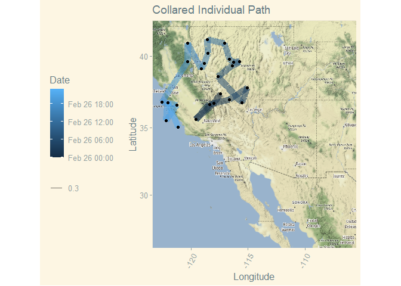<!-- -->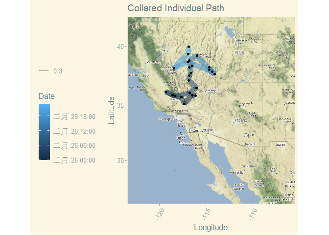<!-- -->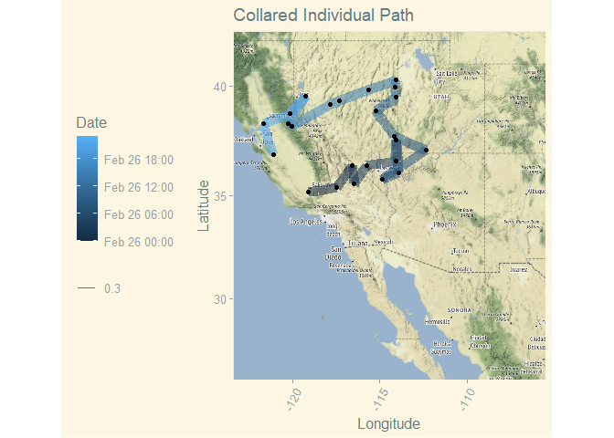<!-- -->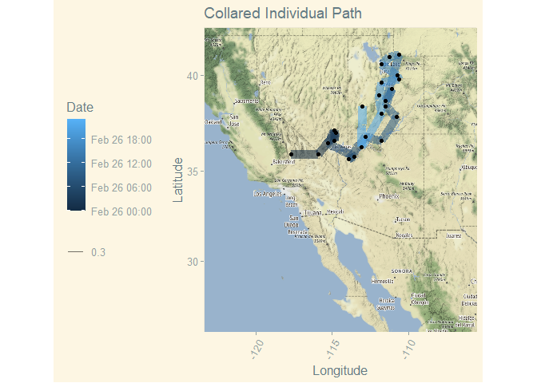<!-- -->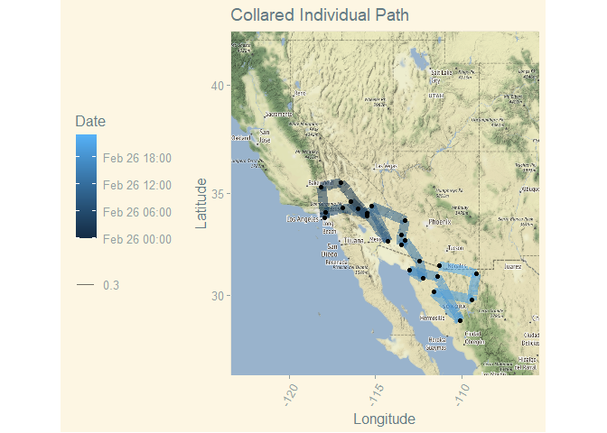<!-- -->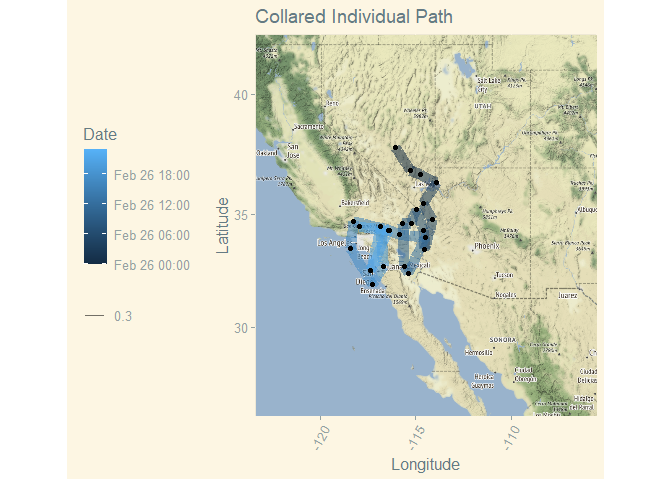<!-- -->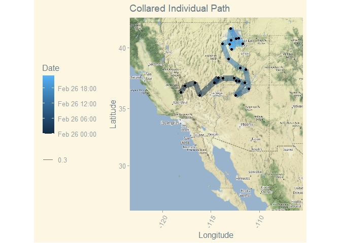<!-- -->


#### 4.  Create a summary of the hypertension data. How many individuals and phenotypes are included in this data set? How many gene markers and chromosomes are included in this data set? Please create a table to show the number of markers on each chromosome.


```r
data(hyper)
```


```r
summary(hyper)
```

```
##     Backcross
## 
##     No. individuals:    250 
## 
##     No. phenotypes:     2 
##     Percent phenotyped: 100 100 
## 
##     No. chromosomes:    20 
##         Autosomes:      1 2 3 4 5 6 7 8 9 10 11 12 13 14 15 16 17 18 19 
##         X chr:          X 
## 
##     Total markers:      174 
##     No. markers:        22 8 6 20 14 11 7 6 5 5 14 5 5 5 11 6 12 4 4 4 
##     Percent genotyped:  47.7 
##     Genotypes (%):    
##           Autosomes:    BB:50.1  BA:49.9 
##        X chromosome:    BY:53.0  AY:47.0
```

```r
nind(hyper)
```

```
## [1] 250
```


```r
nphe(hyper)
```

```
## [1] 2
```


```r
totmar(hyper)
```

```
## [1] 174
```


```r
nchr(hyper)
```

```
## [1] 20
```

```r
nmar(hyper)
```

```
##  1  2  3  4  5  6  7  8  9 10 11 12 13 14 15 16 17 18 19  X 
## 22  8  6 20 14 11  7  6  5  5 14  5  5  5 11  6 12  4  4  4
```

```r
plot(hyper)
```

<!-- -->


#### 5. Please make an interactive genetic map of markers for the hypertension data.


```r
iplotMap(hyper)
```

```
## Set screen size to height=700 x width=1000
```

```{=html}
<div id="htmlwidget-fcc8ca1b5eb31ad746c8" style="width:672px;height:480px;" class="iplotMap html-widget"></div>
<script type="application/json" data-for="htmlwidget-fcc8ca1b5eb31ad746c8">{"x":{"data":{"chr":["1","1","1","1","1","1","1","1","1","1","1","1","1","1","1","1","1","1","1","1","1","1","2","2","2","2","2","2","2","2","3","3","3","3","3","3","4","4","4","4","4","4","4","4","4","4","4","4","4","4","4","4","4","4","4","4","5","5","5","5","5","5","5","5","5","5","5","5","5","5","6","6","6","6","6","6","6","6","6","6","6","7","7","7","7","7","7","7","8","8","8","8","8","8","9","9","9","9","9","10","10","10","10","10","11","11","11","11","11","11","11","11","11","11","11","11","11","11","12","12","12","12","12","13","13","13","13","13","14","14","14","14","14","15","15","15","15","15","15","15","15","15","15","15","16","16","16","16","16","16","17","17","17","17","17","17","17","17","17","17","17","17","18","18","18","18","19","19","19","19","X","X","X","X"],"pos":[3.3,19.7,32.8,35,37.2,41.5,43.7,43.7,49.2,54.6,64.5,67.8,69.9,74.3,75.4,82,82,82,82,86.3,94,115.8,7.7,17.5,29.5,49.2,54.6,66.7,85.2,98.4,2.2,17.5,37.2,44.8,57.9,66.7,0,14.2,16.4,17.5,18.6,21.9,23,23,25.1,28.4,29.5,30.6,31.7,31.7,32.8,33.9,35,47,56.8,74.3,0,5.5,10.9,14.2,15.3,18.6,32.8,51.4,60.1,66.7,73.2,74.3,77.6,82,0,9.8,21.9,25.1,29.5,40.4,51.4,56.8,63.4,65.6,66.7,1.1,13.1,26.2,28.4,37.2,53.6,55.6,6.6,19.7,33.9,40.4,59,75.4,12,24,40.4,56.8,68.9,2.2,15.3,50.3,69.9,75.4,2.2,4.4,4.4,8.7,8.7,10.9,13.1,17.5,17.5,19.7,25.1,43.7,60.1,80.9,1.1,16.4,23,40.4,56.8,5.7,7.7,16.4,40.4,59,0,16.4,36.1,52.5,67.8,5.5,5.5,7.7,13.1,16.4,16.4,17.5,17.5,29.5,55.7,63.4,0,25.1,31.7,32.8,51.4,51.4,1.1,1.1,1.1,2.2,3.3,3.3,5.5,6.6,10.9,19.7,33.9,50.3,2.2,14.2,26.2,37.2,0,17.5,32.8,55.7,1.1,20.8,29.5,43.7],"marker":["D1Mit296","D1Mit123","D1Mit156","D1Mit178","D1Mit19","D1Mit7","D1Mit46","D1Mit132","D1Mit334","D1Mit305","D1Mit26","D1Mit94","D1Mit218","D1Mit100","D1Mit102","D1Mit14","D1Mit105","D1Mit159","D1Mit267","D1Mit15","D1Mit456","D1Mit155","D2Mit359","D2Mit82","D2Mit241","D2Mit14","D2Mit62","D2Mit280","D2Mit229","D2Mit266","D3Mit164","D3Mit6","D3Mit11","D3Mit14","D3Mit44","D3Mit19","D4Mit149","D4Mit41","D4Mit108","D4Mit237","D4Mit286","D4Mit214","D4Mit53","D4Mit89","D4Mit111","D4Mit288","D4Mit164","D4Mit178","D4Mit80","D4Mit81","D4Mit276","D4Mit152","D4Mit302","D4Mit175","D4Mit16","D4Mit14","D5Mit193","D5Mit61","D5Mit387","D5Mit148","D5Mit13","D5Mit55","D5Mit312","D5Mit188","D5Mit213","D5Mit31","D5Mit99","D5Mit101","D5Mit409","D5Mit169","D6Mit86","D6Mit273","D6Mit188","D6Mit8","D6Mit213","D6Mit36","D6Mit135","D6Mit59","D6Mit295","D6Mit201","D6Mit15","D7Mit306","D7Mit25","D7Mit297","D7Mit30","D7Mit37","D7Mit71","D7Nds4","D8Mit3","D8Mit292","D8Mit25","D8Mit45","D8Mit271","D8Mit156","D9Mit297","D9Mit27","D9Mit8","D9Mit24","D9Mit18","D10Mit166","D10Mit214","D10Mit11","D10Mit14","D10Mit297","D11Mit74","D11Mit2","D11Mit78","D11Mit79","D11Mit80","D11Mit82","D11Mit163","D11Mit110","D11Mit136","D11Mit20","D11Mit310","D11Mit35","D11Mit67","D11Mit48","D12Mit37","D12Mit110","D12Mit34","D12Mit118","D12Mit20","D13Mit16","D13Mit59","D13Mit91","D13Mit148","D13Mit78","D14Mit48","D14Mit14","D14Mit37","D14Mit7","D14Mit266","D15Mit11","D15Mit175","D15Mit53","D15Mit111","D15Mit56","D15Mit22","D15Mit206","D15Mit152","D15Mit156","D15Mit108","D15Mit79","D16Mit32","D16Mit4","D16Mit171","D16Mit5","D16Mit70","D16Mit106","D17Mit164","D17Mit143","D17Mit57","D17Mit113","D17Mit131","D17Mit46","D17Mit45","D17Mit23","D17Mit11","D17Mit10","D17Mit53","D17Mit221","D18Mit67","D18Mit17","D18Mit50","D18Mit4","D19Mit59","D19Mit40","D19Mit53","D19Mit137","DXMit55","DXMit22","DXMit16","DXMit130"],"chrname":["1","2","3","4","5","6","7","8","9","10","11","12","13","14","15","16","17","18","19","X"]},"chartOpts":{"shiftStart":false}},"evals":[],"jsHooks":[]}</script>
```

#### 6. Make a plot shows the pattern of missing genotype data in the hypertension dataset. Please reorder the recorded individuals according to their blood pressure phenotypes. Is there a specific pattern of missing genotype? Please explain it.


```r
plotMissing(hyper, main="")
```

<!-- -->


```r
plotMissing(hyper, main="", reorder=1)
```

<!-- -->


###### These plots tell us which genotypes are missing. The reordered versions tell us specifically where certain phenotypic data is missing for specific individuals. Here it looks like individuals 50-200 are missing a ton of data.  


#### 7. Based on your answer from previous question, you probably noticed that there are gene markers without data. Please use the function `drop.nullmarkers` to remove markers that have no genotype data. After this, make a new summary to show the number of markers on each chromosome. How many gene markers were dropped? Where were the dropped markers located? Please use the data without nullmarkers for the following questions.


```r
hyper2<-drop.nullmarkers(hyper)
```


```r
summary(hyper2)
```

```
##     Backcross
## 
##     No. individuals:    250 
## 
##     No. phenotypes:     2 
##     Percent phenotyped: 100 100 
## 
##     No. chromosomes:    20 
##         Autosomes:      1 2 3 4 5 6 7 8 9 10 11 12 13 14 15 16 17 18 19 
##         X chr:          X 
## 
##     Total markers:      173 
##     No. markers:        22 8 6 20 14 11 7 6 5 5 14 5 5 4 11 6 12 4 4 4 
##     Percent genotyped:  48 
##     Genotypes (%):    
##           Autosomes:    BB:50.1  BA:49.9 
##        X chromosome:    BY:53.0  AY:47.0
```


```r
summary(hyper)
```

```
##     Backcross
## 
##     No. individuals:    250 
## 
##     No. phenotypes:     2 
##     Percent phenotyped: 100 100 
## 
##     No. chromosomes:    20 
##         Autosomes:      1 2 3 4 5 6 7 8 9 10 11 12 13 14 15 16 17 18 19 
##         X chr:          X 
## 
##     Total markers:      174 
##     No. markers:        22 8 6 20 14 11 7 6 5 5 14 5 5 5 11 6 12 4 4 4 
##     Percent genotyped:  47.7 
##     Genotypes (%):    
##           Autosomes:    BB:50.1  BA:49.9 
##        X chromosome:    BY:53.0  AY:47.0
```

###### Only one marker was dropped on chromosome 14.

#### 8.  Please conduct single-QTL analysis and create a table to give the maximum LOD score on each chromosome based on their blood pressure phenotypes. Which gene marker has the higiest LOD score? Which chromosome contains the gene marker that has the highest LOD score? Then, creates an interactive chart with LOD curves from a genome scan for all chromosomes.


```r
bp<-calc.genoprob(hyper,step=1)
qtl_data_hyper<-scanone(hyper)
```

```
## Warning in scanone(hyper): First running calc.genoprob.
```

```r
summary(qtl_data_hyper)
```

```
##           chr  pos   lod
## D1Mit334    1 49.2 3.527
## D2Mit62     2 54.6 1.445
## D3Mit11     3 37.2 0.781
## D4Mit164    4 29.5 8.094
## D5Mit31     5 66.7 1.545
## D6Mit188    6 21.9 1.821
## D7Mit297    7 26.2 0.400
## D8Mit271    8 59.0 0.791
## D9Mit18     9 68.9 0.750
## D10Mit214  10 15.3 0.247
## D11Mit35   11 43.7 0.626
## D12Mit37   12  1.1 0.429
## D13Mit78   13 59.0 0.313
## D14Mit7    14 52.5 0.106
## D15Mit152  15 17.5 1.705
## D16Mit70   16 51.4 0.370
## D17Mit46   17  3.3 0.207
## D18Mit17   18 14.2 0.506
## D19Mit59   19  0.0 0.792
## DXMit130    X 43.7 0.927
```

###### Looks like chromosome 4 (D4Mit164) has the gene with the highest LOD. 


#### 9. Based on your genome scan results, create a table which only includes those chromosomes with LOD > 1. Creates an interactive chart with LOD curves linked to estimated QTL effects for only those chromosomes with LOD > 1. Find the gene maker with the highest LOD score and describe how does the genetype of this marker influence the individual’s phenotype.


```r
cute_lil_plot<-iplotScanone(qtl_data_hyper, chr=c(1,2,4,5,6,15))
cute_lil_plot
```

```{=html}
<div id="htmlwidget-8aa372235e468f5199fe" style="width:672px;height:480px;" class="iplotScanone html-widget"></div>
<script type="application/json" data-for="htmlwidget-8aa372235e468f5199fe">{"x":{"scanone_data":{"chr":["1","1","1","1","1","1","1","1","1","1","1","1","1","1","1","1","1","1","1","1","1","1","2","2","2","2","2","2","2","2","4","4","4","4","4","4","4","4","4","4","4","4","4","4","4","4","4","4","4","4","5","5","5","5","5","5","5","5","5","5","5","5","5","5","6","6","6","6","6","6","6","6","6","6","6","15","15","15","15","15","15","15","15","15","15","15"],"pos":[3.3,19.7,32.8,35,37.2,41.5,43.7,43.7,49.2,54.6,64.5,67.8,69.9,74.3,75.4,82,82,82,82,86.3,94,115.8,7.7,17.5,29.5,49.2,54.6,66.7,85.2,98.4,0,14.2,16.4,17.5,18.6,21.9,23,23,25.1,28.4,29.5,30.6,31.7,31.7,32.8,33.9,35,47,56.8,74.3,0,5.5,10.9,14.2,15.3,18.6,32.8,51.4,60.1,66.7,73.2,74.3,77.6,82,0,9.8,21.9,25.1,29.5,40.4,51.4,56.8,63.4,65.6,66.7,5.5,5.5,7.7,13.1,16.4,16.4,17.5,17.5,29.5,55.7,63.4],"lod":[0.41174,0.3996,1.6944,1.652,2.9441,3.1329,3.3422,3.3422,3.5267,2.0066,2.1624,3.3629,3.0964,3.1759,3.2198,3.0291,3.0291,3.0292,3.0292,1.5125,1.3031,0.26594,0.22479,0.53687,0.82866,1.2477,1.4452,1.1551,0.025937,0.050309,2.0619,5.3804,5.4854,6.5579,6.5093,6.8497,5.8422,5.8422,6.3079,6.1784,8.0937,6.3749,5.1376,5.1376,4.8876,4.7649,3.7287,2.7396,2.433,2.1736,0.37286,0.22466,0.064921,0.11395,0.163,0.33804,0.04742,0.26549,0.40211,1.5448,1.4009,1.3524,1.2961,1.3353,0.11721,0.83534,1.8212,1.7993,0.9416,1.1323,0.88355,0.8142,0.98427,0.64101,0.65953,1.0675,1.0675,0.74597,1.2863,1.3673,1.3673,1.7054,1.7054,1.0458,0.60782,0.96666],"marker":["D1Mit296","D1Mit123","D1Mit156","D1Mit178","D1Mit19","D1Mit7","D1Mit46","D1Mit132","D1Mit334","D1Mit305","D1Mit26","D1Mit94","D1Mit218","D1Mit100","D1Mit102","D1Mit14","D1Mit105","D1Mit159","D1Mit267","D1Mit15","D1Mit456","D1Mit155","D2Mit359","D2Mit82","D2Mit241","D2Mit14","D2Mit62","D2Mit280","D2Mit229","D2Mit266","D4Mit149","D4Mit41","D4Mit108","D4Mit237","D4Mit286","D4Mit214","D4Mit53","D4Mit89","D4Mit111","D4Mit288","D4Mit164","D4Mit178","D4Mit80","D4Mit81","D4Mit276","D4Mit152","D4Mit302","D4Mit175","D4Mit16","D4Mit14","D5Mit193","D5Mit61","D5Mit387","D5Mit148","D5Mit13","D5Mit55","D5Mit312","D5Mit188","D5Mit213","D5Mit31","D5Mit99","D5Mit101","D5Mit409","D5Mit169","D6Mit86","D6Mit273","D6Mit188","D6Mit8","D6Mit213","D6Mit36","D6Mit135","D6Mit59","D6Mit295","D6Mit201","D6Mit15","D15Mit11","D15Mit175","D15Mit53","D15Mit111","D15Mit56","D15Mit22","D15Mit206","D15Mit152","D15Mit156","D15Mit108","D15Mit79"],"chrname":["1","2","4","5","6","15"],"lodname":"lod"},"pxg_data":null,"pxg_type":"none","chartOpts":null},"evals":[],"jsHooks":[]}</script>
```

###### Higher LOD score gives us an indication of how likely it will be that an individual with homozygous expression at this gene will exhibit the phenotype of high blood pressure. 


#### 10.Please save your interactive chart from Q9 as a html file `hyper_iplotScanone.html` and make sure your upload it to your github repository with your lab14 homework as well.


```r
htmlwidgets::saveWidget(cute_lil_plot, file="hyper_iplotScanone.html")
```

