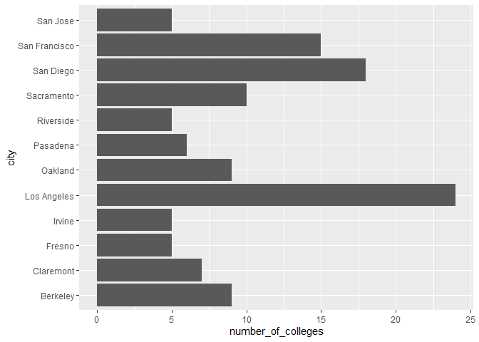
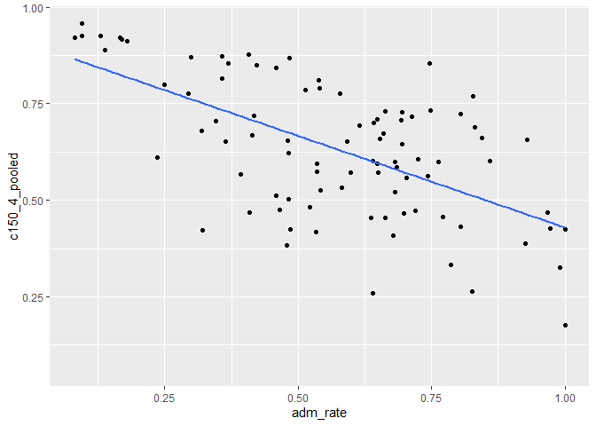
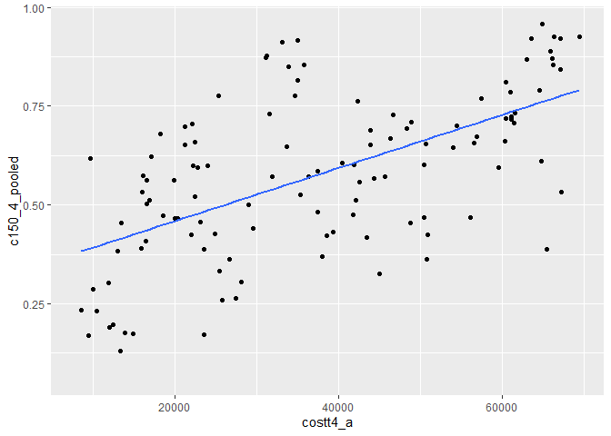
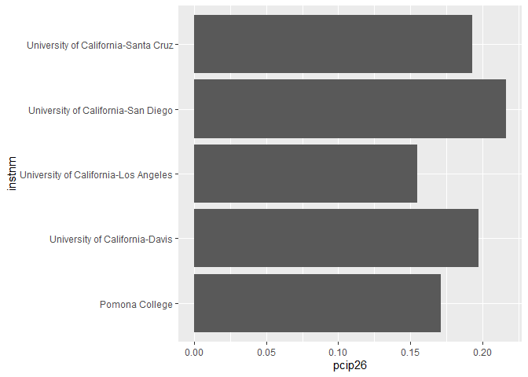
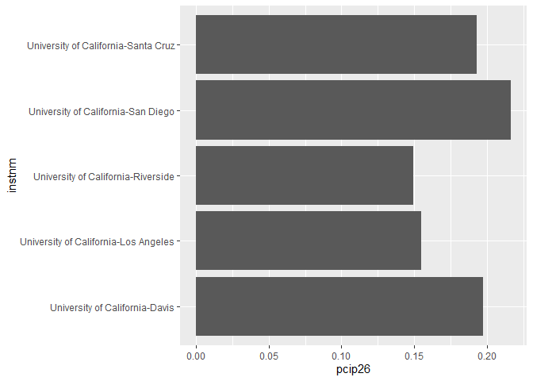

```r
library(tidyverse)
```

```
## -- Attaching packages --------------------------------------- tidyverse 1.3.0 --
```

```
## √ ggplot2 3.3.3     √ purrr   0.3.4
## √ tibble  3.0.5     √ dplyr   1.0.3
## √ tidyr   1.1.2     √ stringr 1.4.0
## √ readr   1.4.0     √ forcats 0.5.1
```

```
## -- Conflicts ------------------------------------------ tidyverse_conflicts() --
## x dplyr::filter() masks stats::filter()
## x dplyr::lag()    masks stats::lag()
```

```r
library(janitor)
```

```
## 
## Attaching package: 'janitor'
```

```
## The following objects are masked from 'package:stats':
## 
##     chisq.test, fisher.test
```

```r
library(here)
```

```
## here() starts at D:/TA files/Winter2021 BIS15L/students_rep/BIS15W2021_ahearne
```

```r
library(naniar)
```


```r
colleges<-readr::read_csv("data/ca_college_data.csv")
```

```
## 
## -- Column specification --------------------------------------------------------
## cols(
##   INSTNM = col_character(),
##   CITY = col_character(),
##   STABBR = col_character(),
##   ZIP = col_character(),
##   ADM_RATE = col_double(),
##   SAT_AVG = col_double(),
##   PCIP26 = col_double(),
##   COSTT4_A = col_double(),
##   C150_4_POOLED = col_double(),
##   PFTFTUG1_EF = col_double()
## )
```


```r
names(colleges)
```

```
##  [1] "INSTNM"        "CITY"          "STABBR"        "ZIP"          
##  [5] "ADM_RATE"      "SAT_AVG"       "PCIP26"        "COSTT4_A"     
##  [9] "C150_4_POOLED" "PFTFTUG1_EF"
```

####1. Use your preferred function(s) to have a look at the data and get an idea of its structure. Make sure you summarize NA’s and determine whether or not the data are tidy. You may also consider dealing with any naming issues.


```r
glimpse(colleges)
```

```
## Rows: 341
## Columns: 10
## $ INSTNM        <chr> "Grossmont College", "College of the Sequoias", "Coll...
## $ CITY          <chr> "El Cajon", "Visalia", "San Mateo", "Ventura", "Oxnar...
## $ STABBR        <chr> "CA", "CA", "CA", "CA", "CA", "CA", "CA", "CA", "CA",...
## $ ZIP           <chr> "92020-1799", "93277-2214", "94402-3784", "93003-3872...
## $ ADM_RATE      <dbl> NA, NA, NA, NA, NA, NA, NA, NA, NA, NA, NA, NA, NA, N...
## $ SAT_AVG       <dbl> NA, NA, NA, NA, NA, NA, NA, NA, NA, NA, NA, NA, NA, N...
## $ PCIP26        <dbl> 0.0016, 0.0066, 0.0038, 0.0035, 0.0085, 0.0151, 0.000...
## $ COSTT4_A      <dbl> 7956, 8109, 8278, 8407, 8516, 8577, 8580, 9181, 9281,...
## $ C150_4_POOLED <dbl> NA, NA, NA, NA, NA, NA, 0.2334, NA, NA, NA, NA, 0.170...
## $ PFTFTUG1_EF   <dbl> 0.3546, 0.5413, 0.3567, 0.3824, 0.2753, 0.4286, 0.230...
```


```r
naniar::miss_var_summary(colleges)
```

```
## # A tibble: 10 x 3
##    variable      n_miss pct_miss
##    <chr>          <int>    <dbl>
##  1 SAT_AVG          276     80.9
##  2 ADM_RATE         240     70.4
##  3 C150_4_POOLED    221     64.8
##  4 COSTT4_A         124     36.4
##  5 PFTFTUG1_EF       53     15.5
##  6 PCIP26            35     10.3
##  7 INSTNM             0      0  
##  8 CITY               0      0  
##  9 STABBR             0      0  
## 10 ZIP                0      0
```

```r
colleges
```

```
## # A tibble: 341 x 10
##    INSTNM CITY  STABBR ZIP   ADM_RATE SAT_AVG PCIP26 COSTT4_A C150_4_POOLED
##    <chr>  <chr> <chr>  <chr>    <dbl>   <dbl>  <dbl>    <dbl>         <dbl>
##  1 Gross~ El C~ CA     9202~       NA      NA 0.0016     7956        NA    
##  2 Colle~ Visa~ CA     9327~       NA      NA 0.0066     8109        NA    
##  3 Colle~ San ~ CA     9440~       NA      NA 0.0038     8278        NA    
##  4 Ventu~ Vent~ CA     9300~       NA      NA 0.0035     8407        NA    
##  5 Oxnar~ Oxna~ CA     9303~       NA      NA 0.0085     8516        NA    
##  6 Moorp~ Moor~ CA     9302~       NA      NA 0.0151     8577        NA    
##  7 Skyli~ San ~ CA     9406~       NA      NA 0          8580         0.233
##  8 Glend~ Glen~ CA     9120~       NA      NA 0.002      9181        NA    
##  9 Citru~ Glen~ CA     9174~       NA      NA 0.0021     9281        NA    
## 10 Fresn~ Fres~ CA     93741       NA      NA 0.0324     9370        NA    
## # ... with 331 more rows, and 1 more variable: PFTFTUG1_EF <dbl>
```


```r
college<-
  janitor::clean_names(colleges)
college
```

```
## # A tibble: 341 x 10
##    instnm city  stabbr zip   adm_rate sat_avg pcip26 costt4_a c150_4_pooled
##    <chr>  <chr> <chr>  <chr>    <dbl>   <dbl>  <dbl>    <dbl>         <dbl>
##  1 Gross~ El C~ CA     9202~       NA      NA 0.0016     7956        NA    
##  2 Colle~ Visa~ CA     9327~       NA      NA 0.0066     8109        NA    
##  3 Colle~ San ~ CA     9440~       NA      NA 0.0038     8278        NA    
##  4 Ventu~ Vent~ CA     9300~       NA      NA 0.0035     8407        NA    
##  5 Oxnar~ Oxna~ CA     9303~       NA      NA 0.0085     8516        NA    
##  6 Moorp~ Moor~ CA     9302~       NA      NA 0.0151     8577        NA    
##  7 Skyli~ San ~ CA     9406~       NA      NA 0          8580         0.233
##  8 Glend~ Glen~ CA     9120~       NA      NA 0.002      9181        NA    
##  9 Citru~ Glen~ CA     9174~       NA      NA 0.0021     9281        NA    
## 10 Fresn~ Fres~ CA     93741       NA      NA 0.0324     9370        NA    
## # ... with 331 more rows, and 1 more variable: pftftug1_ef <dbl>
```

#### 2. Which cities in California have the highest number of colleges?


```r
college%>%
  filter(stabbr=="CA")%>%
  group_by(city)%>%
  summarize("number_of_colleges"=n())%>%
  top_n(10, number_of_colleges)%>%
  arrange(desc(number_of_colleges))
```

```
## # A tibble: 12 x 2
##    city          number_of_colleges
##    <chr>                      <int>
##  1 Los Angeles                   24
##  2 San Diego                     18
##  3 San Francisco                 15
##  4 Sacramento                    10
##  5 Berkeley                       9
##  6 Oakland                        9
##  7 Claremont                      7
##  8 Pasadena                       6
##  9 Fresno                         5
## 10 Irvine                         5
## 11 Riverside                      5
## 12 San Jose                       5
```


#### 3. Based on your answer to #2, make a plot that shows the number of colleges in the top 10 cities.


```r
college%>%
  filter(stabbr=="CA")%>%
  group_by(city)%>%
  summarize("number_of_colleges"=n())%>%
  top_n(10, number_of_colleges)%>%
  ggplot(aes(x=city, y=number_of_colleges))+
  geom_col()+
  coord_flip()
```

<!-- -->

#### 4. The column `COSTT4_A` is the annual cost of each institution. Which city has the highest average cost? Where is it located?


```r
college%>%
  select(instnm, city, stabbr, costt4_a)%>%
  group_by(city)%>%
  summarize(avg_cost_city=mean(costt4_a, na.rm=T))%>%
  top_n(1, avg_cost_city)
```

```
## # A tibble: 1 x 2
##   city      avg_cost_city
##   <chr>             <dbl>
## 1 Claremont         66498
```

#### 5. Based on your answer to #4, make a plot that compares the cost of the individual colleges in the most expensive city. Bonus! Add UC Davis here to see how it compares :>).


```r
college%>%
  filter(city=="Claremont"|city=="Davis")%>%
  ggplot(aes(x=instnm, y=costt4_a))+
  geom_col()+
  coord_flip()
```

```
## Warning: Removed 2 rows containing missing values (position_stack).
```

<!-- -->

#### 6. The column `ADM_RATE` is the admissions rate by college and `C150_4_POOLED` is the four-year completion rate. Use a scatterplot to show the relationship between these two variables. What do you think this means?


```r
college%>%
  ggplot(aes(x=adm_rate, y=c150_4_pooled))+
  geom_point()+
  geom_smooth(method=lm, se=F)
```

```
## `geom_smooth()` using formula 'y ~ x'
```

```
## Warning: Removed 251 rows containing non-finite values (stat_smooth).
```

```
## Warning: Removed 251 rows containing missing values (geom_point).
```

<!-- -->


```r
#The data seems to suggest that the lower the admission rate, the fewer students are retained.However, this plot fails to take in the complex factors of socioeconomic status. 
```


#### 7. Is there a relationship between cost and four-year completion rate? (You don’t need to do the stats, just produce a plot). What do you think this means?


```r
college%>%
  ggplot(aes(x=costt4_a, y=c150_4_pooled))+
  geom_point()+
  geom_smooth(method=lm,se=F)
```

```
## `geom_smooth()` using formula 'y ~ x'
```

```
## Warning: Removed 225 rows containing non-finite values (stat_smooth).
```

```
## Warning: Removed 225 rows containing missing values (geom_point).
```

<!-- -->


```r
#This data seems to suggest the higher the cost of the university, the higher the retention rate. Perhaps because many of the folks who are able to afford the initial tuition to ivy league universities (like those that have high cost) are not in the position where their families need them to drop out to support their livlihoods. It's expensive to be poor. 
```

#### 8.The column titled `INSTNM` is the institution name. We are only interested in the University of California colleges. Make a new data frame that is restricted to UC institutions. You can remove `Hastings College of Law` and `UC San Francisco` as we are only interested in undergraduate institutions.


```r
UC<-
college%>%
  filter_all(any_vars(str_detect(.,pattern="University of California")))%>%
  filter(instnm!="University of California-San Francisco", instnm!="University of California-Hastings College of Law")
UC
```

```
## # A tibble: 8 x 10
##   instnm city  stabbr zip   adm_rate sat_avg pcip26 costt4_a c150_4_pooled
##   <chr>  <chr> <chr>  <chr>    <dbl>   <dbl>  <dbl>    <dbl>         <dbl>
## 1 Unive~ La J~ CA     92093    0.357    1324  0.216    31043         0.872
## 2 Unive~ Irvi~ CA     92697    0.406    1206  0.107    31198         0.876
## 3 Unive~ Rive~ CA     92521    0.663    1078  0.149    31494         0.73 
## 4 Unive~ Los ~ CA     9009~    0.180    1334  0.155    33078         0.911
## 5 Unive~ Davis CA     9561~    0.423    1218  0.198    33904         0.850
## 6 Unive~ Sant~ CA     9506~    0.578    1201  0.193    34608         0.776
## 7 Unive~ Berk~ CA     94720    0.169    1422  0.105    34924         0.916
## 8 Unive~ Sant~ CA     93106    0.358    1281  0.108    34998         0.816
## # ... with 1 more variable: pftftug1_ef <dbl>
```

#### 8a. Remove `Hastings College of Law` and `UC San Francisco` and store the final data frame as a new object univ_calif_final


```r
univ_calif_final<-UC
```

#### 8b. Use `separate()` to separate institution name into two new columns “UNIV” and “CAMPUS”.


```r
uc<-
univ_calif_final%>%
  separate(instnm, into=c("univ","campus"),sep="-")
uc
```

```
## # A tibble: 8 x 11
##   univ  campus city  stabbr zip   adm_rate sat_avg pcip26 costt4_a c150_4_pooled
##   <chr> <chr>  <chr> <chr>  <chr>    <dbl>   <dbl>  <dbl>    <dbl>         <dbl>
## 1 Univ~ San D~ La J~ CA     92093    0.357    1324  0.216    31043         0.872
## 2 Univ~ Irvine Irvi~ CA     92697    0.406    1206  0.107    31198         0.876
## 3 Univ~ River~ Rive~ CA     92521    0.663    1078  0.149    31494         0.73 
## 4 Univ~ Los A~ Los ~ CA     9009~    0.180    1334  0.155    33078         0.911
## 5 Univ~ Davis  Davis CA     9561~    0.423    1218  0.198    33904         0.850
## 6 Univ~ Santa~ Sant~ CA     9506~    0.578    1201  0.193    34608         0.776
## 7 Univ~ Berke~ Berk~ CA     94720    0.169    1422  0.105    34924         0.916
## 8 Univ~ Santa~ Sant~ CA     93106    0.358    1281  0.108    34998         0.816
## # ... with 1 more variable: pftftug1_ef <dbl>
```
<style>
div.blue { background-color:#e6f0ff; border-radius: 5px; padding: 20px;}
</style>
<div class = "blue">

#### 9. The column `ADM_RATE` is the admissions rate by campus. Which UC has the lowest and highest admissions rates? Produce a numerical summary and an appropriate plot.

# Please remember to make a summary table shows `ADM_RATE` for each campus as the question requested.


```r
uc%>%
  ggplot(aes(x=campus, y=adm_rate))+
  geom_col()
```

<!-- -->

#### 10. If you wanted to get a degree in biological or biomedical sciences, which campus confers the majority of these degrees? Produce a numerical summary and an appropriate plot.

# Please remember to make a summary table shows `pcip26` for each campus as the question requested.


```r
college%>%
  top_n(5, pcip26)%>%
  ggplot(aes(x=instnm, y=pcip26))+
  geom_col()+
  coord_flip()
```

<!-- -->


```r
#Alternatively, if we want to restrict this question just to UCs. 
```


```r
UC%>%
  top_n(5, pcip26)%>%
  ggplot(aes(x=instnm, y=pcip26))+
  geom_col()+
  coord_flip()
```

<!-- -->
</div>

