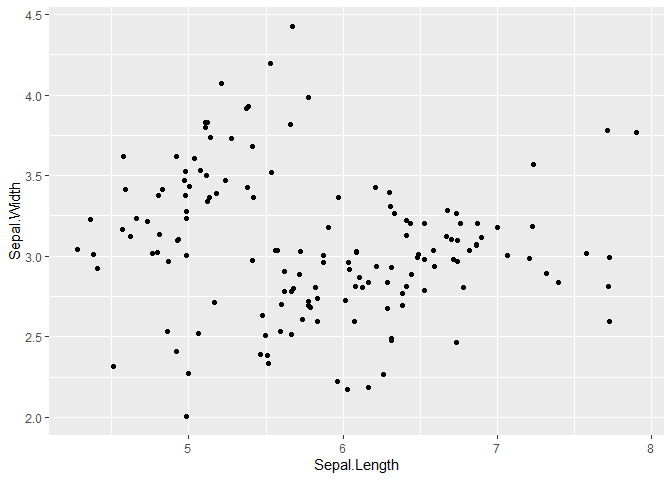
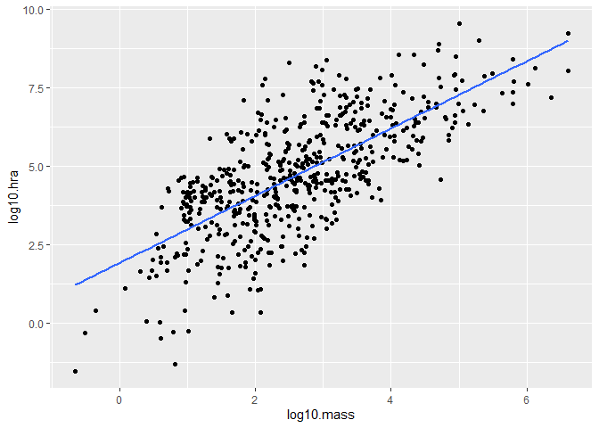
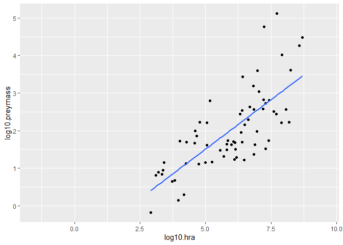
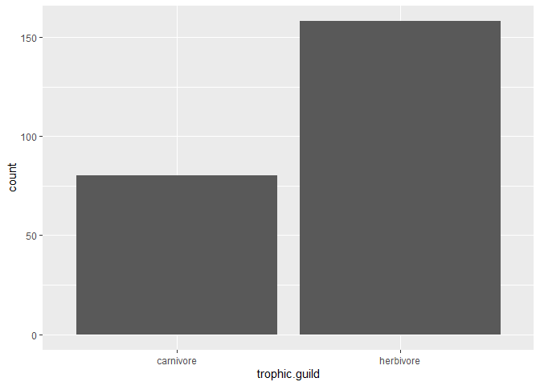
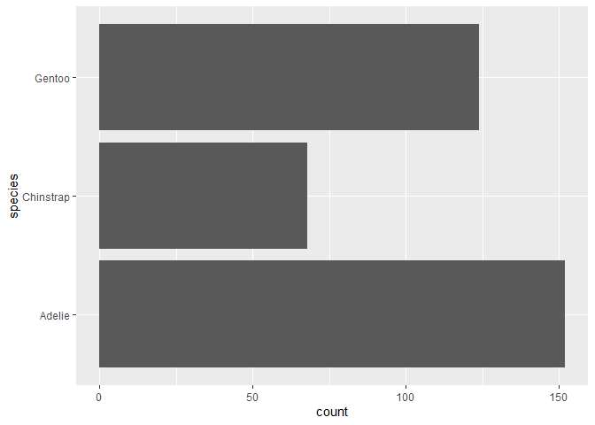
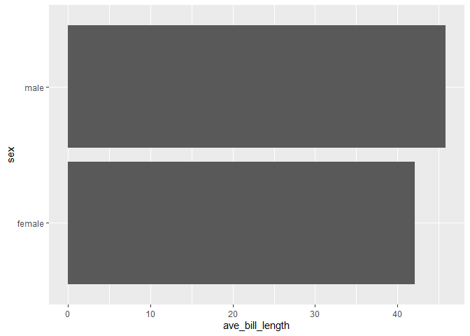
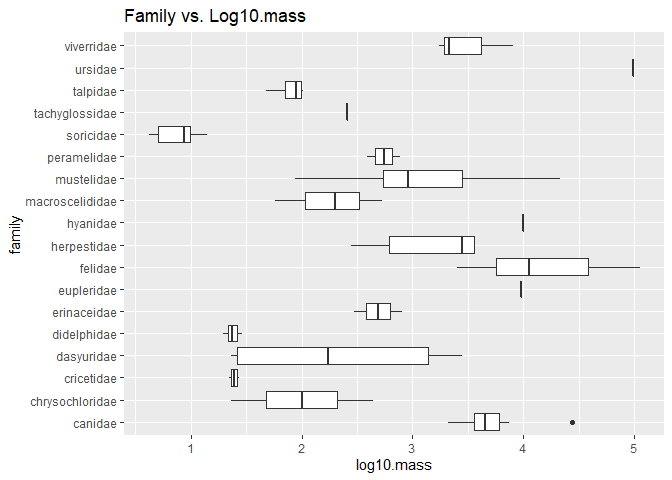

```r
library(tidyverse)
```

```
## -- Attaching packages --------------------------------------- tidyverse 1.3.0 --
```

```
## v ggplot2 3.3.3     v purrr   0.3.4
## v tibble  3.0.4     v dplyr   1.0.2
## v tidyr   1.1.2     v stringr 1.4.0
## v readr   1.4.0     v forcats 0.5.0
```

```
## -- Conflicts ------------------------------------------ tidyverse_conflicts() --
## x dplyr::filter() masks stats::filter()
## x dplyr::lag()    masks stats::lag()
```

```r
library(naniar)
library(janitor)
```

```
## 
## Attaching package: 'janitor'
```

```
## The following objects are masked from 'package:stats':
## 
##     chisq.test, fisher.test
```

```r
library(here)
```

```
## here() starts at C:/Users/starf/Documents/GitHub/BIS15W2021_ahearne
```

```r
?iris
```

```
## starting httpd help server ... done
```

```r
names(iris)
```

```
## [1] "Sepal.Length" "Sepal.Width"  "Petal.Length" "Petal.Width"  "Species"
```

```r
glimpse(iris)
```

```
## Rows: 150
## Columns: 5
## $ Sepal.Length <dbl> 5.1, 4.9, 4.7, 4.6, 5.0, 5.4, 4.6, 5.0, 4.4, 4.9, 5.4,...
## $ Sepal.Width  <dbl> 3.5, 3.0, 3.2, 3.1, 3.6, 3.9, 3.4, 3.4, 2.9, 3.1, 3.7,...
## $ Petal.Length <dbl> 1.4, 1.4, 1.3, 1.5, 1.4, 1.7, 1.4, 1.5, 1.4, 1.5, 1.5,...
## $ Petal.Width  <dbl> 0.2, 0.2, 0.2, 0.2, 0.2, 0.4, 0.3, 0.2, 0.2, 0.1, 0.2,...
## $ Species      <fct> setosa, setosa, setosa, setosa, setosa, setosa, setosa...
```

```r
ggplot(data=iris,mapping=aes(x=Species,y=Petal.Length))
```

<!-- -->


```r
ggplot(data=iris,mapping=aes(x=Species,y=Petal.Length))+
  geom_boxplot()
```

<!-- -->


```r
ggplot(data=iris,mapping=aes(x=Sepal.Length, y=Sepal.Width))+
  geom_jitter()
```

<!-- -->


```r
homerange <- readr::read_csv("data/Tamburelloetal_HomeRangeDatabase.csv")
```

```
## 
## -- Column specification --------------------------------------------------------
## cols(
##   .default = col_character(),
##   mean.mass.g = col_double(),
##   log10.mass = col_double(),
##   mean.hra.m2 = col_double(),
##   log10.hra = col_double(),
##   preymass = col_double(),
##   log10.preymass = col_double(),
##   PPMR = col_double()
## )
## i Use `spec()` for the full column specifications.
```


```r
homerange
```

```
## # A tibble: 569 x 24
##    taxon common.name class order family genus species primarymethod N    
##    <chr> <chr>       <chr> <chr> <chr>  <chr> <chr>   <chr>         <chr>
##  1 lake~ american e~ acti~ angu~ angui~ angu~ rostra~ telemetry     16   
##  2 rive~ blacktail ~ acti~ cypr~ catos~ moxo~ poecil~ mark-recaptu~ <NA> 
##  3 rive~ central st~ acti~ cypr~ cypri~ camp~ anomal~ mark-recaptu~ 20   
##  4 rive~ rosyside d~ acti~ cypr~ cypri~ clin~ fundul~ mark-recaptu~ 26   
##  5 rive~ longnose d~ acti~ cypr~ cypri~ rhin~ catara~ mark-recaptu~ 17   
##  6 rive~ muskellunge acti~ esoc~ esoci~ esox  masqui~ telemetry     5    
##  7 mari~ pollack     acti~ gadi~ gadid~ poll~ pollac~ telemetry     2    
##  8 mari~ saithe      acti~ gadi~ gadid~ poll~ virens  telemetry     2    
##  9 mari~ lined surg~ acti~ perc~ acant~ acan~ lineat~ direct obser~ <NA> 
## 10 mari~ orangespin~ acti~ perc~ acant~ naso  litura~ telemetry     8    
## # ... with 559 more rows, and 15 more variables: mean.mass.g <dbl>,
## #   log10.mass <dbl>, alternative.mass.reference <chr>, mean.hra.m2 <dbl>,
## #   log10.hra <dbl>, hra.reference <chr>, realm <chr>, thermoregulation <chr>,
## #   locomotion <chr>, trophic.guild <chr>, dimension <chr>, preymass <dbl>,
## #   log10.preymass <dbl>, PPMR <dbl>, prey.size.reference <chr>
```


```r
is.na(homerange)
```

```
##        taxon common.name class order family genus species primarymethod     N
##   [1,] FALSE       FALSE FALSE FALSE  FALSE FALSE   FALSE         FALSE FALSE
##   [2,] FALSE       FALSE FALSE FALSE  FALSE FALSE   FALSE         FALSE  TRUE
##   [3,] FALSE       FALSE FALSE FALSE  FALSE FALSE   FALSE         FALSE FALSE
##   [4,] FALSE       FALSE FALSE FALSE  FALSE FALSE   FALSE         FALSE FALSE
##   [5,] FALSE       FALSE FALSE FALSE  FALSE FALSE   FALSE         FALSE FALSE
##   [6,] FALSE       FALSE FALSE FALSE  FALSE FALSE   FALSE         FALSE FALSE
##   [7,] FALSE       FALSE FALSE FALSE  FALSE FALSE   FALSE         FALSE FALSE
##   [8,] FALSE       FALSE FALSE FALSE  FALSE FALSE   FALSE         FALSE FALSE
##   [9,] FALSE       FALSE FALSE FALSE  FALSE FALSE   FALSE         FALSE  TRUE
##  [10,] FALSE       FALSE FALSE FALSE  FALSE FALSE   FALSE         FALSE FALSE
##  [11,] FALSE       FALSE FALSE FALSE  FALSE FALSE   FALSE         FALSE FALSE
##  [12,] FALSE       FALSE FALSE FALSE  FALSE FALSE   FALSE         FALSE FALSE
##  [13,] FALSE       FALSE FALSE FALSE  FALSE FALSE   FALSE         FALSE FALSE
##  [14,] FALSE       FALSE FALSE FALSE  FALSE FALSE   FALSE         FALSE FALSE
##  [15,] FALSE       FALSE FALSE FALSE  FALSE FALSE   FALSE         FALSE FALSE
##  [16,] FALSE       FALSE FALSE FALSE  FALSE FALSE   FALSE         FALSE FALSE
##  [17,] FALSE       FALSE FALSE FALSE  FALSE FALSE   FALSE         FALSE  TRUE
##  [18,] FALSE       FALSE FALSE FALSE  FALSE FALSE   FALSE         FALSE  TRUE
##  [19,] FALSE       FALSE FALSE FALSE  FALSE FALSE   FALSE         FALSE FALSE
##  [20,] FALSE       FALSE FALSE FALSE  FALSE FALSE   FALSE         FALSE FALSE
##  [21,] FALSE       FALSE FALSE FALSE  FALSE FALSE   FALSE         FALSE  TRUE
##  [22,] FALSE       FALSE FALSE FALSE  FALSE FALSE   FALSE         FALSE FALSE
##  [23,] FALSE       FALSE FALSE FALSE  FALSE FALSE   FALSE         FALSE  TRUE
##  [24,] FALSE       FALSE FALSE FALSE  FALSE FALSE   FALSE         FALSE  TRUE
##  [25,] FALSE       FALSE FALSE FALSE  FALSE FALSE   FALSE         FALSE  TRUE
##  [26,] FALSE       FALSE FALSE FALSE  FALSE FALSE   FALSE         FALSE FALSE
##  [27,] FALSE       FALSE FALSE FALSE  FALSE FALSE   FALSE         FALSE  TRUE
##  [28,] FALSE       FALSE FALSE FALSE  FALSE FALSE   FALSE         FALSE FALSE
##  [29,] FALSE       FALSE FALSE FALSE  FALSE FALSE   FALSE         FALSE FALSE
##  [30,] FALSE       FALSE FALSE FALSE  FALSE FALSE   FALSE         FALSE FALSE
##  [31,] FALSE       FALSE FALSE FALSE  FALSE FALSE   FALSE         FALSE FALSE
##  [32,] FALSE       FALSE FALSE FALSE  FALSE FALSE   FALSE         FALSE  TRUE
##  [33,] FALSE       FALSE FALSE FALSE  FALSE FALSE   FALSE         FALSE FALSE
##  [34,] FALSE       FALSE FALSE FALSE  FALSE FALSE   FALSE         FALSE FALSE
##  [35,] FALSE       FALSE FALSE FALSE  FALSE FALSE   FALSE         FALSE FALSE
##  [36,] FALSE       FALSE FALSE FALSE  FALSE FALSE   FALSE         FALSE FALSE
##  [37,] FALSE       FALSE FALSE FALSE  FALSE FALSE   FALSE         FALSE FALSE
##  [38,] FALSE       FALSE FALSE FALSE  FALSE FALSE   FALSE         FALSE  TRUE
##  [39,] FALSE       FALSE FALSE FALSE  FALSE FALSE   FALSE         FALSE FALSE
##  [40,] FALSE       FALSE FALSE FALSE  FALSE FALSE   FALSE         FALSE FALSE
##  [41,] FALSE       FALSE FALSE FALSE  FALSE FALSE   FALSE         FALSE FALSE
##  [42,] FALSE       FALSE FALSE FALSE  FALSE FALSE   FALSE         FALSE FALSE
##  [43,] FALSE       FALSE FALSE FALSE  FALSE FALSE   FALSE         FALSE  TRUE
##  [44,] FALSE       FALSE FALSE FALSE  FALSE FALSE   FALSE         FALSE FALSE
##  [45,] FALSE       FALSE FALSE FALSE  FALSE FALSE   FALSE         FALSE FALSE
##  [46,] FALSE       FALSE FALSE FALSE  FALSE FALSE   FALSE         FALSE FALSE
##  [47,] FALSE       FALSE FALSE FALSE  FALSE FALSE   FALSE         FALSE FALSE
##  [48,] FALSE       FALSE FALSE FALSE  FALSE FALSE   FALSE         FALSE FALSE
##  [49,] FALSE       FALSE FALSE FALSE  FALSE FALSE   FALSE         FALSE  TRUE
##  [50,] FALSE       FALSE FALSE FALSE  FALSE FALSE   FALSE         FALSE FALSE
##  [51,] FALSE       FALSE FALSE FALSE  FALSE FALSE   FALSE         FALSE FALSE
##  [52,] FALSE       FALSE FALSE FALSE  FALSE FALSE   FALSE         FALSE FALSE
##  [53,] FALSE       FALSE FALSE FALSE  FALSE FALSE   FALSE         FALSE FALSE
##  [54,] FALSE       FALSE FALSE FALSE  FALSE FALSE   FALSE         FALSE FALSE
##  [55,] FALSE       FALSE FALSE FALSE  FALSE FALSE   FALSE         FALSE FALSE
##  [56,] FALSE       FALSE FALSE FALSE  FALSE FALSE   FALSE         FALSE FALSE
##  [57,] FALSE       FALSE FALSE FALSE  FALSE FALSE   FALSE         FALSE FALSE
##  [58,] FALSE       FALSE FALSE FALSE  FALSE FALSE   FALSE         FALSE FALSE
##  [59,] FALSE       FALSE FALSE FALSE  FALSE FALSE   FALSE         FALSE FALSE
##  [60,] FALSE       FALSE FALSE FALSE  FALSE FALSE   FALSE         FALSE FALSE
##  [61,] FALSE       FALSE FALSE FALSE  FALSE FALSE   FALSE         FALSE  TRUE
##  [62,] FALSE       FALSE FALSE FALSE  FALSE FALSE   FALSE         FALSE  TRUE
##  [63,] FALSE       FALSE FALSE FALSE  FALSE FALSE   FALSE         FALSE  TRUE
##  [64,] FALSE       FALSE FALSE FALSE  FALSE FALSE   FALSE         FALSE FALSE
##  [65,] FALSE       FALSE FALSE FALSE  FALSE FALSE   FALSE         FALSE  TRUE
##  [66,] FALSE       FALSE FALSE FALSE  FALSE FALSE   FALSE         FALSE  TRUE
##  [67,] FALSE       FALSE FALSE FALSE  FALSE FALSE   FALSE         FALSE  TRUE
##  [68,] FALSE       FALSE FALSE FALSE  FALSE FALSE   FALSE         FALSE  TRUE
##  [69,] FALSE       FALSE FALSE FALSE  FALSE FALSE   FALSE         FALSE FALSE
##  [70,] FALSE       FALSE FALSE FALSE  FALSE FALSE   FALSE         FALSE FALSE
##  [71,] FALSE       FALSE FALSE FALSE  FALSE FALSE   FALSE         FALSE FALSE
##  [72,] FALSE       FALSE FALSE FALSE  FALSE FALSE   FALSE         FALSE FALSE
##  [73,] FALSE       FALSE FALSE FALSE  FALSE FALSE   FALSE         FALSE FALSE
##  [74,] FALSE       FALSE FALSE FALSE  FALSE FALSE   FALSE         FALSE FALSE
##  [75,] FALSE       FALSE FALSE FALSE  FALSE FALSE   FALSE         FALSE FALSE
##  [76,] FALSE       FALSE FALSE FALSE  FALSE FALSE   FALSE         FALSE FALSE
##  [77,] FALSE       FALSE FALSE FALSE  FALSE FALSE   FALSE         FALSE FALSE
##  [78,] FALSE       FALSE FALSE FALSE  FALSE FALSE   FALSE         FALSE FALSE
##  [79,] FALSE       FALSE FALSE FALSE  FALSE FALSE   FALSE         FALSE FALSE
##  [80,] FALSE       FALSE FALSE FALSE  FALSE FALSE   FALSE         FALSE FALSE
##  [81,] FALSE       FALSE FALSE FALSE  FALSE FALSE   FALSE         FALSE  TRUE
##  [82,] FALSE       FALSE FALSE FALSE  FALSE FALSE   FALSE         FALSE FALSE
##  [83,] FALSE       FALSE FALSE FALSE  FALSE FALSE   FALSE         FALSE FALSE
##  [84,] FALSE       FALSE FALSE FALSE  FALSE FALSE   FALSE         FALSE FALSE
##  [85,] FALSE       FALSE FALSE FALSE  FALSE FALSE   FALSE         FALSE FALSE
##  [86,] FALSE       FALSE FALSE FALSE  FALSE FALSE   FALSE         FALSE FALSE
##  [87,] FALSE       FALSE FALSE FALSE  FALSE FALSE   FALSE         FALSE FALSE
##  [88,] FALSE       FALSE FALSE FALSE  FALSE FALSE   FALSE         FALSE FALSE
##  [89,] FALSE       FALSE FALSE FALSE  FALSE FALSE   FALSE         FALSE FALSE
##  [90,] FALSE       FALSE FALSE FALSE  FALSE FALSE   FALSE         FALSE FALSE
##  [91,] FALSE       FALSE FALSE FALSE  FALSE FALSE   FALSE         FALSE FALSE
##  [92,] FALSE       FALSE FALSE FALSE  FALSE FALSE   FALSE         FALSE FALSE
##  [93,] FALSE       FALSE FALSE FALSE  FALSE FALSE   FALSE         FALSE FALSE
##  [94,] FALSE       FALSE FALSE FALSE  FALSE FALSE   FALSE         FALSE FALSE
##  [95,] FALSE       FALSE FALSE FALSE  FALSE FALSE   FALSE         FALSE  TRUE
##  [96,] FALSE       FALSE FALSE FALSE  FALSE FALSE   FALSE         FALSE  TRUE
##  [97,] FALSE       FALSE FALSE FALSE  FALSE FALSE   FALSE         FALSE FALSE
##  [98,] FALSE       FALSE FALSE FALSE  FALSE FALSE   FALSE         FALSE FALSE
##  [99,] FALSE       FALSE FALSE FALSE  FALSE FALSE   FALSE         FALSE FALSE
## [100,] FALSE       FALSE FALSE FALSE  FALSE FALSE   FALSE         FALSE FALSE
## [101,] FALSE       FALSE FALSE FALSE  FALSE FALSE   FALSE         FALSE  TRUE
## [102,] FALSE       FALSE FALSE FALSE  FALSE FALSE   FALSE         FALSE FALSE
## [103,] FALSE       FALSE FALSE FALSE  FALSE FALSE   FALSE         FALSE FALSE
## [104,] FALSE       FALSE FALSE FALSE  FALSE FALSE   FALSE         FALSE  TRUE
## [105,] FALSE       FALSE FALSE FALSE  FALSE FALSE   FALSE         FALSE FALSE
## [106,] FALSE       FALSE FALSE FALSE  FALSE FALSE   FALSE         FALSE FALSE
## [107,] FALSE       FALSE FALSE FALSE  FALSE FALSE   FALSE         FALSE FALSE
## [108,] FALSE       FALSE FALSE FALSE  FALSE FALSE   FALSE         FALSE FALSE
## [109,] FALSE       FALSE FALSE FALSE  FALSE FALSE   FALSE         FALSE FALSE
## [110,] FALSE       FALSE FALSE FALSE  FALSE FALSE   FALSE         FALSE FALSE
## [111,] FALSE       FALSE FALSE FALSE  FALSE FALSE   FALSE         FALSE  TRUE
## [112,] FALSE       FALSE FALSE FALSE  FALSE FALSE   FALSE         FALSE  TRUE
## [113,] FALSE       FALSE FALSE FALSE  FALSE FALSE   FALSE         FALSE  TRUE
## [114,] FALSE       FALSE FALSE FALSE  FALSE FALSE   FALSE         FALSE  TRUE
## [115,] FALSE       FALSE FALSE FALSE  FALSE FALSE   FALSE         FALSE  TRUE
## [116,] FALSE       FALSE FALSE FALSE  FALSE FALSE   FALSE         FALSE  TRUE
## [117,] FALSE       FALSE FALSE FALSE  FALSE FALSE   FALSE         FALSE  TRUE
## [118,] FALSE       FALSE FALSE FALSE  FALSE FALSE   FALSE         FALSE FALSE
## [119,] FALSE       FALSE FALSE FALSE  FALSE FALSE   FALSE         FALSE  TRUE
## [120,] FALSE       FALSE FALSE FALSE  FALSE FALSE   FALSE         FALSE FALSE
## [121,] FALSE       FALSE FALSE FALSE  FALSE FALSE   FALSE         FALSE FALSE
## [122,] FALSE       FALSE FALSE FALSE  FALSE FALSE   FALSE         FALSE  TRUE
## [123,] FALSE       FALSE FALSE FALSE  FALSE FALSE   FALSE         FALSE FALSE
## [124,] FALSE       FALSE FALSE FALSE  FALSE FALSE   FALSE         FALSE  TRUE
## [125,] FALSE       FALSE FALSE FALSE  FALSE FALSE   FALSE         FALSE  TRUE
## [126,] FALSE       FALSE FALSE FALSE  FALSE FALSE   FALSE         FALSE  TRUE
## [127,] FALSE       FALSE FALSE FALSE  FALSE FALSE   FALSE         FALSE  TRUE
## [128,] FALSE       FALSE FALSE FALSE  FALSE FALSE   FALSE         FALSE  TRUE
## [129,] FALSE       FALSE FALSE FALSE  FALSE FALSE   FALSE         FALSE  TRUE
## [130,] FALSE       FALSE FALSE FALSE  FALSE FALSE   FALSE         FALSE  TRUE
## [131,] FALSE       FALSE FALSE FALSE  FALSE FALSE   FALSE         FALSE FALSE
## [132,] FALSE       FALSE FALSE FALSE  FALSE FALSE   FALSE         FALSE FALSE
## [133,] FALSE       FALSE FALSE FALSE  FALSE FALSE   FALSE         FALSE  TRUE
## [134,] FALSE       FALSE FALSE FALSE  FALSE FALSE   FALSE         FALSE  TRUE
## [135,] FALSE       FALSE FALSE FALSE  FALSE FALSE   FALSE         FALSE  TRUE
## [136,] FALSE       FALSE FALSE FALSE  FALSE FALSE   FALSE         FALSE  TRUE
## [137,] FALSE       FALSE FALSE FALSE  FALSE FALSE   FALSE         FALSE  TRUE
## [138,] FALSE       FALSE FALSE FALSE  FALSE FALSE   FALSE         FALSE  TRUE
## [139,] FALSE       FALSE FALSE FALSE  FALSE FALSE   FALSE         FALSE  TRUE
## [140,] FALSE       FALSE FALSE FALSE  FALSE FALSE   FALSE         FALSE  TRUE
## [141,] FALSE       FALSE FALSE FALSE  FALSE FALSE   FALSE         FALSE  TRUE
## [142,] FALSE       FALSE FALSE FALSE  FALSE FALSE   FALSE         FALSE  TRUE
## [143,] FALSE       FALSE FALSE FALSE  FALSE FALSE   FALSE         FALSE FALSE
## [144,] FALSE       FALSE FALSE FALSE  FALSE FALSE   FALSE         FALSE FALSE
## [145,] FALSE       FALSE FALSE FALSE  FALSE FALSE   FALSE         FALSE  TRUE
## [146,] FALSE       FALSE FALSE FALSE  FALSE FALSE   FALSE         FALSE  TRUE
## [147,] FALSE       FALSE FALSE FALSE  FALSE FALSE   FALSE         FALSE  TRUE
## [148,] FALSE       FALSE FALSE FALSE  FALSE FALSE   FALSE         FALSE  TRUE
## [149,] FALSE       FALSE FALSE FALSE  FALSE FALSE   FALSE          TRUE  TRUE
## [150,] FALSE       FALSE FALSE FALSE  FALSE FALSE   FALSE         FALSE  TRUE
## [151,] FALSE       FALSE FALSE FALSE  FALSE FALSE   FALSE         FALSE FALSE
## [152,] FALSE       FALSE FALSE FALSE  FALSE FALSE   FALSE         FALSE FALSE
## [153,] FALSE       FALSE FALSE FALSE  FALSE FALSE   FALSE         FALSE  TRUE
## [154,] FALSE       FALSE FALSE FALSE  FALSE FALSE   FALSE         FALSE  TRUE
## [155,] FALSE       FALSE FALSE FALSE  FALSE FALSE   FALSE         FALSE  TRUE
## [156,] FALSE       FALSE FALSE FALSE  FALSE FALSE   FALSE         FALSE  TRUE
## [157,] FALSE       FALSE FALSE FALSE  FALSE FALSE   FALSE         FALSE FALSE
## [158,] FALSE       FALSE FALSE FALSE  FALSE FALSE   FALSE         FALSE FALSE
## [159,] FALSE       FALSE FALSE FALSE  FALSE FALSE   FALSE         FALSE FALSE
## [160,] FALSE       FALSE FALSE FALSE  FALSE FALSE   FALSE         FALSE FALSE
## [161,] FALSE       FALSE FALSE FALSE  FALSE FALSE   FALSE         FALSE  TRUE
## [162,] FALSE       FALSE FALSE FALSE  FALSE FALSE   FALSE         FALSE  TRUE
## [163,] FALSE       FALSE FALSE FALSE  FALSE FALSE   FALSE         FALSE  TRUE
## [164,] FALSE       FALSE FALSE FALSE  FALSE FALSE   FALSE         FALSE  TRUE
## [165,] FALSE       FALSE FALSE FALSE  FALSE FALSE   FALSE         FALSE  TRUE
## [166,] FALSE       FALSE FALSE FALSE  FALSE FALSE   FALSE         FALSE  TRUE
## [167,] FALSE       FALSE FALSE FALSE  FALSE FALSE   FALSE         FALSE  TRUE
## [168,] FALSE       FALSE FALSE FALSE  FALSE FALSE   FALSE         FALSE  TRUE
## [169,] FALSE       FALSE FALSE FALSE  FALSE FALSE   FALSE         FALSE  TRUE
## [170,] FALSE       FALSE FALSE FALSE  FALSE FALSE   FALSE         FALSE FALSE
## [171,] FALSE       FALSE FALSE FALSE  FALSE FALSE   FALSE         FALSE FALSE
## [172,] FALSE       FALSE FALSE FALSE  FALSE FALSE   FALSE         FALSE FALSE
## [173,] FALSE       FALSE FALSE FALSE  FALSE FALSE   FALSE         FALSE  TRUE
## [174,] FALSE       FALSE FALSE FALSE  FALSE FALSE   FALSE         FALSE FALSE
## [175,] FALSE       FALSE FALSE FALSE  FALSE FALSE   FALSE         FALSE FALSE
## [176,] FALSE       FALSE FALSE FALSE  FALSE FALSE   FALSE         FALSE  TRUE
## [177,] FALSE       FALSE FALSE FALSE  FALSE FALSE   FALSE         FALSE  TRUE
## [178,] FALSE       FALSE FALSE FALSE  FALSE FALSE   FALSE         FALSE  TRUE
## [179,] FALSE       FALSE FALSE FALSE  FALSE FALSE   FALSE         FALSE  TRUE
## [180,] FALSE       FALSE FALSE FALSE  FALSE FALSE   FALSE         FALSE  TRUE
## [181,] FALSE       FALSE FALSE FALSE  FALSE FALSE   FALSE         FALSE  TRUE
## [182,] FALSE       FALSE FALSE FALSE  FALSE FALSE   FALSE         FALSE FALSE
## [183,] FALSE       FALSE FALSE FALSE  FALSE FALSE   FALSE         FALSE  TRUE
## [184,] FALSE       FALSE FALSE FALSE  FALSE FALSE   FALSE         FALSE  TRUE
## [185,] FALSE       FALSE FALSE FALSE  FALSE FALSE   FALSE         FALSE  TRUE
## [186,] FALSE       FALSE FALSE FALSE  FALSE FALSE   FALSE         FALSE  TRUE
## [187,] FALSE       FALSE FALSE FALSE  FALSE FALSE   FALSE         FALSE  TRUE
## [188,] FALSE       FALSE FALSE FALSE  FALSE FALSE   FALSE         FALSE  TRUE
## [189,] FALSE       FALSE FALSE FALSE  FALSE FALSE   FALSE         FALSE  TRUE
## [190,] FALSE       FALSE FALSE FALSE  FALSE FALSE   FALSE         FALSE  TRUE
## [191,] FALSE       FALSE FALSE FALSE  FALSE FALSE   FALSE         FALSE  TRUE
## [192,] FALSE       FALSE FALSE FALSE  FALSE FALSE   FALSE         FALSE  TRUE
## [193,] FALSE       FALSE FALSE FALSE  FALSE FALSE   FALSE         FALSE  TRUE
## [194,] FALSE       FALSE FALSE FALSE  FALSE FALSE   FALSE         FALSE  TRUE
## [195,] FALSE       FALSE FALSE FALSE  FALSE FALSE   FALSE         FALSE  TRUE
## [196,] FALSE       FALSE FALSE FALSE  FALSE FALSE   FALSE         FALSE  TRUE
## [197,] FALSE       FALSE FALSE FALSE  FALSE FALSE   FALSE         FALSE  TRUE
## [198,] FALSE       FALSE FALSE FALSE  FALSE FALSE   FALSE         FALSE  TRUE
## [199,] FALSE       FALSE FALSE FALSE  FALSE FALSE   FALSE         FALSE  TRUE
## [200,] FALSE       FALSE FALSE FALSE  FALSE FALSE   FALSE         FALSE  TRUE
## [201,] FALSE       FALSE FALSE FALSE  FALSE FALSE   FALSE         FALSE  TRUE
## [202,] FALSE       FALSE FALSE FALSE  FALSE FALSE   FALSE         FALSE  TRUE
## [203,] FALSE       FALSE FALSE FALSE  FALSE FALSE   FALSE         FALSE  TRUE
## [204,] FALSE       FALSE FALSE FALSE  FALSE FALSE   FALSE         FALSE  TRUE
## [205,] FALSE       FALSE FALSE FALSE  FALSE FALSE   FALSE         FALSE  TRUE
## [206,] FALSE       FALSE FALSE FALSE  FALSE FALSE   FALSE         FALSE FALSE
## [207,] FALSE       FALSE FALSE FALSE  FALSE FALSE   FALSE         FALSE  TRUE
## [208,] FALSE       FALSE FALSE FALSE  FALSE FALSE   FALSE         FALSE  TRUE
## [209,] FALSE       FALSE FALSE FALSE  FALSE FALSE   FALSE         FALSE  TRUE
## [210,] FALSE       FALSE FALSE FALSE  FALSE FALSE   FALSE         FALSE  TRUE
## [211,] FALSE       FALSE FALSE FALSE  FALSE FALSE   FALSE         FALSE FALSE
## [212,] FALSE       FALSE FALSE FALSE  FALSE FALSE   FALSE         FALSE  TRUE
## [213,] FALSE       FALSE FALSE FALSE  FALSE FALSE   FALSE         FALSE  TRUE
## [214,] FALSE       FALSE FALSE FALSE  FALSE FALSE   FALSE         FALSE  TRUE
## [215,] FALSE       FALSE FALSE FALSE  FALSE FALSE   FALSE         FALSE  TRUE
## [216,] FALSE       FALSE FALSE FALSE  FALSE FALSE   FALSE         FALSE  TRUE
## [217,] FALSE       FALSE FALSE FALSE  FALSE FALSE   FALSE         FALSE  TRUE
## [218,] FALSE       FALSE FALSE FALSE  FALSE FALSE   FALSE         FALSE  TRUE
## [219,] FALSE       FALSE FALSE FALSE  FALSE FALSE   FALSE         FALSE FALSE
## [220,] FALSE       FALSE FALSE FALSE  FALSE FALSE   FALSE         FALSE  TRUE
## [221,] FALSE       FALSE FALSE FALSE  FALSE FALSE   FALSE         FALSE  TRUE
## [222,] FALSE       FALSE FALSE FALSE  FALSE FALSE   FALSE         FALSE  TRUE
## [223,] FALSE       FALSE FALSE FALSE  FALSE FALSE   FALSE         FALSE  TRUE
## [224,] FALSE       FALSE FALSE FALSE  FALSE FALSE   FALSE         FALSE  TRUE
## [225,] FALSE       FALSE FALSE FALSE  FALSE FALSE   FALSE         FALSE  TRUE
## [226,] FALSE       FALSE FALSE FALSE  FALSE FALSE   FALSE         FALSE  TRUE
## [227,] FALSE       FALSE FALSE FALSE  FALSE FALSE   FALSE         FALSE  TRUE
## [228,] FALSE       FALSE FALSE FALSE  FALSE FALSE   FALSE         FALSE  TRUE
## [229,] FALSE       FALSE FALSE FALSE  FALSE FALSE   FALSE         FALSE FALSE
## [230,] FALSE       FALSE FALSE FALSE  FALSE FALSE   FALSE         FALSE  TRUE
## [231,] FALSE       FALSE FALSE FALSE  FALSE FALSE   FALSE         FALSE FALSE
## [232,] FALSE       FALSE FALSE FALSE  FALSE FALSE   FALSE         FALSE FALSE
## [233,] FALSE       FALSE FALSE FALSE  FALSE FALSE   FALSE         FALSE  TRUE
## [234,] FALSE       FALSE FALSE FALSE  FALSE FALSE   FALSE         FALSE  TRUE
## [235,] FALSE       FALSE FALSE FALSE  FALSE FALSE   FALSE         FALSE  TRUE
## [236,] FALSE       FALSE FALSE FALSE  FALSE FALSE   FALSE         FALSE  TRUE
## [237,] FALSE       FALSE FALSE FALSE  FALSE FALSE   FALSE         FALSE  TRUE
## [238,] FALSE       FALSE FALSE FALSE  FALSE FALSE   FALSE         FALSE  TRUE
## [239,] FALSE       FALSE FALSE FALSE  FALSE FALSE   FALSE         FALSE  TRUE
## [240,] FALSE       FALSE FALSE FALSE  FALSE FALSE   FALSE         FALSE FALSE
## [241,] FALSE       FALSE FALSE FALSE  FALSE FALSE   FALSE         FALSE FALSE
## [242,] FALSE       FALSE FALSE FALSE  FALSE FALSE   FALSE         FALSE FALSE
## [243,] FALSE       FALSE FALSE FALSE  FALSE FALSE   FALSE         FALSE  TRUE
## [244,] FALSE       FALSE FALSE FALSE  FALSE FALSE   FALSE         FALSE  TRUE
## [245,] FALSE       FALSE FALSE FALSE  FALSE FALSE   FALSE         FALSE  TRUE
## [246,] FALSE       FALSE FALSE FALSE  FALSE FALSE   FALSE         FALSE  TRUE
## [247,] FALSE       FALSE FALSE FALSE  FALSE FALSE   FALSE         FALSE  TRUE
## [248,] FALSE       FALSE FALSE FALSE  FALSE FALSE   FALSE         FALSE  TRUE
## [249,] FALSE       FALSE FALSE FALSE  FALSE FALSE   FALSE         FALSE  TRUE
## [250,] FALSE       FALSE FALSE FALSE  FALSE FALSE   FALSE         FALSE FALSE
## [251,] FALSE       FALSE FALSE FALSE  FALSE FALSE   FALSE         FALSE  TRUE
## [252,] FALSE       FALSE FALSE FALSE  FALSE FALSE   FALSE         FALSE FALSE
## [253,] FALSE       FALSE FALSE FALSE  FALSE FALSE   FALSE         FALSE FALSE
## [254,] FALSE       FALSE FALSE FALSE  FALSE FALSE   FALSE         FALSE  TRUE
## [255,] FALSE       FALSE FALSE FALSE  FALSE FALSE   FALSE         FALSE  TRUE
## [256,] FALSE       FALSE FALSE FALSE  FALSE FALSE   FALSE         FALSE  TRUE
## [257,] FALSE       FALSE FALSE FALSE  FALSE FALSE   FALSE         FALSE  TRUE
## [258,] FALSE       FALSE FALSE FALSE  FALSE FALSE   FALSE         FALSE  TRUE
## [259,] FALSE       FALSE FALSE FALSE  FALSE FALSE   FALSE         FALSE  TRUE
## [260,] FALSE       FALSE FALSE FALSE  FALSE FALSE   FALSE         FALSE  TRUE
## [261,] FALSE       FALSE FALSE FALSE  FALSE FALSE   FALSE         FALSE  TRUE
## [262,] FALSE       FALSE FALSE FALSE  FALSE FALSE   FALSE         FALSE  TRUE
## [263,] FALSE       FALSE FALSE FALSE  FALSE FALSE   FALSE         FALSE  TRUE
## [264,] FALSE       FALSE FALSE FALSE  FALSE FALSE   FALSE         FALSE  TRUE
## [265,] FALSE       FALSE FALSE FALSE  FALSE FALSE   FALSE         FALSE  TRUE
## [266,] FALSE       FALSE FALSE FALSE  FALSE FALSE   FALSE         FALSE  TRUE
## [267,] FALSE       FALSE FALSE FALSE  FALSE FALSE   FALSE         FALSE  TRUE
## [268,] FALSE       FALSE FALSE FALSE  FALSE FALSE   FALSE         FALSE  TRUE
## [269,] FALSE       FALSE FALSE FALSE  FALSE FALSE   FALSE         FALSE  TRUE
## [270,] FALSE       FALSE FALSE FALSE  FALSE FALSE   FALSE         FALSE  TRUE
## [271,] FALSE       FALSE FALSE FALSE  FALSE FALSE   FALSE         FALSE  TRUE
## [272,] FALSE       FALSE FALSE FALSE  FALSE FALSE   FALSE         FALSE  TRUE
## [273,] FALSE       FALSE FALSE FALSE  FALSE FALSE   FALSE         FALSE  TRUE
## [274,] FALSE       FALSE FALSE FALSE  FALSE FALSE   FALSE         FALSE  TRUE
## [275,] FALSE       FALSE FALSE FALSE  FALSE FALSE   FALSE         FALSE  TRUE
## [276,] FALSE       FALSE FALSE FALSE  FALSE FALSE   FALSE         FALSE  TRUE
## [277,] FALSE       FALSE FALSE FALSE  FALSE FALSE   FALSE         FALSE  TRUE
## [278,] FALSE       FALSE FALSE FALSE  FALSE FALSE   FALSE         FALSE  TRUE
## [279,] FALSE       FALSE FALSE FALSE  FALSE FALSE   FALSE         FALSE  TRUE
## [280,] FALSE       FALSE FALSE FALSE  FALSE FALSE   FALSE         FALSE  TRUE
## [281,] FALSE       FALSE FALSE FALSE  FALSE FALSE   FALSE         FALSE  TRUE
## [282,] FALSE       FALSE FALSE FALSE  FALSE FALSE   FALSE         FALSE  TRUE
## [283,] FALSE       FALSE FALSE FALSE  FALSE FALSE   FALSE         FALSE  TRUE
## [284,] FALSE       FALSE FALSE FALSE  FALSE FALSE   FALSE         FALSE  TRUE
## [285,] FALSE       FALSE FALSE FALSE  FALSE FALSE   FALSE         FALSE  TRUE
## [286,] FALSE       FALSE FALSE FALSE  FALSE FALSE   FALSE         FALSE  TRUE
## [287,] FALSE       FALSE FALSE FALSE  FALSE FALSE   FALSE         FALSE  TRUE
## [288,] FALSE       FALSE FALSE FALSE  FALSE FALSE   FALSE         FALSE  TRUE
## [289,] FALSE       FALSE FALSE FALSE  FALSE FALSE   FALSE         FALSE  TRUE
## [290,] FALSE       FALSE FALSE FALSE  FALSE FALSE   FALSE         FALSE  TRUE
## [291,] FALSE       FALSE FALSE FALSE  FALSE FALSE   FALSE         FALSE  TRUE
## [292,] FALSE       FALSE FALSE FALSE  FALSE FALSE   FALSE         FALSE  TRUE
## [293,] FALSE       FALSE FALSE FALSE  FALSE FALSE   FALSE         FALSE  TRUE
## [294,] FALSE       FALSE FALSE FALSE  FALSE FALSE   FALSE         FALSE  TRUE
## [295,] FALSE       FALSE FALSE FALSE  FALSE FALSE   FALSE         FALSE  TRUE
## [296,] FALSE       FALSE FALSE FALSE  FALSE FALSE   FALSE         FALSE  TRUE
## [297,] FALSE       FALSE FALSE FALSE  FALSE FALSE   FALSE         FALSE  TRUE
## [298,] FALSE       FALSE FALSE FALSE  FALSE FALSE   FALSE         FALSE  TRUE
## [299,] FALSE       FALSE FALSE FALSE  FALSE FALSE   FALSE         FALSE  TRUE
## [300,] FALSE       FALSE FALSE FALSE  FALSE FALSE   FALSE         FALSE  TRUE
## [301,] FALSE       FALSE FALSE FALSE  FALSE FALSE   FALSE         FALSE  TRUE
## [302,] FALSE       FALSE FALSE FALSE  FALSE FALSE   FALSE         FALSE  TRUE
## [303,] FALSE       FALSE FALSE FALSE  FALSE FALSE   FALSE         FALSE  TRUE
## [304,] FALSE       FALSE FALSE FALSE  FALSE FALSE   FALSE         FALSE  TRUE
## [305,] FALSE       FALSE FALSE FALSE  FALSE FALSE   FALSE         FALSE  TRUE
## [306,] FALSE       FALSE FALSE FALSE  FALSE FALSE   FALSE         FALSE  TRUE
## [307,] FALSE       FALSE FALSE FALSE  FALSE FALSE   FALSE         FALSE  TRUE
## [308,] FALSE       FALSE FALSE FALSE  FALSE FALSE   FALSE         FALSE  TRUE
## [309,] FALSE       FALSE FALSE FALSE  FALSE FALSE   FALSE         FALSE  TRUE
## [310,] FALSE       FALSE FALSE FALSE  FALSE FALSE   FALSE         FALSE  TRUE
## [311,] FALSE       FALSE FALSE FALSE  FALSE FALSE   FALSE         FALSE  TRUE
## [312,] FALSE       FALSE FALSE FALSE  FALSE FALSE   FALSE         FALSE  TRUE
## [313,] FALSE       FALSE FALSE FALSE  FALSE FALSE   FALSE         FALSE  TRUE
## [314,] FALSE       FALSE FALSE FALSE  FALSE FALSE   FALSE         FALSE  TRUE
## [315,] FALSE       FALSE FALSE FALSE  FALSE FALSE   FALSE         FALSE  TRUE
## [316,] FALSE       FALSE FALSE FALSE  FALSE FALSE   FALSE         FALSE  TRUE
## [317,] FALSE       FALSE FALSE FALSE  FALSE FALSE   FALSE         FALSE  TRUE
## [318,] FALSE       FALSE FALSE FALSE  FALSE FALSE   FALSE         FALSE  TRUE
## [319,] FALSE       FALSE FALSE FALSE  FALSE FALSE   FALSE         FALSE  TRUE
## [320,] FALSE       FALSE FALSE FALSE  FALSE FALSE   FALSE         FALSE  TRUE
## [321,] FALSE       FALSE FALSE FALSE  FALSE FALSE   FALSE         FALSE  TRUE
## [322,] FALSE       FALSE FALSE FALSE  FALSE FALSE   FALSE         FALSE  TRUE
## [323,] FALSE       FALSE FALSE FALSE  FALSE FALSE   FALSE         FALSE  TRUE
## [324,] FALSE       FALSE FALSE FALSE  FALSE FALSE   FALSE         FALSE  TRUE
## [325,] FALSE       FALSE FALSE FALSE  FALSE FALSE   FALSE         FALSE  TRUE
## [326,] FALSE       FALSE FALSE FALSE  FALSE FALSE   FALSE         FALSE  TRUE
## [327,] FALSE       FALSE FALSE FALSE  FALSE FALSE   FALSE         FALSE FALSE
## [328,] FALSE       FALSE FALSE FALSE  FALSE FALSE   FALSE         FALSE  TRUE
## [329,] FALSE       FALSE FALSE FALSE  FALSE FALSE   FALSE         FALSE  TRUE
## [330,] FALSE       FALSE FALSE FALSE  FALSE FALSE   FALSE         FALSE  TRUE
## [331,] FALSE       FALSE FALSE FALSE  FALSE FALSE   FALSE         FALSE  TRUE
## [332,] FALSE       FALSE FALSE FALSE  FALSE FALSE   FALSE         FALSE  TRUE
## [333,] FALSE       FALSE FALSE FALSE  FALSE FALSE   FALSE         FALSE  TRUE
## [334,] FALSE       FALSE FALSE FALSE  FALSE FALSE   FALSE         FALSE  TRUE
## [335,] FALSE       FALSE FALSE FALSE  FALSE FALSE   FALSE         FALSE  TRUE
## [336,] FALSE       FALSE FALSE FALSE  FALSE FALSE   FALSE         FALSE  TRUE
## [337,] FALSE       FALSE FALSE FALSE  FALSE FALSE   FALSE         FALSE  TRUE
## [338,] FALSE       FALSE FALSE FALSE  FALSE FALSE   FALSE         FALSE  TRUE
## [339,] FALSE       FALSE FALSE FALSE  FALSE FALSE   FALSE         FALSE  TRUE
## [340,] FALSE       FALSE FALSE FALSE  FALSE FALSE   FALSE         FALSE  TRUE
## [341,] FALSE       FALSE FALSE FALSE  FALSE FALSE   FALSE         FALSE  TRUE
## [342,] FALSE       FALSE FALSE FALSE  FALSE FALSE   FALSE         FALSE  TRUE
## [343,] FALSE       FALSE FALSE FALSE  FALSE FALSE   FALSE         FALSE  TRUE
## [344,] FALSE       FALSE FALSE FALSE  FALSE FALSE   FALSE         FALSE  TRUE
## [345,] FALSE       FALSE FALSE FALSE  FALSE FALSE   FALSE         FALSE  TRUE
## [346,] FALSE       FALSE FALSE FALSE  FALSE FALSE   FALSE         FALSE  TRUE
## [347,] FALSE       FALSE FALSE FALSE  FALSE FALSE   FALSE         FALSE  TRUE
## [348,] FALSE       FALSE FALSE FALSE  FALSE FALSE   FALSE         FALSE  TRUE
## [349,] FALSE       FALSE FALSE FALSE  FALSE FALSE   FALSE         FALSE  TRUE
## [350,] FALSE       FALSE FALSE FALSE  FALSE FALSE   FALSE         FALSE  TRUE
## [351,] FALSE       FALSE FALSE FALSE  FALSE FALSE   FALSE         FALSE  TRUE
## [352,] FALSE       FALSE FALSE FALSE  FALSE FALSE   FALSE         FALSE FALSE
## [353,] FALSE       FALSE FALSE FALSE  FALSE FALSE   FALSE         FALSE  TRUE
## [354,] FALSE       FALSE FALSE FALSE  FALSE FALSE   FALSE         FALSE  TRUE
## [355,] FALSE       FALSE FALSE FALSE  FALSE FALSE   FALSE         FALSE  TRUE
## [356,] FALSE       FALSE FALSE FALSE  FALSE FALSE   FALSE         FALSE  TRUE
## [357,] FALSE       FALSE FALSE FALSE  FALSE FALSE   FALSE         FALSE  TRUE
## [358,] FALSE       FALSE FALSE FALSE  FALSE FALSE   FALSE         FALSE  TRUE
## [359,] FALSE       FALSE FALSE FALSE  FALSE FALSE   FALSE         FALSE  TRUE
## [360,] FALSE       FALSE FALSE FALSE  FALSE FALSE   FALSE         FALSE  TRUE
## [361,] FALSE       FALSE FALSE FALSE  FALSE FALSE   FALSE         FALSE  TRUE
## [362,] FALSE       FALSE FALSE FALSE  FALSE FALSE   FALSE         FALSE  TRUE
## [363,] FALSE       FALSE FALSE FALSE  FALSE FALSE   FALSE         FALSE  TRUE
## [364,] FALSE       FALSE FALSE FALSE  FALSE FALSE   FALSE         FALSE  TRUE
## [365,] FALSE       FALSE FALSE FALSE  FALSE FALSE   FALSE         FALSE  TRUE
## [366,] FALSE       FALSE FALSE FALSE  FALSE FALSE   FALSE         FALSE  TRUE
## [367,] FALSE       FALSE FALSE FALSE  FALSE FALSE   FALSE         FALSE  TRUE
## [368,] FALSE       FALSE FALSE FALSE  FALSE FALSE   FALSE         FALSE  TRUE
## [369,] FALSE       FALSE FALSE FALSE  FALSE FALSE   FALSE         FALSE  TRUE
## [370,] FALSE       FALSE FALSE FALSE  FALSE FALSE   FALSE         FALSE  TRUE
## [371,] FALSE       FALSE FALSE FALSE  FALSE FALSE   FALSE         FALSE  TRUE
## [372,] FALSE       FALSE FALSE FALSE  FALSE FALSE   FALSE         FALSE  TRUE
## [373,] FALSE       FALSE FALSE FALSE  FALSE FALSE   FALSE         FALSE  TRUE
## [374,] FALSE       FALSE FALSE FALSE  FALSE FALSE   FALSE         FALSE  TRUE
## [375,] FALSE       FALSE FALSE FALSE  FALSE FALSE   FALSE         FALSE  TRUE
## [376,] FALSE       FALSE FALSE FALSE  FALSE FALSE   FALSE         FALSE  TRUE
## [377,] FALSE       FALSE FALSE FALSE  FALSE FALSE   FALSE         FALSE  TRUE
## [378,] FALSE       FALSE FALSE FALSE  FALSE FALSE   FALSE         FALSE  TRUE
## [379,] FALSE       FALSE FALSE FALSE  FALSE FALSE   FALSE         FALSE  TRUE
## [380,] FALSE       FALSE FALSE FALSE  FALSE FALSE   FALSE         FALSE  TRUE
## [381,] FALSE       FALSE FALSE FALSE  FALSE FALSE   FALSE         FALSE  TRUE
## [382,] FALSE       FALSE FALSE FALSE  FALSE FALSE   FALSE         FALSE  TRUE
## [383,] FALSE       FALSE FALSE FALSE  FALSE FALSE   FALSE         FALSE  TRUE
## [384,] FALSE       FALSE FALSE FALSE  FALSE FALSE   FALSE         FALSE  TRUE
## [385,] FALSE       FALSE FALSE FALSE  FALSE FALSE   FALSE         FALSE  TRUE
## [386,] FALSE       FALSE FALSE FALSE  FALSE FALSE   FALSE         FALSE  TRUE
## [387,] FALSE       FALSE FALSE FALSE  FALSE FALSE   FALSE         FALSE  TRUE
## [388,] FALSE       FALSE FALSE FALSE  FALSE FALSE   FALSE         FALSE  TRUE
## [389,] FALSE       FALSE FALSE FALSE  FALSE FALSE   FALSE         FALSE  TRUE
## [390,] FALSE       FALSE FALSE FALSE  FALSE FALSE   FALSE         FALSE  TRUE
## [391,] FALSE       FALSE FALSE FALSE  FALSE FALSE   FALSE         FALSE  TRUE
## [392,] FALSE       FALSE FALSE FALSE  FALSE FALSE   FALSE         FALSE  TRUE
## [393,] FALSE       FALSE FALSE FALSE  FALSE FALSE   FALSE         FALSE  TRUE
## [394,] FALSE       FALSE FALSE FALSE  FALSE FALSE   FALSE         FALSE  TRUE
## [395,] FALSE       FALSE FALSE FALSE  FALSE FALSE   FALSE         FALSE  TRUE
## [396,] FALSE       FALSE FALSE FALSE  FALSE FALSE   FALSE         FALSE  TRUE
## [397,] FALSE       FALSE FALSE FALSE  FALSE FALSE   FALSE         FALSE  TRUE
## [398,] FALSE       FALSE FALSE FALSE  FALSE FALSE   FALSE         FALSE  TRUE
## [399,] FALSE       FALSE FALSE FALSE  FALSE FALSE   FALSE         FALSE  TRUE
## [400,] FALSE       FALSE FALSE FALSE  FALSE FALSE   FALSE         FALSE  TRUE
## [401,] FALSE       FALSE FALSE FALSE  FALSE FALSE   FALSE         FALSE  TRUE
## [402,] FALSE       FALSE FALSE FALSE  FALSE FALSE   FALSE         FALSE  TRUE
## [403,] FALSE       FALSE FALSE FALSE  FALSE FALSE   FALSE         FALSE  TRUE
## [404,] FALSE       FALSE FALSE FALSE  FALSE FALSE   FALSE         FALSE  TRUE
## [405,] FALSE       FALSE FALSE FALSE  FALSE FALSE   FALSE         FALSE  TRUE
## [406,] FALSE       FALSE FALSE FALSE  FALSE FALSE   FALSE         FALSE  TRUE
## [407,] FALSE       FALSE FALSE FALSE  FALSE FALSE   FALSE         FALSE  TRUE
## [408,] FALSE       FALSE FALSE FALSE  FALSE FALSE   FALSE         FALSE  TRUE
## [409,] FALSE       FALSE FALSE FALSE  FALSE FALSE   FALSE         FALSE  TRUE
## [410,] FALSE       FALSE FALSE FALSE  FALSE FALSE   FALSE         FALSE  TRUE
## [411,] FALSE       FALSE FALSE FALSE  FALSE FALSE   FALSE         FALSE  TRUE
## [412,] FALSE       FALSE FALSE FALSE  FALSE FALSE   FALSE         FALSE  TRUE
## [413,] FALSE       FALSE FALSE FALSE  FALSE FALSE   FALSE         FALSE  TRUE
## [414,] FALSE       FALSE FALSE FALSE  FALSE FALSE   FALSE         FALSE  TRUE
## [415,] FALSE       FALSE FALSE FALSE  FALSE FALSE   FALSE         FALSE  TRUE
## [416,] FALSE       FALSE FALSE FALSE  FALSE FALSE   FALSE         FALSE  TRUE
## [417,] FALSE       FALSE FALSE FALSE  FALSE FALSE   FALSE         FALSE  TRUE
## [418,] FALSE       FALSE FALSE FALSE  FALSE FALSE   FALSE         FALSE  TRUE
## [419,] FALSE       FALSE FALSE FALSE  FALSE FALSE   FALSE         FALSE  TRUE
## [420,] FALSE       FALSE FALSE FALSE  FALSE FALSE   FALSE         FALSE  TRUE
## [421,] FALSE       FALSE FALSE FALSE  FALSE FALSE   FALSE         FALSE  TRUE
## [422,] FALSE       FALSE FALSE FALSE  FALSE FALSE   FALSE         FALSE  TRUE
## [423,] FALSE       FALSE FALSE FALSE  FALSE FALSE   FALSE         FALSE  TRUE
## [424,] FALSE       FALSE FALSE FALSE  FALSE FALSE   FALSE         FALSE  TRUE
## [425,] FALSE       FALSE FALSE FALSE  FALSE FALSE   FALSE         FALSE  TRUE
## [426,] FALSE       FALSE FALSE FALSE  FALSE FALSE   FALSE         FALSE  TRUE
## [427,] FALSE       FALSE FALSE FALSE  FALSE FALSE   FALSE         FALSE  TRUE
## [428,] FALSE       FALSE FALSE FALSE  FALSE FALSE   FALSE         FALSE  TRUE
## [429,] FALSE       FALSE FALSE FALSE  FALSE FALSE   FALSE         FALSE  TRUE
## [430,] FALSE       FALSE FALSE FALSE  FALSE FALSE   FALSE         FALSE  TRUE
## [431,] FALSE       FALSE FALSE FALSE  FALSE FALSE   FALSE         FALSE  TRUE
## [432,] FALSE       FALSE FALSE FALSE  FALSE FALSE   FALSE         FALSE  TRUE
## [433,] FALSE       FALSE FALSE FALSE  FALSE FALSE   FALSE         FALSE  TRUE
## [434,] FALSE       FALSE FALSE FALSE  FALSE FALSE   FALSE         FALSE  TRUE
## [435,] FALSE       FALSE FALSE FALSE  FALSE FALSE   FALSE         FALSE  TRUE
## [436,] FALSE       FALSE FALSE FALSE  FALSE FALSE   FALSE         FALSE  TRUE
## [437,] FALSE       FALSE FALSE FALSE  FALSE FALSE   FALSE         FALSE  TRUE
## [438,] FALSE       FALSE FALSE FALSE  FALSE FALSE   FALSE         FALSE  TRUE
## [439,] FALSE       FALSE FALSE FALSE  FALSE FALSE   FALSE         FALSE  TRUE
## [440,] FALSE       FALSE FALSE FALSE  FALSE FALSE   FALSE         FALSE  TRUE
## [441,] FALSE       FALSE FALSE FALSE  FALSE FALSE   FALSE         FALSE  TRUE
## [442,] FALSE       FALSE FALSE FALSE  FALSE FALSE   FALSE         FALSE  TRUE
## [443,] FALSE       FALSE FALSE FALSE  FALSE FALSE   FALSE         FALSE  TRUE
## [444,] FALSE       FALSE FALSE FALSE  FALSE FALSE   FALSE         FALSE  TRUE
## [445,] FALSE       FALSE FALSE FALSE  FALSE FALSE   FALSE         FALSE  TRUE
## [446,] FALSE       FALSE FALSE FALSE  FALSE FALSE   FALSE         FALSE  TRUE
## [447,] FALSE       FALSE FALSE FALSE  FALSE FALSE   FALSE         FALSE  TRUE
## [448,] FALSE       FALSE FALSE FALSE  FALSE FALSE   FALSE         FALSE  TRUE
## [449,] FALSE       FALSE FALSE FALSE  FALSE FALSE   FALSE         FALSE  TRUE
## [450,] FALSE       FALSE FALSE FALSE  FALSE FALSE   FALSE         FALSE  TRUE
## [451,] FALSE       FALSE FALSE FALSE  FALSE FALSE   FALSE         FALSE  TRUE
## [452,] FALSE       FALSE FALSE FALSE  FALSE FALSE   FALSE         FALSE  TRUE
## [453,] FALSE       FALSE FALSE FALSE  FALSE FALSE   FALSE         FALSE  TRUE
## [454,] FALSE       FALSE FALSE FALSE  FALSE FALSE   FALSE         FALSE  TRUE
## [455,] FALSE       FALSE FALSE FALSE  FALSE FALSE   FALSE         FALSE  TRUE
## [456,] FALSE       FALSE FALSE FALSE  FALSE FALSE   FALSE         FALSE  TRUE
## [457,] FALSE       FALSE FALSE FALSE  FALSE FALSE   FALSE         FALSE  TRUE
## [458,] FALSE       FALSE FALSE FALSE  FALSE FALSE   FALSE         FALSE  TRUE
## [459,] FALSE       FALSE FALSE FALSE  FALSE FALSE   FALSE         FALSE  TRUE
## [460,] FALSE       FALSE FALSE FALSE  FALSE FALSE   FALSE         FALSE  TRUE
## [461,] FALSE       FALSE FALSE FALSE  FALSE FALSE   FALSE         FALSE  TRUE
## [462,] FALSE       FALSE FALSE FALSE  FALSE FALSE   FALSE         FALSE  TRUE
## [463,] FALSE       FALSE FALSE FALSE  FALSE FALSE   FALSE         FALSE  TRUE
## [464,] FALSE       FALSE FALSE FALSE  FALSE FALSE   FALSE         FALSE  TRUE
## [465,] FALSE       FALSE FALSE FALSE  FALSE FALSE   FALSE         FALSE  TRUE
## [466,] FALSE       FALSE FALSE FALSE  FALSE FALSE   FALSE         FALSE  TRUE
## [467,] FALSE       FALSE FALSE FALSE  FALSE FALSE   FALSE         FALSE  TRUE
## [468,] FALSE       FALSE FALSE FALSE  FALSE FALSE   FALSE         FALSE  TRUE
## [469,] FALSE       FALSE FALSE FALSE  FALSE FALSE   FALSE         FALSE  TRUE
## [470,] FALSE       FALSE FALSE FALSE  FALSE FALSE   FALSE         FALSE  TRUE
## [471,] FALSE       FALSE FALSE FALSE  FALSE FALSE   FALSE         FALSE  TRUE
## [472,] FALSE       FALSE FALSE FALSE  FALSE FALSE   FALSE         FALSE  TRUE
## [473,] FALSE       FALSE FALSE FALSE  FALSE FALSE   FALSE         FALSE  TRUE
## [474,] FALSE       FALSE FALSE FALSE  FALSE FALSE   FALSE         FALSE  TRUE
## [475,] FALSE       FALSE FALSE FALSE  FALSE FALSE   FALSE         FALSE  TRUE
## [476,] FALSE       FALSE FALSE FALSE  FALSE FALSE   FALSE         FALSE  TRUE
## [477,] FALSE       FALSE FALSE FALSE  FALSE FALSE   FALSE         FALSE  TRUE
## [478,] FALSE       FALSE FALSE FALSE  FALSE FALSE   FALSE         FALSE  TRUE
## [479,] FALSE       FALSE FALSE FALSE  FALSE FALSE   FALSE         FALSE  TRUE
## [480,] FALSE       FALSE FALSE FALSE  FALSE FALSE   FALSE         FALSE  TRUE
## [481,] FALSE       FALSE FALSE FALSE  FALSE FALSE   FALSE         FALSE  TRUE
## [482,] FALSE       FALSE FALSE FALSE  FALSE FALSE   FALSE         FALSE  TRUE
## [483,] FALSE       FALSE FALSE FALSE  FALSE FALSE   FALSE         FALSE  TRUE
## [484,] FALSE       FALSE FALSE FALSE  FALSE FALSE   FALSE         FALSE  TRUE
## [485,] FALSE       FALSE FALSE FALSE  FALSE FALSE   FALSE         FALSE  TRUE
## [486,] FALSE       FALSE FALSE FALSE  FALSE FALSE   FALSE         FALSE  TRUE
## [487,] FALSE       FALSE FALSE FALSE  FALSE FALSE   FALSE         FALSE  TRUE
## [488,] FALSE       FALSE FALSE FALSE  FALSE FALSE   FALSE         FALSE  TRUE
## [489,] FALSE       FALSE FALSE FALSE  FALSE FALSE   FALSE         FALSE  TRUE
## [490,] FALSE       FALSE FALSE FALSE  FALSE FALSE   FALSE         FALSE  TRUE
## [491,] FALSE       FALSE FALSE FALSE  FALSE FALSE   FALSE         FALSE  TRUE
## [492,] FALSE       FALSE FALSE FALSE  FALSE FALSE   FALSE         FALSE FALSE
## [493,] FALSE       FALSE FALSE FALSE  FALSE FALSE   FALSE         FALSE FALSE
## [494,] FALSE       FALSE FALSE FALSE  FALSE FALSE   FALSE         FALSE FALSE
## [495,] FALSE       FALSE FALSE FALSE  FALSE FALSE   FALSE         FALSE FALSE
## [496,] FALSE       FALSE FALSE FALSE  FALSE FALSE   FALSE         FALSE FALSE
## [497,] FALSE       FALSE FALSE FALSE  FALSE FALSE   FALSE         FALSE  TRUE
## [498,] FALSE       FALSE FALSE FALSE  FALSE FALSE   FALSE         FALSE FALSE
## [499,] FALSE       FALSE FALSE FALSE  FALSE FALSE   FALSE         FALSE FALSE
## [500,] FALSE       FALSE FALSE FALSE  FALSE FALSE   FALSE         FALSE FALSE
## [501,] FALSE       FALSE FALSE FALSE  FALSE FALSE   FALSE         FALSE FALSE
## [502,] FALSE       FALSE FALSE FALSE  FALSE FALSE   FALSE         FALSE FALSE
## [503,] FALSE       FALSE FALSE FALSE  FALSE FALSE   FALSE         FALSE FALSE
## [504,] FALSE       FALSE FALSE FALSE  FALSE FALSE   FALSE         FALSE FALSE
## [505,] FALSE       FALSE FALSE FALSE  FALSE FALSE   FALSE         FALSE FALSE
## [506,] FALSE       FALSE FALSE FALSE  FALSE FALSE   FALSE         FALSE FALSE
## [507,] FALSE       FALSE FALSE FALSE  FALSE FALSE   FALSE         FALSE FALSE
## [508,] FALSE       FALSE FALSE FALSE  FALSE FALSE   FALSE         FALSE FALSE
## [509,] FALSE       FALSE FALSE FALSE  FALSE FALSE   FALSE         FALSE FALSE
## [510,] FALSE       FALSE FALSE FALSE  FALSE FALSE   FALSE         FALSE FALSE
## [511,] FALSE       FALSE FALSE FALSE  FALSE FALSE   FALSE         FALSE FALSE
## [512,] FALSE       FALSE FALSE FALSE  FALSE FALSE   FALSE         FALSE FALSE
## [513,] FALSE       FALSE FALSE FALSE  FALSE FALSE   FALSE         FALSE FALSE
## [514,] FALSE       FALSE FALSE FALSE  FALSE FALSE   FALSE         FALSE FALSE
## [515,] FALSE       FALSE FALSE FALSE  FALSE FALSE   FALSE         FALSE FALSE
## [516,] FALSE       FALSE FALSE FALSE  FALSE FALSE   FALSE         FALSE FALSE
## [517,] FALSE       FALSE FALSE FALSE  FALSE FALSE   FALSE         FALSE FALSE
## [518,] FALSE       FALSE FALSE FALSE  FALSE FALSE   FALSE         FALSE  TRUE
## [519,] FALSE       FALSE FALSE FALSE  FALSE FALSE   FALSE         FALSE FALSE
## [520,] FALSE       FALSE FALSE FALSE  FALSE FALSE   FALSE         FALSE FALSE
## [521,] FALSE       FALSE FALSE FALSE  FALSE FALSE   FALSE         FALSE FALSE
## [522,] FALSE       FALSE FALSE FALSE  FALSE FALSE   FALSE         FALSE FALSE
## [523,] FALSE       FALSE FALSE FALSE  FALSE FALSE   FALSE         FALSE  TRUE
## [524,] FALSE       FALSE FALSE FALSE  FALSE FALSE   FALSE         FALSE FALSE
## [525,] FALSE       FALSE FALSE FALSE  FALSE FALSE   FALSE         FALSE FALSE
## [526,] FALSE       FALSE FALSE FALSE  FALSE FALSE   FALSE         FALSE FALSE
## [527,] FALSE       FALSE FALSE FALSE  FALSE FALSE   FALSE         FALSE FALSE
## [528,] FALSE       FALSE FALSE FALSE  FALSE FALSE   FALSE         FALSE FALSE
## [529,] FALSE       FALSE FALSE FALSE  FALSE FALSE   FALSE         FALSE FALSE
## [530,] FALSE       FALSE FALSE FALSE  FALSE FALSE   FALSE         FALSE FALSE
## [531,] FALSE       FALSE FALSE FALSE  FALSE FALSE   FALSE         FALSE FALSE
## [532,] FALSE       FALSE FALSE FALSE  FALSE FALSE   FALSE         FALSE FALSE
## [533,] FALSE       FALSE FALSE FALSE  FALSE FALSE   FALSE         FALSE FALSE
## [534,] FALSE       FALSE FALSE FALSE  FALSE FALSE   FALSE         FALSE FALSE
## [535,] FALSE       FALSE FALSE FALSE  FALSE FALSE   FALSE         FALSE FALSE
## [536,] FALSE       FALSE FALSE FALSE  FALSE FALSE   FALSE         FALSE FALSE
## [537,] FALSE       FALSE FALSE FALSE  FALSE FALSE   FALSE         FALSE FALSE
## [538,] FALSE       FALSE FALSE FALSE  FALSE FALSE   FALSE         FALSE FALSE
## [539,] FALSE       FALSE FALSE FALSE  FALSE FALSE   FALSE         FALSE FALSE
## [540,] FALSE       FALSE FALSE FALSE  FALSE FALSE   FALSE         FALSE FALSE
## [541,] FALSE       FALSE FALSE FALSE  FALSE FALSE   FALSE         FALSE FALSE
## [542,] FALSE       FALSE FALSE FALSE  FALSE FALSE   FALSE         FALSE FALSE
## [543,] FALSE       FALSE FALSE FALSE  FALSE FALSE   FALSE         FALSE FALSE
## [544,] FALSE       FALSE FALSE FALSE  FALSE FALSE   FALSE         FALSE FALSE
## [545,] FALSE       FALSE FALSE FALSE  FALSE FALSE   FALSE         FALSE FALSE
## [546,] FALSE       FALSE FALSE FALSE  FALSE FALSE   FALSE         FALSE FALSE
## [547,] FALSE       FALSE FALSE FALSE  FALSE FALSE   FALSE         FALSE FALSE
## [548,] FALSE       FALSE FALSE FALSE  FALSE FALSE   FALSE         FALSE FALSE
## [549,] FALSE       FALSE FALSE FALSE  FALSE FALSE   FALSE         FALSE FALSE
## [550,] FALSE       FALSE FALSE FALSE  FALSE FALSE   FALSE         FALSE FALSE
## [551,] FALSE       FALSE FALSE FALSE  FALSE FALSE   FALSE         FALSE FALSE
## [552,] FALSE       FALSE FALSE FALSE  FALSE FALSE   FALSE         FALSE FALSE
## [553,] FALSE       FALSE FALSE FALSE  FALSE FALSE   FALSE         FALSE FALSE
## [554,] FALSE       FALSE FALSE FALSE  FALSE FALSE   FALSE         FALSE FALSE
## [555,] FALSE       FALSE FALSE FALSE  FALSE FALSE   FALSE         FALSE FALSE
## [556,] FALSE       FALSE FALSE FALSE  FALSE FALSE   FALSE         FALSE FALSE
## [557,] FALSE       FALSE FALSE FALSE  FALSE FALSE   FALSE         FALSE FALSE
## [558,] FALSE       FALSE FALSE FALSE  FALSE FALSE   FALSE         FALSE FALSE
## [559,] FALSE       FALSE FALSE FALSE  FALSE FALSE   FALSE         FALSE FALSE
## [560,] FALSE       FALSE FALSE FALSE  FALSE FALSE   FALSE         FALSE FALSE
## [561,] FALSE       FALSE FALSE FALSE  FALSE FALSE   FALSE         FALSE FALSE
## [562,] FALSE       FALSE FALSE FALSE  FALSE FALSE   FALSE         FALSE FALSE
## [563,] FALSE       FALSE FALSE FALSE  FALSE FALSE   FALSE         FALSE FALSE
## [564,] FALSE       FALSE FALSE FALSE  FALSE FALSE   FALSE         FALSE FALSE
## [565,] FALSE       FALSE FALSE FALSE  FALSE FALSE   FALSE         FALSE FALSE
## [566,] FALSE       FALSE FALSE FALSE  FALSE FALSE   FALSE         FALSE FALSE
## [567,] FALSE       FALSE FALSE FALSE  FALSE FALSE   FALSE         FALSE FALSE
## [568,] FALSE       FALSE FALSE FALSE  FALSE FALSE   FALSE         FALSE FALSE
## [569,] FALSE       FALSE FALSE FALSE  FALSE FALSE   FALSE         FALSE FALSE
##        mean.mass.g log10.mass alternative.mass.reference mean.hra.m2 log10.hra
##   [1,]       FALSE      FALSE                       TRUE       FALSE     FALSE
##   [2,]       FALSE      FALSE                       TRUE       FALSE     FALSE
##   [3,]       FALSE      FALSE                       TRUE       FALSE     FALSE
##   [4,]       FALSE      FALSE                       TRUE       FALSE     FALSE
##   [5,]       FALSE      FALSE                       TRUE       FALSE     FALSE
##   [6,]       FALSE      FALSE                       TRUE       FALSE     FALSE
##   [7,]       FALSE      FALSE                       TRUE       FALSE     FALSE
##   [8,]       FALSE      FALSE                       TRUE       FALSE     FALSE
##   [9,]       FALSE      FALSE                       TRUE       FALSE     FALSE
##  [10,]       FALSE      FALSE                       TRUE       FALSE     FALSE
##  [11,]       FALSE      FALSE                       TRUE       FALSE     FALSE
##  [12,]       FALSE      FALSE                       TRUE       FALSE     FALSE
##  [13,]       FALSE      FALSE                       TRUE       FALSE     FALSE
##  [14,]       FALSE      FALSE                       TRUE       FALSE     FALSE
##  [15,]       FALSE      FALSE                       TRUE       FALSE     FALSE
##  [16,]       FALSE      FALSE                       TRUE       FALSE     FALSE
##  [17,]       FALSE      FALSE                       TRUE       FALSE     FALSE
##  [18,]       FALSE      FALSE                       TRUE       FALSE     FALSE
##  [19,]       FALSE      FALSE                       TRUE       FALSE     FALSE
##  [20,]       FALSE      FALSE                       TRUE       FALSE     FALSE
##  [21,]       FALSE      FALSE                       TRUE       FALSE     FALSE
##  [22,]       FALSE      FALSE                       TRUE       FALSE     FALSE
##  [23,]       FALSE      FALSE                       TRUE       FALSE     FALSE
##  [24,]       FALSE      FALSE                       TRUE       FALSE     FALSE
##  [25,]       FALSE      FALSE                       TRUE       FALSE     FALSE
##  [26,]       FALSE      FALSE                       TRUE       FALSE     FALSE
##  [27,]       FALSE      FALSE                       TRUE       FALSE     FALSE
##  [28,]       FALSE      FALSE                       TRUE       FALSE     FALSE
##  [29,]       FALSE      FALSE                       TRUE       FALSE     FALSE
##  [30,]       FALSE      FALSE                       TRUE       FALSE     FALSE
##  [31,]       FALSE      FALSE                       TRUE       FALSE     FALSE
##  [32,]       FALSE      FALSE                       TRUE       FALSE     FALSE
##  [33,]       FALSE      FALSE                       TRUE       FALSE     FALSE
##  [34,]       FALSE      FALSE                       TRUE       FALSE     FALSE
##  [35,]       FALSE      FALSE                       TRUE       FALSE     FALSE
##  [36,]       FALSE      FALSE                       TRUE       FALSE     FALSE
##  [37,]       FALSE      FALSE                       TRUE       FALSE     FALSE
##  [38,]       FALSE      FALSE                       TRUE       FALSE     FALSE
##  [39,]       FALSE      FALSE                       TRUE       FALSE     FALSE
##  [40,]       FALSE      FALSE                       TRUE       FALSE     FALSE
##  [41,]       FALSE      FALSE                       TRUE       FALSE     FALSE
##  [42,]       FALSE      FALSE                       TRUE       FALSE     FALSE
##  [43,]       FALSE      FALSE                       TRUE       FALSE     FALSE
##  [44,]       FALSE      FALSE                       TRUE       FALSE     FALSE
##  [45,]       FALSE      FALSE                       TRUE       FALSE     FALSE
##  [46,]       FALSE      FALSE                       TRUE       FALSE     FALSE
##  [47,]       FALSE      FALSE                       TRUE       FALSE     FALSE
##  [48,]       FALSE      FALSE                       TRUE       FALSE     FALSE
##  [49,]       FALSE      FALSE                       TRUE       FALSE     FALSE
##  [50,]       FALSE      FALSE                       TRUE       FALSE     FALSE
##  [51,]       FALSE      FALSE                       TRUE       FALSE     FALSE
##  [52,]       FALSE      FALSE                       TRUE       FALSE     FALSE
##  [53,]       FALSE      FALSE                       TRUE       FALSE     FALSE
##  [54,]       FALSE      FALSE                       TRUE       FALSE     FALSE
##  [55,]       FALSE      FALSE                       TRUE       FALSE     FALSE
##  [56,]       FALSE      FALSE                       TRUE       FALSE     FALSE
##  [57,]       FALSE      FALSE                       TRUE       FALSE     FALSE
##  [58,]       FALSE      FALSE                       TRUE       FALSE     FALSE
##  [59,]       FALSE      FALSE                       TRUE       FALSE     FALSE
##  [60,]       FALSE      FALSE                       TRUE       FALSE     FALSE
##  [61,]       FALSE      FALSE                       TRUE       FALSE     FALSE
##  [62,]       FALSE      FALSE                       TRUE       FALSE     FALSE
##  [63,]       FALSE      FALSE                       TRUE       FALSE     FALSE
##  [64,]       FALSE      FALSE                       TRUE       FALSE     FALSE
##  [65,]       FALSE      FALSE                       TRUE       FALSE     FALSE
##  [66,]       FALSE      FALSE                       TRUE       FALSE     FALSE
##  [67,]       FALSE      FALSE                       TRUE       FALSE     FALSE
##  [68,]       FALSE      FALSE                       TRUE       FALSE     FALSE
##  [69,]       FALSE      FALSE                       TRUE       FALSE     FALSE
##  [70,]       FALSE      FALSE                       TRUE       FALSE     FALSE
##  [71,]       FALSE      FALSE                       TRUE       FALSE     FALSE
##  [72,]       FALSE      FALSE                       TRUE       FALSE     FALSE
##  [73,]       FALSE      FALSE                       TRUE       FALSE     FALSE
##  [74,]       FALSE      FALSE                       TRUE       FALSE     FALSE
##  [75,]       FALSE      FALSE                       TRUE       FALSE     FALSE
##  [76,]       FALSE      FALSE                       TRUE       FALSE     FALSE
##  [77,]       FALSE      FALSE                       TRUE       FALSE     FALSE
##  [78,]       FALSE      FALSE                       TRUE       FALSE     FALSE
##  [79,]       FALSE      FALSE                       TRUE       FALSE     FALSE
##  [80,]       FALSE      FALSE                       TRUE       FALSE     FALSE
##  [81,]       FALSE      FALSE                       TRUE       FALSE     FALSE
##  [82,]       FALSE      FALSE                       TRUE       FALSE     FALSE
##  [83,]       FALSE      FALSE                       TRUE       FALSE     FALSE
##  [84,]       FALSE      FALSE                       TRUE       FALSE     FALSE
##  [85,]       FALSE      FALSE                       TRUE       FALSE     FALSE
##  [86,]       FALSE      FALSE                       TRUE       FALSE     FALSE
##  [87,]       FALSE      FALSE                       TRUE       FALSE     FALSE
##  [88,]       FALSE      FALSE                       TRUE       FALSE     FALSE
##  [89,]       FALSE      FALSE                       TRUE       FALSE     FALSE
##  [90,]       FALSE      FALSE                       TRUE       FALSE     FALSE
##  [91,]       FALSE      FALSE                       TRUE       FALSE     FALSE
##  [92,]       FALSE      FALSE                       TRUE       FALSE     FALSE
##  [93,]       FALSE      FALSE                       TRUE       FALSE     FALSE
##  [94,]       FALSE      FALSE                       TRUE       FALSE     FALSE
##  [95,]       FALSE      FALSE                       TRUE       FALSE     FALSE
##  [96,]       FALSE      FALSE                       TRUE       FALSE     FALSE
##  [97,]       FALSE      FALSE                       TRUE       FALSE     FALSE
##  [98,]       FALSE      FALSE                       TRUE       FALSE     FALSE
##  [99,]       FALSE      FALSE                       TRUE       FALSE     FALSE
## [100,]       FALSE      FALSE                       TRUE       FALSE     FALSE
## [101,]       FALSE      FALSE                       TRUE       FALSE     FALSE
## [102,]       FALSE      FALSE                       TRUE       FALSE     FALSE
## [103,]       FALSE      FALSE                       TRUE       FALSE     FALSE
## [104,]       FALSE      FALSE                       TRUE       FALSE     FALSE
## [105,]       FALSE      FALSE                       TRUE       FALSE     FALSE
## [106,]       FALSE      FALSE                       TRUE       FALSE     FALSE
## [107,]       FALSE      FALSE                       TRUE       FALSE     FALSE
## [108,]       FALSE      FALSE                       TRUE       FALSE     FALSE
## [109,]       FALSE      FALSE                       TRUE       FALSE     FALSE
## [110,]       FALSE      FALSE                       TRUE       FALSE     FALSE
## [111,]       FALSE      FALSE                       TRUE       FALSE     FALSE
## [112,]       FALSE      FALSE                       TRUE       FALSE     FALSE
## [113,]       FALSE      FALSE                       TRUE       FALSE     FALSE
## [114,]       FALSE      FALSE                       TRUE       FALSE     FALSE
## [115,]       FALSE      FALSE                       TRUE       FALSE     FALSE
## [116,]       FALSE      FALSE                       TRUE       FALSE     FALSE
## [117,]       FALSE      FALSE                       TRUE       FALSE     FALSE
## [118,]       FALSE      FALSE                       TRUE       FALSE     FALSE
## [119,]       FALSE      FALSE                       TRUE       FALSE     FALSE
## [120,]       FALSE      FALSE                       TRUE       FALSE     FALSE
## [121,]       FALSE      FALSE                       TRUE       FALSE     FALSE
## [122,]       FALSE      FALSE                       TRUE       FALSE     FALSE
## [123,]       FALSE      FALSE                       TRUE       FALSE     FALSE
## [124,]       FALSE      FALSE                       TRUE       FALSE     FALSE
## [125,]       FALSE      FALSE                       TRUE       FALSE     FALSE
## [126,]       FALSE      FALSE                       TRUE       FALSE     FALSE
## [127,]       FALSE      FALSE                       TRUE       FALSE     FALSE
## [128,]       FALSE      FALSE                       TRUE       FALSE     FALSE
## [129,]       FALSE      FALSE                       TRUE       FALSE     FALSE
## [130,]       FALSE      FALSE                       TRUE       FALSE     FALSE
## [131,]       FALSE      FALSE                      FALSE       FALSE     FALSE
## [132,]       FALSE      FALSE                       TRUE       FALSE     FALSE
## [133,]       FALSE      FALSE                       TRUE       FALSE     FALSE
## [134,]       FALSE      FALSE                       TRUE       FALSE     FALSE
## [135,]       FALSE      FALSE                       TRUE       FALSE     FALSE
## [136,]       FALSE      FALSE                       TRUE       FALSE     FALSE
## [137,]       FALSE      FALSE                       TRUE       FALSE     FALSE
## [138,]       FALSE      FALSE                       TRUE       FALSE     FALSE
## [139,]       FALSE      FALSE                       TRUE       FALSE     FALSE
## [140,]       FALSE      FALSE                       TRUE       FALSE     FALSE
## [141,]       FALSE      FALSE                       TRUE       FALSE     FALSE
## [142,]       FALSE      FALSE                       TRUE       FALSE     FALSE
## [143,]       FALSE      FALSE                       TRUE       FALSE     FALSE
## [144,]       FALSE      FALSE                       TRUE       FALSE     FALSE
## [145,]       FALSE      FALSE                       TRUE       FALSE     FALSE
## [146,]       FALSE      FALSE                       TRUE       FALSE     FALSE
## [147,]       FALSE      FALSE                       TRUE       FALSE     FALSE
## [148,]       FALSE      FALSE                       TRUE       FALSE     FALSE
## [149,]       FALSE      FALSE                       TRUE       FALSE     FALSE
## [150,]       FALSE      FALSE                       TRUE       FALSE     FALSE
## [151,]       FALSE      FALSE                      FALSE       FALSE     FALSE
## [152,]       FALSE      FALSE                       TRUE       FALSE     FALSE
## [153,]       FALSE      FALSE                       TRUE       FALSE     FALSE
## [154,]       FALSE      FALSE                       TRUE       FALSE     FALSE
## [155,]       FALSE      FALSE                       TRUE       FALSE     FALSE
## [156,]       FALSE      FALSE                       TRUE       FALSE     FALSE
## [157,]       FALSE      FALSE                       TRUE       FALSE     FALSE
## [158,]       FALSE      FALSE                       TRUE       FALSE     FALSE
## [159,]       FALSE      FALSE                      FALSE       FALSE     FALSE
## [160,]       FALSE      FALSE                       TRUE       FALSE     FALSE
## [161,]       FALSE      FALSE                       TRUE       FALSE     FALSE
## [162,]       FALSE      FALSE                       TRUE       FALSE     FALSE
## [163,]       FALSE      FALSE                       TRUE       FALSE     FALSE
## [164,]       FALSE      FALSE                       TRUE       FALSE     FALSE
## [165,]       FALSE      FALSE                       TRUE       FALSE     FALSE
## [166,]       FALSE      FALSE                       TRUE       FALSE     FALSE
## [167,]       FALSE      FALSE                       TRUE       FALSE     FALSE
## [168,]       FALSE      FALSE                       TRUE       FALSE     FALSE
## [169,]       FALSE      FALSE                       TRUE       FALSE     FALSE
## [170,]       FALSE      FALSE                      FALSE       FALSE     FALSE
## [171,]       FALSE      FALSE                       TRUE       FALSE     FALSE
## [172,]       FALSE      FALSE                       TRUE       FALSE     FALSE
## [173,]       FALSE      FALSE                       TRUE       FALSE     FALSE
## [174,]       FALSE      FALSE                       TRUE       FALSE     FALSE
## [175,]       FALSE      FALSE                       TRUE       FALSE     FALSE
## [176,]       FALSE      FALSE                       TRUE       FALSE     FALSE
## [177,]       FALSE      FALSE                       TRUE       FALSE     FALSE
## [178,]       FALSE      FALSE                       TRUE       FALSE     FALSE
## [179,]       FALSE      FALSE                       TRUE       FALSE     FALSE
## [180,]       FALSE      FALSE                       TRUE       FALSE     FALSE
## [181,]       FALSE      FALSE                       TRUE       FALSE     FALSE
## [182,]       FALSE      FALSE                       TRUE       FALSE     FALSE
## [183,]       FALSE      FALSE                       TRUE       FALSE     FALSE
## [184,]       FALSE      FALSE                       TRUE       FALSE     FALSE
## [185,]       FALSE      FALSE                       TRUE       FALSE     FALSE
## [186,]       FALSE      FALSE                       TRUE       FALSE     FALSE
## [187,]       FALSE      FALSE                       TRUE       FALSE     FALSE
## [188,]       FALSE      FALSE                       TRUE       FALSE     FALSE
## [189,]       FALSE      FALSE                       TRUE       FALSE     FALSE
## [190,]       FALSE      FALSE                       TRUE       FALSE     FALSE
## [191,]       FALSE      FALSE                       TRUE       FALSE     FALSE
## [192,]       FALSE      FALSE                       TRUE       FALSE     FALSE
## [193,]       FALSE      FALSE                       TRUE       FALSE     FALSE
## [194,]       FALSE      FALSE                       TRUE       FALSE     FALSE
## [195,]       FALSE      FALSE                       TRUE       FALSE     FALSE
## [196,]       FALSE      FALSE                       TRUE       FALSE     FALSE
## [197,]       FALSE      FALSE                       TRUE       FALSE     FALSE
## [198,]       FALSE      FALSE                       TRUE       FALSE     FALSE
## [199,]       FALSE      FALSE                       TRUE       FALSE     FALSE
## [200,]       FALSE      FALSE                       TRUE       FALSE     FALSE
## [201,]       FALSE      FALSE                       TRUE       FALSE     FALSE
## [202,]       FALSE      FALSE                       TRUE       FALSE     FALSE
## [203,]       FALSE      FALSE                       TRUE       FALSE     FALSE
## [204,]       FALSE      FALSE                       TRUE       FALSE     FALSE
## [205,]       FALSE      FALSE                       TRUE       FALSE     FALSE
## [206,]       FALSE      FALSE                       TRUE       FALSE     FALSE
## [207,]       FALSE      FALSE                       TRUE       FALSE     FALSE
## [208,]       FALSE      FALSE                       TRUE       FALSE     FALSE
## [209,]       FALSE      FALSE                       TRUE       FALSE     FALSE
## [210,]       FALSE      FALSE                       TRUE       FALSE     FALSE
## [211,]       FALSE      FALSE                      FALSE       FALSE     FALSE
## [212,]       FALSE      FALSE                       TRUE       FALSE     FALSE
## [213,]       FALSE      FALSE                       TRUE       FALSE     FALSE
## [214,]       FALSE      FALSE                       TRUE       FALSE     FALSE
## [215,]       FALSE      FALSE                       TRUE       FALSE     FALSE
## [216,]       FALSE      FALSE                       TRUE       FALSE     FALSE
## [217,]       FALSE      FALSE                       TRUE       FALSE     FALSE
## [218,]       FALSE      FALSE                       TRUE       FALSE     FALSE
## [219,]       FALSE      FALSE                       TRUE       FALSE     FALSE
## [220,]       FALSE      FALSE                       TRUE       FALSE     FALSE
## [221,]       FALSE      FALSE                       TRUE       FALSE     FALSE
## [222,]       FALSE      FALSE                       TRUE       FALSE     FALSE
## [223,]       FALSE      FALSE                       TRUE       FALSE     FALSE
## [224,]       FALSE      FALSE                       TRUE       FALSE     FALSE
## [225,]       FALSE      FALSE                       TRUE       FALSE     FALSE
## [226,]       FALSE      FALSE                       TRUE       FALSE     FALSE
## [227,]       FALSE      FALSE                       TRUE       FALSE     FALSE
## [228,]       FALSE      FALSE                       TRUE       FALSE     FALSE
## [229,]       FALSE      FALSE                       TRUE       FALSE     FALSE
## [230,]       FALSE      FALSE                       TRUE       FALSE     FALSE
## [231,]       FALSE      FALSE                       TRUE       FALSE     FALSE
## [232,]       FALSE      FALSE                       TRUE       FALSE     FALSE
## [233,]       FALSE      FALSE                       TRUE       FALSE     FALSE
## [234,]       FALSE      FALSE                       TRUE       FALSE     FALSE
## [235,]       FALSE      FALSE                       TRUE       FALSE     FALSE
## [236,]       FALSE      FALSE                       TRUE       FALSE     FALSE
## [237,]       FALSE      FALSE                       TRUE       FALSE     FALSE
## [238,]       FALSE      FALSE                       TRUE       FALSE     FALSE
## [239,]       FALSE      FALSE                       TRUE       FALSE     FALSE
## [240,]       FALSE      FALSE                       TRUE       FALSE     FALSE
## [241,]       FALSE      FALSE                      FALSE       FALSE     FALSE
## [242,]       FALSE      FALSE                      FALSE       FALSE     FALSE
## [243,]       FALSE      FALSE                       TRUE       FALSE     FALSE
## [244,]       FALSE      FALSE                       TRUE       FALSE     FALSE
## [245,]       FALSE      FALSE                       TRUE       FALSE     FALSE
## [246,]       FALSE      FALSE                       TRUE       FALSE     FALSE
## [247,]       FALSE      FALSE                       TRUE       FALSE     FALSE
## [248,]       FALSE      FALSE                       TRUE       FALSE     FALSE
## [249,]       FALSE      FALSE                       TRUE       FALSE     FALSE
## [250,]       FALSE      FALSE                       TRUE       FALSE     FALSE
## [251,]       FALSE      FALSE                       TRUE       FALSE     FALSE
## [252,]       FALSE      FALSE                       TRUE       FALSE     FALSE
## [253,]       FALSE      FALSE                       TRUE       FALSE     FALSE
## [254,]       FALSE      FALSE                       TRUE       FALSE     FALSE
## [255,]       FALSE      FALSE                       TRUE       FALSE     FALSE
## [256,]       FALSE      FALSE                       TRUE       FALSE     FALSE
## [257,]       FALSE      FALSE                       TRUE       FALSE     FALSE
## [258,]       FALSE      FALSE                       TRUE       FALSE     FALSE
## [259,]       FALSE      FALSE                       TRUE       FALSE     FALSE
## [260,]       FALSE      FALSE                       TRUE       FALSE     FALSE
## [261,]       FALSE      FALSE                       TRUE       FALSE     FALSE
## [262,]       FALSE      FALSE                       TRUE       FALSE     FALSE
## [263,]       FALSE      FALSE                       TRUE       FALSE     FALSE
## [264,]       FALSE      FALSE                       TRUE       FALSE     FALSE
## [265,]       FALSE      FALSE                       TRUE       FALSE     FALSE
## [266,]       FALSE      FALSE                       TRUE       FALSE     FALSE
## [267,]       FALSE      FALSE                       TRUE       FALSE     FALSE
## [268,]       FALSE      FALSE                       TRUE       FALSE     FALSE
## [269,]       FALSE      FALSE                       TRUE       FALSE     FALSE
## [270,]       FALSE      FALSE                       TRUE       FALSE     FALSE
## [271,]       FALSE      FALSE                       TRUE       FALSE     FALSE
## [272,]       FALSE      FALSE                       TRUE       FALSE     FALSE
## [273,]       FALSE      FALSE                       TRUE       FALSE     FALSE
## [274,]       FALSE      FALSE                       TRUE       FALSE     FALSE
## [275,]       FALSE      FALSE                       TRUE       FALSE     FALSE
## [276,]       FALSE      FALSE                       TRUE       FALSE     FALSE
## [277,]       FALSE      FALSE                       TRUE       FALSE     FALSE
## [278,]       FALSE      FALSE                       TRUE       FALSE     FALSE
## [279,]       FALSE      FALSE                       TRUE       FALSE     FALSE
## [280,]       FALSE      FALSE                       TRUE       FALSE     FALSE
## [281,]       FALSE      FALSE                       TRUE       FALSE     FALSE
## [282,]       FALSE      FALSE                       TRUE       FALSE     FALSE
## [283,]       FALSE      FALSE                       TRUE       FALSE     FALSE
## [284,]       FALSE      FALSE                       TRUE       FALSE     FALSE
## [285,]       FALSE      FALSE                       TRUE       FALSE     FALSE
## [286,]       FALSE      FALSE                       TRUE       FALSE     FALSE
## [287,]       FALSE      FALSE                       TRUE       FALSE     FALSE
## [288,]       FALSE      FALSE                       TRUE       FALSE     FALSE
## [289,]       FALSE      FALSE                       TRUE       FALSE     FALSE
## [290,]       FALSE      FALSE                       TRUE       FALSE     FALSE
## [291,]       FALSE      FALSE                       TRUE       FALSE     FALSE
## [292,]       FALSE      FALSE                       TRUE       FALSE     FALSE
## [293,]       FALSE      FALSE                       TRUE       FALSE     FALSE
## [294,]       FALSE      FALSE                       TRUE       FALSE     FALSE
## [295,]       FALSE      FALSE                       TRUE       FALSE     FALSE
## [296,]       FALSE      FALSE                       TRUE       FALSE     FALSE
## [297,]       FALSE      FALSE                       TRUE       FALSE     FALSE
## [298,]       FALSE      FALSE                       TRUE       FALSE     FALSE
## [299,]       FALSE      FALSE                       TRUE       FALSE     FALSE
## [300,]       FALSE      FALSE                       TRUE       FALSE     FALSE
## [301,]       FALSE      FALSE                       TRUE       FALSE     FALSE
## [302,]       FALSE      FALSE                       TRUE       FALSE     FALSE
## [303,]       FALSE      FALSE                       TRUE       FALSE     FALSE
## [304,]       FALSE      FALSE                       TRUE       FALSE     FALSE
## [305,]       FALSE      FALSE                       TRUE       FALSE     FALSE
## [306,]       FALSE      FALSE                       TRUE       FALSE     FALSE
## [307,]       FALSE      FALSE                       TRUE       FALSE     FALSE
## [308,]       FALSE      FALSE                       TRUE       FALSE     FALSE
## [309,]       FALSE      FALSE                       TRUE       FALSE     FALSE
## [310,]       FALSE      FALSE                       TRUE       FALSE     FALSE
## [311,]       FALSE      FALSE                       TRUE       FALSE     FALSE
## [312,]       FALSE      FALSE                       TRUE       FALSE     FALSE
## [313,]       FALSE      FALSE                       TRUE       FALSE     FALSE
## [314,]       FALSE      FALSE                       TRUE       FALSE     FALSE
## [315,]       FALSE      FALSE                       TRUE       FALSE     FALSE
## [316,]       FALSE      FALSE                       TRUE       FALSE     FALSE
## [317,]       FALSE      FALSE                       TRUE       FALSE     FALSE
## [318,]       FALSE      FALSE                       TRUE       FALSE     FALSE
## [319,]       FALSE      FALSE                       TRUE       FALSE     FALSE
## [320,]       FALSE      FALSE                       TRUE       FALSE     FALSE
## [321,]       FALSE      FALSE                       TRUE       FALSE     FALSE
## [322,]       FALSE      FALSE                       TRUE       FALSE     FALSE
## [323,]       FALSE      FALSE                       TRUE       FALSE     FALSE
## [324,]       FALSE      FALSE                       TRUE       FALSE     FALSE
## [325,]       FALSE      FALSE                       TRUE       FALSE     FALSE
## [326,]       FALSE      FALSE                       TRUE       FALSE     FALSE
## [327,]       FALSE      FALSE                       TRUE       FALSE     FALSE
## [328,]       FALSE      FALSE                       TRUE       FALSE     FALSE
## [329,]       FALSE      FALSE                       TRUE       FALSE     FALSE
## [330,]       FALSE      FALSE                       TRUE       FALSE     FALSE
## [331,]       FALSE      FALSE                       TRUE       FALSE     FALSE
## [332,]       FALSE      FALSE                       TRUE       FALSE     FALSE
## [333,]       FALSE      FALSE                       TRUE       FALSE     FALSE
## [334,]       FALSE      FALSE                       TRUE       FALSE     FALSE
## [335,]       FALSE      FALSE                       TRUE       FALSE     FALSE
## [336,]       FALSE      FALSE                       TRUE       FALSE     FALSE
## [337,]       FALSE      FALSE                       TRUE       FALSE     FALSE
## [338,]       FALSE      FALSE                       TRUE       FALSE     FALSE
## [339,]       FALSE      FALSE                       TRUE       FALSE     FALSE
## [340,]       FALSE      FALSE                       TRUE       FALSE     FALSE
## [341,]       FALSE      FALSE                       TRUE       FALSE     FALSE
## [342,]       FALSE      FALSE                       TRUE       FALSE     FALSE
## [343,]       FALSE      FALSE                       TRUE       FALSE     FALSE
## [344,]       FALSE      FALSE                       TRUE       FALSE     FALSE
## [345,]       FALSE      FALSE                       TRUE       FALSE     FALSE
## [346,]       FALSE      FALSE                       TRUE       FALSE     FALSE
## [347,]       FALSE      FALSE                       TRUE       FALSE     FALSE
## [348,]       FALSE      FALSE                       TRUE       FALSE     FALSE
## [349,]       FALSE      FALSE                       TRUE       FALSE     FALSE
## [350,]       FALSE      FALSE                       TRUE       FALSE     FALSE
## [351,]       FALSE      FALSE                       TRUE       FALSE     FALSE
## [352,]       FALSE      FALSE                       TRUE       FALSE     FALSE
## [353,]       FALSE      FALSE                       TRUE       FALSE     FALSE
## [354,]       FALSE      FALSE                       TRUE       FALSE     FALSE
## [355,]       FALSE      FALSE                       TRUE       FALSE     FALSE
## [356,]       FALSE      FALSE                       TRUE       FALSE     FALSE
## [357,]       FALSE      FALSE                       TRUE       FALSE     FALSE
## [358,]       FALSE      FALSE                       TRUE       FALSE     FALSE
## [359,]       FALSE      FALSE                       TRUE       FALSE     FALSE
## [360,]       FALSE      FALSE                       TRUE       FALSE     FALSE
## [361,]       FALSE      FALSE                       TRUE       FALSE     FALSE
## [362,]       FALSE      FALSE                       TRUE       FALSE     FALSE
## [363,]       FALSE      FALSE                       TRUE       FALSE     FALSE
## [364,]       FALSE      FALSE                       TRUE       FALSE     FALSE
## [365,]       FALSE      FALSE                       TRUE       FALSE     FALSE
## [366,]       FALSE      FALSE                       TRUE       FALSE     FALSE
## [367,]       FALSE      FALSE                       TRUE       FALSE     FALSE
## [368,]       FALSE      FALSE                       TRUE       FALSE     FALSE
## [369,]       FALSE      FALSE                       TRUE       FALSE     FALSE
## [370,]       FALSE      FALSE                       TRUE       FALSE     FALSE
## [371,]       FALSE      FALSE                       TRUE       FALSE     FALSE
## [372,]       FALSE      FALSE                       TRUE       FALSE     FALSE
## [373,]       FALSE      FALSE                       TRUE       FALSE     FALSE
## [374,]       FALSE      FALSE                       TRUE       FALSE     FALSE
## [375,]       FALSE      FALSE                       TRUE       FALSE     FALSE
## [376,]       FALSE      FALSE                       TRUE       FALSE     FALSE
## [377,]       FALSE      FALSE                       TRUE       FALSE     FALSE
## [378,]       FALSE      FALSE                       TRUE       FALSE     FALSE
## [379,]       FALSE      FALSE                       TRUE       FALSE     FALSE
## [380,]       FALSE      FALSE                       TRUE       FALSE     FALSE
## [381,]       FALSE      FALSE                       TRUE       FALSE     FALSE
## [382,]       FALSE      FALSE                       TRUE       FALSE     FALSE
## [383,]       FALSE      FALSE                       TRUE       FALSE     FALSE
## [384,]       FALSE      FALSE                       TRUE       FALSE     FALSE
## [385,]       FALSE      FALSE                       TRUE       FALSE     FALSE
## [386,]       FALSE      FALSE                       TRUE       FALSE     FALSE
## [387,]       FALSE      FALSE                       TRUE       FALSE     FALSE
## [388,]       FALSE      FALSE                       TRUE       FALSE     FALSE
## [389,]       FALSE      FALSE                       TRUE       FALSE     FALSE
## [390,]       FALSE      FALSE                       TRUE       FALSE     FALSE
## [391,]       FALSE      FALSE                       TRUE       FALSE     FALSE
## [392,]       FALSE      FALSE                       TRUE       FALSE     FALSE
## [393,]       FALSE      FALSE                       TRUE       FALSE     FALSE
## [394,]       FALSE      FALSE                       TRUE       FALSE     FALSE
## [395,]       FALSE      FALSE                       TRUE       FALSE     FALSE
## [396,]       FALSE      FALSE                       TRUE       FALSE     FALSE
## [397,]       FALSE      FALSE                       TRUE       FALSE     FALSE
## [398,]       FALSE      FALSE                       TRUE       FALSE     FALSE
## [399,]       FALSE      FALSE                       TRUE       FALSE     FALSE
## [400,]       FALSE      FALSE                       TRUE       FALSE     FALSE
## [401,]       FALSE      FALSE                       TRUE       FALSE     FALSE
## [402,]       FALSE      FALSE                       TRUE       FALSE     FALSE
## [403,]       FALSE      FALSE                       TRUE       FALSE     FALSE
## [404,]       FALSE      FALSE                       TRUE       FALSE     FALSE
## [405,]       FALSE      FALSE                       TRUE       FALSE     FALSE
## [406,]       FALSE      FALSE                       TRUE       FALSE     FALSE
## [407,]       FALSE      FALSE                       TRUE       FALSE     FALSE
## [408,]       FALSE      FALSE                       TRUE       FALSE     FALSE
## [409,]       FALSE      FALSE                       TRUE       FALSE     FALSE
## [410,]       FALSE      FALSE                       TRUE       FALSE     FALSE
## [411,]       FALSE      FALSE                       TRUE       FALSE     FALSE
## [412,]       FALSE      FALSE                       TRUE       FALSE     FALSE
## [413,]       FALSE      FALSE                       TRUE       FALSE     FALSE
## [414,]       FALSE      FALSE                       TRUE       FALSE     FALSE
## [415,]       FALSE      FALSE                       TRUE       FALSE     FALSE
## [416,]       FALSE      FALSE                       TRUE       FALSE     FALSE
## [417,]       FALSE      FALSE                       TRUE       FALSE     FALSE
## [418,]       FALSE      FALSE                       TRUE       FALSE     FALSE
## [419,]       FALSE      FALSE                       TRUE       FALSE     FALSE
## [420,]       FALSE      FALSE                       TRUE       FALSE     FALSE
## [421,]       FALSE      FALSE                       TRUE       FALSE     FALSE
## [422,]       FALSE      FALSE                       TRUE       FALSE     FALSE
## [423,]       FALSE      FALSE                       TRUE       FALSE     FALSE
## [424,]       FALSE      FALSE                       TRUE       FALSE     FALSE
## [425,]       FALSE      FALSE                       TRUE       FALSE     FALSE
## [426,]       FALSE      FALSE                       TRUE       FALSE     FALSE
## [427,]       FALSE      FALSE                       TRUE       FALSE     FALSE
## [428,]       FALSE      FALSE                       TRUE       FALSE     FALSE
## [429,]       FALSE      FALSE                       TRUE       FALSE     FALSE
## [430,]       FALSE      FALSE                       TRUE       FALSE     FALSE
## [431,]       FALSE      FALSE                       TRUE       FALSE     FALSE
## [432,]       FALSE      FALSE                       TRUE       FALSE     FALSE
## [433,]       FALSE      FALSE                       TRUE       FALSE     FALSE
## [434,]       FALSE      FALSE                       TRUE       FALSE     FALSE
## [435,]       FALSE      FALSE                       TRUE       FALSE     FALSE
## [436,]       FALSE      FALSE                       TRUE       FALSE     FALSE
## [437,]       FALSE      FALSE                       TRUE       FALSE     FALSE
## [438,]       FALSE      FALSE                       TRUE       FALSE     FALSE
## [439,]       FALSE      FALSE                       TRUE       FALSE     FALSE
## [440,]       FALSE      FALSE                       TRUE       FALSE     FALSE
## [441,]       FALSE      FALSE                       TRUE       FALSE     FALSE
## [442,]       FALSE      FALSE                       TRUE       FALSE     FALSE
## [443,]       FALSE      FALSE                       TRUE       FALSE     FALSE
## [444,]       FALSE      FALSE                       TRUE       FALSE     FALSE
## [445,]       FALSE      FALSE                       TRUE       FALSE     FALSE
## [446,]       FALSE      FALSE                       TRUE       FALSE     FALSE
## [447,]       FALSE      FALSE                       TRUE       FALSE     FALSE
## [448,]       FALSE      FALSE                       TRUE       FALSE     FALSE
## [449,]       FALSE      FALSE                       TRUE       FALSE     FALSE
## [450,]       FALSE      FALSE                       TRUE       FALSE     FALSE
## [451,]       FALSE      FALSE                       TRUE       FALSE     FALSE
## [452,]       FALSE      FALSE                       TRUE       FALSE     FALSE
## [453,]       FALSE      FALSE                       TRUE       FALSE     FALSE
## [454,]       FALSE      FALSE                       TRUE       FALSE     FALSE
## [455,]       FALSE      FALSE                       TRUE       FALSE     FALSE
## [456,]       FALSE      FALSE                       TRUE       FALSE     FALSE
## [457,]       FALSE      FALSE                       TRUE       FALSE     FALSE
## [458,]       FALSE      FALSE                       TRUE       FALSE     FALSE
## [459,]       FALSE      FALSE                       TRUE       FALSE     FALSE
## [460,]       FALSE      FALSE                       TRUE       FALSE     FALSE
## [461,]       FALSE      FALSE                       TRUE       FALSE     FALSE
## [462,]       FALSE      FALSE                       TRUE       FALSE     FALSE
## [463,]       FALSE      FALSE                       TRUE       FALSE     FALSE
## [464,]       FALSE      FALSE                       TRUE       FALSE     FALSE
## [465,]       FALSE      FALSE                       TRUE       FALSE     FALSE
## [466,]       FALSE      FALSE                       TRUE       FALSE     FALSE
## [467,]       FALSE      FALSE                       TRUE       FALSE     FALSE
## [468,]       FALSE      FALSE                       TRUE       FALSE     FALSE
## [469,]       FALSE      FALSE                       TRUE       FALSE     FALSE
## [470,]       FALSE      FALSE                       TRUE       FALSE     FALSE
## [471,]       FALSE      FALSE                       TRUE       FALSE     FALSE
## [472,]       FALSE      FALSE                       TRUE       FALSE     FALSE
## [473,]       FALSE      FALSE                       TRUE       FALSE     FALSE
## [474,]       FALSE      FALSE                       TRUE       FALSE     FALSE
## [475,]       FALSE      FALSE                       TRUE       FALSE     FALSE
## [476,]       FALSE      FALSE                       TRUE       FALSE     FALSE
## [477,]       FALSE      FALSE                       TRUE       FALSE     FALSE
## [478,]       FALSE      FALSE                       TRUE       FALSE     FALSE
## [479,]       FALSE      FALSE                       TRUE       FALSE     FALSE
## [480,]       FALSE      FALSE                       TRUE       FALSE     FALSE
## [481,]       FALSE      FALSE                       TRUE       FALSE     FALSE
## [482,]       FALSE      FALSE                       TRUE       FALSE     FALSE
## [483,]       FALSE      FALSE                       TRUE       FALSE     FALSE
## [484,]       FALSE      FALSE                       TRUE       FALSE     FALSE
## [485,]       FALSE      FALSE                       TRUE       FALSE     FALSE
## [486,]       FALSE      FALSE                       TRUE       FALSE     FALSE
## [487,]       FALSE      FALSE                       TRUE       FALSE     FALSE
## [488,]       FALSE      FALSE                       TRUE       FALSE     FALSE
## [489,]       FALSE      FALSE                       TRUE       FALSE     FALSE
## [490,]       FALSE      FALSE                       TRUE       FALSE     FALSE
## [491,]       FALSE      FALSE                       TRUE       FALSE     FALSE
## [492,]       FALSE      FALSE                       TRUE       FALSE     FALSE
## [493,]       FALSE      FALSE                       TRUE       FALSE     FALSE
## [494,]       FALSE      FALSE                       TRUE       FALSE     FALSE
## [495,]       FALSE      FALSE                       TRUE       FALSE     FALSE
## [496,]       FALSE      FALSE                       TRUE       FALSE     FALSE
## [497,]       FALSE      FALSE                       TRUE       FALSE     FALSE
## [498,]       FALSE      FALSE                       TRUE       FALSE     FALSE
## [499,]       FALSE      FALSE                       TRUE       FALSE     FALSE
## [500,]       FALSE      FALSE                       TRUE       FALSE     FALSE
## [501,]       FALSE      FALSE                       TRUE       FALSE     FALSE
## [502,]       FALSE      FALSE                       TRUE       FALSE     FALSE
## [503,]       FALSE      FALSE                       TRUE       FALSE     FALSE
## [504,]       FALSE      FALSE                       TRUE       FALSE     FALSE
## [505,]       FALSE      FALSE                       TRUE       FALSE     FALSE
## [506,]       FALSE      FALSE                       TRUE       FALSE     FALSE
## [507,]       FALSE      FALSE                       TRUE       FALSE     FALSE
## [508,]       FALSE      FALSE                       TRUE       FALSE     FALSE
## [509,]       FALSE      FALSE                       TRUE       FALSE     FALSE
## [510,]       FALSE      FALSE                       TRUE       FALSE     FALSE
## [511,]       FALSE      FALSE                       TRUE       FALSE     FALSE
## [512,]       FALSE      FALSE                       TRUE       FALSE     FALSE
## [513,]       FALSE      FALSE                       TRUE       FALSE     FALSE
## [514,]       FALSE      FALSE                       TRUE       FALSE     FALSE
## [515,]       FALSE      FALSE                       TRUE       FALSE     FALSE
## [516,]       FALSE      FALSE                       TRUE       FALSE     FALSE
## [517,]       FALSE      FALSE                       TRUE       FALSE     FALSE
## [518,]       FALSE      FALSE                       TRUE       FALSE     FALSE
## [519,]       FALSE      FALSE                       TRUE       FALSE     FALSE
## [520,]       FALSE      FALSE                       TRUE       FALSE     FALSE
## [521,]       FALSE      FALSE                       TRUE       FALSE     FALSE
## [522,]       FALSE      FALSE                       TRUE       FALSE     FALSE
## [523,]       FALSE      FALSE                       TRUE       FALSE     FALSE
## [524,]       FALSE      FALSE                       TRUE       FALSE     FALSE
## [525,]       FALSE      FALSE                       TRUE       FALSE     FALSE
## [526,]       FALSE      FALSE                       TRUE       FALSE     FALSE
## [527,]       FALSE      FALSE                       TRUE       FALSE     FALSE
## [528,]       FALSE      FALSE                       TRUE       FALSE     FALSE
## [529,]       FALSE      FALSE                       TRUE       FALSE     FALSE
## [530,]       FALSE      FALSE                       TRUE       FALSE     FALSE
## [531,]       FALSE      FALSE                       TRUE       FALSE     FALSE
## [532,]       FALSE      FALSE                       TRUE       FALSE     FALSE
## [533,]       FALSE      FALSE                       TRUE       FALSE     FALSE
## [534,]       FALSE      FALSE                       TRUE       FALSE     FALSE
## [535,]       FALSE      FALSE                       TRUE       FALSE     FALSE
## [536,]       FALSE      FALSE                       TRUE       FALSE     FALSE
## [537,]       FALSE      FALSE                       TRUE       FALSE     FALSE
## [538,]       FALSE      FALSE                       TRUE       FALSE     FALSE
## [539,]       FALSE      FALSE                       TRUE       FALSE     FALSE
## [540,]       FALSE      FALSE                       TRUE       FALSE     FALSE
## [541,]       FALSE      FALSE                       TRUE       FALSE     FALSE
## [542,]       FALSE      FALSE                       TRUE       FALSE     FALSE
## [543,]       FALSE      FALSE                       TRUE       FALSE     FALSE
## [544,]       FALSE      FALSE                       TRUE       FALSE     FALSE
## [545,]       FALSE      FALSE                       TRUE       FALSE     FALSE
## [546,]       FALSE      FALSE                       TRUE       FALSE     FALSE
## [547,]       FALSE      FALSE                      FALSE       FALSE     FALSE
## [548,]       FALSE      FALSE                       TRUE       FALSE     FALSE
## [549,]       FALSE      FALSE                       TRUE       FALSE     FALSE
## [550,]       FALSE      FALSE                       TRUE       FALSE     FALSE
## [551,]       FALSE      FALSE                       TRUE       FALSE     FALSE
## [552,]       FALSE      FALSE                       TRUE       FALSE     FALSE
## [553,]       FALSE      FALSE                       TRUE       FALSE     FALSE
## [554,]       FALSE      FALSE                       TRUE       FALSE     FALSE
## [555,]       FALSE      FALSE                       TRUE       FALSE     FALSE
## [556,]       FALSE      FALSE                       TRUE       FALSE     FALSE
## [557,]       FALSE      FALSE                       TRUE       FALSE     FALSE
## [558,]       FALSE      FALSE                       TRUE       FALSE     FALSE
## [559,]       FALSE      FALSE                       TRUE       FALSE     FALSE
## [560,]       FALSE      FALSE                       TRUE       FALSE     FALSE
## [561,]       FALSE      FALSE                       TRUE       FALSE     FALSE
## [562,]       FALSE      FALSE                       TRUE       FALSE     FALSE
## [563,]       FALSE      FALSE                       TRUE       FALSE     FALSE
## [564,]       FALSE      FALSE                       TRUE       FALSE     FALSE
## [565,]       FALSE      FALSE                       TRUE       FALSE     FALSE
## [566,]       FALSE      FALSE                       TRUE       FALSE     FALSE
## [567,]       FALSE      FALSE                       TRUE       FALSE     FALSE
## [568,]       FALSE      FALSE                       TRUE       FALSE     FALSE
## [569,]       FALSE      FALSE                       TRUE       FALSE     FALSE
##        hra.reference realm thermoregulation locomotion trophic.guild dimension
##   [1,]         FALSE FALSE            FALSE      FALSE         FALSE     FALSE
##   [2,]         FALSE FALSE            FALSE      FALSE         FALSE     FALSE
##   [3,]         FALSE FALSE            FALSE      FALSE         FALSE     FALSE
##   [4,]         FALSE FALSE            FALSE      FALSE         FALSE     FALSE
##   [5,]         FALSE FALSE            FALSE      FALSE         FALSE     FALSE
##   [6,]         FALSE FALSE            FALSE      FALSE         FALSE     FALSE
##   [7,]         FALSE FALSE            FALSE      FALSE         FALSE     FALSE
##   [8,]         FALSE FALSE            FALSE      FALSE         FALSE     FALSE
##   [9,]         FALSE FALSE            FALSE      FALSE         FALSE     FALSE
##  [10,]         FALSE FALSE            FALSE      FALSE         FALSE     FALSE
##  [11,]         FALSE FALSE            FALSE      FALSE         FALSE     FALSE
##  [12,]         FALSE FALSE            FALSE      FALSE         FALSE     FALSE
##  [13,]         FALSE FALSE            FALSE      FALSE         FALSE     FALSE
##  [14,]         FALSE FALSE            FALSE      FALSE         FALSE     FALSE
##  [15,]         FALSE FALSE            FALSE      FALSE         FALSE     FALSE
##  [16,]         FALSE FALSE            FALSE      FALSE         FALSE     FALSE
##  [17,]         FALSE FALSE            FALSE      FALSE         FALSE     FALSE
##  [18,]         FALSE FALSE            FALSE      FALSE         FALSE     FALSE
##  [19,]         FALSE FALSE            FALSE      FALSE         FALSE     FALSE
##  [20,]         FALSE FALSE            FALSE      FALSE         FALSE     FALSE
##  [21,]         FALSE FALSE            FALSE      FALSE         FALSE     FALSE
##  [22,]         FALSE FALSE            FALSE      FALSE         FALSE     FALSE
##  [23,]         FALSE FALSE            FALSE      FALSE         FALSE     FALSE
##  [24,]         FALSE FALSE            FALSE      FALSE         FALSE     FALSE
##  [25,]         FALSE FALSE            FALSE      FALSE         FALSE     FALSE
##  [26,]         FALSE FALSE            FALSE      FALSE         FALSE     FALSE
##  [27,]         FALSE FALSE            FALSE      FALSE         FALSE     FALSE
##  [28,]         FALSE FALSE            FALSE      FALSE         FALSE     FALSE
##  [29,]         FALSE FALSE            FALSE      FALSE         FALSE     FALSE
##  [30,]         FALSE FALSE            FALSE      FALSE         FALSE     FALSE
##  [31,]         FALSE FALSE            FALSE      FALSE         FALSE     FALSE
##  [32,]         FALSE FALSE            FALSE      FALSE         FALSE     FALSE
##  [33,]         FALSE FALSE            FALSE      FALSE         FALSE     FALSE
##  [34,]         FALSE FALSE            FALSE      FALSE         FALSE     FALSE
##  [35,]         FALSE FALSE            FALSE      FALSE         FALSE     FALSE
##  [36,]         FALSE FALSE            FALSE      FALSE         FALSE     FALSE
##  [37,]         FALSE FALSE            FALSE      FALSE         FALSE     FALSE
##  [38,]         FALSE FALSE            FALSE      FALSE         FALSE     FALSE
##  [39,]         FALSE FALSE            FALSE      FALSE         FALSE     FALSE
##  [40,]         FALSE FALSE            FALSE      FALSE         FALSE     FALSE
##  [41,]         FALSE FALSE            FALSE      FALSE         FALSE     FALSE
##  [42,]         FALSE FALSE            FALSE      FALSE         FALSE     FALSE
##  [43,]         FALSE FALSE            FALSE      FALSE         FALSE     FALSE
##  [44,]         FALSE FALSE            FALSE      FALSE         FALSE     FALSE
##  [45,]         FALSE FALSE            FALSE      FALSE         FALSE     FALSE
##  [46,]         FALSE FALSE            FALSE      FALSE         FALSE     FALSE
##  [47,]         FALSE FALSE            FALSE      FALSE         FALSE     FALSE
##  [48,]         FALSE FALSE            FALSE      FALSE         FALSE     FALSE
##  [49,]         FALSE FALSE            FALSE      FALSE         FALSE     FALSE
##  [50,]         FALSE FALSE            FALSE      FALSE         FALSE     FALSE
##  [51,]         FALSE FALSE            FALSE      FALSE         FALSE     FALSE
##  [52,]         FALSE FALSE            FALSE      FALSE         FALSE     FALSE
##  [53,]         FALSE FALSE            FALSE      FALSE         FALSE     FALSE
##  [54,]         FALSE FALSE            FALSE      FALSE         FALSE     FALSE
##  [55,]         FALSE FALSE            FALSE      FALSE         FALSE     FALSE
##  [56,]         FALSE FALSE            FALSE      FALSE         FALSE     FALSE
##  [57,]         FALSE FALSE            FALSE      FALSE         FALSE     FALSE
##  [58,]         FALSE FALSE            FALSE      FALSE         FALSE     FALSE
##  [59,]         FALSE FALSE            FALSE      FALSE         FALSE     FALSE
##  [60,]         FALSE FALSE            FALSE      FALSE         FALSE     FALSE
##  [61,]         FALSE FALSE            FALSE      FALSE         FALSE     FALSE
##  [62,]         FALSE FALSE            FALSE      FALSE         FALSE     FALSE
##  [63,]         FALSE FALSE            FALSE      FALSE         FALSE     FALSE
##  [64,]         FALSE FALSE            FALSE      FALSE         FALSE     FALSE
##  [65,]         FALSE FALSE            FALSE      FALSE         FALSE     FALSE
##  [66,]         FALSE FALSE            FALSE      FALSE         FALSE     FALSE
##  [67,]         FALSE FALSE            FALSE      FALSE         FALSE     FALSE
##  [68,]         FALSE FALSE            FALSE      FALSE         FALSE     FALSE
##  [69,]         FALSE FALSE            FALSE      FALSE         FALSE     FALSE
##  [70,]         FALSE FALSE            FALSE      FALSE         FALSE     FALSE
##  [71,]         FALSE FALSE            FALSE      FALSE         FALSE     FALSE
##  [72,]         FALSE FALSE            FALSE      FALSE         FALSE     FALSE
##  [73,]         FALSE FALSE            FALSE      FALSE         FALSE     FALSE
##  [74,]         FALSE FALSE            FALSE      FALSE         FALSE     FALSE
##  [75,]         FALSE FALSE            FALSE      FALSE         FALSE     FALSE
##  [76,]         FALSE FALSE            FALSE      FALSE         FALSE     FALSE
##  [77,]         FALSE FALSE            FALSE      FALSE         FALSE     FALSE
##  [78,]         FALSE FALSE            FALSE      FALSE         FALSE     FALSE
##  [79,]         FALSE FALSE            FALSE      FALSE         FALSE     FALSE
##  [80,]         FALSE FALSE            FALSE      FALSE         FALSE     FALSE
##  [81,]         FALSE FALSE            FALSE      FALSE         FALSE     FALSE
##  [82,]         FALSE FALSE            FALSE      FALSE         FALSE     FALSE
##  [83,]         FALSE FALSE            FALSE      FALSE         FALSE     FALSE
##  [84,]         FALSE FALSE            FALSE      FALSE         FALSE     FALSE
##  [85,]         FALSE FALSE            FALSE      FALSE         FALSE     FALSE
##  [86,]         FALSE FALSE            FALSE      FALSE         FALSE     FALSE
##  [87,]         FALSE FALSE            FALSE      FALSE         FALSE     FALSE
##  [88,]         FALSE FALSE            FALSE      FALSE         FALSE     FALSE
##  [89,]         FALSE FALSE            FALSE      FALSE         FALSE     FALSE
##  [90,]         FALSE FALSE            FALSE      FALSE         FALSE     FALSE
##  [91,]         FALSE FALSE            FALSE      FALSE         FALSE     FALSE
##  [92,]         FALSE FALSE            FALSE      FALSE         FALSE     FALSE
##  [93,]         FALSE FALSE            FALSE      FALSE         FALSE     FALSE
##  [94,]         FALSE FALSE            FALSE      FALSE         FALSE     FALSE
##  [95,]         FALSE FALSE            FALSE      FALSE         FALSE     FALSE
##  [96,]         FALSE FALSE            FALSE      FALSE         FALSE     FALSE
##  [97,]         FALSE FALSE            FALSE      FALSE         FALSE     FALSE
##  [98,]         FALSE FALSE            FALSE      FALSE         FALSE     FALSE
##  [99,]         FALSE FALSE            FALSE      FALSE         FALSE     FALSE
## [100,]         FALSE FALSE            FALSE      FALSE         FALSE     FALSE
## [101,]         FALSE FALSE            FALSE      FALSE         FALSE     FALSE
## [102,]         FALSE FALSE            FALSE      FALSE         FALSE     FALSE
## [103,]         FALSE FALSE            FALSE      FALSE         FALSE     FALSE
## [104,]         FALSE FALSE            FALSE      FALSE         FALSE     FALSE
## [105,]         FALSE FALSE            FALSE      FALSE         FALSE     FALSE
## [106,]         FALSE FALSE            FALSE      FALSE         FALSE     FALSE
## [107,]         FALSE FALSE            FALSE      FALSE         FALSE     FALSE
## [108,]         FALSE FALSE            FALSE      FALSE         FALSE     FALSE
## [109,]         FALSE FALSE            FALSE      FALSE         FALSE     FALSE
## [110,]         FALSE FALSE            FALSE      FALSE         FALSE     FALSE
## [111,]         FALSE FALSE            FALSE      FALSE         FALSE     FALSE
## [112,]         FALSE FALSE            FALSE      FALSE         FALSE     FALSE
## [113,]         FALSE FALSE            FALSE      FALSE         FALSE     FALSE
## [114,]         FALSE FALSE            FALSE      FALSE         FALSE     FALSE
## [115,]         FALSE FALSE            FALSE      FALSE         FALSE     FALSE
## [116,]         FALSE FALSE            FALSE      FALSE         FALSE     FALSE
## [117,]         FALSE FALSE            FALSE      FALSE         FALSE     FALSE
## [118,]         FALSE FALSE            FALSE      FALSE         FALSE     FALSE
## [119,]         FALSE FALSE            FALSE      FALSE         FALSE     FALSE
## [120,]         FALSE FALSE            FALSE      FALSE         FALSE     FALSE
## [121,]         FALSE FALSE            FALSE      FALSE         FALSE     FALSE
## [122,]         FALSE FALSE            FALSE      FALSE         FALSE     FALSE
## [123,]         FALSE FALSE            FALSE      FALSE         FALSE     FALSE
## [124,]         FALSE FALSE            FALSE      FALSE         FALSE     FALSE
## [125,]         FALSE FALSE            FALSE      FALSE         FALSE     FALSE
## [126,]         FALSE FALSE            FALSE      FALSE         FALSE     FALSE
## [127,]         FALSE FALSE            FALSE      FALSE         FALSE     FALSE
## [128,]         FALSE FALSE            FALSE      FALSE         FALSE     FALSE
## [129,]         FALSE FALSE            FALSE      FALSE         FALSE     FALSE
## [130,]         FALSE FALSE            FALSE      FALSE         FALSE     FALSE
## [131,]         FALSE FALSE            FALSE      FALSE         FALSE     FALSE
## [132,]         FALSE FALSE            FALSE      FALSE         FALSE     FALSE
## [133,]         FALSE FALSE            FALSE      FALSE         FALSE     FALSE
## [134,]         FALSE FALSE            FALSE      FALSE         FALSE     FALSE
## [135,]         FALSE FALSE            FALSE      FALSE         FALSE     FALSE
## [136,]         FALSE FALSE            FALSE      FALSE         FALSE     FALSE
## [137,]         FALSE FALSE            FALSE      FALSE         FALSE     FALSE
## [138,]         FALSE FALSE            FALSE      FALSE         FALSE     FALSE
## [139,]         FALSE FALSE            FALSE      FALSE         FALSE     FALSE
## [140,]         FALSE FALSE            FALSE      FALSE         FALSE     FALSE
## [141,]         FALSE FALSE            FALSE      FALSE         FALSE     FALSE
## [142,]         FALSE FALSE            FALSE      FALSE         FALSE     FALSE
## [143,]         FALSE FALSE            FALSE      FALSE         FALSE     FALSE
## [144,]         FALSE FALSE            FALSE      FALSE         FALSE     FALSE
## [145,]         FALSE FALSE            FALSE      FALSE         FALSE     FALSE
## [146,]         FALSE FALSE            FALSE      FALSE         FALSE     FALSE
## [147,]         FALSE FALSE            FALSE      FALSE         FALSE     FALSE
## [148,]         FALSE FALSE            FALSE      FALSE         FALSE     FALSE
## [149,]         FALSE FALSE            FALSE      FALSE         FALSE     FALSE
## [150,]         FALSE FALSE            FALSE      FALSE         FALSE     FALSE
## [151,]         FALSE FALSE            FALSE      FALSE         FALSE     FALSE
## [152,]         FALSE FALSE            FALSE      FALSE         FALSE     FALSE
## [153,]         FALSE FALSE            FALSE      FALSE         FALSE     FALSE
## [154,]         FALSE FALSE            FALSE      FALSE         FALSE     FALSE
## [155,]         FALSE FALSE            FALSE      FALSE         FALSE     FALSE
## [156,]         FALSE FALSE            FALSE      FALSE         FALSE     FALSE
## [157,]         FALSE FALSE            FALSE      FALSE         FALSE     FALSE
## [158,]         FALSE FALSE            FALSE      FALSE         FALSE     FALSE
## [159,]         FALSE FALSE            FALSE      FALSE         FALSE     FALSE
## [160,]         FALSE FALSE            FALSE      FALSE         FALSE     FALSE
## [161,]         FALSE FALSE            FALSE      FALSE         FALSE     FALSE
## [162,]         FALSE FALSE            FALSE      FALSE         FALSE     FALSE
## [163,]         FALSE FALSE            FALSE      FALSE         FALSE     FALSE
## [164,]         FALSE FALSE            FALSE      FALSE         FALSE     FALSE
## [165,]         FALSE FALSE            FALSE      FALSE         FALSE     FALSE
## [166,]         FALSE FALSE            FALSE      FALSE         FALSE     FALSE
## [167,]         FALSE FALSE            FALSE      FALSE         FALSE     FALSE
## [168,]         FALSE FALSE            FALSE      FALSE         FALSE     FALSE
## [169,]         FALSE FALSE            FALSE      FALSE         FALSE     FALSE
## [170,]         FALSE FALSE            FALSE      FALSE         FALSE     FALSE
## [171,]         FALSE FALSE            FALSE      FALSE         FALSE     FALSE
## [172,]         FALSE FALSE            FALSE      FALSE         FALSE     FALSE
## [173,]         FALSE FALSE            FALSE      FALSE         FALSE     FALSE
## [174,]         FALSE FALSE            FALSE      FALSE         FALSE     FALSE
## [175,]         FALSE FALSE            FALSE      FALSE         FALSE     FALSE
## [176,]         FALSE FALSE            FALSE      FALSE         FALSE     FALSE
## [177,]         FALSE FALSE            FALSE      FALSE         FALSE     FALSE
## [178,]         FALSE FALSE            FALSE      FALSE         FALSE     FALSE
## [179,]         FALSE FALSE            FALSE      FALSE         FALSE     FALSE
## [180,]         FALSE FALSE            FALSE      FALSE         FALSE     FALSE
## [181,]         FALSE FALSE            FALSE      FALSE         FALSE     FALSE
## [182,]         FALSE FALSE            FALSE      FALSE         FALSE     FALSE
## [183,]         FALSE FALSE            FALSE      FALSE         FALSE     FALSE
## [184,]         FALSE FALSE            FALSE      FALSE         FALSE     FALSE
## [185,]         FALSE FALSE            FALSE      FALSE         FALSE     FALSE
## [186,]         FALSE FALSE            FALSE      FALSE         FALSE     FALSE
## [187,]         FALSE FALSE            FALSE      FALSE         FALSE     FALSE
## [188,]         FALSE FALSE            FALSE      FALSE         FALSE     FALSE
## [189,]         FALSE FALSE            FALSE      FALSE         FALSE     FALSE
## [190,]         FALSE FALSE            FALSE      FALSE         FALSE     FALSE
## [191,]         FALSE FALSE            FALSE      FALSE         FALSE     FALSE
## [192,]         FALSE FALSE            FALSE      FALSE         FALSE     FALSE
## [193,]         FALSE FALSE            FALSE      FALSE         FALSE     FALSE
## [194,]         FALSE FALSE            FALSE      FALSE         FALSE     FALSE
## [195,]         FALSE FALSE            FALSE      FALSE         FALSE     FALSE
## [196,]         FALSE FALSE            FALSE      FALSE         FALSE     FALSE
## [197,]         FALSE FALSE            FALSE      FALSE         FALSE     FALSE
## [198,]         FALSE FALSE            FALSE      FALSE         FALSE     FALSE
## [199,]         FALSE FALSE            FALSE      FALSE         FALSE     FALSE
## [200,]         FALSE FALSE            FALSE      FALSE         FALSE     FALSE
## [201,]         FALSE FALSE            FALSE      FALSE         FALSE     FALSE
## [202,]         FALSE FALSE            FALSE      FALSE         FALSE     FALSE
## [203,]         FALSE FALSE            FALSE      FALSE         FALSE     FALSE
## [204,]         FALSE FALSE            FALSE      FALSE         FALSE     FALSE
## [205,]         FALSE FALSE            FALSE      FALSE         FALSE     FALSE
## [206,]         FALSE FALSE            FALSE      FALSE         FALSE     FALSE
## [207,]         FALSE FALSE            FALSE      FALSE         FALSE     FALSE
## [208,]         FALSE FALSE            FALSE      FALSE         FALSE     FALSE
## [209,]         FALSE FALSE            FALSE      FALSE         FALSE     FALSE
## [210,]         FALSE FALSE            FALSE      FALSE         FALSE     FALSE
## [211,]         FALSE FALSE            FALSE      FALSE         FALSE     FALSE
## [212,]         FALSE FALSE            FALSE      FALSE         FALSE     FALSE
## [213,]         FALSE FALSE            FALSE      FALSE         FALSE     FALSE
## [214,]         FALSE FALSE            FALSE      FALSE         FALSE     FALSE
## [215,]         FALSE FALSE            FALSE      FALSE         FALSE     FALSE
## [216,]         FALSE FALSE            FALSE      FALSE         FALSE     FALSE
## [217,]         FALSE FALSE            FALSE      FALSE         FALSE     FALSE
## [218,]         FALSE FALSE            FALSE      FALSE         FALSE     FALSE
## [219,]         FALSE FALSE            FALSE      FALSE         FALSE     FALSE
## [220,]         FALSE FALSE            FALSE      FALSE         FALSE     FALSE
## [221,]         FALSE FALSE            FALSE      FALSE         FALSE     FALSE
## [222,]         FALSE FALSE            FALSE      FALSE         FALSE     FALSE
## [223,]         FALSE FALSE            FALSE      FALSE         FALSE     FALSE
## [224,]         FALSE FALSE            FALSE      FALSE         FALSE     FALSE
## [225,]         FALSE FALSE            FALSE      FALSE         FALSE     FALSE
## [226,]         FALSE FALSE            FALSE      FALSE         FALSE     FALSE
## [227,]         FALSE FALSE            FALSE      FALSE         FALSE     FALSE
## [228,]         FALSE FALSE            FALSE      FALSE         FALSE     FALSE
## [229,]         FALSE FALSE            FALSE      FALSE         FALSE     FALSE
## [230,]         FALSE FALSE            FALSE      FALSE         FALSE     FALSE
## [231,]         FALSE FALSE            FALSE      FALSE         FALSE     FALSE
## [232,]         FALSE FALSE            FALSE      FALSE         FALSE     FALSE
## [233,]         FALSE FALSE            FALSE      FALSE         FALSE     FALSE
## [234,]         FALSE FALSE            FALSE      FALSE         FALSE     FALSE
## [235,]         FALSE FALSE            FALSE      FALSE         FALSE     FALSE
## [236,]         FALSE FALSE            FALSE      FALSE         FALSE     FALSE
## [237,]         FALSE FALSE            FALSE      FALSE         FALSE     FALSE
## [238,]         FALSE FALSE            FALSE      FALSE         FALSE     FALSE
## [239,]         FALSE FALSE            FALSE      FALSE         FALSE     FALSE
## [240,]         FALSE FALSE            FALSE      FALSE         FALSE     FALSE
## [241,]         FALSE FALSE            FALSE      FALSE         FALSE     FALSE
## [242,]         FALSE FALSE            FALSE      FALSE         FALSE     FALSE
## [243,]         FALSE FALSE            FALSE      FALSE         FALSE     FALSE
## [244,]         FALSE FALSE            FALSE      FALSE         FALSE     FALSE
## [245,]         FALSE FALSE            FALSE      FALSE         FALSE     FALSE
## [246,]         FALSE FALSE            FALSE      FALSE         FALSE     FALSE
## [247,]         FALSE FALSE            FALSE      FALSE         FALSE     FALSE
## [248,]         FALSE FALSE            FALSE      FALSE         FALSE     FALSE
## [249,]         FALSE FALSE            FALSE      FALSE         FALSE     FALSE
## [250,]         FALSE FALSE            FALSE      FALSE         FALSE     FALSE
## [251,]         FALSE FALSE            FALSE      FALSE         FALSE     FALSE
## [252,]         FALSE FALSE            FALSE      FALSE         FALSE     FALSE
## [253,]         FALSE FALSE            FALSE      FALSE         FALSE     FALSE
## [254,]         FALSE FALSE            FALSE      FALSE         FALSE     FALSE
## [255,]         FALSE FALSE            FALSE      FALSE         FALSE     FALSE
## [256,]         FALSE FALSE            FALSE      FALSE         FALSE     FALSE
## [257,]         FALSE FALSE            FALSE      FALSE         FALSE     FALSE
## [258,]         FALSE FALSE            FALSE      FALSE         FALSE     FALSE
## [259,]         FALSE FALSE            FALSE      FALSE         FALSE     FALSE
## [260,]         FALSE FALSE            FALSE      FALSE         FALSE     FALSE
## [261,]         FALSE FALSE            FALSE      FALSE         FALSE     FALSE
## [262,]         FALSE FALSE            FALSE      FALSE         FALSE     FALSE
## [263,]         FALSE FALSE            FALSE      FALSE         FALSE     FALSE
## [264,]         FALSE FALSE            FALSE      FALSE         FALSE     FALSE
## [265,]         FALSE FALSE            FALSE      FALSE         FALSE     FALSE
## [266,]         FALSE FALSE            FALSE      FALSE         FALSE     FALSE
## [267,]         FALSE FALSE            FALSE      FALSE         FALSE     FALSE
## [268,]         FALSE FALSE            FALSE      FALSE         FALSE     FALSE
## [269,]         FALSE FALSE            FALSE      FALSE         FALSE     FALSE
## [270,]         FALSE FALSE            FALSE      FALSE         FALSE     FALSE
## [271,]         FALSE FALSE            FALSE      FALSE         FALSE     FALSE
## [272,]         FALSE FALSE            FALSE      FALSE         FALSE     FALSE
## [273,]         FALSE FALSE            FALSE      FALSE         FALSE     FALSE
## [274,]         FALSE FALSE            FALSE      FALSE         FALSE     FALSE
## [275,]         FALSE FALSE            FALSE      FALSE         FALSE     FALSE
## [276,]         FALSE FALSE            FALSE      FALSE         FALSE     FALSE
## [277,]         FALSE FALSE            FALSE      FALSE         FALSE     FALSE
## [278,]         FALSE FALSE            FALSE      FALSE         FALSE     FALSE
## [279,]         FALSE FALSE            FALSE      FALSE         FALSE     FALSE
## [280,]         FALSE FALSE            FALSE      FALSE         FALSE     FALSE
## [281,]         FALSE FALSE            FALSE      FALSE         FALSE     FALSE
## [282,]         FALSE FALSE            FALSE      FALSE         FALSE     FALSE
## [283,]         FALSE FALSE            FALSE      FALSE         FALSE     FALSE
## [284,]         FALSE FALSE            FALSE      FALSE         FALSE     FALSE
## [285,]         FALSE FALSE            FALSE      FALSE         FALSE     FALSE
## [286,]         FALSE FALSE            FALSE      FALSE         FALSE     FALSE
## [287,]         FALSE FALSE            FALSE      FALSE         FALSE     FALSE
## [288,]         FALSE FALSE            FALSE      FALSE         FALSE     FALSE
## [289,]         FALSE FALSE            FALSE      FALSE         FALSE     FALSE
## [290,]         FALSE FALSE            FALSE      FALSE         FALSE     FALSE
## [291,]         FALSE FALSE            FALSE      FALSE         FALSE     FALSE
## [292,]         FALSE FALSE            FALSE      FALSE         FALSE     FALSE
## [293,]         FALSE FALSE            FALSE      FALSE         FALSE     FALSE
## [294,]         FALSE FALSE            FALSE      FALSE         FALSE     FALSE
## [295,]         FALSE FALSE            FALSE      FALSE         FALSE     FALSE
## [296,]         FALSE FALSE            FALSE      FALSE         FALSE     FALSE
## [297,]         FALSE FALSE            FALSE      FALSE         FALSE     FALSE
## [298,]         FALSE FALSE            FALSE      FALSE         FALSE     FALSE
## [299,]         FALSE FALSE            FALSE      FALSE         FALSE     FALSE
## [300,]         FALSE FALSE            FALSE      FALSE         FALSE     FALSE
## [301,]         FALSE FALSE            FALSE      FALSE         FALSE     FALSE
## [302,]         FALSE FALSE            FALSE      FALSE         FALSE     FALSE
## [303,]         FALSE FALSE            FALSE      FALSE         FALSE     FALSE
## [304,]         FALSE FALSE            FALSE      FALSE         FALSE     FALSE
## [305,]         FALSE FALSE            FALSE      FALSE         FALSE     FALSE
## [306,]         FALSE FALSE            FALSE      FALSE         FALSE     FALSE
## [307,]         FALSE FALSE            FALSE      FALSE         FALSE     FALSE
## [308,]         FALSE FALSE            FALSE      FALSE         FALSE     FALSE
## [309,]         FALSE FALSE            FALSE      FALSE         FALSE     FALSE
## [310,]         FALSE FALSE            FALSE      FALSE         FALSE     FALSE
## [311,]         FALSE FALSE            FALSE      FALSE         FALSE     FALSE
## [312,]         FALSE FALSE            FALSE      FALSE         FALSE     FALSE
## [313,]         FALSE FALSE            FALSE      FALSE         FALSE     FALSE
## [314,]         FALSE FALSE            FALSE      FALSE         FALSE     FALSE
## [315,]         FALSE FALSE            FALSE      FALSE         FALSE     FALSE
## [316,]         FALSE FALSE            FALSE      FALSE         FALSE     FALSE
## [317,]         FALSE FALSE            FALSE      FALSE         FALSE     FALSE
## [318,]         FALSE FALSE            FALSE      FALSE         FALSE     FALSE
## [319,]         FALSE FALSE            FALSE      FALSE         FALSE     FALSE
## [320,]         FALSE FALSE            FALSE      FALSE         FALSE     FALSE
## [321,]         FALSE FALSE            FALSE      FALSE         FALSE     FALSE
## [322,]         FALSE FALSE            FALSE      FALSE         FALSE     FALSE
## [323,]         FALSE FALSE            FALSE      FALSE         FALSE     FALSE
## [324,]         FALSE FALSE            FALSE      FALSE         FALSE     FALSE
## [325,]         FALSE FALSE            FALSE      FALSE         FALSE     FALSE
## [326,]         FALSE FALSE            FALSE      FALSE         FALSE     FALSE
## [327,]         FALSE FALSE            FALSE      FALSE         FALSE     FALSE
## [328,]         FALSE FALSE            FALSE      FALSE         FALSE     FALSE
## [329,]         FALSE FALSE            FALSE      FALSE         FALSE     FALSE
## [330,]         FALSE FALSE            FALSE      FALSE         FALSE     FALSE
## [331,]         FALSE FALSE            FALSE      FALSE         FALSE     FALSE
## [332,]         FALSE FALSE            FALSE      FALSE         FALSE     FALSE
## [333,]         FALSE FALSE            FALSE      FALSE         FALSE     FALSE
## [334,]         FALSE FALSE            FALSE      FALSE         FALSE     FALSE
## [335,]         FALSE FALSE            FALSE      FALSE         FALSE     FALSE
## [336,]         FALSE FALSE            FALSE      FALSE         FALSE     FALSE
## [337,]         FALSE FALSE            FALSE      FALSE         FALSE     FALSE
## [338,]         FALSE FALSE            FALSE      FALSE         FALSE     FALSE
## [339,]         FALSE FALSE            FALSE      FALSE         FALSE     FALSE
## [340,]         FALSE FALSE            FALSE      FALSE         FALSE     FALSE
## [341,]         FALSE FALSE            FALSE      FALSE         FALSE     FALSE
## [342,]         FALSE FALSE            FALSE      FALSE         FALSE     FALSE
## [343,]         FALSE FALSE            FALSE      FALSE         FALSE     FALSE
## [344,]         FALSE FALSE            FALSE      FALSE         FALSE     FALSE
## [345,]         FALSE FALSE            FALSE      FALSE         FALSE     FALSE
## [346,]         FALSE FALSE            FALSE      FALSE         FALSE     FALSE
## [347,]         FALSE FALSE            FALSE      FALSE         FALSE     FALSE
## [348,]         FALSE FALSE            FALSE      FALSE         FALSE     FALSE
## [349,]         FALSE FALSE            FALSE      FALSE         FALSE     FALSE
## [350,]         FALSE FALSE            FALSE      FALSE         FALSE     FALSE
## [351,]         FALSE FALSE            FALSE      FALSE         FALSE     FALSE
## [352,]         FALSE FALSE            FALSE      FALSE         FALSE     FALSE
## [353,]         FALSE FALSE            FALSE      FALSE         FALSE     FALSE
## [354,]         FALSE FALSE            FALSE      FALSE         FALSE     FALSE
## [355,]         FALSE FALSE            FALSE      FALSE         FALSE     FALSE
## [356,]         FALSE FALSE            FALSE      FALSE         FALSE     FALSE
## [357,]         FALSE FALSE            FALSE      FALSE         FALSE     FALSE
## [358,]         FALSE FALSE            FALSE      FALSE         FALSE     FALSE
## [359,]         FALSE FALSE            FALSE      FALSE         FALSE     FALSE
## [360,]         FALSE FALSE            FALSE      FALSE         FALSE     FALSE
## [361,]         FALSE FALSE            FALSE      FALSE         FALSE     FALSE
## [362,]         FALSE FALSE            FALSE      FALSE         FALSE     FALSE
## [363,]         FALSE FALSE            FALSE      FALSE         FALSE     FALSE
## [364,]         FALSE FALSE            FALSE      FALSE         FALSE     FALSE
## [365,]         FALSE FALSE            FALSE      FALSE         FALSE     FALSE
## [366,]         FALSE FALSE            FALSE      FALSE         FALSE     FALSE
## [367,]         FALSE FALSE            FALSE      FALSE         FALSE     FALSE
## [368,]         FALSE FALSE            FALSE      FALSE         FALSE     FALSE
## [369,]         FALSE FALSE            FALSE      FALSE         FALSE     FALSE
## [370,]         FALSE FALSE            FALSE      FALSE         FALSE     FALSE
## [371,]         FALSE FALSE            FALSE      FALSE         FALSE     FALSE
## [372,]         FALSE FALSE            FALSE      FALSE         FALSE     FALSE
## [373,]         FALSE FALSE            FALSE      FALSE         FALSE     FALSE
## [374,]         FALSE FALSE            FALSE      FALSE         FALSE     FALSE
## [375,]         FALSE FALSE            FALSE      FALSE         FALSE     FALSE
## [376,]         FALSE FALSE            FALSE      FALSE         FALSE     FALSE
## [377,]         FALSE FALSE            FALSE      FALSE         FALSE     FALSE
## [378,]         FALSE FALSE            FALSE      FALSE         FALSE     FALSE
## [379,]         FALSE FALSE            FALSE      FALSE         FALSE     FALSE
## [380,]         FALSE FALSE            FALSE      FALSE         FALSE     FALSE
## [381,]         FALSE FALSE            FALSE      FALSE         FALSE     FALSE
## [382,]         FALSE FALSE            FALSE      FALSE         FALSE     FALSE
## [383,]         FALSE FALSE            FALSE      FALSE         FALSE     FALSE
## [384,]         FALSE FALSE            FALSE      FALSE         FALSE     FALSE
## [385,]         FALSE FALSE            FALSE      FALSE         FALSE     FALSE
## [386,]         FALSE FALSE            FALSE      FALSE         FALSE     FALSE
## [387,]         FALSE FALSE            FALSE      FALSE         FALSE     FALSE
## [388,]         FALSE FALSE            FALSE      FALSE         FALSE     FALSE
## [389,]         FALSE FALSE            FALSE      FALSE         FALSE     FALSE
## [390,]         FALSE FALSE            FALSE      FALSE         FALSE     FALSE
## [391,]         FALSE FALSE            FALSE      FALSE         FALSE     FALSE
## [392,]         FALSE FALSE            FALSE      FALSE         FALSE     FALSE
## [393,]         FALSE FALSE            FALSE      FALSE         FALSE     FALSE
## [394,]         FALSE FALSE            FALSE      FALSE         FALSE     FALSE
## [395,]         FALSE FALSE            FALSE      FALSE         FALSE     FALSE
## [396,]         FALSE FALSE            FALSE      FALSE         FALSE     FALSE
## [397,]         FALSE FALSE            FALSE      FALSE         FALSE     FALSE
## [398,]         FALSE FALSE            FALSE      FALSE         FALSE     FALSE
## [399,]         FALSE FALSE            FALSE      FALSE         FALSE     FALSE
## [400,]         FALSE FALSE            FALSE      FALSE         FALSE     FALSE
## [401,]         FALSE FALSE            FALSE      FALSE         FALSE     FALSE
## [402,]         FALSE FALSE            FALSE      FALSE         FALSE     FALSE
## [403,]         FALSE FALSE            FALSE      FALSE         FALSE     FALSE
## [404,]         FALSE FALSE            FALSE      FALSE         FALSE     FALSE
## [405,]         FALSE FALSE            FALSE      FALSE         FALSE     FALSE
## [406,]         FALSE FALSE            FALSE      FALSE         FALSE     FALSE
## [407,]         FALSE FALSE            FALSE      FALSE         FALSE     FALSE
## [408,]         FALSE FALSE            FALSE      FALSE         FALSE     FALSE
## [409,]         FALSE FALSE            FALSE      FALSE         FALSE     FALSE
## [410,]         FALSE FALSE            FALSE      FALSE         FALSE     FALSE
## [411,]         FALSE FALSE            FALSE      FALSE         FALSE     FALSE
## [412,]         FALSE FALSE            FALSE      FALSE         FALSE     FALSE
## [413,]         FALSE FALSE            FALSE      FALSE         FALSE     FALSE
## [414,]         FALSE FALSE            FALSE      FALSE         FALSE     FALSE
## [415,]         FALSE FALSE            FALSE      FALSE         FALSE     FALSE
## [416,]         FALSE FALSE            FALSE      FALSE         FALSE     FALSE
## [417,]         FALSE FALSE            FALSE      FALSE         FALSE     FALSE
## [418,]         FALSE FALSE            FALSE      FALSE         FALSE     FALSE
## [419,]         FALSE FALSE            FALSE      FALSE         FALSE     FALSE
## [420,]         FALSE FALSE            FALSE      FALSE         FALSE     FALSE
## [421,]         FALSE FALSE            FALSE      FALSE         FALSE     FALSE
## [422,]         FALSE FALSE            FALSE      FALSE         FALSE     FALSE
## [423,]         FALSE FALSE            FALSE      FALSE         FALSE     FALSE
## [424,]         FALSE FALSE            FALSE      FALSE         FALSE     FALSE
## [425,]         FALSE FALSE            FALSE      FALSE         FALSE     FALSE
## [426,]         FALSE FALSE            FALSE      FALSE         FALSE     FALSE
## [427,]         FALSE FALSE            FALSE      FALSE         FALSE     FALSE
## [428,]         FALSE FALSE            FALSE      FALSE         FALSE     FALSE
## [429,]         FALSE FALSE            FALSE      FALSE         FALSE     FALSE
## [430,]         FALSE FALSE            FALSE      FALSE         FALSE     FALSE
## [431,]         FALSE FALSE            FALSE      FALSE         FALSE     FALSE
## [432,]         FALSE FALSE            FALSE      FALSE         FALSE     FALSE
## [433,]         FALSE FALSE            FALSE      FALSE         FALSE     FALSE
## [434,]         FALSE FALSE            FALSE      FALSE         FALSE     FALSE
## [435,]         FALSE FALSE            FALSE      FALSE         FALSE     FALSE
## [436,]         FALSE FALSE            FALSE      FALSE         FALSE     FALSE
## [437,]         FALSE FALSE            FALSE      FALSE         FALSE     FALSE
## [438,]         FALSE FALSE            FALSE      FALSE         FALSE     FALSE
## [439,]         FALSE FALSE            FALSE      FALSE         FALSE     FALSE
## [440,]         FALSE FALSE            FALSE      FALSE         FALSE     FALSE
## [441,]         FALSE FALSE            FALSE      FALSE         FALSE     FALSE
## [442,]         FALSE FALSE            FALSE      FALSE         FALSE     FALSE
## [443,]         FALSE FALSE            FALSE      FALSE         FALSE     FALSE
## [444,]         FALSE FALSE            FALSE      FALSE         FALSE     FALSE
## [445,]         FALSE FALSE            FALSE      FALSE         FALSE     FALSE
## [446,]         FALSE FALSE            FALSE      FALSE         FALSE     FALSE
## [447,]         FALSE FALSE            FALSE      FALSE         FALSE     FALSE
## [448,]         FALSE FALSE            FALSE      FALSE         FALSE     FALSE
## [449,]         FALSE FALSE            FALSE      FALSE         FALSE     FALSE
## [450,]         FALSE FALSE            FALSE      FALSE         FALSE     FALSE
## [451,]         FALSE FALSE            FALSE      FALSE         FALSE     FALSE
## [452,]         FALSE FALSE            FALSE      FALSE         FALSE     FALSE
## [453,]         FALSE FALSE            FALSE      FALSE         FALSE     FALSE
## [454,]         FALSE FALSE            FALSE      FALSE         FALSE     FALSE
## [455,]         FALSE FALSE            FALSE      FALSE         FALSE     FALSE
## [456,]         FALSE FALSE            FALSE      FALSE         FALSE     FALSE
## [457,]         FALSE FALSE            FALSE      FALSE         FALSE     FALSE
## [458,]         FALSE FALSE            FALSE      FALSE         FALSE     FALSE
## [459,]         FALSE FALSE            FALSE      FALSE         FALSE     FALSE
## [460,]         FALSE FALSE            FALSE      FALSE         FALSE     FALSE
## [461,]         FALSE FALSE            FALSE      FALSE         FALSE     FALSE
## [462,]         FALSE FALSE            FALSE      FALSE         FALSE     FALSE
## [463,]         FALSE FALSE            FALSE      FALSE         FALSE     FALSE
## [464,]         FALSE FALSE            FALSE      FALSE         FALSE     FALSE
## [465,]         FALSE FALSE            FALSE      FALSE         FALSE     FALSE
## [466,]         FALSE FALSE            FALSE      FALSE         FALSE     FALSE
## [467,]         FALSE FALSE            FALSE      FALSE         FALSE     FALSE
## [468,]         FALSE FALSE            FALSE      FALSE         FALSE     FALSE
## [469,]         FALSE FALSE            FALSE      FALSE         FALSE     FALSE
## [470,]         FALSE FALSE            FALSE      FALSE         FALSE     FALSE
## [471,]         FALSE FALSE            FALSE      FALSE         FALSE     FALSE
## [472,]         FALSE FALSE            FALSE      FALSE         FALSE     FALSE
## [473,]         FALSE FALSE            FALSE      FALSE         FALSE     FALSE
## [474,]         FALSE FALSE            FALSE      FALSE         FALSE     FALSE
## [475,]         FALSE FALSE            FALSE      FALSE         FALSE     FALSE
## [476,]         FALSE FALSE            FALSE      FALSE         FALSE     FALSE
## [477,]         FALSE FALSE            FALSE      FALSE         FALSE     FALSE
## [478,]         FALSE FALSE            FALSE      FALSE         FALSE     FALSE
## [479,]         FALSE FALSE            FALSE      FALSE         FALSE     FALSE
## [480,]         FALSE FALSE            FALSE      FALSE         FALSE     FALSE
## [481,]         FALSE FALSE            FALSE      FALSE         FALSE     FALSE
## [482,]         FALSE FALSE            FALSE      FALSE         FALSE     FALSE
## [483,]         FALSE FALSE            FALSE      FALSE         FALSE     FALSE
## [484,]         FALSE FALSE            FALSE      FALSE         FALSE     FALSE
## [485,]         FALSE FALSE            FALSE      FALSE         FALSE     FALSE
## [486,]         FALSE FALSE            FALSE      FALSE         FALSE     FALSE
## [487,]         FALSE FALSE            FALSE      FALSE         FALSE     FALSE
## [488,]         FALSE FALSE            FALSE      FALSE         FALSE     FALSE
## [489,]         FALSE FALSE            FALSE      FALSE         FALSE     FALSE
## [490,]         FALSE FALSE            FALSE      FALSE         FALSE     FALSE
## [491,]         FALSE FALSE            FALSE      FALSE         FALSE     FALSE
## [492,]         FALSE FALSE            FALSE      FALSE         FALSE     FALSE
## [493,]         FALSE FALSE            FALSE      FALSE         FALSE     FALSE
## [494,]         FALSE FALSE            FALSE      FALSE         FALSE     FALSE
## [495,]         FALSE FALSE            FALSE      FALSE         FALSE     FALSE
## [496,]         FALSE FALSE            FALSE      FALSE         FALSE     FALSE
## [497,]         FALSE FALSE            FALSE      FALSE         FALSE     FALSE
## [498,]         FALSE FALSE            FALSE      FALSE         FALSE     FALSE
## [499,]         FALSE FALSE            FALSE      FALSE         FALSE     FALSE
## [500,]         FALSE FALSE            FALSE      FALSE         FALSE     FALSE
## [501,]         FALSE FALSE            FALSE      FALSE         FALSE     FALSE
## [502,]         FALSE FALSE            FALSE      FALSE         FALSE     FALSE
## [503,]         FALSE FALSE            FALSE      FALSE         FALSE     FALSE
## [504,]         FALSE FALSE            FALSE      FALSE         FALSE     FALSE
## [505,]         FALSE FALSE            FALSE      FALSE         FALSE     FALSE
## [506,]         FALSE FALSE            FALSE      FALSE         FALSE     FALSE
## [507,]         FALSE FALSE            FALSE      FALSE         FALSE     FALSE
## [508,]         FALSE FALSE            FALSE      FALSE         FALSE     FALSE
## [509,]         FALSE FALSE            FALSE      FALSE         FALSE     FALSE
## [510,]         FALSE FALSE            FALSE      FALSE         FALSE     FALSE
## [511,]         FALSE FALSE            FALSE      FALSE         FALSE     FALSE
## [512,]         FALSE FALSE            FALSE      FALSE         FALSE     FALSE
## [513,]         FALSE FALSE            FALSE      FALSE         FALSE     FALSE
## [514,]         FALSE FALSE            FALSE      FALSE         FALSE     FALSE
## [515,]         FALSE FALSE            FALSE      FALSE         FALSE     FALSE
## [516,]         FALSE FALSE            FALSE      FALSE         FALSE     FALSE
## [517,]         FALSE FALSE            FALSE      FALSE         FALSE     FALSE
## [518,]         FALSE FALSE            FALSE      FALSE         FALSE     FALSE
## [519,]         FALSE FALSE            FALSE      FALSE         FALSE     FALSE
## [520,]         FALSE FALSE            FALSE      FALSE         FALSE     FALSE
## [521,]         FALSE FALSE            FALSE      FALSE         FALSE     FALSE
## [522,]         FALSE FALSE            FALSE      FALSE         FALSE     FALSE
## [523,]         FALSE FALSE            FALSE      FALSE         FALSE     FALSE
## [524,]         FALSE FALSE            FALSE      FALSE         FALSE     FALSE
## [525,]         FALSE FALSE            FALSE      FALSE         FALSE     FALSE
## [526,]         FALSE FALSE            FALSE      FALSE         FALSE     FALSE
## [527,]         FALSE FALSE            FALSE      FALSE         FALSE     FALSE
## [528,]         FALSE FALSE            FALSE      FALSE         FALSE     FALSE
## [529,]         FALSE FALSE            FALSE      FALSE         FALSE     FALSE
## [530,]         FALSE FALSE            FALSE      FALSE         FALSE     FALSE
## [531,]         FALSE FALSE            FALSE      FALSE         FALSE     FALSE
## [532,]         FALSE FALSE            FALSE      FALSE         FALSE     FALSE
## [533,]         FALSE FALSE            FALSE      FALSE         FALSE     FALSE
## [534,]         FALSE FALSE            FALSE      FALSE         FALSE     FALSE
## [535,]         FALSE FALSE            FALSE      FALSE         FALSE     FALSE
## [536,]         FALSE FALSE            FALSE      FALSE         FALSE     FALSE
## [537,]         FALSE FALSE            FALSE      FALSE         FALSE     FALSE
## [538,]         FALSE FALSE            FALSE      FALSE         FALSE     FALSE
## [539,]         FALSE FALSE            FALSE      FALSE         FALSE     FALSE
## [540,]         FALSE FALSE            FALSE      FALSE         FALSE     FALSE
## [541,]         FALSE FALSE            FALSE      FALSE         FALSE     FALSE
## [542,]         FALSE FALSE            FALSE      FALSE         FALSE     FALSE
## [543,]         FALSE FALSE            FALSE      FALSE         FALSE     FALSE
## [544,]         FALSE FALSE            FALSE      FALSE         FALSE     FALSE
## [545,]         FALSE FALSE            FALSE      FALSE         FALSE     FALSE
## [546,]         FALSE FALSE            FALSE      FALSE         FALSE     FALSE
## [547,]         FALSE FALSE            FALSE      FALSE         FALSE     FALSE
## [548,]         FALSE FALSE            FALSE      FALSE         FALSE     FALSE
## [549,]         FALSE FALSE            FALSE      FALSE         FALSE     FALSE
## [550,]         FALSE FALSE            FALSE      FALSE         FALSE     FALSE
## [551,]         FALSE FALSE            FALSE      FALSE         FALSE     FALSE
## [552,]         FALSE FALSE            FALSE      FALSE         FALSE     FALSE
## [553,]         FALSE FALSE            FALSE      FALSE         FALSE     FALSE
## [554,]         FALSE FALSE            FALSE      FALSE         FALSE     FALSE
## [555,]         FALSE FALSE            FALSE      FALSE         FALSE     FALSE
## [556,]         FALSE FALSE            FALSE      FALSE         FALSE     FALSE
## [557,]         FALSE FALSE            FALSE      FALSE         FALSE     FALSE
## [558,]         FALSE FALSE            FALSE      FALSE         FALSE     FALSE
## [559,]         FALSE FALSE            FALSE      FALSE         FALSE     FALSE
## [560,]         FALSE FALSE            FALSE      FALSE         FALSE     FALSE
## [561,]         FALSE FALSE            FALSE      FALSE         FALSE     FALSE
## [562,]         FALSE FALSE            FALSE      FALSE         FALSE     FALSE
## [563,]         FALSE FALSE            FALSE      FALSE         FALSE     FALSE
## [564,]         FALSE FALSE            FALSE      FALSE         FALSE     FALSE
## [565,]         FALSE FALSE            FALSE      FALSE         FALSE     FALSE
## [566,]         FALSE FALSE            FALSE      FALSE         FALSE     FALSE
## [567,]         FALSE FALSE            FALSE      FALSE         FALSE     FALSE
## [568,]         FALSE FALSE            FALSE      FALSE         FALSE     FALSE
## [569,]         FALSE FALSE            FALSE      FALSE         FALSE     FALSE
##        preymass log10.preymass  PPMR prey.size.reference
##   [1,]     TRUE           TRUE  TRUE                TRUE
##   [2,]     TRUE           TRUE  TRUE                TRUE
##   [3,]     TRUE           TRUE  TRUE                TRUE
##   [4,]     TRUE           TRUE  TRUE                TRUE
##   [5,]     TRUE           TRUE  TRUE                TRUE
##   [6,]     TRUE           TRUE  TRUE                TRUE
##   [7,]    FALSE          FALSE FALSE               FALSE
##   [8,]     TRUE           TRUE  TRUE                TRUE
##   [9,]     TRUE           TRUE  TRUE                TRUE
##  [10,]     TRUE           TRUE  TRUE                TRUE
##  [11,]     TRUE           TRUE  TRUE                TRUE
##  [12,]     TRUE           TRUE  TRUE                TRUE
##  [13,]     TRUE           TRUE  TRUE                TRUE
##  [14,]     TRUE           TRUE  TRUE                TRUE
##  [15,]     TRUE           TRUE  TRUE                TRUE
##  [16,]     TRUE           TRUE  TRUE                TRUE
##  [17,]     TRUE           TRUE  TRUE                TRUE
##  [18,]     TRUE           TRUE  TRUE                TRUE
##  [19,]     TRUE           TRUE  TRUE                TRUE
##  [20,]     TRUE           TRUE  TRUE                TRUE
##  [21,]     TRUE           TRUE  TRUE                TRUE
##  [22,]     TRUE           TRUE  TRUE                TRUE
##  [23,]     TRUE           TRUE  TRUE                TRUE
##  [24,]     TRUE           TRUE  TRUE                TRUE
##  [25,]     TRUE           TRUE  TRUE                TRUE
##  [26,]     TRUE           TRUE  TRUE                TRUE
##  [27,]     TRUE           TRUE  TRUE                TRUE
##  [28,]     TRUE           TRUE  TRUE                TRUE
##  [29,]     TRUE           TRUE  TRUE                TRUE
##  [30,]     TRUE           TRUE  TRUE                TRUE
##  [31,]     TRUE           TRUE  TRUE                TRUE
##  [32,]     TRUE           TRUE  TRUE                TRUE
##  [33,]     TRUE           TRUE  TRUE                TRUE
##  [34,]     TRUE           TRUE  TRUE                TRUE
##  [35,]     TRUE           TRUE  TRUE                TRUE
##  [36,]     TRUE           TRUE  TRUE                TRUE
##  [37,]     TRUE           TRUE  TRUE                TRUE
##  [38,]     TRUE           TRUE  TRUE                TRUE
##  [39,]     TRUE           TRUE  TRUE                TRUE
##  [40,]     TRUE           TRUE  TRUE                TRUE
##  [41,]     TRUE           TRUE  TRUE                TRUE
##  [42,]     TRUE           TRUE  TRUE                TRUE
##  [43,]     TRUE           TRUE  TRUE                TRUE
##  [44,]     TRUE           TRUE  TRUE                TRUE
##  [45,]     TRUE           TRUE  TRUE                TRUE
##  [46,]     TRUE           TRUE  TRUE                TRUE
##  [47,]     TRUE           TRUE  TRUE                TRUE
##  [48,]     TRUE           TRUE  TRUE                TRUE
##  [49,]     TRUE           TRUE  TRUE                TRUE
##  [50,]     TRUE           TRUE  TRUE                TRUE
##  [51,]     TRUE           TRUE  TRUE                TRUE
##  [52,]    FALSE          FALSE FALSE               FALSE
##  [53,]     TRUE           TRUE  TRUE                TRUE
##  [54,]     TRUE           TRUE  TRUE                TRUE
##  [55,]     TRUE           TRUE  TRUE                TRUE
##  [56,]     TRUE           TRUE  TRUE                TRUE
##  [57,]     TRUE           TRUE  TRUE                TRUE
##  [58,]     TRUE           TRUE  TRUE                TRUE
##  [59,]     TRUE           TRUE  TRUE                TRUE
##  [60,]     TRUE           TRUE  TRUE                TRUE
##  [61,]     TRUE           TRUE  TRUE                TRUE
##  [62,]     TRUE           TRUE  TRUE                TRUE
##  [63,]     TRUE           TRUE  TRUE                TRUE
##  [64,]     TRUE           TRUE  TRUE                TRUE
##  [65,]     TRUE           TRUE  TRUE                TRUE
##  [66,]     TRUE           TRUE  TRUE                TRUE
##  [67,]     TRUE           TRUE  TRUE                TRUE
##  [68,]     TRUE           TRUE  TRUE                TRUE
##  [69,]     TRUE           TRUE  TRUE                TRUE
##  [70,]     TRUE           TRUE  TRUE                TRUE
##  [71,]     TRUE           TRUE  TRUE                TRUE
##  [72,]     TRUE           TRUE  TRUE                TRUE
##  [73,]     TRUE           TRUE  TRUE                TRUE
##  [74,]     TRUE           TRUE  TRUE                TRUE
##  [75,]     TRUE           TRUE  TRUE                TRUE
##  [76,]     TRUE           TRUE  TRUE                TRUE
##  [77,]    FALSE          FALSE FALSE               FALSE
##  [78,]     TRUE           TRUE  TRUE                TRUE
##  [79,]     TRUE           TRUE  TRUE                TRUE
##  [80,]     TRUE           TRUE  TRUE                TRUE
##  [81,]     TRUE           TRUE  TRUE                TRUE
##  [82,]    FALSE          FALSE FALSE               FALSE
##  [83,]     TRUE           TRUE  TRUE                TRUE
##  [84,]    FALSE          FALSE FALSE               FALSE
##  [85,]     TRUE           TRUE  TRUE                TRUE
##  [86,]     TRUE           TRUE  TRUE                TRUE
##  [87,]     TRUE           TRUE  TRUE                TRUE
##  [88,]     TRUE           TRUE  TRUE                TRUE
##  [89,]     TRUE           TRUE  TRUE                TRUE
##  [90,]     TRUE           TRUE  TRUE                TRUE
##  [91,]     TRUE           TRUE  TRUE                TRUE
##  [92,]    FALSE          FALSE FALSE               FALSE
##  [93,]     TRUE           TRUE  TRUE                TRUE
##  [94,]     TRUE           TRUE  TRUE                TRUE
##  [95,]     TRUE           TRUE  TRUE                TRUE
##  [96,]     TRUE           TRUE  TRUE                TRUE
##  [97,]     TRUE           TRUE  TRUE                TRUE
##  [98,]     TRUE           TRUE  TRUE                TRUE
##  [99,]     TRUE           TRUE  TRUE                TRUE
## [100,]     TRUE           TRUE  TRUE                TRUE
## [101,]    FALSE          FALSE FALSE               FALSE
## [102,]     TRUE           TRUE  TRUE                TRUE
## [103,]     TRUE           TRUE  TRUE                TRUE
## [104,]     TRUE           TRUE  TRUE                TRUE
## [105,]    FALSE          FALSE FALSE               FALSE
## [106,]    FALSE          FALSE FALSE               FALSE
## [107,]    FALSE          FALSE FALSE               FALSE
## [108,]     TRUE           TRUE  TRUE                TRUE
## [109,]     TRUE           TRUE  TRUE                TRUE
## [110,]     TRUE           TRUE  TRUE                TRUE
## [111,]     TRUE           TRUE  TRUE                TRUE
## [112,]     TRUE           TRUE  TRUE                TRUE
## [113,]     TRUE           TRUE  TRUE                TRUE
## [114,]    FALSE          FALSE FALSE               FALSE
## [115,]    FALSE          FALSE FALSE               FALSE
## [116,]    FALSE          FALSE FALSE               FALSE
## [117,]     TRUE           TRUE  TRUE                TRUE
## [118,]    FALSE          FALSE FALSE               FALSE
## [119,]     TRUE           TRUE  TRUE                TRUE
## [120,]     TRUE           TRUE  TRUE                TRUE
## [121,]     TRUE           TRUE  TRUE                TRUE
## [122,]     TRUE           TRUE  TRUE                TRUE
## [123,]     TRUE           TRUE  TRUE                TRUE
## [124,]     TRUE           TRUE  TRUE                TRUE
## [125,]     TRUE           TRUE  TRUE                TRUE
## [126,]     TRUE           TRUE  TRUE                TRUE
## [127,]     TRUE           TRUE  TRUE                TRUE
## [128,]     TRUE           TRUE  TRUE                TRUE
## [129,]     TRUE           TRUE  TRUE                TRUE
## [130,]     TRUE           TRUE  TRUE                TRUE
## [131,]     TRUE           TRUE  TRUE                TRUE
## [132,]     TRUE           TRUE  TRUE                TRUE
## [133,]    FALSE          FALSE FALSE               FALSE
## [134,]    FALSE          FALSE FALSE               FALSE
## [135,]     TRUE           TRUE  TRUE                TRUE
## [136,]    FALSE          FALSE FALSE               FALSE
## [137,]    FALSE          FALSE FALSE               FALSE
## [138,]    FALSE          FALSE FALSE               FALSE
## [139,]    FALSE          FALSE FALSE               FALSE
## [140,]    FALSE          FALSE FALSE               FALSE
## [141,]     TRUE           TRUE  TRUE                TRUE
## [142,]    FALSE          FALSE FALSE               FALSE
## [143,]     TRUE           TRUE  TRUE                TRUE
## [144,]     TRUE           TRUE  TRUE                TRUE
## [145,]     TRUE           TRUE  TRUE                TRUE
## [146,]    FALSE          FALSE FALSE               FALSE
## [147,]    FALSE          FALSE FALSE               FALSE
## [148,]    FALSE          FALSE FALSE               FALSE
## [149,]    FALSE          FALSE FALSE               FALSE
## [150,]     TRUE           TRUE  TRUE                TRUE
## [151,]     TRUE           TRUE  TRUE                TRUE
## [152,]     TRUE           TRUE  TRUE                TRUE
## [153,]     TRUE           TRUE  TRUE                TRUE
## [154,]     TRUE           TRUE  TRUE                TRUE
## [155,]     TRUE           TRUE  TRUE                TRUE
## [156,]     TRUE           TRUE  TRUE                TRUE
## [157,]     TRUE           TRUE  TRUE                TRUE
## [158,]     TRUE           TRUE  TRUE                TRUE
## [159,]     TRUE           TRUE  TRUE                TRUE
## [160,]     TRUE           TRUE  TRUE                TRUE
## [161,]     TRUE           TRUE  TRUE                TRUE
## [162,]     TRUE           TRUE  TRUE                TRUE
## [163,]     TRUE           TRUE  TRUE                TRUE
## [164,]     TRUE           TRUE  TRUE                TRUE
## [165,]     TRUE           TRUE  TRUE                TRUE
## [166,]     TRUE           TRUE  TRUE                TRUE
## [167,]     TRUE           TRUE  TRUE                TRUE
## [168,]     TRUE           TRUE  TRUE                TRUE
## [169,]     TRUE           TRUE  TRUE                TRUE
## [170,]     TRUE           TRUE  TRUE                TRUE
## [171,]     TRUE           TRUE  TRUE                TRUE
## [172,]     TRUE           TRUE  TRUE                TRUE
## [173,]     TRUE           TRUE  TRUE                TRUE
## [174,]     TRUE           TRUE  TRUE                TRUE
## [175,]     TRUE           TRUE  TRUE                TRUE
## [176,]     TRUE           TRUE  TRUE                TRUE
## [177,]     TRUE           TRUE  TRUE                TRUE
## [178,]     TRUE           TRUE  TRUE                TRUE
## [179,]     TRUE           TRUE  TRUE                TRUE
## [180,]     TRUE           TRUE  TRUE                TRUE
## [181,]     TRUE           TRUE  TRUE                TRUE
## [182,]     TRUE           TRUE  TRUE                TRUE
## [183,]     TRUE           TRUE  TRUE                TRUE
## [184,]     TRUE           TRUE  TRUE                TRUE
## [185,]     TRUE           TRUE  TRUE                TRUE
## [186,]     TRUE           TRUE  TRUE                TRUE
## [187,]     TRUE           TRUE  TRUE                TRUE
## [188,]     TRUE           TRUE  TRUE                TRUE
## [189,]     TRUE           TRUE  TRUE                TRUE
## [190,]     TRUE           TRUE  TRUE                TRUE
## [191,]     TRUE           TRUE  TRUE                TRUE
## [192,]     TRUE           TRUE  TRUE                TRUE
## [193,]     TRUE           TRUE  TRUE                TRUE
## [194,]     TRUE           TRUE  TRUE                TRUE
## [195,]     TRUE           TRUE  TRUE                TRUE
## [196,]     TRUE           TRUE  TRUE                TRUE
## [197,]     TRUE           TRUE  TRUE                TRUE
## [198,]     TRUE           TRUE  TRUE                TRUE
## [199,]     TRUE           TRUE  TRUE                TRUE
## [200,]     TRUE           TRUE  TRUE                TRUE
## [201,]     TRUE           TRUE  TRUE                TRUE
## [202,]     TRUE           TRUE  TRUE                TRUE
## [203,]     TRUE           TRUE  TRUE                TRUE
## [204,]     TRUE           TRUE  TRUE                TRUE
## [205,]     TRUE           TRUE  TRUE                TRUE
## [206,]     TRUE           TRUE  TRUE                TRUE
## [207,]     TRUE           TRUE  TRUE                TRUE
## [208,]     TRUE           TRUE  TRUE                TRUE
## [209,]     TRUE           TRUE  TRUE                TRUE
## [210,]     TRUE           TRUE  TRUE                TRUE
## [211,]     TRUE           TRUE  TRUE                TRUE
## [212,]     TRUE           TRUE  TRUE                TRUE
## [213,]     TRUE           TRUE  TRUE                TRUE
## [214,]     TRUE           TRUE  TRUE                TRUE
## [215,]     TRUE           TRUE  TRUE                TRUE
## [216,]     TRUE           TRUE  TRUE                TRUE
## [217,]     TRUE           TRUE  TRUE                TRUE
## [218,]     TRUE           TRUE  TRUE                TRUE
## [219,]     TRUE           TRUE  TRUE                TRUE
## [220,]     TRUE           TRUE  TRUE                TRUE
## [221,]     TRUE           TRUE  TRUE                TRUE
## [222,]     TRUE           TRUE  TRUE                TRUE
## [223,]     TRUE           TRUE  TRUE                TRUE
## [224,]     TRUE           TRUE  TRUE                TRUE
## [225,]     TRUE           TRUE  TRUE                TRUE
## [226,]     TRUE           TRUE  TRUE                TRUE
## [227,]     TRUE           TRUE  TRUE                TRUE
## [228,]     TRUE           TRUE  TRUE                TRUE
## [229,]     TRUE           TRUE  TRUE                TRUE
## [230,]     TRUE           TRUE  TRUE                TRUE
## [231,]     TRUE           TRUE  TRUE                TRUE
## [232,]     TRUE           TRUE  TRUE                TRUE
## [233,]     TRUE           TRUE  TRUE                TRUE
## [234,]     TRUE           TRUE  TRUE                TRUE
## [235,]     TRUE           TRUE  TRUE                TRUE
## [236,]     TRUE           TRUE  TRUE                TRUE
## [237,]     TRUE           TRUE  TRUE                TRUE
## [238,]     TRUE           TRUE  TRUE                TRUE
## [239,]     TRUE           TRUE  TRUE                TRUE
## [240,]     TRUE           TRUE  TRUE                TRUE
## [241,]     TRUE           TRUE  TRUE                TRUE
## [242,]     TRUE           TRUE  TRUE                TRUE
## [243,]     TRUE           TRUE  TRUE                TRUE
## [244,]    FALSE          FALSE FALSE               FALSE
## [245,]    FALSE          FALSE FALSE               FALSE
## [246,]    FALSE          FALSE FALSE               FALSE
## [247,]    FALSE          FALSE FALSE               FALSE
## [248,]    FALSE          FALSE FALSE               FALSE
## [249,]     TRUE           TRUE  TRUE                TRUE
## [250,]    FALSE          FALSE FALSE               FALSE
## [251,]    FALSE          FALSE FALSE               FALSE
## [252,]     TRUE           TRUE  TRUE                TRUE
## [253,]     TRUE           TRUE  TRUE                TRUE
## [254,]     TRUE           TRUE  TRUE                TRUE
## [255,]     TRUE           TRUE  TRUE                TRUE
## [256,]     TRUE           TRUE  TRUE                TRUE
## [257,]     TRUE           TRUE  TRUE                TRUE
## [258,]     TRUE           TRUE  TRUE                TRUE
## [259,]     TRUE           TRUE  TRUE                TRUE
## [260,]     TRUE           TRUE  TRUE                TRUE
## [261,]     TRUE           TRUE  TRUE                TRUE
## [262,]     TRUE           TRUE  TRUE                TRUE
## [263,]     TRUE           TRUE  TRUE                TRUE
## [264,]     TRUE           TRUE  TRUE                TRUE
## [265,]     TRUE           TRUE  TRUE                TRUE
## [266,]     TRUE           TRUE  TRUE                TRUE
## [267,]     TRUE           TRUE  TRUE                TRUE
## [268,]     TRUE           TRUE  TRUE                TRUE
## [269,]     TRUE           TRUE  TRUE                TRUE
## [270,]     TRUE           TRUE  TRUE                TRUE
## [271,]     TRUE           TRUE  TRUE                TRUE
## [272,]     TRUE           TRUE  TRUE                TRUE
## [273,]     TRUE           TRUE  TRUE                TRUE
## [274,]     TRUE           TRUE  TRUE                TRUE
## [275,]     TRUE           TRUE  TRUE                TRUE
## [276,]     TRUE           TRUE  TRUE                TRUE
## [277,]     TRUE           TRUE  TRUE                TRUE
## [278,]     TRUE           TRUE  TRUE                TRUE
## [279,]     TRUE           TRUE  TRUE                TRUE
## [280,]     TRUE           TRUE  TRUE                TRUE
## [281,]     TRUE           TRUE  TRUE                TRUE
## [282,]     TRUE           TRUE  TRUE                TRUE
## [283,]     TRUE           TRUE  TRUE                TRUE
## [284,]     TRUE           TRUE  TRUE                TRUE
## [285,]     TRUE           TRUE  TRUE                TRUE
## [286,]     TRUE           TRUE  TRUE                TRUE
## [287,]     TRUE           TRUE  TRUE                TRUE
## [288,]     TRUE           TRUE  TRUE                TRUE
## [289,]     TRUE           TRUE  TRUE                TRUE
## [290,]     TRUE           TRUE  TRUE                TRUE
## [291,]     TRUE           TRUE  TRUE                TRUE
## [292,]     TRUE           TRUE  TRUE                TRUE
## [293,]     TRUE           TRUE  TRUE                TRUE
## [294,]     TRUE           TRUE  TRUE                TRUE
## [295,]     TRUE           TRUE  TRUE                TRUE
## [296,]     TRUE           TRUE  TRUE                TRUE
## [297,]     TRUE           TRUE  TRUE                TRUE
## [298,]    FALSE          FALSE FALSE               FALSE
## [299,]     TRUE           TRUE  TRUE                TRUE
## [300,]     TRUE           TRUE  TRUE                TRUE
## [301,]     TRUE           TRUE  TRUE                TRUE
## [302,]     TRUE           TRUE  TRUE                TRUE
## [303,]     TRUE           TRUE  TRUE                TRUE
## [304,]     TRUE           TRUE  TRUE                TRUE
## [305,]     TRUE           TRUE  TRUE                TRUE
## [306,]    FALSE          FALSE FALSE               FALSE
## [307,]     TRUE           TRUE  TRUE                TRUE
## [308,]     TRUE           TRUE  TRUE                TRUE
## [309,]     TRUE           TRUE  TRUE                TRUE
## [310,]    FALSE          FALSE FALSE               FALSE
## [311,]    FALSE          FALSE FALSE               FALSE
## [312,]     TRUE           TRUE  TRUE                TRUE
## [313,]    FALSE          FALSE FALSE               FALSE
## [314,]    FALSE          FALSE FALSE               FALSE
## [315,]    FALSE          FALSE FALSE               FALSE
## [316,]     TRUE           TRUE  TRUE                TRUE
## [317,]    FALSE          FALSE FALSE               FALSE
## [318,]     TRUE           TRUE  TRUE                TRUE
## [319,]    FALSE          FALSE FALSE               FALSE
## [320,]    FALSE          FALSE FALSE               FALSE
## [321,]     TRUE           TRUE  TRUE                TRUE
## [322,]     TRUE           TRUE  TRUE                TRUE
## [323,]    FALSE          FALSE FALSE               FALSE
## [324,]     TRUE           TRUE  TRUE                TRUE
## [325,]     TRUE           TRUE  TRUE                TRUE
## [326,]     TRUE           TRUE  TRUE                TRUE
## [327,]    FALSE          FALSE FALSE               FALSE
## [328,]     TRUE           TRUE  TRUE                TRUE
## [329,]     TRUE           TRUE  TRUE                TRUE
## [330,]     TRUE           TRUE  TRUE                TRUE
## [331,]     TRUE           TRUE  TRUE                TRUE
## [332,]     TRUE           TRUE  TRUE                TRUE
## [333,]    FALSE          FALSE FALSE               FALSE
## [334,]     TRUE           TRUE  TRUE                TRUE
## [335,]    FALSE          FALSE FALSE               FALSE
## [336,]    FALSE          FALSE FALSE               FALSE
## [337,]    FALSE          FALSE FALSE               FALSE
## [338,]    FALSE          FALSE FALSE               FALSE
## [339,]     TRUE           TRUE  TRUE                TRUE
## [340,]     TRUE           TRUE  TRUE                TRUE
## [341,]     TRUE           TRUE  TRUE                TRUE
## [342,]    FALSE          FALSE FALSE               FALSE
## [343,]     TRUE           TRUE  TRUE                TRUE
## [344,]     TRUE           TRUE  TRUE                TRUE
## [345,]     TRUE           TRUE  TRUE                TRUE
## [346,]     TRUE           TRUE  TRUE                TRUE
## [347,]     TRUE           TRUE  TRUE                TRUE
## [348,]    FALSE          FALSE FALSE               FALSE
## [349,]     TRUE           TRUE  TRUE                TRUE
## [350,]     TRUE           TRUE  TRUE                TRUE
## [351,]     TRUE           TRUE  TRUE                TRUE
## [352,]     TRUE           TRUE  TRUE                TRUE
## [353,]     TRUE           TRUE  TRUE                TRUE
## [354,]     TRUE           TRUE  TRUE                TRUE
## [355,]     TRUE           TRUE  TRUE                TRUE
## [356,]     TRUE           TRUE  TRUE                TRUE
## [357,]     TRUE           TRUE  TRUE                TRUE
## [358,]     TRUE           TRUE  TRUE                TRUE
## [359,]     TRUE           TRUE  TRUE                TRUE
## [360,]     TRUE           TRUE  TRUE                TRUE
## [361,]     TRUE           TRUE  TRUE                TRUE
## [362,]     TRUE           TRUE  TRUE                TRUE
## [363,]     TRUE           TRUE  TRUE                TRUE
## [364,]     TRUE           TRUE  TRUE                TRUE
## [365,]     TRUE           TRUE  TRUE                TRUE
## [366,]     TRUE           TRUE  TRUE                TRUE
## [367,]     TRUE           TRUE  TRUE                TRUE
## [368,]     TRUE           TRUE  TRUE                TRUE
## [369,]     TRUE           TRUE  TRUE                TRUE
## [370,]     TRUE           TRUE  TRUE                TRUE
## [371,]     TRUE           TRUE  TRUE                TRUE
## [372,]     TRUE           TRUE  TRUE                TRUE
## [373,]     TRUE           TRUE  TRUE                TRUE
## [374,]     TRUE           TRUE  TRUE                TRUE
## [375,]     TRUE           TRUE  TRUE                TRUE
## [376,]     TRUE           TRUE  TRUE                TRUE
## [377,]     TRUE           TRUE  TRUE                TRUE
## [378,]     TRUE           TRUE  TRUE                TRUE
## [379,]     TRUE           TRUE  TRUE                TRUE
## [380,]     TRUE           TRUE  TRUE                TRUE
## [381,]     TRUE           TRUE  TRUE                TRUE
## [382,]     TRUE           TRUE  TRUE                TRUE
## [383,]     TRUE           TRUE  TRUE                TRUE
## [384,]     TRUE           TRUE  TRUE                TRUE
## [385,]     TRUE           TRUE  TRUE                TRUE
## [386,]     TRUE           TRUE  TRUE                TRUE
## [387,]     TRUE           TRUE  TRUE                TRUE
## [388,]     TRUE           TRUE  TRUE                TRUE
## [389,]     TRUE           TRUE  TRUE                TRUE
## [390,]     TRUE           TRUE  TRUE                TRUE
## [391,]     TRUE           TRUE  TRUE                TRUE
## [392,]     TRUE           TRUE  TRUE                TRUE
## [393,]     TRUE           TRUE  TRUE                TRUE
## [394,]     TRUE           TRUE  TRUE                TRUE
## [395,]     TRUE           TRUE  TRUE                TRUE
## [396,]     TRUE           TRUE  TRUE                TRUE
## [397,]     TRUE           TRUE  TRUE                TRUE
## [398,]     TRUE           TRUE  TRUE                TRUE
## [399,]     TRUE           TRUE  TRUE                TRUE
## [400,]     TRUE           TRUE  TRUE                TRUE
## [401,]     TRUE           TRUE  TRUE                TRUE
## [402,]     TRUE           TRUE  TRUE                TRUE
## [403,]     TRUE           TRUE  TRUE                TRUE
## [404,]     TRUE           TRUE  TRUE                TRUE
## [405,]     TRUE           TRUE  TRUE                TRUE
## [406,]     TRUE           TRUE  TRUE                TRUE
## [407,]     TRUE           TRUE  TRUE                TRUE
## [408,]     TRUE           TRUE  TRUE                TRUE
## [409,]     TRUE           TRUE  TRUE                TRUE
## [410,]     TRUE           TRUE  TRUE                TRUE
## [411,]     TRUE           TRUE  TRUE                TRUE
## [412,]     TRUE           TRUE  TRUE                TRUE
## [413,]     TRUE           TRUE  TRUE                TRUE
## [414,]     TRUE           TRUE  TRUE                TRUE
## [415,]     TRUE           TRUE  TRUE                TRUE
## [416,]     TRUE           TRUE  TRUE                TRUE
## [417,]     TRUE           TRUE  TRUE                TRUE
## [418,]     TRUE           TRUE  TRUE                TRUE
## [419,]     TRUE           TRUE  TRUE                TRUE
## [420,]     TRUE           TRUE  TRUE                TRUE
## [421,]     TRUE           TRUE  TRUE                TRUE
## [422,]     TRUE           TRUE  TRUE                TRUE
## [423,]     TRUE           TRUE  TRUE                TRUE
## [424,]     TRUE           TRUE  TRUE                TRUE
## [425,]     TRUE           TRUE  TRUE                TRUE
## [426,]     TRUE           TRUE  TRUE                TRUE
## [427,]     TRUE           TRUE  TRUE                TRUE
## [428,]     TRUE           TRUE  TRUE                TRUE
## [429,]     TRUE           TRUE  TRUE                TRUE
## [430,]     TRUE           TRUE  TRUE                TRUE
## [431,]     TRUE           TRUE  TRUE                TRUE
## [432,]     TRUE           TRUE  TRUE                TRUE
## [433,]     TRUE           TRUE  TRUE                TRUE
## [434,]     TRUE           TRUE  TRUE                TRUE
## [435,]     TRUE           TRUE  TRUE                TRUE
## [436,]     TRUE           TRUE  TRUE                TRUE
## [437,]     TRUE           TRUE  TRUE                TRUE
## [438,]     TRUE           TRUE  TRUE                TRUE
## [439,]     TRUE           TRUE  TRUE                TRUE
## [440,]     TRUE           TRUE  TRUE                TRUE
## [441,]     TRUE           TRUE  TRUE                TRUE
## [442,]     TRUE           TRUE  TRUE                TRUE
## [443,]     TRUE           TRUE  TRUE                TRUE
## [444,]     TRUE           TRUE  TRUE                TRUE
## [445,]     TRUE           TRUE  TRUE                TRUE
## [446,]     TRUE           TRUE  TRUE                TRUE
## [447,]     TRUE           TRUE  TRUE                TRUE
## [448,]     TRUE           TRUE  TRUE                TRUE
## [449,]     TRUE           TRUE  TRUE                TRUE
## [450,]     TRUE           TRUE  TRUE                TRUE
## [451,]     TRUE           TRUE  TRUE                TRUE
## [452,]     TRUE           TRUE  TRUE                TRUE
## [453,]     TRUE           TRUE  TRUE                TRUE
## [454,]     TRUE           TRUE  TRUE                TRUE
## [455,]     TRUE           TRUE  TRUE                TRUE
## [456,]     TRUE           TRUE  TRUE                TRUE
## [457,]     TRUE           TRUE  TRUE                TRUE
## [458,]     TRUE           TRUE  TRUE                TRUE
## [459,]     TRUE           TRUE  TRUE                TRUE
## [460,]     TRUE           TRUE  TRUE                TRUE
## [461,]     TRUE           TRUE  TRUE                TRUE
## [462,]     TRUE           TRUE  TRUE                TRUE
## [463,]     TRUE           TRUE  TRUE                TRUE
## [464,]     TRUE           TRUE  TRUE                TRUE
## [465,]     TRUE           TRUE  TRUE                TRUE
## [466,]     TRUE           TRUE  TRUE                TRUE
## [467,]     TRUE           TRUE  TRUE                TRUE
## [468,]     TRUE           TRUE  TRUE                TRUE
## [469,]     TRUE           TRUE  TRUE                TRUE
## [470,]     TRUE           TRUE  TRUE                TRUE
## [471,]     TRUE           TRUE  TRUE                TRUE
## [472,]     TRUE           TRUE  TRUE                TRUE
## [473,]     TRUE           TRUE  TRUE                TRUE
## [474,]     TRUE           TRUE  TRUE                TRUE
## [475,]     TRUE           TRUE  TRUE                TRUE
## [476,]     TRUE           TRUE  TRUE                TRUE
## [477,]     TRUE           TRUE  TRUE                TRUE
## [478,]     TRUE           TRUE  TRUE                TRUE
## [479,]     TRUE           TRUE  TRUE                TRUE
## [480,]     TRUE           TRUE  TRUE                TRUE
## [481,]     TRUE           TRUE  TRUE                TRUE
## [482,]     TRUE           TRUE  TRUE                TRUE
## [483,]     TRUE           TRUE  TRUE                TRUE
## [484,]     TRUE           TRUE  TRUE                TRUE
## [485,]     TRUE           TRUE  TRUE                TRUE
## [486,]     TRUE           TRUE  TRUE                TRUE
## [487,]     TRUE           TRUE  TRUE                TRUE
## [488,]     TRUE           TRUE  TRUE                TRUE
## [489,]     TRUE           TRUE  TRUE                TRUE
## [490,]     TRUE           TRUE  TRUE                TRUE
## [491,]     TRUE           TRUE  TRUE                TRUE
## [492,]     TRUE           TRUE  TRUE                TRUE
## [493,]     TRUE           TRUE  TRUE                TRUE
## [494,]     TRUE           TRUE  TRUE                TRUE
## [495,]    FALSE          FALSE FALSE               FALSE
## [496,]    FALSE          FALSE FALSE               FALSE
## [497,]     TRUE           TRUE  TRUE                TRUE
## [498,]     TRUE           TRUE  TRUE                TRUE
## [499,]     TRUE           TRUE  TRUE                TRUE
## [500,]    FALSE          FALSE FALSE               FALSE
## [501,]     TRUE           TRUE  TRUE                TRUE
## [502,]    FALSE          FALSE FALSE               FALSE
## [503,]     TRUE           TRUE  TRUE                TRUE
## [504,]     TRUE           TRUE  TRUE                TRUE
## [505,]     TRUE           TRUE  TRUE                TRUE
## [506,]    FALSE          FALSE FALSE               FALSE
## [507,]     TRUE           TRUE  TRUE                TRUE
## [508,]    FALSE          FALSE FALSE               FALSE
## [509,]     TRUE           TRUE  TRUE                TRUE
## [510,]     TRUE           TRUE  TRUE                TRUE
## [511,]    FALSE          FALSE FALSE               FALSE
## [512,]     TRUE           TRUE  TRUE                TRUE
## [513,]     TRUE           TRUE  TRUE                TRUE
## [514,]     TRUE           TRUE  TRUE                TRUE
## [515,]     TRUE           TRUE  TRUE                TRUE
## [516,]    FALSE          FALSE FALSE               FALSE
## [517,]     TRUE           TRUE  TRUE                TRUE
## [518,]     TRUE           TRUE  TRUE                TRUE
## [519,]     TRUE           TRUE  TRUE                TRUE
## [520,]     TRUE           TRUE  TRUE                TRUE
## [521,]     TRUE           TRUE  TRUE                TRUE
## [522,]     TRUE           TRUE  TRUE                TRUE
## [523,]     TRUE           TRUE  TRUE                TRUE
## [524,]     TRUE           TRUE  TRUE                TRUE
## [525,]     TRUE           TRUE  TRUE                TRUE
## [526,]     TRUE           TRUE  TRUE                TRUE
## [527,]     TRUE           TRUE  TRUE                TRUE
## [528,]     TRUE           TRUE  TRUE                TRUE
## [529,]     TRUE           TRUE  TRUE                TRUE
## [530,]    FALSE          FALSE FALSE               FALSE
## [531,]     TRUE           TRUE  TRUE                TRUE
## [532,]    FALSE          FALSE FALSE               FALSE
## [533,]    FALSE          FALSE FALSE               FALSE
## [534,]     TRUE           TRUE  TRUE                TRUE
## [535,]    FALSE          FALSE FALSE               FALSE
## [536,]     TRUE           TRUE  TRUE                TRUE
## [537,]    FALSE          FALSE FALSE               FALSE
## [538,]     TRUE           TRUE  TRUE                TRUE
## [539,]     TRUE           TRUE  TRUE                TRUE
## [540,]     TRUE           TRUE  TRUE                TRUE
## [541,]    FALSE          FALSE FALSE               FALSE
## [542,]     TRUE           TRUE  TRUE                TRUE
## [543,]    FALSE          FALSE FALSE               FALSE
## [544,]     TRUE           TRUE  TRUE                TRUE
## [545,]     TRUE           TRUE  TRUE                TRUE
## [546,]     TRUE           TRUE  TRUE                TRUE
## [547,]     TRUE           TRUE  TRUE                TRUE
## [548,]     TRUE           TRUE  TRUE                TRUE
## [549,]     TRUE           TRUE  TRUE                TRUE
## [550,]     TRUE           TRUE  TRUE                TRUE
## [551,]     TRUE           TRUE  TRUE                TRUE
## [552,]     TRUE           TRUE  TRUE                TRUE
## [553,]     TRUE           TRUE  TRUE                TRUE
## [554,]     TRUE           TRUE  TRUE                TRUE
## [555,]     TRUE           TRUE  TRUE                TRUE
## [556,]     TRUE           TRUE  TRUE                TRUE
## [557,]     TRUE           TRUE  TRUE                TRUE
## [558,]     TRUE           TRUE  TRUE                TRUE
## [559,]     TRUE           TRUE  TRUE                TRUE
## [560,]     TRUE           TRUE  TRUE                TRUE
## [561,]     TRUE           TRUE  TRUE                TRUE
## [562,]     TRUE           TRUE  TRUE                TRUE
## [563,]     TRUE           TRUE  TRUE                TRUE
## [564,]     TRUE           TRUE  TRUE                TRUE
## [565,]     TRUE           TRUE  TRUE                TRUE
## [566,]     TRUE           TRUE  TRUE                TRUE
## [567,]     TRUE           TRUE  TRUE                TRUE
## [568,]     TRUE           TRUE  TRUE                TRUE
## [569,]     TRUE           TRUE  TRUE                TRUE
```


```r
ggplot(data=homerange, mapping=aes(x=log10.mass, y=log10.hra))+
  geom_point()
```

<!-- -->


```r
ggplot(data=homerange, mapping=aes(x=log10.mass,y=log10.hra))+
  geom_jitter()
```

<!-- -->


```r
ggplot(data=homerange,mapping=aes(x=log10.mass,y=log10.hra))+
  geom_jitter()+
  geom_smooth(method=lm, se=F)
```

```
## `geom_smooth()` using formula 'y ~ x'
```

<!-- -->


```r
ggplot(data=homerange,mapping=aes(x=log10.hra,y=log10.preymass))+
  geom_jitter()+
  geom_smooth(method=lm, se=F)
```

```
## `geom_smooth()` using formula 'y ~ x'
```

```
## Warning: Removed 502 rows containing non-finite values (stat_smooth).
```

```
## Warning: Removed 502 rows containing missing values (geom_point).
```

<!-- -->


```r
#the function removed the NAs for me! So nice.
```


```r
homerange%>%
  ggplot(aes(x=trophic.guild))+
  geom_bar()
```

<!-- -->


```r
homerange%>%
  filter(family=="salmonidae")%>%
  ggplot(aes(x=common.name, y=log10.mass))+
  geom_col()
```

<!-- -->


```r
homerange%>%
  group_by(class)%>%
  summarize(mean_body_wt=mean(log10.mass))%>%
  ggplot(aes(x=class,y=mean_body_wt))+
  geom_bar(stat="identity")
```

```
## `summarise()` ungrouping output (override with `.groups` argument)
```

<!-- -->


```r
homerange%>%
  group_by(class)%>% 
  summarize(mean_body_wt=mean(log10.mass))%>% 
  ggplot(aes(x=class,y=mean_body_wt))+
  geom_col()
```

```
## `summarise()` ungrouping output (override with `.groups` argument)
```

<!-- -->


```r
names(homerange)
```

```
##  [1] "taxon"                      "common.name"               
##  [3] "class"                      "order"                     
##  [5] "family"                     "genus"                     
##  [7] "species"                    "primarymethod"             
##  [9] "N"                          "mean.mass.g"               
## [11] "log10.mass"                 "alternative.mass.reference"
## [13] "mean.hra.m2"                "log10.hra"                 
## [15] "hra.reference"              "realm"                     
## [17] "thermoregulation"           "locomotion"                
## [19] "trophic.guild"              "dimension"                 
## [21] "preymass"                   "log10.preymass"            
## [23] "PPMR"                       "prey.size.reference"
```

```r
homerange
```

```
## # A tibble: 569 x 24
##    taxon common.name class order family genus species primarymethod N    
##    <chr> <chr>       <chr> <chr> <chr>  <chr> <chr>   <chr>         <chr>
##  1 lake~ american e~ acti~ angu~ angui~ angu~ rostra~ telemetry     16   
##  2 rive~ blacktail ~ acti~ cypr~ catos~ moxo~ poecil~ mark-recaptu~ <NA> 
##  3 rive~ central st~ acti~ cypr~ cypri~ camp~ anomal~ mark-recaptu~ 20   
##  4 rive~ rosyside d~ acti~ cypr~ cypri~ clin~ fundul~ mark-recaptu~ 26   
##  5 rive~ longnose d~ acti~ cypr~ cypri~ rhin~ catara~ mark-recaptu~ 17   
##  6 rive~ muskellunge acti~ esoc~ esoci~ esox  masqui~ telemetry     5    
##  7 mari~ pollack     acti~ gadi~ gadid~ poll~ pollac~ telemetry     2    
##  8 mari~ saithe      acti~ gadi~ gadid~ poll~ virens  telemetry     2    
##  9 mari~ lined surg~ acti~ perc~ acant~ acan~ lineat~ direct obser~ <NA> 
## 10 mari~ orangespin~ acti~ perc~ acant~ naso  litura~ telemetry     8    
## # ... with 559 more rows, and 15 more variables: mean.mass.g <dbl>,
## #   log10.mass <dbl>, alternative.mass.reference <chr>, mean.hra.m2 <dbl>,
## #   log10.hra <dbl>, hra.reference <chr>, realm <chr>, thermoregulation <chr>,
## #   locomotion <chr>, trophic.guild <chr>, dimension <chr>, preymass <dbl>,
## #   log10.preymass <dbl>, PPMR <dbl>, prey.size.reference <chr>
```


```r
homerange%>%
  filter(class=="mammalia")%>%
  ggplot(aes(x=trophic.guild))+
  geom_bar()
```

<!-- -->


```r
homerange%>%
  filter(taxon=="mammals")%>%
  top_n(-10,log10.mass)%>%
  ggplot(aes(x=common.name, y=log10.mass))+
  geom_col()+
  coord_flip()
```

<!-- -->

#9.2


```r
library(palmerpenguins)
```


```r
penguins
```

```
## # A tibble: 344 x 8
##    species island bill_length_mm bill_depth_mm flipper_length_~ body_mass_g
##    <fct>   <fct>           <dbl>         <dbl>            <int>       <int>
##  1 Adelie  Torge~           39.1          18.7              181        3750
##  2 Adelie  Torge~           39.5          17.4              186        3800
##  3 Adelie  Torge~           40.3          18                195        3250
##  4 Adelie  Torge~           NA            NA                 NA          NA
##  5 Adelie  Torge~           36.7          19.3              193        3450
##  6 Adelie  Torge~           39.3          20.6              190        3650
##  7 Adelie  Torge~           38.9          17.8              181        3625
##  8 Adelie  Torge~           39.2          19.6              195        4675
##  9 Adelie  Torge~           34.1          18.1              193        3475
## 10 Adelie  Torge~           42            20.2              190        4250
## # ... with 334 more rows, and 2 more variables: sex <fct>, year <int>
```


```r
penguins%>%
  count(island,species,Sort=F)
```

```
## # A tibble: 5 x 4
##   island    species   Sort      n
##   <fct>     <fct>     <lgl> <int>
## 1 Biscoe    Adelie    FALSE    44
## 2 Biscoe    Gentoo    FALSE   124
## 3 Dream     Adelie    FALSE    56
## 4 Dream     Chinstrap FALSE    68
## 5 Torgersen Adelie    FALSE    52
```

```r
penguins%>%
  group_by(island)%>%
  ggplot(aes(x=species))+
  geom_bar()+
  coord_flip()
```

<!-- -->

```r
penguins%>%
  filter(sex!="NA")%>%
  group_by(sex)%>%
  summarize(ave_bill_length=mean(bill_length_mm))%>%
  ggplot(aes(x=sex,y=ave_bill_length))+
  geom_col()+
  coord_flip()
```

```
## `summarise()` ungrouping output (override with `.groups` argument)
```

<!-- -->


```r
homerange
```

```
## # A tibble: 569 x 24
##    taxon common.name class order family genus species primarymethod N    
##    <chr> <chr>       <chr> <chr> <chr>  <chr> <chr>   <chr>         <chr>
##  1 lake~ american e~ acti~ angu~ angui~ angu~ rostra~ telemetry     16   
##  2 rive~ blacktail ~ acti~ cypr~ catos~ moxo~ poecil~ mark-recaptu~ <NA> 
##  3 rive~ central st~ acti~ cypr~ cypri~ camp~ anomal~ mark-recaptu~ 20   
##  4 rive~ rosyside d~ acti~ cypr~ cypri~ clin~ fundul~ mark-recaptu~ 26   
##  5 rive~ longnose d~ acti~ cypr~ cypri~ rhin~ catara~ mark-recaptu~ 17   
##  6 rive~ muskellunge acti~ esoc~ esoci~ esox  masqui~ telemetry     5    
##  7 mari~ pollack     acti~ gadi~ gadid~ poll~ pollac~ telemetry     2    
##  8 mari~ saithe      acti~ gadi~ gadid~ poll~ virens  telemetry     2    
##  9 mari~ lined surg~ acti~ perc~ acant~ acan~ lineat~ direct obser~ <NA> 
## 10 mari~ orangespin~ acti~ perc~ acant~ naso  litura~ telemetry     8    
## # ... with 559 more rows, and 15 more variables: mean.mass.g <dbl>,
## #   log10.mass <dbl>, alternative.mass.reference <chr>, mean.hra.m2 <dbl>,
## #   log10.hra <dbl>, hra.reference <chr>, realm <chr>, thermoregulation <chr>,
## #   locomotion <chr>, trophic.guild <chr>, dimension <chr>, preymass <dbl>,
## #   log10.preymass <dbl>, PPMR <dbl>, prey.size.reference <chr>
```


```r
homerange%>%
  group_by(class)%>%
  summarize(min_log10.mass=min(log10.mass),
            max_log10.mass=max(log10.mass),
            median_log10.mass=median(log10.mass))
```

```
## `summarise()` ungrouping output (override with `.groups` argument)
```

```
## # A tibble: 4 x 4
##   class          min_log10.mass max_log10.mass median_log10.mass
##   <chr>                   <dbl>          <dbl>             <dbl>
## 1 actinopterygii         -0.658           3.55              2.08
## 2 aves                    0.712           4.95              1.82
## 3 mammalia                0.620           6.60              3.33
## 4 reptilia                0.539           4.03              2.51
```


```r
homerange%>%
  ggplot(aes(x=class,y=log10.mass))+
  geom_boxplot()
```

<!-- -->


```r
homerange%>%
  ggplot(aes(x=trophic.guild, y=log10.mass))+
  geom_boxplot()
```

<!-- -->


```r
homerange %>% 
  filter(taxon=="mammals" & trophic.guild=="carnivore") %>% 
  summarize(min_log10.mass=min(log10.mass),
            max_log10.mass=max(log10.mass),
            mean_log10.mass=mean(log10.mass),
            median_log10.mass=median(log10.mass),
            total_n=n()) %>% 
  pivot_longer(cols=everything(),
               names_to="measurement",
               values_to="value")
```

```
## # A tibble: 5 x 2
##   measurement        value
##   <chr>              <dbl>
## 1 min_log10.mass     0.620
## 2 max_log10.mass     5.05 
## 3 mean_log10.mass    3.03 
## 4 median_log10.mass  3.29 
## 5 total_n           80
```


```r
homerange %>% 
  filter(taxon=="mammals" & trophic.guild=="carnivore") %>% 
  select(family, log10.mass) 
```

```
## # A tibble: 80 x 2
##    family          log10.mass
##    <chr>                <dbl>
##  1 chrysochloridae       2.64
##  2 chrysochloridae       1.36
##  3 canidae               3.70
##  4 canidae               4.44
##  5 canidae               3.87
##  6 canidae               3.60
##  7 canidae               3.65
##  8 canidae               3.51
##  9 canidae               3.32
## 10 eupleridae            3.98
## # ... with 70 more rows
```


```r
homerange %>% 
  filter(taxon=="mammals" & trophic.guild=="carnivore") %>% 
  select(family, log10.mass) %>% 
  ggplot(aes(x=family, y=log10.mass))+
  geom_boxplot()+
  coord_flip()+
  labs(title="Family vs. Log10.mass")
```

<!-- -->

