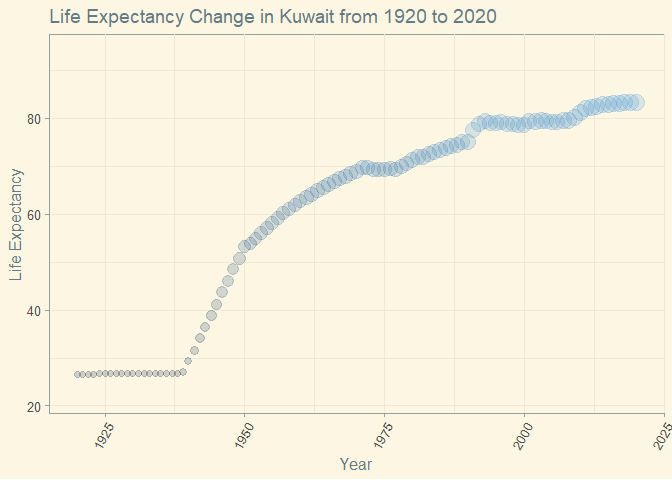
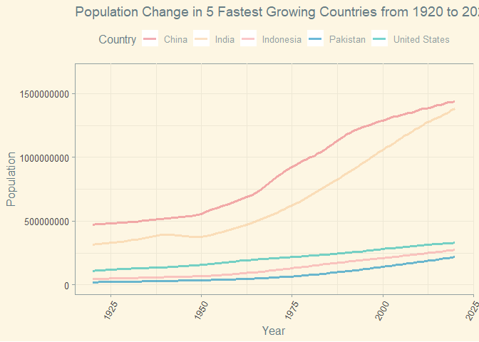
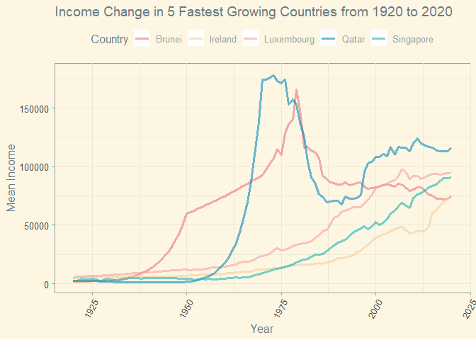
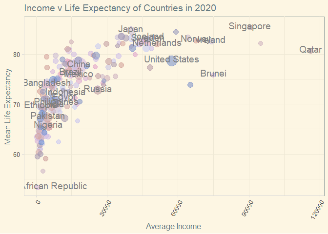

## Instructions
Answer the following questions and complete the exercises in RMarkdown. Please embed all of your code and push your final work to your repository. Your code should be organized, clean, and run free from errors. Be sure to **add your name** to the author header above. You may use any resources to answer these questions (including each other), but you may not post questions to Open Stacks or external help sites. There are 10 total questions.  

Make sure to use the formatting conventions of RMarkdown to make your report neat and clean! Your plots should use consistent aesthetics throughout. Feel free to be creative- there are many possible solutions to these questions!  

This exam is due by **12:00p on Tuesday, February 23**.  

## Load the libraries

```r
library(tidyverse)
```

```
## -- Attaching packages --------------------------------------- tidyverse 1.3.0 --
```

```
## √ ggplot2 3.3.3     √ purrr   0.3.4
## √ tibble  3.0.6     √ dplyr   1.0.4
## √ tidyr   1.1.2     √ stringr 1.4.0
## √ readr   1.4.0     √ forcats 0.5.1
```

```
## -- Conflicts ------------------------------------------ tidyverse_conflicts() --
## x dplyr::filter() masks stats::filter()
## x dplyr::lag()    masks stats::lag()
```

```r
library(janitor)
```

```
## 
## Attaching package: 'janitor'
```

```
## The following objects are masked from 'package:stats':
## 
##     chisq.test, fisher.test
```

```r
library(here)
```

```
## here() starts at D:/TA files/Winter2021 BIS15L/students_rep/BIS15W2021_ahearne
```

```r
library(skimr)
library(visdat)
library(naniar)
```

```
## 
## Attaching package: 'naniar'
```

```
## The following object is masked from 'package:skimr':
## 
##     n_complete
```

```r
#install.packages("gapminder")
library(ggthemes)
library(paletteer)
library(RColorBrewer)
options(scipen=999) #disables scientific notation when printing
```

## Gapminder
For this assignment, we are going to use data from  [gapminder](https://www.gapminder.org/). Gapminder includes information about economics, population, social issues, and life expectancy from countries all over the world. We will use three data sets, so please load all three.  

One thing to note is that the data include years beyond 2021. These are projections based on modeling done by the gapminder organization. Start by importing the data.

```r
population <- readr::read_csv("data/population_total.csv")
```

```
## 
## -- Column specification --------------------------------------------------------
## cols(
##   .default = col_double(),
##   country = col_character()
## )
## i Use `spec()` for the full column specifications.
```

```r
population
```

```
## # A tibble: 195 x 302
##    country `1800` `1801` `1802` `1803` `1804` `1805` `1806` `1807` `1808` `1809`
##    <chr>    <dbl>  <dbl>  <dbl>  <dbl>  <dbl>  <dbl>  <dbl>  <dbl>  <dbl>  <dbl>
##  1 Afghan~ 3.28e6 3.28e6 3.28e6 3.28e6 3.28e6 3.28e6 3.28e6 3.28e6 3.28e6 3.28e6
##  2 Albania 4.00e5 4.02e5 4.04e5 4.05e5 4.07e5 4.09e5 4.11e5 4.13e5 4.14e5 4.16e5
##  3 Algeria 2.50e6 2.51e6 2.52e6 2.53e6 2.54e6 2.55e6 2.56e6 2.56e6 2.57e6 2.58e6
##  4 Andorra 2.65e3 2.65e3 2.65e3 2.65e3 2.65e3 2.65e3 2.65e3 2.65e3 2.65e3 2.65e3
##  5 Angola  1.57e6 1.57e6 1.57e6 1.57e6 1.57e6 1.57e6 1.57e6 1.57e6 1.57e6 1.57e6
##  6 Antigu~ 3.70e4 3.70e4 3.70e4 3.70e4 3.70e4 3.70e4 3.70e4 3.70e4 3.70e4 3.70e4
##  7 Argent~ 5.34e5 5.20e5 5.06e5 4.92e5 4.79e5 4.66e5 4.53e5 4.41e5 4.29e5 4.17e5
##  8 Armenia 4.13e5 4.13e5 4.13e5 4.13e5 4.13e5 4.13e5 4.13e5 4.13e5 4.13e5 4.13e5
##  9 Austra~ 2.00e5 2.05e5 2.11e5 2.16e5 2.22e5 2.27e5 2.33e5 2.39e5 2.46e5 2.52e5
## 10 Austria 3.00e6 3.02e6 3.04e6 3.05e6 3.07e6 3.09e6 3.11e6 3.12e6 3.14e6 3.16e6
## # ... with 185 more rows, and 291 more variables: 1810 <dbl>, 1811 <dbl>,
## #   1812 <dbl>, 1813 <dbl>, 1814 <dbl>, 1815 <dbl>, 1816 <dbl>, 1817 <dbl>,
## #   1818 <dbl>, 1819 <dbl>, 1820 <dbl>, 1821 <dbl>, 1822 <dbl>, 1823 <dbl>,
## #   1824 <dbl>, 1825 <dbl>, 1826 <dbl>, 1827 <dbl>, 1828 <dbl>, 1829 <dbl>,
## #   1830 <dbl>, 1831 <dbl>, 1832 <dbl>, 1833 <dbl>, 1834 <dbl>, 1835 <dbl>,
## #   1836 <dbl>, 1837 <dbl>, 1838 <dbl>, 1839 <dbl>, 1840 <dbl>, 1841 <dbl>,
## #   1842 <dbl>, 1843 <dbl>, 1844 <dbl>, 1845 <dbl>, 1846 <dbl>, 1847 <dbl>,
## #   1848 <dbl>, 1849 <dbl>, 1850 <dbl>, 1851 <dbl>, 1852 <dbl>, 1853 <dbl>,
## #   1854 <dbl>, 1855 <dbl>, 1856 <dbl>, 1857 <dbl>, 1858 <dbl>, 1859 <dbl>,
## #   1860 <dbl>, 1861 <dbl>, 1862 <dbl>, 1863 <dbl>, 1864 <dbl>, 1865 <dbl>,
## #   1866 <dbl>, 1867 <dbl>, 1868 <dbl>, 1869 <dbl>, 1870 <dbl>, 1871 <dbl>,
## #   1872 <dbl>, 1873 <dbl>, 1874 <dbl>, 1875 <dbl>, 1876 <dbl>, 1877 <dbl>,
## #   1878 <dbl>, 1879 <dbl>, 1880 <dbl>, 1881 <dbl>, 1882 <dbl>, 1883 <dbl>,
## #   1884 <dbl>, 1885 <dbl>, 1886 <dbl>, 1887 <dbl>, 1888 <dbl>, 1889 <dbl>,
## #   1890 <dbl>, 1891 <dbl>, 1892 <dbl>, 1893 <dbl>, 1894 <dbl>, 1895 <dbl>,
## #   1896 <dbl>, 1897 <dbl>, 1898 <dbl>, 1899 <dbl>, 1900 <dbl>, 1901 <dbl>,
## #   1902 <dbl>, 1903 <dbl>, 1904 <dbl>, 1905 <dbl>, 1906 <dbl>, 1907 <dbl>,
## #   1908 <dbl>, 1909 <dbl>, ...
```


```r
#glimpse(population)    #D:
any_na(population)
```

```
## [1] FALSE
```


```r
income <- readr::read_csv("data/income_per_person_gdppercapita_ppp_inflation_adjusted.csv")
```

```
## 
## -- Column specification --------------------------------------------------------
## cols(
##   .default = col_double(),
##   country = col_character()
## )
## i Use `spec()` for the full column specifications.
```

```r
income
```

```
## # A tibble: 193 x 242
##    country `1800` `1801` `1802` `1803` `1804` `1805` `1806` `1807` `1808` `1809`
##    <chr>    <dbl>  <dbl>  <dbl>  <dbl>  <dbl>  <dbl>  <dbl>  <dbl>  <dbl>  <dbl>
##  1 Afghan~    603    603    603    603    603    603    603    603    603    603
##  2 Albania    667    667    667    667    667    668    668    668    668    668
##  3 Algeria    715    716    717    718    719    720    721    722    723    724
##  4 Andorra   1200   1200   1200   1200   1210   1210   1210   1210   1220   1220
##  5 Angola     618    620    623    626    628    631    634    637    640    642
##  6 Antigu~    757    757    757    757    757    757    757    758    758    758
##  7 Argent~   1640   1640   1650   1650   1660   1660   1670   1680   1680   1690
##  8 Armenia    514    514    514    514    514    514    514    514    514    514
##  9 Austra~    817    822    826    831    836    841    845    850    855    860
## 10 Austria   1850   1850   1860   1870   1880   1880   1890   1900   1910   1920
## # ... with 183 more rows, and 231 more variables: 1810 <dbl>, 1811 <dbl>,
## #   1812 <dbl>, 1813 <dbl>, 1814 <dbl>, 1815 <dbl>, 1816 <dbl>, 1817 <dbl>,
## #   1818 <dbl>, 1819 <dbl>, 1820 <dbl>, 1821 <dbl>, 1822 <dbl>, 1823 <dbl>,
## #   1824 <dbl>, 1825 <dbl>, 1826 <dbl>, 1827 <dbl>, 1828 <dbl>, 1829 <dbl>,
## #   1830 <dbl>, 1831 <dbl>, 1832 <dbl>, 1833 <dbl>, 1834 <dbl>, 1835 <dbl>,
## #   1836 <dbl>, 1837 <dbl>, 1838 <dbl>, 1839 <dbl>, 1840 <dbl>, 1841 <dbl>,
## #   1842 <dbl>, 1843 <dbl>, 1844 <dbl>, 1845 <dbl>, 1846 <dbl>, 1847 <dbl>,
## #   1848 <dbl>, 1849 <dbl>, 1850 <dbl>, 1851 <dbl>, 1852 <dbl>, 1853 <dbl>,
## #   1854 <dbl>, 1855 <dbl>, 1856 <dbl>, 1857 <dbl>, 1858 <dbl>, 1859 <dbl>,
## #   1860 <dbl>, 1861 <dbl>, 1862 <dbl>, 1863 <dbl>, 1864 <dbl>, 1865 <dbl>,
## #   1866 <dbl>, 1867 <dbl>, 1868 <dbl>, 1869 <dbl>, 1870 <dbl>, 1871 <dbl>,
## #   1872 <dbl>, 1873 <dbl>, 1874 <dbl>, 1875 <dbl>, 1876 <dbl>, 1877 <dbl>,
## #   1878 <dbl>, 1879 <dbl>, 1880 <dbl>, 1881 <dbl>, 1882 <dbl>, 1883 <dbl>,
## #   1884 <dbl>, 1885 <dbl>, 1886 <dbl>, 1887 <dbl>, 1888 <dbl>, 1889 <dbl>,
## #   1890 <dbl>, 1891 <dbl>, 1892 <dbl>, 1893 <dbl>, 1894 <dbl>, 1895 <dbl>,
## #   1896 <dbl>, 1897 <dbl>, 1898 <dbl>, 1899 <dbl>, 1900 <dbl>, 1901 <dbl>,
## #   1902 <dbl>, 1903 <dbl>, 1904 <dbl>, 1905 <dbl>, 1906 <dbl>, 1907 <dbl>,
## #   1908 <dbl>, 1909 <dbl>, ...
```

```r
#glimpse(income)    #D:
any_na(income)
```

```
## [1] FALSE
```


```r
life_expectancy <- readr::read_csv("data/life_expectancy_years.csv")
```

```
## 
## -- Column specification --------------------------------------------------------
## cols(
##   .default = col_double(),
##   country = col_character()
## )
## i Use `spec()` for the full column specifications.
```

```r
life_expectancy
```

```
## # A tibble: 187 x 302
##    country `1800` `1801` `1802` `1803` `1804` `1805` `1806` `1807` `1808` `1809`
##    <chr>    <dbl>  <dbl>  <dbl>  <dbl>  <dbl>  <dbl>  <dbl>  <dbl>  <dbl>  <dbl>
##  1 Afghan~   28.2   28.2   28.2   28.2   28.2   28.2   28.1   28.1   28.1   28.1
##  2 Albania   35.4   35.4   35.4   35.4   35.4   35.4   35.4   35.4   35.4   35.4
##  3 Algeria   28.8   28.8   28.8   28.8   28.8   28.8   28.8   28.8   28.8   28.8
##  4 Andorra   NA     NA     NA     NA     NA     NA     NA     NA     NA     NA  
##  5 Angola    27     27     27     27     27     27     27     27     27     27  
##  6 Antigu~   33.5   33.5   33.5   33.5   33.5   33.5   33.5   33.5   33.5   33.5
##  7 Argent~   33.2   33.2   33.2   33.2   33.2   33.2   33.2   33.2   33.2   33.2
##  8 Armenia   34     34     34     34     34     34     34     34     34     34  
##  9 Austra~   34     34     34     34     34     34     34     34     34     34  
## 10 Austria   34.4   34.4   34.4   34.4   34.4   34.4   34.4   34.4   34.4   34.4
## # ... with 177 more rows, and 291 more variables: 1810 <dbl>, 1811 <dbl>,
## #   1812 <dbl>, 1813 <dbl>, 1814 <dbl>, 1815 <dbl>, 1816 <dbl>, 1817 <dbl>,
## #   1818 <dbl>, 1819 <dbl>, 1820 <dbl>, 1821 <dbl>, 1822 <dbl>, 1823 <dbl>,
## #   1824 <dbl>, 1825 <dbl>, 1826 <dbl>, 1827 <dbl>, 1828 <dbl>, 1829 <dbl>,
## #   1830 <dbl>, 1831 <dbl>, 1832 <dbl>, 1833 <dbl>, 1834 <dbl>, 1835 <dbl>,
## #   1836 <dbl>, 1837 <dbl>, 1838 <dbl>, 1839 <dbl>, 1840 <dbl>, 1841 <dbl>,
## #   1842 <dbl>, 1843 <dbl>, 1844 <dbl>, 1845 <dbl>, 1846 <dbl>, 1847 <dbl>,
## #   1848 <dbl>, 1849 <dbl>, 1850 <dbl>, 1851 <dbl>, 1852 <dbl>, 1853 <dbl>,
## #   1854 <dbl>, 1855 <dbl>, 1856 <dbl>, 1857 <dbl>, 1858 <dbl>, 1859 <dbl>,
## #   1860 <dbl>, 1861 <dbl>, 1862 <dbl>, 1863 <dbl>, 1864 <dbl>, 1865 <dbl>,
## #   1866 <dbl>, 1867 <dbl>, 1868 <dbl>, 1869 <dbl>, 1870 <dbl>, 1871 <dbl>,
## #   1872 <dbl>, 1873 <dbl>, 1874 <dbl>, 1875 <dbl>, 1876 <dbl>, 1877 <dbl>,
## #   1878 <dbl>, 1879 <dbl>, 1880 <dbl>, 1881 <dbl>, 1882 <dbl>, 1883 <dbl>,
## #   1884 <dbl>, 1885 <dbl>, 1886 <dbl>, 1887 <dbl>, 1888 <dbl>, 1889 <dbl>,
## #   1890 <dbl>, 1891 <dbl>, 1892 <dbl>, 1893 <dbl>, 1894 <dbl>, 1895 <dbl>,
## #   1896 <dbl>, 1897 <dbl>, 1898 <dbl>, 1899 <dbl>, 1900 <dbl>, 1901 <dbl>,
## #   1902 <dbl>, 1903 <dbl>, 1904 <dbl>, 1905 <dbl>, 1906 <dbl>, 1907 <dbl>,
## #   1908 <dbl>, 1909 <dbl>, ...
```

```r
#glimpse(life_expectancy)    #D:
#any_na(life_expectancy)
life_expectancy%>% 
  summarise_all(~(sum(is.na(.))))
```

```
## # A tibble: 1 x 302
##   country `1800` `1801` `1802` `1803` `1804` `1805` `1806` `1807` `1808` `1809`
##     <int>  <int>  <int>  <int>  <int>  <int>  <int>  <int>  <int>  <int>  <int>
## 1       0      3      3      3      3      3      3      3      3      3      3
## # ... with 291 more variables: 1810 <int>, 1811 <int>, 1812 <int>, 1813 <int>,
## #   1814 <int>, 1815 <int>, 1816 <int>, 1817 <int>, 1818 <int>, 1819 <int>,
## #   1820 <int>, 1821 <int>, 1822 <int>, 1823 <int>, 1824 <int>, 1825 <int>,
## #   1826 <int>, 1827 <int>, 1828 <int>, 1829 <int>, 1830 <int>, 1831 <int>,
## #   1832 <int>, 1833 <int>, 1834 <int>, 1835 <int>, 1836 <int>, 1837 <int>,
## #   1838 <int>, 1839 <int>, 1840 <int>, 1841 <int>, 1842 <int>, 1843 <int>,
## #   1844 <int>, 1845 <int>, 1846 <int>, 1847 <int>, 1848 <int>, 1849 <int>,
## #   1850 <int>, 1851 <int>, 1852 <int>, 1853 <int>, 1854 <int>, 1855 <int>,
## #   1856 <int>, 1857 <int>, 1858 <int>, 1859 <int>, 1860 <int>, 1861 <int>,
## #   1862 <int>, 1863 <int>, 1864 <int>, 1865 <int>, 1866 <int>, 1867 <int>,
## #   1868 <int>, 1869 <int>, 1870 <int>, 1871 <int>, 1872 <int>, 1873 <int>,
## #   1874 <int>, 1875 <int>, 1876 <int>, 1877 <int>, 1878 <int>, 1879 <int>,
## #   1880 <int>, 1881 <int>, 1882 <int>, 1883 <int>, 1884 <int>, 1885 <int>,
## #   1886 <int>, 1887 <int>, 1888 <int>, 1889 <int>, 1890 <int>, 1891 <int>,
## #   1892 <int>, 1893 <int>, 1894 <int>, 1895 <int>, 1896 <int>, 1897 <int>,
## #   1898 <int>, 1899 <int>, 1900 <int>, 1901 <int>, 1902 <int>, 1903 <int>,
## #   1904 <int>, 1905 <int>, 1906 <int>, 1907 <int>, 1908 <int>, 1909 <int>, ...
```


#### 1. (3 points) Once you have an idea of the structure of the data, please make each data set tidy and store them as new objects. You will need both the original and tidy data!

```r
population2<-population%>%
  pivot_longer(-country,
               names_to="year",
              values_to="population_n")
population2$year<-as.integer(population2$year)
population2$country<-as.factor(population2$country)
population2
```

```
## # A tibble: 58,695 x 3
##    country      year population_n
##    <fct>       <int>        <dbl>
##  1 Afghanistan  1800      3280000
##  2 Afghanistan  1801      3280000
##  3 Afghanistan  1802      3280000
##  4 Afghanistan  1803      3280000
##  5 Afghanistan  1804      3280000
##  6 Afghanistan  1805      3280000
##  7 Afghanistan  1806      3280000
##  8 Afghanistan  1807      3280000
##  9 Afghanistan  1808      3280000
## 10 Afghanistan  1809      3280000
## # ... with 58,685 more rows
```


```r
income2<-income%>%
  pivot_longer(-country,
               names_to="year",
               values_to="mean_income")
income2$country<-as.factor(income2$country)
income2$year<-as.integer(income2$year)
income2
```

```
## # A tibble: 46,513 x 3
##    country      year mean_income
##    <fct>       <int>       <dbl>
##  1 Afghanistan  1800         603
##  2 Afghanistan  1801         603
##  3 Afghanistan  1802         603
##  4 Afghanistan  1803         603
##  5 Afghanistan  1804         603
##  6 Afghanistan  1805         603
##  7 Afghanistan  1806         603
##  8 Afghanistan  1807         603
##  9 Afghanistan  1808         603
## 10 Afghanistan  1809         603
## # ... with 46,503 more rows
```


```r
life_expectancy2<-life_expectancy%>%
  pivot_longer(-country,
               names_to="year",
              values_to="mean_life_expectancy")
life_expectancy2$country<-as.factor(life_expectancy2$country)
life_expectancy2$year<-as.integer(life_expectancy2$year)
life_expectancy2
```

```
## # A tibble: 56,287 x 3
##    country      year mean_life_expectancy
##    <fct>       <int>                <dbl>
##  1 Afghanistan  1800                 28.2
##  2 Afghanistan  1801                 28.2
##  3 Afghanistan  1802                 28.2
##  4 Afghanistan  1803                 28.2
##  5 Afghanistan  1804                 28.2
##  6 Afghanistan  1805                 28.2
##  7 Afghanistan  1806                 28.1
##  8 Afghanistan  1807                 28.1
##  9 Afghanistan  1808                 28.1
## 10 Afghanistan  1809                 28.1
## # ... with 56,277 more rows
```


#### 2. (1 point) How many different countries are represented in the data? Provide the total number and their names. Since each data set includes different numbers of countries, you will need to do this for each one.

```r
population2%>%
  group_by(country)%>%
  summarise(n_country=n_distinct(country))
```

```
## # A tibble: 195 x 2
##    country             n_country
##  * <fct>                   <int>
##  1 Afghanistan                 1
##  2 Albania                     1
##  3 Algeria                     1
##  4 Andorra                     1
##  5 Angola                      1
##  6 Antigua and Barbuda         1
##  7 Argentina                   1
##  8 Armenia                     1
##  9 Australia                   1
## 10 Austria                     1
## # ... with 185 more rows
```


```r
#195 rows, 195 distinct countries in population2.
```


```r
income2%>%
  group_by(country)%>%
  summarise(n_country=n_distinct(country))
```

```
## # A tibble: 193 x 2
##    country             n_country
##  * <fct>                   <int>
##  1 Afghanistan                 1
##  2 Albania                     1
##  3 Algeria                     1
##  4 Andorra                     1
##  5 Angola                      1
##  6 Antigua and Barbuda         1
##  7 Argentina                   1
##  8 Armenia                     1
##  9 Australia                   1
## 10 Austria                     1
## # ... with 183 more rows
```

```r
#193 rows, 193 distinct countries in income2.
```


```r
life_expectancy2%>%
  group_by(country)%>%
  summarise(n_country=n_distinct(country))
```

```
## # A tibble: 187 x 2
##    country             n_country
##  * <fct>                   <int>
##  1 Afghanistan                 1
##  2 Albania                     1
##  3 Algeria                     1
##  4 Andorra                     1
##  5 Angola                      1
##  6 Antigua and Barbuda         1
##  7 Argentina                   1
##  8 Armenia                     1
##  9 Australia                   1
## 10 Austria                     1
## # ... with 177 more rows
```

```r
#187 rows, 187 distinct countries in life_expectancy2.
```


## *Life Expectancy*  

#### 3. (2 points) Let's limit the data to the past 100 years (1920-2020). For these years, which country has the highest life expectancy? How about the lowest life expectancy?  

Highest

```r
life_expectancy2%>%
  filter(year>=1920, year<=2020, country!="Andorra")%>% #We're leaving out Andorra bc she's missing a ton of data.
  group_by(country)%>%
  summarize(timespan_avg=mean(mean_life_expectancy, na.rm=T))%>%
  arrange(desc(timespan_avg))%>%
  top_n(5)
```

```
## Selecting by timespan_avg
```

```
## # A tibble: 5 x 2
##   country     timespan_avg
##   <fct>              <dbl>
## 1 Sweden              73.5
## 2 Norway              73.2
## 3 Netherlands         73.0
## 4 Dominica            73.0
## 5 Iceland             72.9
```


```r
life_expectancy2%>%
  filter(year>=1920,year<=2020,country=="Andorra")%>%
  miss_var_summary()
```

```
## # A tibble: 3 x 3
##   variable             n_miss pct_miss
##   <chr>                 <int>    <dbl>
## 1 mean_life_expectancy     53     52.5
## 2 country                   0      0  
## 3 year                      0      0
```


Lowest

```r
life_expectancy2%>%
  filter(year>=1920, year<=2020)%>% 
  group_by(country)%>%
  summarize(timespan_avg=mean(mean_life_expectancy, na.rm=T))%>%
  arrange(timespan_avg)%>%
  top_n(-5)
```

```
## Selecting by timespan_avg
```

```
## # A tibble: 5 x 2
##   country                  timespan_avg
##   <fct>                           <dbl>
## 1 Central African Republic         41.8
## 2 Mali                             41.8
## 3 Ethiopia                         42.6
## 4 Sierra Leone                     42.6
## 5 Guinea-Bissau                    42.6
```


#### 4. (3 points) Although we can see which country has the highest life expectancy for the past 100 years, we don't know which countries have changed the most. What are the top 5 countries that have experienced the biggest improvement in life expectancy between 1920-2020?

```r
life_expectancy2%>%
  filter(year==1920 | year==2020)%>%
  summarize(country, 
            year,
            expectancy_improvement=mean_life_expectancy-lag(mean_life_expectancy,default=first(mean_life_expectancy)))%>%
  arrange(desc(expectancy_improvement))%>%
  top_n(5)
```

```
## Selecting by expectancy_improvement
```

```
## # A tibble: 5 x 3
##   country          year expectancy_improvement
##   <fct>           <int>                  <dbl>
## 1 Kuwait           2020                   56.8
## 2 Kyrgyz Republic  2020                   56.5
## 3 Turkmenistan     2020                   55.3
## 4 South Korea      2020                   55  
## 5 Tajikistan       2020                   54.3
```


#### 5. (3 points) Make a plot that shows the change over the past 100 years for the country with the biggest improvement in life expectancy. Be sure to add appropriate aesthetics to make the plot clean and clear. Once you have made the plot, do a little internet searching and see if you can discover what historical event may have contributed to this remarkable change.  


```r
#devtools::install_github("johannesbjork/LaCroixColoR")
my_lil_palette<- LaCroixColoR::lacroix_palette("Pamplemousse", type = "discrete")
my_lil_palette_cont<-LaCroixColoR::lacroix_palette("Pamplemousse", n = 187, type = "continuous")
barplot(rep(1,100), axes=FALSE, col=my_lil_palette_cont)
```

<!-- -->


```r
life_expectancy2%>%
  filter(country=="Kuwait")%>%
  ggplot(aes(x=year, y=mean_life_expectancy, color=mean_life_expectancy, size=mean_life_expectancy))+
  geom_point(alpha=.2)+
  xlim(1920,2020)+
  theme_solarized()+
  theme(legend.position="top",
        axis.text.x=element_text(angle=60, hjust=1))+
  guides(color=FALSE, size=FALSE)+
  labs(title="Life Expectancy Change in Kuwait from 1920 to 2020",
       x="Year",
       y="Life Expectancy",
       color= NULL,
       size= NULL)
```

```
## Warning: Removed 200 rows containing missing values (geom_point).
```

<!-- -->


```r
#According to [The Borgen Project](https://borgenproject.org/10-facts-about-life-expectancy-in-kuwait/), the increase in life expectancy is due in large part to economic growth in the region. In the 1930s, Kuwait was able to leverage its petroleum fields to generate wealth for the country.
```

## *Population Growth*
#### 6. (3 points) Which 5 countries have had the highest population growth over the past 100 years (1920-2020)?

```r
population2%>%
  filter(year==1920 | year==2020)%>%
  summarize(country, 
            year,
            population_growth=population_n-lag(population_n,default=first(population_n)))%>%
  arrange(desc(population_growth))%>%
  filter(year==2020)%>%
  top_n(5)
```

```
## Selecting by population_growth
```

```
## # A tibble: 5 x 3
##   country        year population_growth
##   <fct>         <int>             <dbl>
## 1 India          2020        1063000000
## 2 China          2020         968000000
## 3 Indonesia      2020         226700000
## 4 United States  2020         220000000
## 5 Pakistan       2020         199300000
```

#### 7. (4 points) Produce a plot that shows the 5 countries that have had the highest population growth over the past 100 years (1920-2020). Which countries appear to have had exponential growth?  

```r
population2%>%
  filter(country=="India"| country=="China"| country=="Indonesia"|country=="United States"|country=="Pakistan")%>%
  ggplot(aes(x=year, y=population_n, group=country, color=country))+
  geom_line(size=1.4, alpha=0.6)+
  xlim(1920,2020)+
  theme_solarized()+
  scale_color_manual(values=my_lil_palette)+
  theme(legend.position="top",
        axis.text.x=element_text(angle=60, hjust=1))+
  labs(title="Population Change in 5 Fastest Growing Countries from 1920 to 2020",
       x="Year",
       y="Population",
       color= "Country")
```

```
## Warning: Removed 1000 row(s) containing missing values (geom_path).
```

<!-- -->


```r
#Both China and India look to have experienced exponential growth. 
```


## *Income*
*The units used for income are gross domestic product per person adjusted for differences in purchasing power in international dollars.*
<style>
div.blue { background-color:#e6f0ff; border-radius: 5px; padding: 20px;}
</style>
<div class = "blue">

#### 8. (4 points) As in the previous questions, which countries have experienced the biggest growth in per person GDP. Show this as a table and then plot the changes for the top 5 countries. With a bit of research, you should be able to explain the dramatic downturns of the wealthiest economies that occurred during the 1980's.

```r
income2%>%
  filter(year==1920 | year==2020)%>%
  summarize(country, 
            year,
            mean_income_growth=mean_income-lag(mean_income,default=first(mean_income)))%>%
  arrange(desc(mean_income_growth))%>%
  top_n(5)
```

```
## Selecting by mean_income_growth
```

```
## # A tibble: 5 x 3
##   country     year mean_income_growth
##   <fct>      <int>              <dbl>
## 1 Qatar       2020             113700
## 2 Luxembourg  2020              89370
## 3 Singapore   2020              88060
## 4 Brunei      2020              72970
## 5 Ireland     2020              68930
```


```r
income2%>%
  filter(country=="Qatar"| country=="Luxembourg"| country=="Singapore"|country=="Brunei"|country=="Ireland")%>%
  ggplot(aes(x=year, y=mean_income, group=country, color=country))+
  geom_line(size=1.4, alpha=0.6)+
  xlim(1920,2020)+
  theme_solarized()+
  scale_color_manual(values=my_lil_palette)+
  theme(legend.position="top",
        axis.text.x=element_text(angle=60, hjust=1))+
  labs(title="Income Change in 5 Fastest Growing Countries from 1920 to 2020",
       x="Year",
       y="Mean Income",
       color= "Country")
```

```
## Warning: Removed 700 row(s) containing missing values (geom_path).
```

<!-- -->
</div>


#### 9. (3 points) Create three new objects that restrict each data set (life expectancy, population, income) to the years 1920-2020. Hint: I suggest doing this with the long form of your data. Once this is done, merge all three data sets using the code I provide below. You may need to adjust the code depending on how you have named your objects. I called mine `life_expectancy_100`, `population_100`, and `income_100`. For some of you, learning these `joins` will be important for your project.  

life_expectancy_100

```r
life_expectancy_100<-life_expectancy2%>%
  filter(year>=1920, year<=2020)
life_expectancy_100
```

```
## # A tibble: 18,887 x 3
##    country      year mean_life_expectancy
##    <fct>       <int>                <dbl>
##  1 Afghanistan  1920                 30.6
##  2 Afghanistan  1921                 30.7
##  3 Afghanistan  1922                 30.8
##  4 Afghanistan  1923                 30.8
##  5 Afghanistan  1924                 30.9
##  6 Afghanistan  1925                 31  
##  7 Afghanistan  1926                 31  
##  8 Afghanistan  1927                 31.1
##  9 Afghanistan  1928                 31.1
## 10 Afghanistan  1929                 31.2
## # ... with 18,877 more rows
```

population_100

```r
population_100<-population2%>%
  filter(year>=1920, year<=2020)
population_100
```

```
## # A tibble: 19,695 x 3
##    country      year population_n
##    <fct>       <int>        <dbl>
##  1 Afghanistan  1920     10600000
##  2 Afghanistan  1921     10500000
##  3 Afghanistan  1922     10300000
##  4 Afghanistan  1923      9710000
##  5 Afghanistan  1924      9200000
##  6 Afghanistan  1925      8720000
##  7 Afghanistan  1926      8260000
##  8 Afghanistan  1927      7830000
##  9 Afghanistan  1928      7420000
## 10 Afghanistan  1929      7100000
## # ... with 19,685 more rows
```

income_100

```r
income_100<-income2%>%
  filter(year>=1920, year<=2020)
income_100
```

```
## # A tibble: 19,493 x 3
##    country      year mean_income
##    <fct>       <int>       <dbl>
##  1 Afghanistan  1920        1490
##  2 Afghanistan  1921        1520
##  3 Afghanistan  1922        1550
##  4 Afghanistan  1923        1570
##  5 Afghanistan  1924        1600
##  6 Afghanistan  1925        1630
##  7 Afghanistan  1926        1650
##  8 Afghanistan  1927        1680
##  9 Afghanistan  1928        1710
## 10 Afghanistan  1929        1740
## # ... with 19,483 more rows
```


```r
gapminder_join <- inner_join(life_expectancy_100, population_100, by= c("country", "year"))
gapminder_join <- inner_join(gapminder_join, income_100, by= c("country", "year"))
gapminder_join
```

```
## # A tibble: 18,887 x 5
##    country      year mean_life_expectancy population_n mean_income
##    <fct>       <int>                <dbl>        <dbl>       <dbl>
##  1 Afghanistan  1920                 30.6     10600000        1490
##  2 Afghanistan  1921                 30.7     10500000        1520
##  3 Afghanistan  1922                 30.8     10300000        1550
##  4 Afghanistan  1923                 30.8      9710000        1570
##  5 Afghanistan  1924                 30.9      9200000        1600
##  6 Afghanistan  1925                 31        8720000        1630
##  7 Afghanistan  1926                 31        8260000        1650
##  8 Afghanistan  1927                 31.1      7830000        1680
##  9 Afghanistan  1928                 31.1      7420000        1710
## 10 Afghanistan  1929                 31.2      7100000        1740
## # ... with 18,877 more rows
```

#### 10. (4 points) Use the joined data to perform an analysis of your choice. The analysis should include a comparison between two or more of the variables `life_expectancy`, `population`, or `income.`


```r
gapminder_join$year=as.integer(gapminder_join$year)
gapminder_join
```

```
## # A tibble: 18,887 x 5
##    country      year mean_life_expectancy population_n mean_income
##    <fct>       <int>                <dbl>        <dbl>       <dbl>
##  1 Afghanistan  1920                 30.6     10600000        1490
##  2 Afghanistan  1921                 30.7     10500000        1520
##  3 Afghanistan  1922                 30.8     10300000        1550
##  4 Afghanistan  1923                 30.8      9710000        1570
##  5 Afghanistan  1924                 30.9      9200000        1600
##  6 Afghanistan  1925                 31        8720000        1630
##  7 Afghanistan  1926                 31        8260000        1650
##  8 Afghanistan  1927                 31.1      7830000        1680
##  9 Afghanistan  1928                 31.1      7420000        1710
## 10 Afghanistan  1929                 31.2      7100000        1740
## # ... with 18,877 more rows
```


```r
#devtools::install_github("karthik/wesanderson") 
moth<-wesanderson::wes_palette("GrandBudapest2",187,"continuous")
```

```
## Registered S3 method overwritten by 'wesanderson':
##   method        from        
##   print.palette LaCroixColoR
```


```r
gapminder_join%>%
  filter(year==2020)%>%
  ggplot(aes(x=mean_income, y=mean_life_expectancy, color=country, size=population_n))+
  geom_point(alpha=0.6)+
  theme_solarized()+
  scale_color_manual(values=moth)+
  scale_size(range = c(3,12))+
  theme(legend.position="top",
        axis.text.x=element_text(angle=60, hjust=1),
        axis.line = element_line(color = "grey85"),
        axis.ticks = element_line(color = "grey85"))+
  guides(color=F,size=F)+
  geom_text(aes(x=mean_income, y = mean_life_expectancy+.5, label = country),
            color="grey50",
            size=5,
            data=filter(gapminder_join, population_n >100000000 & year==2020 | year==2020 & country%in%c("Sweden", "Norway", "Netherlands", "Dominca", "Iceland", "Singapore", "Qatar", "Luxemborg","Brunei","Ireland","Central African Republic")))+
  labs(title="Income v Life Expectancy of Countries in 2020",
       x="Average Income",
       y="Mean Life Expectancy",
       color= "Country")
```

```
## Warning: Removed 3 rows containing missing values (geom_point).
```

<!-- -->


